# **Server-Sent Events (SSE) — Complete Notes From Scratch**

---

## **Table of Contents**

1. Why SSE Exists — The Problem Before It
2. The Radio Broadcast Analogy
3. SSE vs Other Techniques — Side by Side
4. How SSE Actually Works — Step by Step
5. The HTTP Connection — What Really Happens
6. The Event Format — Nuts and Bolts
7. All 4 Fields Explained — data, event, id, retry
8. The EventSource API — Your Client-Side Tool
9. All 3 EventSource Events — onopen, onmessage, onerror
10. Custom Event Types — Listening to Named Events
11. Auto-Reconnect — The Superpower of SSE
12. Last-Event-ID — Never Miss a Message
13. Closing the Connection
14. SSE Lifecycle Diagram
15. SSE vs WebSocket — Which One to Pick
16. Connection Limits — The HTTP/1.1 Problem
17. Real World Use Cases — Where SSE Shines
18. When NOT to Use SSE
19. Common Errors and Fixes
20. Quick Reference Cheat Sheet

---

## **1. Why SSE Exists — The Problem Before It**

Before SSE, there was a big problem. The normal HTTP model works like this: **client asks, server answers, connection closes.** That is it. The server cannot speak first. The server cannot say "hey, I have new data for you" on its own.

So what did developers do for real-time updates? They used hacks:

**Short Polling** — The client keeps asking "any new data?" every few seconds, even if there is nothing new. Like calling a restaurant every 5 minutes to ask if your table is ready.

**Long Polling** — The client asks, the server waits and holds the connection open until it has something to send, then sends it and closes. The client immediately asks again. Better, but still a lot of back-and-forth overhead.

Both approaches have problems: too many connections, too much HTTP overhead (headers sent every time), too much delay.

**SSE was created to solve this properly.** The idea is simple: the client makes **one** HTTP request and the server keeps that response open forever, sending data whenever it wants. The client just listens. One connection, server pushes whenever ready.

---

## **2. The Radio Broadcast Analogy**

Think of SSE like a **radio station**.

- You (the client) **tune in once** by turning on the radio (opening the EventSource connection)
- The radio station (the server) **broadcasts continuously** — news, music, updates
- You just **listen** — you cannot talk back to the radio station through the radio
- If your radio loses signal, it **automatically finds the station again** (auto-reconnect)
- The station keeps broadcasting whether you are listening or not

This is exactly how SSE works. One-way, server to client, automatic reconnect if connection drops.

Compare this to a **phone call** (WebSocket) — both sides can talk, but it needs more setup, more resources, and more complexity.

If you only need to **receive** information, use the radio (SSE). If you need to **talk back and forth**, use the phone (WebSocket).

---

## **3. SSE vs Other Techniques — Side by Side**

### **Short Polling**

```
Client:  "Any new data?"
Server:  "No"
[2 seconds pass]
Client:  "Any new data?"
Server:  "No"
[2 seconds pass]
Client:  "Any new data?"
Server:  "Yes! Here it is"
```

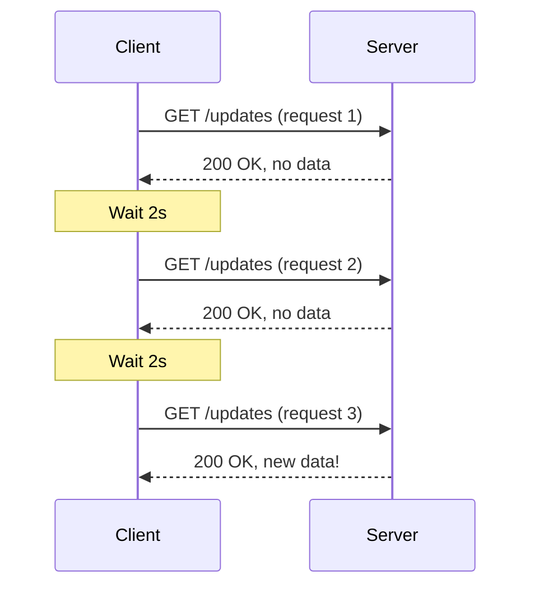

**Problem:** Wastes bandwidth asking when there is nothing new. High latency — you miss data between polls.

---

### **Long Polling**

```
Client:  "Any new data?" (server holds this open...)
Server:  [waits... waits... waits...]
Server:  "Yes! Here it is" (connection closes)
Client:  "Any new data?" (immediately asks again)
```

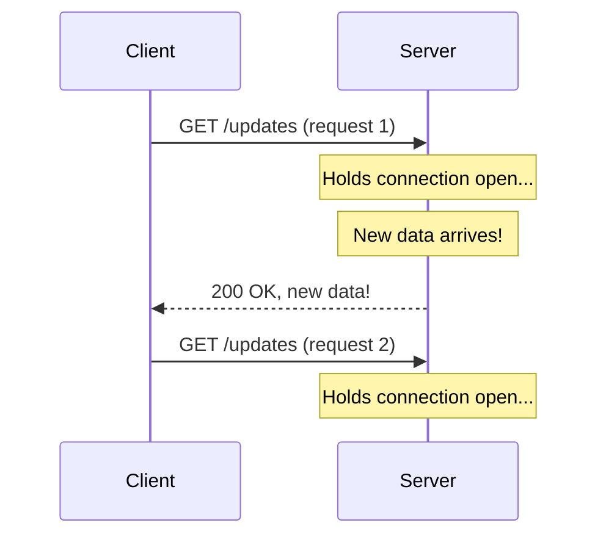

**Problem:** Still many connections over time. Each response needs a new request. Header overhead on every cycle.

---

### **SSE — Server-Sent Events**

```
Client:  "I want to subscribe to updates"
Server:  "OK, staying connected..."
Server:  "Here is event 1"
[5 minutes later]
Server:  "Here is event 2"
[10 minutes later]
Server:  "Here is event 3"
[Connection stays open the whole time]
```

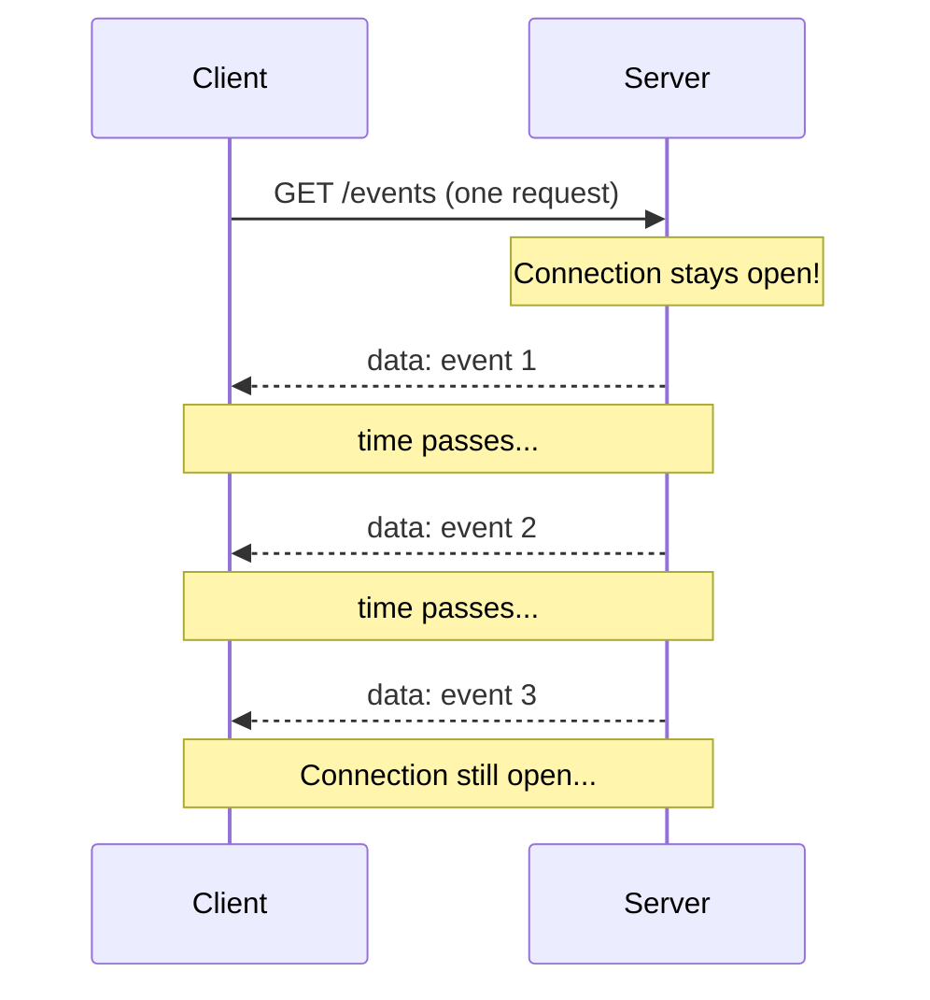

**One connection. Server pushes whenever ready. Client just listens.**

---

### **WebSocket — For Comparison**

```
Client:  "Can we upgrade to WebSocket?"
Server:  "Yes, agreed"
Client:  "Here is a message"
Server:  "Here is a reply"
Client:  "Another message"
Server:  "Another reply"
[Both sides talk freely]
```

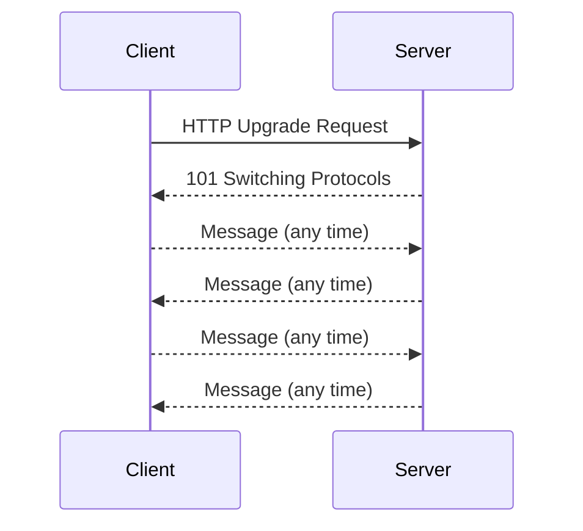

**Two-way, full-duplex. More power, more complexity.**

---

### **Quick Comparison Table**

| Feature | Short Poll | Long Poll | SSE | WebSocket |
|---|---|---|---|---|
| Direction | Client → Server → Client | Client → Server → Client | Server → Client only | Both ways |
| Connections | Many | Many | One (stays open) | One (stays open) |
| Protocol | HTTP | HTTP | HTTP | WebSocket (ws://) |
| Auto-reconnect | Manual | Manual | Built-in ✅ | Manual |
| Browser support | All | All | All modern | All modern |
| Works through proxies | Yes | Yes | Yes | Sometimes not |
| Good for | Simple apps | Medium apps | One-way streams | Two-way apps |

---

## **4. How SSE Actually Works — Step by Step**

Here is what happens exactly, step by step:

**Step 1 — Client opens connection**

The client creates an `EventSource` object with a URL. The browser sends a normal HTTP GET request to that URL.

**Step 2 — Server responds with special headers**

The server sends back HTTP headers like this:
```
HTTP/1.1 200 OK
Content-Type: text/event-stream
Cache-Control: no-cache
Connection: keep-alive
```

The key header is `Content-Type: text/event-stream` — this tells the browser "this is an SSE stream, keep it open and parse events from it."

**Step 3 — Server sends events**

The server writes data to the response body in a special text format. Each time it wants to send an update, it writes a new event to the stream. The connection stays open.

**Step 4 — Client receives and parses events**

The browser automatically reads the stream, parses each event block, and fires JavaScript events that your code can listen to.

**Step 5 — Connection drops (network issue, server restart)**

The browser automatically tries to reconnect after 3 seconds (by default). When it reconnects, it sends the ID of the last event it received so the server can pick up from where it left off.

---

## **5. The HTTP Connection — What Really Happens**

This is the most important thing to understand: **SSE is just a regular HTTP connection that never ends.**

Normal HTTP response:
```
Client: GET /data
Server: HTTP/1.1 200 OK
        Content-Length: 45
        {"name": "test", "value": 42}
        [connection closes]
```

SSE HTTP response:
```
Client: GET /events
Server: HTTP/1.1 200 OK
        Content-Type: text/event-stream
        Cache-Control: no-cache
        [NO Content-Length — response never fully sends]
        
        data: Hello\n\n
        [server waits...]
        data: World\n\n
        [server keeps waiting, sending more when ready...]
```

The server **never sends** `Content-Length` because it does not know when it will stop. The response just keeps going. This is called **chunked transfer encoding** — the server sends data in pieces (chunks) and the client reads each piece as it arrives.

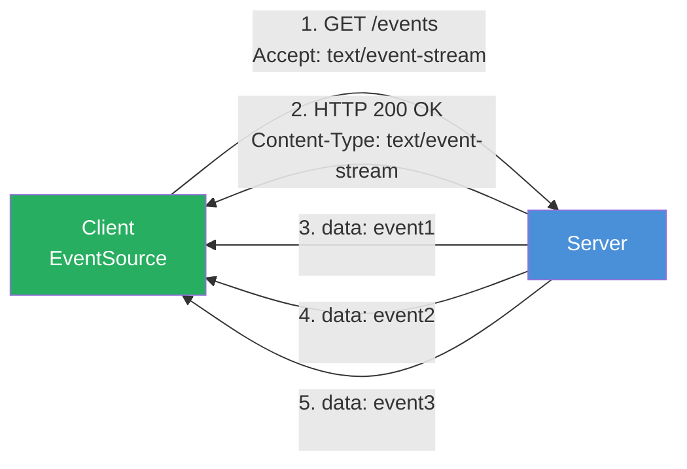

---

## **6. The Event Format — Nuts and Bolts**

Each SSE event is a block of plain text lines. The event block ends with **two newlines** (`\n\n`). That double newline is how the browser knows one event has ended and the next one starts.

Here is the simplest possible event:

```
data: Hello World

```

(There are two newlines at the end — one after `data: Hello World` and one blank line.)

A full event with all fields:

```
id: 42
event: stock-update
data: {"symbol": "AAPL", "price": 175.50}
retry: 5000

```

Multi-line data (when your data is long):

```
data: Line one of message
data: Line two of message
data: Line three of message

```

The browser joins these with newlines when you read `event.data`. You get: `"Line one of message\nLine two of message\nLine three of message"`

Comments (lines starting with `:`) — useful as keepalive pings:

```
: this is a comment, browser ignores it

```

---

## **7. All 4 Fields Explained**

### **data — The actual content (required)**

This is the message itself. Every event needs at least one `data` line.

```
data: Hello
```

```
data: {"user": "Ali", "message": "hi there"}
```

If you have multiple `data` lines in one event block, they get joined with `\n`:
```
data: first line
data: second line

```
Result: `event.data = "first line\nsecond line"`

---

### **event — Custom event type (optional)**

By default all messages are `message` type. But you can name your events so your client can listen for specific types.

```
event: user-joined
data: {"username": "Ali"}

event: price-update
data: {"symbol": "BTC", "price": 67000}

event: notification
data: {"text": "New order received"}
```

On the client side you listen to these by name (explained in section 10).

---

### **id — Event ID for reconnection (optional)**

This is a unique number or string you give to each event. The browser remembers the last ID it received. When the connection drops and the browser reconnects, it sends this ID back to the server via the `Last-Event-ID` header.

```
id: 1
data: First event

id: 2
data: Second event

id: 3
data: Third event
```

Your server can check `Last-Event-ID` on reconnect and send any missed events. This is how you make SSE reliable — no messages get lost even if connection drops.

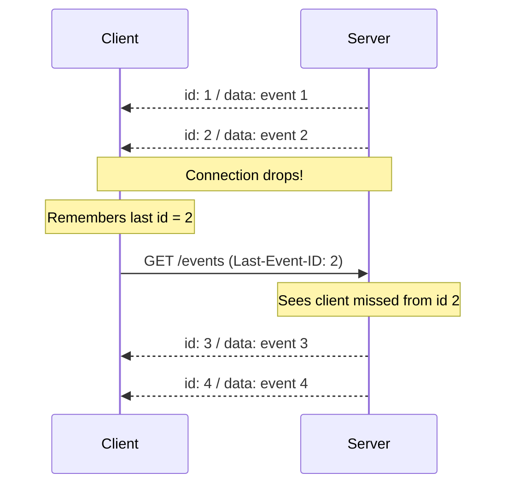

---

### **retry — Reconnect wait time (optional)**

By default the browser waits 3000 milliseconds (3 seconds) before reconnecting after a connection drop. The server can change this.

```
retry: 10000
data: Connection will retry after 10 seconds if dropped
```

This is useful in production. If your server is doing a restart, you might want clients to wait 10-30 seconds before flooding the server with reconnect attempts.

Once the browser receives a `retry` field, it uses that time for all future reconnects in that session.

---

## **8. The EventSource API — Your Client-Side Tool**

`EventSource` is the browser's built-in API for SSE. You do not need any library. It is built into all modern browsers.

### **Basic Setup**

```javascript
// Create a connection
const eventSource = new EventSource('/api/events');

// Now you listen for events using the 3 built-in handlers
eventSource.onopen = function(event) {
    console.log('Connected to server!');
};

eventSource.onmessage = function(event) {
    console.log('Received:', event.data);
};

eventSource.onerror = function(event) {
    console.log('Error or connection lost');
};
```

### **EventSource with credentials (for auth cookies)**

```javascript
// Pass cookies along with the request
const eventSource = new EventSource('/api/events', {
    withCredentials: true
});
```

### **EventSource states**

The `eventSource.readyState` tells you the current state:

| Value | Constant | Meaning |
|---|---|---|
| 0 | CONNECTING | Trying to connect |
| 1 | OPEN | Connected and receiving |
| 2 | CLOSED | Permanently closed |

```javascript
if (eventSource.readyState === EventSource.OPEN) {
    console.log('We are connected');
}
```

---

## **9. All 3 EventSource Events**

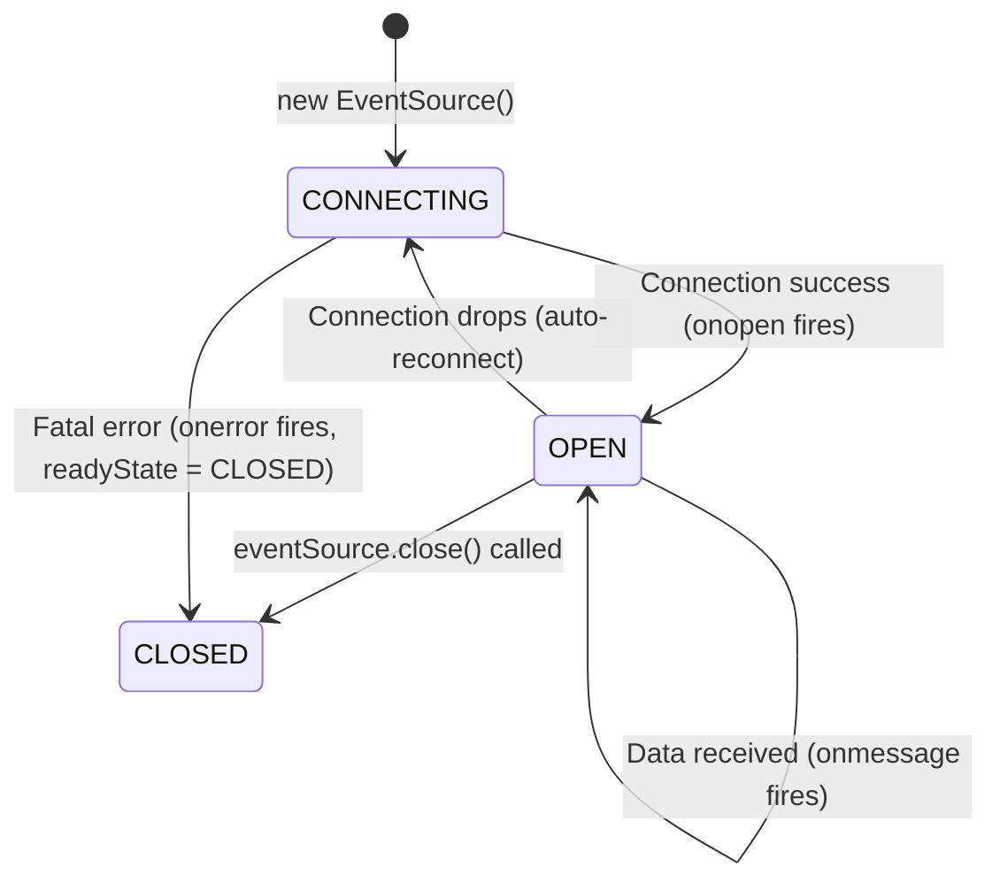

---

### **onopen — Connection Established**

Fires once when the connection opens successfully.

```javascript
eventSource.onopen = function(event) {
    console.log('Connected!');
    // Good place to: update UI to show "live" status
    document.getElementById('status').textContent = '🟢 Live';
};
```

---

### **onmessage — Data Received**

Fires every time the server sends an event WITHOUT a named `event:` field (or with `event: message`).

```javascript
eventSource.onmessage = function(event) {
    // event.data  → the content of the data field
    // event.lastEventId → the id field of this event
    // event.type  → "message" (default type)
    
    console.log('Data:', event.data);
    
    // If server sends JSON, parse it
    const parsed = JSON.parse(event.data);
    console.log('Price:', parsed.price);
};
```

---

### **onerror — Connection Error or Drop**

Fires when connection is lost or an error happens. The browser will auto-reconnect (if `readyState` is not CLOSED). You don't need to manually reconnect.

```javascript
eventSource.onerror = function(event) {
    if (eventSource.readyState === EventSource.CLOSED) {
        console.log('Connection permanently closed');
        // Update UI: "Disconnected"
    } else if (eventSource.readyState === EventSource.CONNECTING) {
        console.log('Connection lost, browser is reconnecting...');
        // Update UI: "Reconnecting..."
    }
};
```

**Important:** `onerror` firing does NOT mean something terrible happened. It often just means the connection dropped and the browser is automatically reconnecting. Check `readyState` to know the actual situation.

---

## **10. Custom Event Types — Listening to Named Events**

When the server sends events with an `event:` field, `onmessage` does NOT fire. You need to use `addEventListener` with the event name.

**Server sends:**
```
event: user-joined
data: {"username": "Ali"}

event: price-update
data: {"symbol": "BTC", "price": 67000}

event: notification
data: {"text": "New order received"}
```

**Client listens:**
```javascript
const eventSource = new EventSource('/api/events');

// Listen for specific event types
eventSource.addEventListener('user-joined', function(event) {
    const user = JSON.parse(event.data);
    console.log('User joined:', user.username);
});

eventSource.addEventListener('price-update', function(event) {
    const price = JSON.parse(event.data);
    console.log('New price:', price.symbol, price.price);
});

eventSource.addEventListener('notification', function(event) {
    const notif = JSON.parse(event.data);
    console.log('Notification:', notif.text);
});

// onmessage still works for events WITHOUT an event: field
eventSource.onmessage = function(event) {
    console.log('Generic event:', event.data);
};
```

Think of it like event listeners in JavaScript — you listen to specific "channels" of events.

---

## **11. Auto-Reconnect — The Superpower of SSE**

This is one of the biggest advantages of SSE over WebSocket. **You do not write reconnection logic.** The browser does it for you.

When the connection drops (network issue, server restart, anything):

1. `onerror` fires
2. Browser waits (default 3 seconds, or whatever the server set with `retry:`)
3. Browser automatically makes a new GET request to the same URL
4. If `id:` was used, browser sends `Last-Event-ID` header automatically
5. Connection is restored
6. `onopen` fires again

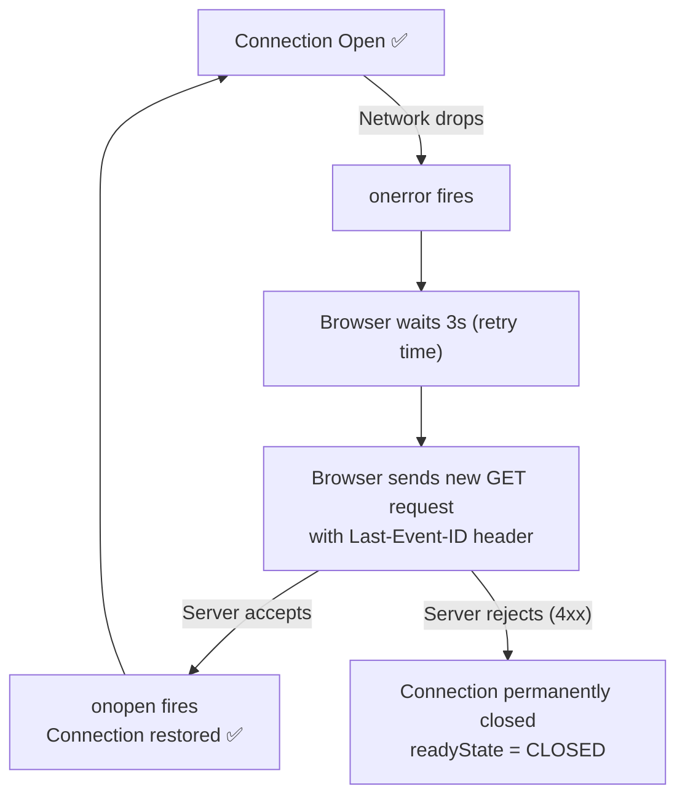

Compare this to WebSocket where you have to:
- Detect close event
- Write exponential backoff logic
- Track what messages you missed
- Manually reconnect
- Handle all edge cases yourself

With SSE — the browser handles all of this. You get it for free.

---

## **12. Last-Event-ID — Never Miss a Message**

This is the mechanism that makes SSE **reliable**. Here is the full picture:

**Server side — you set IDs on events:**
```
id: 1
data: {"order": "created", "orderId": "A001"}

id: 2
data: {"order": "shipped", "orderId": "A001"}

id: 3
data: {"order": "delivered", "orderId": "A001"}
```

**Connection drops after id 2 is received.**

**Browser reconnects and sends:**
```
GET /api/events HTTP/1.1
Last-Event-ID: 2
```

**Server receives this, checks its storage:**
"Client has id 2, so send everything from id 3 onwards"

```
id: 3
data: {"order": "delivered", "orderId": "A001"}
```

**No message missed!**

**Resetting the ID** — if server sends `id:` with no value:
```
id:
data: This event clears the Last-Event-ID
```
Now the browser has no ID to send on reconnect. The server will not know where to resume from.

---

## **13. Closing the Connection**

SSE connections stay open until YOU close them or the server stops sending.

**Client closes the connection:**
```javascript
// Permanently close — no auto-reconnect after this
eventSource.close();

console.log(eventSource.readyState); // 2 = CLOSED
```

**Server signals to stop:**

The server sends HTTP status `204 No Content` to tell the browser "stop reconnecting, this stream is done." The browser will NOT reconnect after receiving a 204.

```
HTTP/1.1 204 No Content
```

Or the server can send an event and then close:
```
event: stream-end
data: {"reason": "All data sent"}

```
Then the client closes on receiving this:
```javascript
eventSource.addEventListener('stream-end', function(event) {
    eventSource.close();
    console.log('Stream finished');
});
```

---

## **14. SSE Lifecycle Diagram**

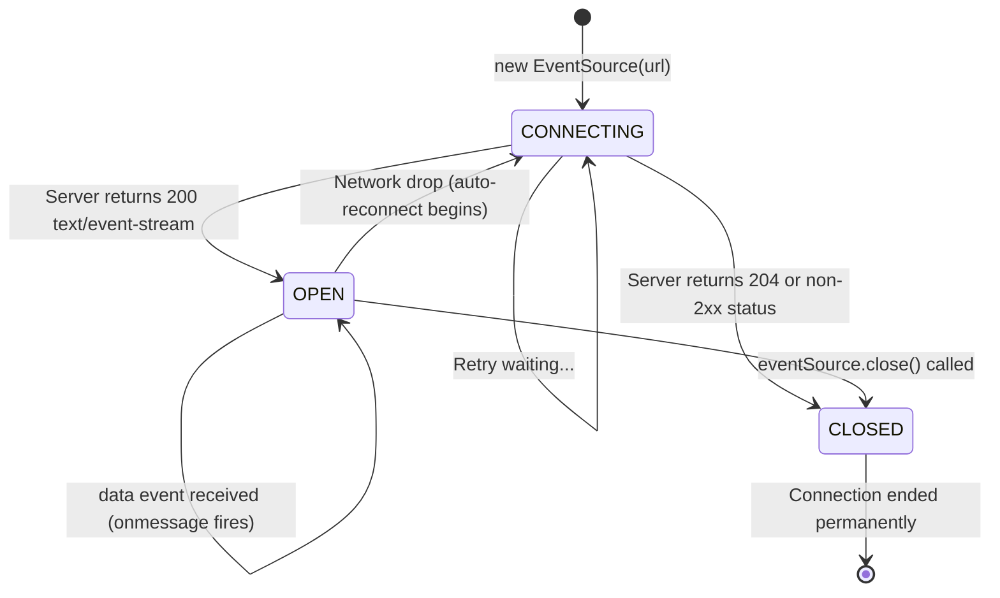

---

## **15. SSE vs WebSocket — Which One to Pick**

This is the most common question. Here is the honest answer.

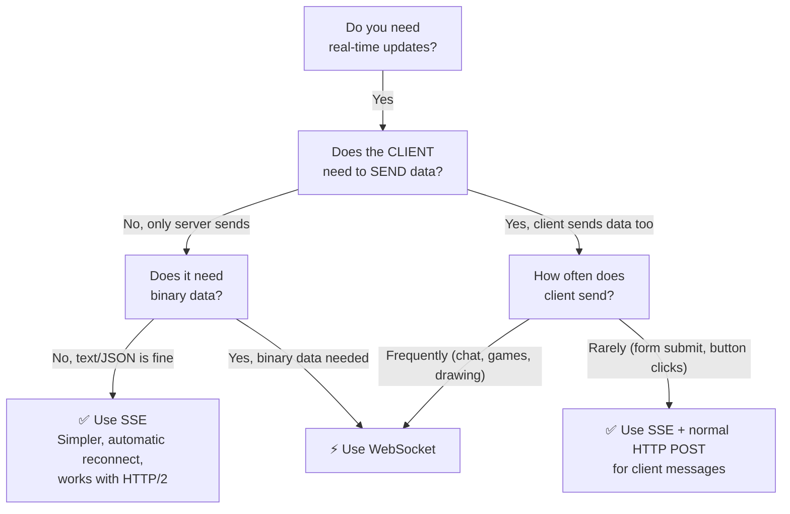

### **Pick SSE when:**

- You only need server → client data flow
- Building: live notifications, stock tickers, news feed, deployment logs, AI chat streaming (yes, ChatGPT/Claude use SSE!), sports scores
- You want simple code with no extra libraries
- You want auto-reconnect without writing it yourself
- Your infrastructure is HTTP-based (proxies, load balancers work fine)

### **Pick WebSocket when:**

- Client needs to send frequent messages to server
- Building: chat apps, multiplayer games, collaborative drawing, video/audio calling
- You need binary data (images, audio frames, game state)
- You need very low latency two-way communication

### **The hidden use case — AI streaming:**

SSE is what OpenAI, Anthropic (Claude), Google Gemini, and basically every LLM API use for streaming responses. The server streams tokens one by one and the client shows them progressively. Perfect one-way data flow.

---

## **16. Connection Limits — The HTTP/1.1 Problem**

There is one limitation you MUST know about SSE.

**Under HTTP/1.1:** Browsers allow maximum **6 connections per domain** total. SSE connections count toward this limit. If you open 6 SSE streams, you used up ALL your connections for that domain — no more API calls, no image loading, nothing.

Example of hitting the limit accidentally:
```
Tab 1: SSE for notifications  ← uses 1 connection
Tab 2: SSE for notifications  ← uses 1 connection  
Tab 3: SSE for notifications  ← uses 1 connection
Tab 4: SSE for notifications  ← uses 1 connection
Tab 5: SSE for notifications  ← uses 1 connection
Tab 6: SSE for notifications  ← uses 1 connection
Tab 7: SSE for notifications  ← BLOCKED! All 6 used up
Also: Regular API calls in Tab 1 ← Also BLOCKED!
```

**Under HTTP/2:** This problem goes away completely. HTTP/2 uses **multiplexing** — many streams share a single TCP connection. You can open hundreds of SSE connections without hitting any browser limit. HTTP/2 adoption is near-universal in 2026.

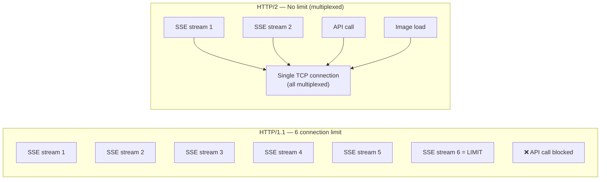

**Check if your server uses HTTP/2** — if yes, you can ignore the connection limit concern. If not, keep in mind: do not open multiple SSE connections per tab.

---

## **17. Real World Use Cases — Where SSE Shines**

### **AI Chat Streaming (biggest use case in 2026)**

When you use ChatGPT or Claude, you see text appear word by word. That is SSE. The model generates tokens and the server sends each one as an SSE event immediately. The alternative (waiting for the full response) would feel painfully slow.

```
data: {"token": "The"}
data: {"token": " weather"}
data: {"token": " in"}
data: {"token": " Mumbai"}
data: {"token": " is"}
data: {"token": " hot."}
data: [DONE]
```

### **Live Notifications**

Email clients, social media, project management tools — when you get a badge or alert without refreshing, SSE is often the technology behind it.

### **Stock/Crypto Price Tickers**

Prices change constantly. Server pushes new price whenever it changes. Much more efficient than polling every second.

### **Deployment/Build Logs**

CI/CD tools like GitHub Actions stream log lines to your browser as the build runs. Each log line is an SSE event.

```
data: [12:03:01] Installing dependencies...
data: [12:03:15] Running tests...
data: [12:03:28] Test 1 passed
data: [12:03:29] Test 2 passed
data: [12:03:30] Build complete ✅
```

### **Live Sports Scores**

Score updates, match events (goal, card, substitution) pushed to browser without polling.

### **Server Monitoring Dashboards**

CPU usage, memory, requests per second — server pushes metrics every few seconds.

---

## **18. When NOT to Use SSE**

SSE is not always the right answer. Do not use it when:

**You need the client to send lots of data** — SSE is one-way only. If your app needs frequent client-to-server messages (chat, games, collaborative editing), use WebSocket.

**You need binary data** — SSE is text-only (UTF-8). If you need to stream raw binary (video, audio, game state as bytes), use WebSocket.

**You need to send custom headers on the EventSource** — The browser's `EventSource` API does not support custom headers. If you need to send an `Authorization: Bearer token` header, you have to use a workaround (query param, cookie, or fetch-based SSE). This is a real limitation.

**You are already using WebSocket for other features** — If you already have WebSocket in your app for chat, do not add SSE just for notifications. Just send notifications through the existing WebSocket.

**Very high frequency updates (60+ per second)** — SSE has text parsing overhead. For game state updates at 60fps, WebSocket binary frames are more efficient.

---

## **19. Common Errors and Fixes**

### **Connection keeps disconnecting immediately**

**Cause:** Server is not setting the right headers or is ending the response too early.

**Fix:**
```
Content-Type: text/event-stream    ← Must be this exact value
Cache-Control: no-cache            ← Prevents caching/buffering
Connection: keep-alive             ← Keep TCP connection open
X-Accel-Buffering: no             ← Disable nginx buffering
```

---

### **Events arrive in a big batch instead of one by one (buffering)**

**Cause:** An intermediary (nginx, CDN, proxy) is buffering the response before sending it to the client.

**Fix:** Add this header in your server response:
```
X-Accel-Buffering: no
```
Or configure nginx:
```
proxy_buffering off;
```

---

### **CORS error when connecting from different domain**

**Cause:** EventSource makes a CORS request. Server must allow it.

**Fix:** Server must send:
```
Access-Control-Allow-Origin: https://yourfrontend.com
```
Or for development:
```
Access-Control-Allow-Origin: *
```

---

### **Cannot send Authorization header with EventSource**

**Cause:** Browser's `EventSource` API does not support custom headers. This is a known limitation.

**Workarounds:**

Option 1 — Query parameter (simple, less secure):
```javascript
const eventSource = new EventSource('/api/events?token=your-jwt-token');
```

Option 2 — Use cookies with `withCredentials`:
```javascript
const eventSource = new EventSource('/api/events', { withCredentials: true });
```
Server sets auth cookie on login, EventSource sends it automatically.

Option 3 — Use `fetch` with `ReadableStream` (more control but more code):
```javascript
const response = await fetch('/api/events', {
    headers: { 'Authorization': 'Bearer ' + token }
});
const reader = response.body.getReader();
// Parse SSE format manually
```

---

### **onerror fires but connection is fine**

**Cause:** When the server intentionally closes the connection (end of stream), `onerror` fires and the browser tries to reconnect. This is normal behavior.

**Fix:** If you want to end the stream cleanly, return HTTP 204 from server or close EventSource on client after receiving a custom "done" event.

---

### **Events stop after some time (timeout)**

**Cause:** Load balancers, proxies, or firewalls often have idle connection timeouts (30 seconds to 5 minutes is common).

**Fix:** Send a keepalive comment every 15-20 seconds:
```
: keepalive ping

```
This tiny comment keeps the connection "active" so timeouts do not trigger.

---

## **20. Quick Reference Cheat Sheet**

### **Event Format**
```
id: 123
event: my-event-name
data: {"key": "value"}
retry: 5000

```

### **Fields Summary**
| Field | Required | What it does |
|---|---|---|
| `data:` | YES | The actual message content |
| `event:` | No | Custom event type name |
| `id:` | No | Event ID for reconnect tracking |
| `retry:` | No | Milliseconds to wait before reconnect |

### **EventSource Setup**
```javascript
const es = new EventSource('/api/events');
const esAuth = new EventSource('/api/events', { withCredentials: true });

es.onopen = (e) => { /* connected */ };
es.onmessage = (e) => { /* e.data = your data */ };
es.onerror = (e) => { /* error or reconnecting */ };
es.addEventListener('custom-event', (e) => { /* named event */ });
es.close(); // stop permanently
```

### **Server Response Headers**
```
Content-Type: text/event-stream
Cache-Control: no-cache
Connection: keep-alive
X-Accel-Buffering: no
```

### **Decision: SSE or WebSocket?**
```
Only server → client data?   → Use SSE
Client sends data too?       → Use WebSocket
Text / JSON data?            → SSE is fine
Binary data?                 → Use WebSocket
Need auto-reconnect?         → SSE (it is free)
Already using WebSocket?     → Stay with WebSocket
AI/LLM token streaming?      → Use SSE (everyone does)
```

### **ReadyState Values**
| Value | Meaning |
|---|---|
| 0 | CONNECTING |
| 1 | OPEN |
| 2 | CLOSED |

### **HTTP/1.1 vs HTTP/2**
- HTTP/1.1: 6 connections per domain max, SSE uses one slot
- HTTP/2: No limit, multiplexed, SSE works freely

---

*Next step: SSE in Python with FastAPI — from basic streaming to advanced patterns.*