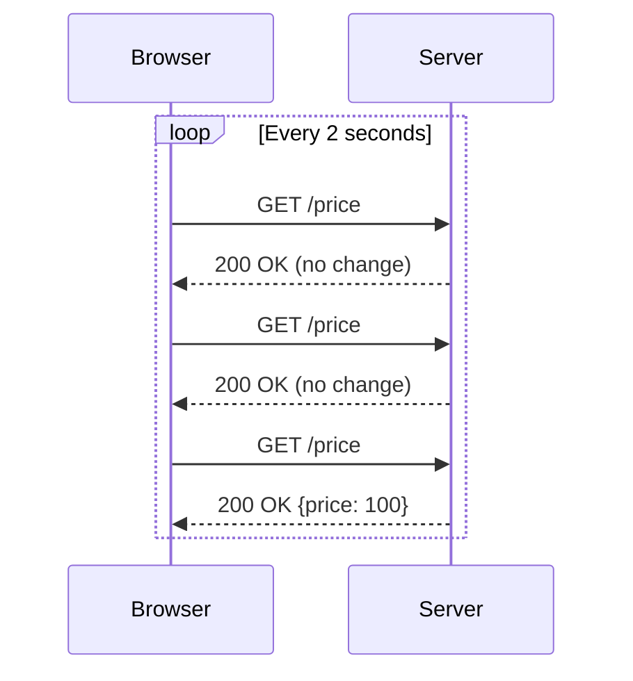
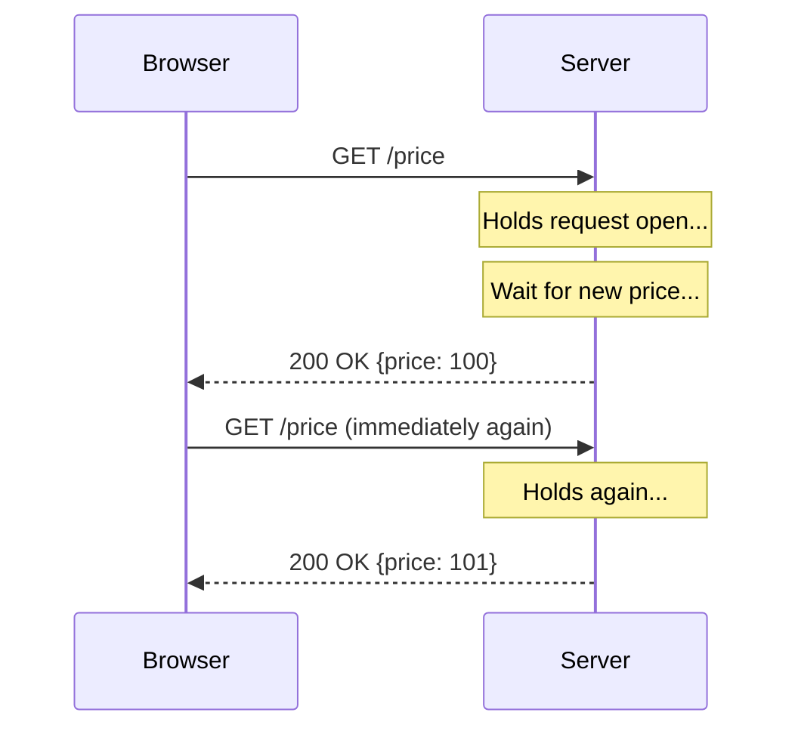
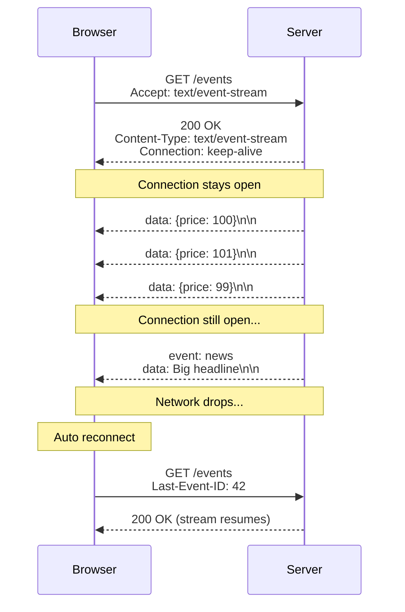
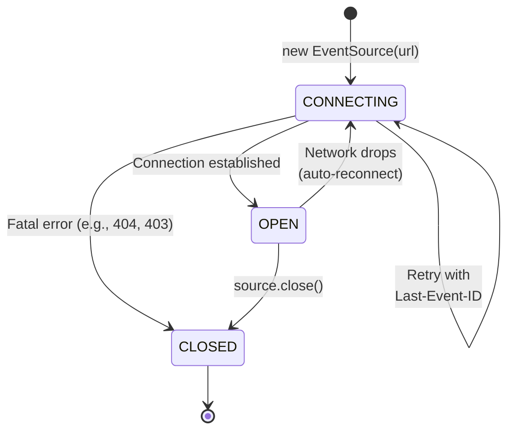
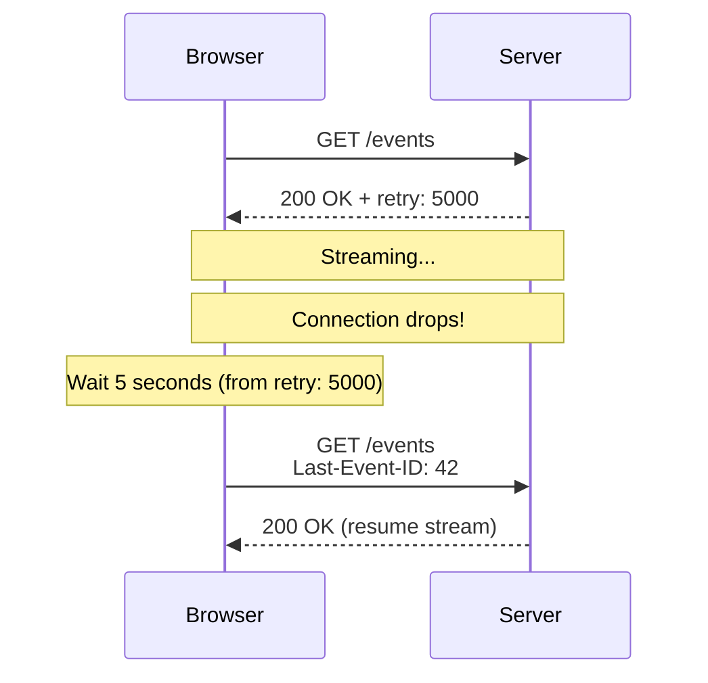
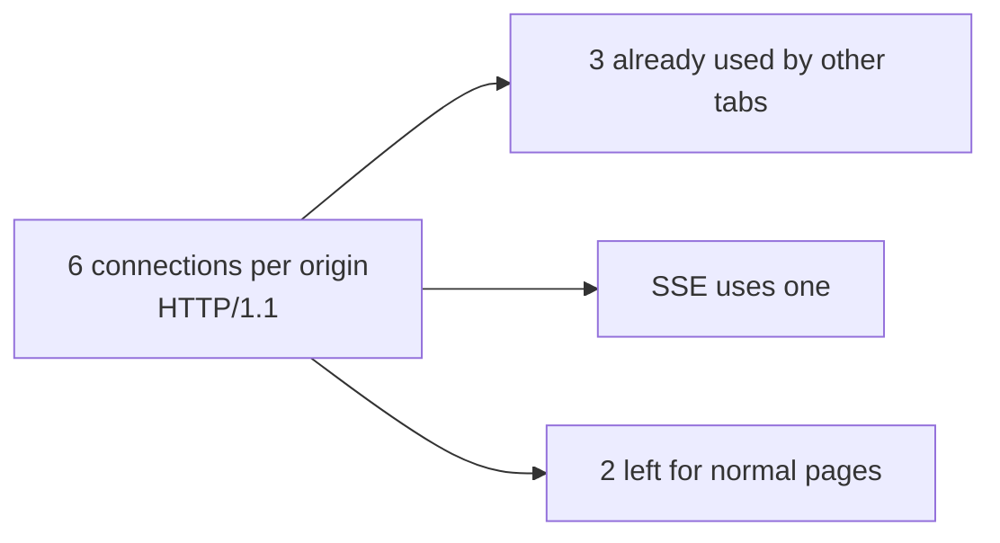
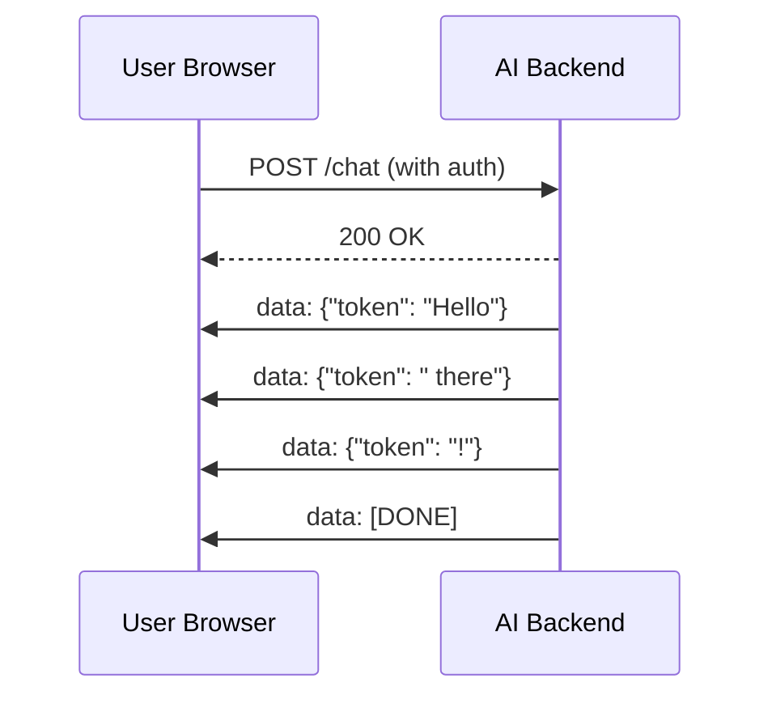

# **Server-Sent Events (SSE) — Complete Notes from Scratch**

> Brother, this is the same kind of deep notes we did for WebSocket — but for **SSE**.
> Read this once carefully and you'll never get confused about SSE again.

---

## **1. What is SSE? (Plain English)**

**SSE = Server-Sent Events.**

It is a way for the **server to push data to the browser continuously**, over a single, long-lived HTTP connection.

Only **one direction** works:
- Server → Client → YES
- Client → Server → NO (client cannot send messages through SSE)

The browser opens the connection once, and the server keeps sending messages whenever it wants — like a news ticker.

It uses plain old HTTP. No new protocol. No handshake upgrade. Just HTTP that never closes.

---

## **2. The Real-World Analogy — The Radio Station**

Imagine three ways to get updates from a friend:

| Method | Analogy | What happens |
|---|---|---|
| **Short Polling** | You call your friend every 5 min: "Any news?" | You keep calling, they keep saying "no" |
| **WebSocket** | A phone call — both sides can talk anytime | You and your friend both can speak freely |
| **SSE** | A **radio station** — friend broadcasts, you just listen | Friend has a mic, you have a speaker. You cannot talk back on this channel |

SSE is the **radio station**. Server is the DJ, browser is the listener. The DJ (server) speaks whenever there's news. The listener (browser) just hears it.

If the listener wants to talk back, they have to use a separate channel (a regular HTTP request or WebSocket).

---

## **3. The Problem SSE Solves**

Before SSE, if you wanted live updates (stock prices, notifications, live scores), you had three bad options:

### **3.1 Short Polling (the bad way)**
Browser keeps asking "any update?" every few seconds.

```
Browser → "Anything new?"
Server  → "Nope"
Browser → "Anything new?"
Server  → "Nope"
Browser → "Anything new?"
Server  → "Yes! Price is 100"
```



**Problems:**
- Wastes requests (most return nothing)
- High latency (up to 2 sec delay)
- Heavy on server

### **3.2 Long Polling (the less bad way)**
Browser asks once, server **holds** the request open until it has something.



**Problems:**
- Still HTTP request/response
- Server holds many idle connections
- Reconnection logic is messy
- Each message = new HTTP request

### **3.3 WebSocket (overkill for one-way)**
Full duplex. Powerful. But you don't need bidirectional if the client never sends anything.

### **3.4 SSE (the right way for one-way push)**
- One HTTP request opens the stream
- Server keeps the connection open
- Server pushes events whenever it wants
- Browser listens
- Auto-reconnect built in
- Works through normal HTTP infrastructure (proxies, auth, etc.)

---

## **4. SSE vs WebSocket vs Polling — The Big Comparison**

| Feature | Short Polling | Long Polling | **SSE** | WebSocket |
|---|---|---|---|---|
| **Direction** | Client → Server | Client → Server | **Server → Client** | Both |
| **Protocol** | HTTP | HTTP | **HTTP** | ws:// or wss:// |
| **Connection** | New each time | New after each response | **One long connection** | One long connection |
| **Auto reconnect** | No (you build it) | No (you build it) | **Yes, built-in** | No (you build it) |
| **Setup complexity** | Trivial | Medium | **Easy** | Medium-Hard |
| **Data format** | Anything | Anything | **Text only** | Anything (text + binary) |
| **Browser API** | fetch / XHR | fetch / XHR | **EventSource** | WebSocket |
| **Passes through proxies** | Yes | Yes | **Yes** | Sometimes tricky |
| **Works with cookies/auth** | Yes | Yes | **Yes** | Needs extra setup |
| **HTTP/2 multiplexing** | Yes | Yes | **Yes (one per origin by default)** | Yes |
| **Latency** | High | Medium | **Low** | Very low |
| **Server load (idle)** | Low | High (held connections) | **Low** | Low |
| **Last-Event-ID resume** | No | No | **Yes, built-in** | No (you build it) |
| **Browser limit per origin** | 6 (HTTP/1.1) | 6 (HTTP/1.1) | **6 (HTTP/1.1)** | No hard cap |
| **Best for** | Rare checks | Legacy systems | **Live feeds, AI streams, logs** | Chat, games, collab |

---

## **5. How SSE Works — The Architecture**



**The flow:**
1. Browser opens HTTP GET request
2. Server replies with `200 OK` and `Content-Type: text/event-stream`
3. Server **does not close** the connection
4. Server writes data whenever it has something
5. Browser keeps listening
6. If connection drops, browser auto-reconnects with `Last-Event-ID`

---

## **6. The Protocol — What the Wire Looks Like**

### **6.1 The HTTP request from browser**

```
GET /events HTTP/1.1
Host: example.com
Accept: text/event-stream
Cache-Control: no-cache
Connection: keep-alive
```

That's it. Just a normal GET request. No special upgrade. No headers dance.

### **6.2 The HTTP response from server**

```
HTTP/1.1 200 OK
Content-Type: text/event-stream
Cache-Control: no-cache
Connection: keep-alive

data: First message

data: Second message

```

**Required header:** `Content-Type: text/event-stream`
**Recommended:** `Cache-Control: no-cache` + `Connection: keep-alive`

### **6.3 The event stream format**

Each event is **plain text fields, separated by newlines, terminated by a blank line**.

```
data: This is message 1

data: This is message 2
event: greeting
id: 42

```

The blank line (`\n\n`) is the **event terminator**. Everything between blank lines is one event.

---

## **7. The 4 Fields — data, event, id, retry**

These are the only 4 field types in SSE. Master these and you master the protocol.

### **7.1 `data:` — the actual payload (REQUIRED)**

What the message contains. Can be multiple lines:

```
data: Line 1 of message
data: Line 2 of message
data: Line 3 of message

```

The browser joins multi-line data with `\n`. So client receives:
```
Line 1 of message
Line 2 of message
Line 3 of message
```

Most people send JSON in a single `data:` line:
```
data: {"price": 100, "time": "12:30"}

```

### **7.2 `event:` — the event type (optional, defaults to "message")**

Lets you name the event so the client can listen for specific types:

```
event: priceUpdate
data: {"price": 100}

event: newsAlert
data: {"headline": "Breaking news"}

event: priceUpdate
data: {"price": 101}

```

On the client side:
- `event: priceUpdate` → `eventSource.addEventListener('priceUpdate', handler)`
- `event: newsAlert` → `eventSource.addEventListener('newsAlert', handler)`
- No `event:` field → `eventSource.onmessage` (or `addEventListener('message', handler)`)

### **7.3 `id:` — event ID for resume (optional)**

Sets a unique ID for the event. Used for **resuming after disconnect**:

```
id: 42
data: {"price": 100}

```

If the connection drops and browser reconnects, it sends:
```
GET /events
Last-Event-ID: 42
```

Server can then replay events with id > 42.

### **7.4 `retry:` — reconnect timing (optional)**

Tells the browser how long to wait before reconnecting:

```
retry: 5000

```

Browser will wait **5000ms** before reconnecting instead of the default (usually 3 seconds).

Only the numeric value matters. The field name must be `retry:`.

### **7.5 Putting it all together — full example**

```
retry: 10000
id: 1
event: userJoined
data: {"username": "alice"}

id: 2
event: message
data: {"from": "bob", "text": "hi"}

id: 3
data: Heartbeat

```

---

## **8. The Lifecycle — State Machine**



### **The 3 readyState values:**

| Value | Constant | Meaning |
|---|---|---|
| `0` | `CONNECTING` | Connection not yet open, or reconnecting |
| `1` | `OPEN` | Connection is open and streaming |
| `2` | `CLOSED` | Connection is closed (either by you or fatal error) |

When `readyState === CLOSED`, browser will **NOT** auto-reconnect. Only auto-reconnects happen when state is `CONNECTING` due to network error.

---

## **9. The EventSource API — Browser Side**

The browser gives you a built-in object: `EventSource`.

### **9.1 Basic usage**

```javascript
// Create the connection
const source = new EventSource('/api/events');

// Default 'message' events
source.onmessage = (event) => {
    console.log('Got:', event.data);
    console.log('Event ID:', event.lastEventId);
};

// Connection opened
source.onopen = () => {
    console.log('Connected!');
};

// Custom event
source.addEventListener('priceUpdate', (event) => {
    const price = JSON.parse(event.data);
    console.log('New price:', price);
});

// Errors
source.onerror = (event) => {
    if (source.readyState === EventSource.CONNECTING) {
        console.log('Reconnecting...');
    } else if (source.readyState === EventSource.CLOSED) {
        console.log('Permanently closed');
    } else {
        console.log('Error:', event);
    }
};

// Close manually
source.close();
```

### **9.2 The 4 standard events**

| Event | When it fires |
|---|---|
| `open` | Connection successfully opened |
| `message` | A message with no `event:` field (default) |
| `error` | Any error — including reconnect attempts |
| (custom name) | A message with `event: <name>` field |

### **9.3 Event object properties**

Every event handler receives an event object with:
- `event.data` → the payload (string)
- `event.event` → event type name
- `event.lastEventId` → the `id:` field (as string)
- `event.origin` → the origin URL

---

## **10. Connection & Reconnection — The Killer Feature**

This is what makes SSE so much better than WebSocket for one-way streaming.

### **10.1 Browser auto-reconnects on:**
- Network drop
- Server closes connection unexpectedly
- Server timeout

### **10.2 Reconnection behavior**



**Default reconnect time:** 3 seconds (if no `retry:` field was ever sent)

**The `Last-Event-ID` header:** if any received event had an `id:` field, the browser remembers the **last one** and sends it on reconnect.

### **10.3 What stops auto-reconnect?**

- Browser killed the EventSource (via `source.close()`)
- HTTP status code is a "fatal" error that can't be retried (e.g., 404, 403, 500 in some implementations — behavior is browser-specific)

### **10.4 Server forcing reconnect**

Send only this and close:
```
retry: 1000
```

Now browser will wait 1 second before next reconnect.

---

## **11. Last-Event-ID — Resuming After Disconnect**

This is **gold** for reliability.

### **Server side:**
```
id: 100
data: First message

id: 101
data: Second message

id: 102
data: Third message

```

### **Connection drops. Browser reconnects:**

```
GET /events HTTP/1.1
Last-Event-ID: 102
```

### **Server side handler:**

```python
# Pseudocode
def handle_sse(request):
    last_id = request.headers.get('Last-Event-ID')
    if last_id:
        # Replay missed events from storage
        for event in db.get_events_after(last_id):
            yield format_event(event)
    # Then continue live stream
    yield from live_event_stream()
```

**Use cases:**
- News feed — user missed updates during offline
- Trading platform — user sees missed ticks
- Notifications — catch up on unread messages

---

## **12. Heartbeat / Keep-Alive — Beating the Zombie Connection**

**Problem:** proxies, load balancers, and corporate firewalls kill idle connections after some time (30s to 5 min).

**Solution:** send periodic "heartbeat" comments.

### **Comment format:**

Lines starting with `:` are **comments** — browser ignores them, but they keep the connection alive:

```
: heartbeat 2026-06-17T10:30:00

```

### **Typical pattern — send heartbeat every 15 seconds:**

```
: ping

: ping

data: {"price": 100}

: ping

: ping

data: {"price": 101}

```

**Why this works:** even if there's no real data, the bytes flowing prevent middleboxes from killing the connection.

---

## **13. Headers — What Goes Where**

### **13.1 Required response headers**

```
Content-Type: text/event-stream
```

### **13.2 Recommended response headers**

```
Content-Type: text/event-stream
Cache-Control: no-cache         # Don't cache
Connection: keep-alive          # Keep connection open
X-Accel-Buffering: no           # Disable Nginx buffering (critical!)
```

### **13.3 Common additional headers**

```
Access-Control-Allow-Origin: https://yourapp.com   # CORS
Access-Control-Allow-Credentials: true             # If using cookies
```

### **13.4 What headers you CAN'T use from browser client**

The native `EventSource` API is **GET-only** and cannot send custom headers (no Authorization header, no custom tokens).

**Workarounds:**
- Use cookies for auth (sent automatically)
- Use query string: `new EventSource('/events?token=abc123')`
- Use polyfills like `eventsource-client` or `fetch-event-source` that support POST + custom headers

---

## **14. Connection Limits — The HTTP/1.1 6-Connection Problem**

On **HTTP/1.1**, browsers limit **6 concurrent connections per origin** total — across all tabs, windows, iframes.

This includes SSE. So if you have 4 tabs open each with an SSE stream, you've used 4 of your 6 slots.



**HTTP/2 fixes this** — supports 100+ concurrent streams per origin via multiplexing. SSE works great on HTTP/2.

---

## **15. Authentication & Authorization**

### **15.1 Cookie-based (works automatically)**

If user is logged in, cookies go with the request. Server checks session as usual.

### **15.2 Query parameter (most common workaround for headers)**

```
const source = new EventSource('/events?token=' + jwt);
```

Server reads `?token=` and validates.

**Downside:** tokens end up in access logs. Use short-lived tokens.

### **15.3 Reading auth headers from request**

Server side, just read normal headers — nothing special:

```python
# Pseudocode — server side
def handle_sse(request):
    auth = request.headers.get('Authorization')
    if not is_valid(auth):
        return 401
    # ... stream events
```

---

## **16. CORS — Cross-Origin SSE**

If the SSE endpoint is on a different domain, you need CORS headers on the response:

```
Access-Control-Allow-Origin: https://yourapp.com
Access-Control-Allow-Credentials: true
```

**Note:** browsers will fire a CORS preflight only for non-simple requests. SSE GET is "simple" — no preflight needed unless you send custom headers (which EventSource can't do anyway).

---

## **17. Common Gotchas & Production Pitfalls**

### **17.1 Nginx buffering (the #1 production killer)**

By default, **Nginx buffers responses**. SSE events get held until buffer fills, then dumped. Real-time becomes "batched every 30 seconds."

**Fix in your Nginx config:**

```nginx
location /api/events {
    proxy_pass http://backend;
    proxy_http_version 1.1;
    proxy_set_header Connection '';

    # THE CRITICAL LINES:
    proxy_buffering off;
    proxy_cache off;
    proxy_read_timeout 86400s;   # 24 hours
    chunked_transfer_encoding on;
}
```

**Or send header from your app:**

```
X-Accel-Buffering: no
```

### **17.2 Forgetting to flush**

In most languages, you need to **flush after each event** so it actually leaves the server:

```
data: hello\n
\n
FLUSH ← important!
```

If you don't flush, output sits in buffer. Browser waits. User sees nothing.

### **17.3 HTTP/1.0 instead of HTTP/1.1**

Some old proxies downgrade to HTTP/1.0 which doesn't support keep-alive. SSE breaks.

**Fix:** ensure `Connection: keep-alive` and `proxy_http_version 1.1` in proxies.

### **17.4 Missing Content-Type**

If response is `text/plain` or `application/json`, browser won't fire events. Must be `text/event-stream`.

### **17.5 Blank lines in data**

If your data contains `\n\n`, it can confuse the parser. The first `\n\n` ends the event. Use JSON.stringify() to escape or keep data single-line.

### **17.6 Tab vs spaces**

In the protocol spec, leading spaces in field values are ignored. So:
```
data: hello
```
and
```
data:  hello  (with leading space)
```
are the same. Be careful.

---

## **18. Real-World Use Cases**

### **✅ Great fit for SSE:**

- **AI/LLM streaming** (ChatGPT-style token-by-token responses) — currently the most popular use
- **Live notifications** (Twitter mentions, GitHub notifications)
- **News feeds** (sports scores, breaking news)
- **Stock/crypto prices**
- **Server logs streaming** to a dashboard
- **Build progress** (CI/CD logs to browser)
- **Progress bars** for long-running tasks
- **Live dashboards** (analytics, monitoring)
- **Email notifications** in webmail

### **❌ NOT a fit for SSE:**

- **Chat apps** (need to send messages → WebSocket)
- **Multiplayer games** (need bidirectional → WebSocket)
- **Collaborative editing** (need to send edits → WebSocket)
- **Real-time form validation that sends keystrokes** (need to send data → WebSocket)
- **Binary streaming** (audio, video, files) → WebSocket or WebRTC
- **Very high-frequency** bidirectional data (e.g., 1000s msg/sec both ways) → WebSocket

---

## **19. SSE with AI/LLM Streaming — Why It's Everywhere Now**

When ChatGPT streams tokens, it's using SSE. Here's why:



**Why SSE and not WebSocket for AI?**
- One-way stream (server → client only)
- Simple to implement on top of HTTP
- Plays well with REST APIs and auth
- Easy to use with `fetch().then(r => r.body.getReader())` or `EventSource`
- Most LLM SDKs (OpenAI, Anthropic) use SSE under the hood

---

## **20. Why SSE Uses Plain HTTP — The Hidden Wins**

| Benefit | Explanation |
|---|---|
| **Works through proxies** | No protocol upgrade needed |
| **Cookies sent automatically** | Auth just works |
| **Same-origin policy works** | Security is normal HTTP |
| **CORS works normally** | Standard CORS headers |
| **HTTPS = WSS-equivalent security** | TLS on the existing connection |
| **Load balancers work** | Any HTTP LB handles it (with the Nginx config fix) |
| **CDN-friendly** | Can be cached in parts if needed |
| **Easy debugging** | `curl -N http://...` works |

---

## **21. Quick Reference Cheat Sheet**

### **Server response skeleton:**

```
HTTP/1.1 200 OK
Content-Type: text/event-stream
Cache-Control: no-cache
Connection: keep-alive

: connected

data: hello world

id: 1
event: greeting
data: {"msg": "hi"}

retry: 5000

data: another message

```

### **Client skeleton:**

```javascript
const es = new EventSource('/events');

es.onopen = () => console.log('open');
es.onmessage = (e) => console.log('msg:', e.data);
es.onerror = (e) => {
    if (es.readyState === EventSource.CONNECTING) console.log('reconnecting...');
    else if (es.readyState === EventSource.CLOSED) console.log('closed');
};
es.addEventListener('greeting', (e) => console.log('greeting:', e.data));
// es.close();  // when done
```

### **Field summary:**

| Field | Required? | Default | Purpose |
|---|---|---|---|
| `data:` | Yes (in every event) | — | The message payload |
| `event:` | No | `message` | Custom event type name |
| `id:` | No | none | Sets Last-Event-ID for resume |
| `retry:` | No | 3000ms | Reconnect delay in ms |
| `:` (comment) | No | — | Keep-alive ping |

### **Browser state:**

| readyState | Value | Auto-reconnect? |
|---|---|---|
| CONNECTING | 0 | Already in progress |
| OPEN | 1 | Only if connection drops |
| CLOSED | 2 | No, terminal |

### **Browser support:**

| Browser | Native EventSource |
|---|---|
| Chrome | ✅ |
| Firefox | ✅ |
| Safari | ✅ |
| Edge | ✅ |
| IE 11 | ❌ (needs polyfill) |
| Node.js | ❌ (use `eventsource` package) |

---

## **22. Recap — The 5 Things You MUST Remember**

1. **SSE is one-way.** Server → Client only. Period.
2. **It's plain HTTP.** No protocol upgrade. Just a GET request with `text/event-stream`.
3. **Auto-reconnect is built in.** Browser handles reconnection with `Last-Event-ID`.
4. **Text only.** No binary (use WebSocket for that).
5. **Disable Nginx buffering** (`proxy_buffering off` + `X-Accel-Buffering: no`) — otherwise your real-time stream becomes a 30-second batch.

---

## **What's Next?**

Once you're comfortable with these SSE notes — theory, format, lifecycle, gotchas — say the word and we'll move to:

**👉 Server-Sent Events in Python with FastAPI**
- Basic streaming endpoint
- Sending events with proper flushing
- Custom event types + JSON payloads
- Heartbeat to keep connections alive
- Multiple clients / broadcasting
- Reconnection with Last-Event-ID
- CORS + auth setup
- Chat-like app with SSE (receive-only pattern)

Just ping me brother when ready! 🚀