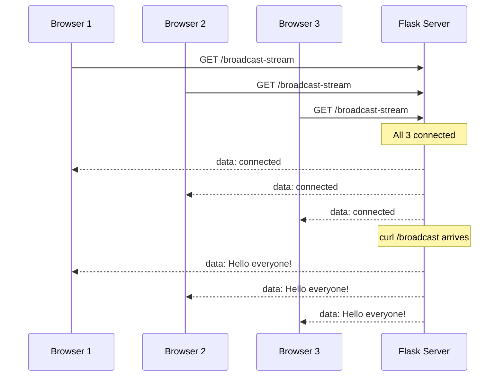
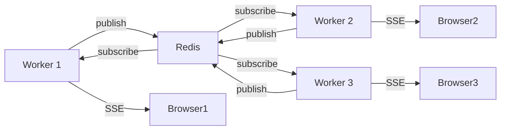
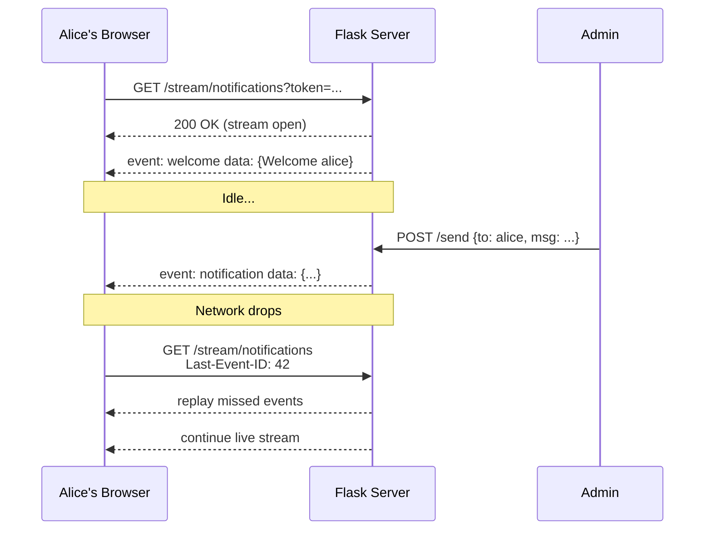

# **Server-Sent Events with Flask — Complete Guide from Scratch to Advanced**

> Brother, this picks up right where the SSE basics notes left off.
> Now we'll build SSE in Flask from a tiny one-line stream all the way to a scaled Redis-backed production system.
> Every example is runnable. Copy, paste, run.

---

## **Table of Contents**

1. [Setup — Install everything you need](#1-setup--install-everything-you-need)
2. [Project structure we'll build](#2-project-structure-well-build)
3. [Example 1 — Tiny SSE endpoint (smallest possible)](#3-example-1--tiny-sse-endpoint-smallest-possible)
4. [Example 2 — HTML/JS test client](#4-example-2--htmljs-test-client)
5. [Example 3 — Connection manager (track all clients)](#5-example-3--connection-manager-track-all-clients)
6. [Example 4 — Broadcast to everyone](#6-example-4--broadcast-to-everyone)
7. [Example 5 — Channels / topics (group messaging)](#7-example-5--channels--topics-group-messaging)
8. [Example 6 — User-targeted messages (one-to-one)](#8-example-6--user-targeted-messages-one-to-one)
9. [Example 7 — Authentication with JWT (token in query)](#9-example-7--authentication-with-jwt-token-in-query)
10. [Example 8 — Heartbeat to keep connections alive](#10-example-8--heartbeat-to-keep-connections-alive)
11. [Example 9 — Structured JSON messages with helpers](#11-example-9--structured-json-messages-with-helpers)
12. [Example 10 — Scaling with Redis Pub/Sub (multiple workers)](#12-example-10--scaling-with-redis-pubsub-multiple-workers)
13. [Example 11 — Reconnection with Last-Event-ID](#13-example-11--reconnection-with-last-event-id)
14. [Testing your Flask SSE server](#14-testing-your-flask-sse-server)
15. [Common pitfalls in Flask SSE](#15-common-pitfalls-in-flask-sse)
16. [Case Study — Real-time notification system step by step](#16-case-study--real-time-notification-system-step-by-step)
17. [Quick reference card](#17-quick-reference-card)

---

## **1. Setup — Install everything you need**

### **Option A: Pure Flask (no extra deps for SSE itself)**

```bash
pip install flask
```

That's it for the basics. We'll write SSE by hand using `Response` + a generator.

### **Option B: With Flask-SSE extension (Redis-based)**

```bash
pip install flask flask-sse redis gunicorn gevent
```

`flask-sse` is the official extension. It uses Redis pub/sub under the hood — great for production.

### **Option C: For testing**

```bash
pip install requests sseclient-py
```

### **Recommended versions**

```
flask>=3.0
python>=3.10
redis>=5.0
gunicorn>=21.0
gevent>=23.0
```

---

## **2. Project structure we'll build**

```
sse_flask_project/
│
├── app.py                  # main Flask app, all examples in one file (for learning)
├── sse_utils.py            # SSE formatting helpers
├── connection_manager.py   # tracks active SSE clients
├── auth.py                 # JWT decoding
├── static/
│   └── client.html         # test client page
├── templates/
│   └── index.html          # demo page
└── requirements.txt
```

For this guide, **all examples live in `app.py`** with separate routes so you can copy-paste and run.

---

## **3. Example 1 — Tiny SSE endpoint (smallest possible)**

This is the **smallest working SSE server** in Flask. Three lines of code.

### **`app.py`**

```python
from flask import Flask, Response

app = Flask(__name__)

@app.route("/stream")
def stream():
    def generate():
        yield "data: hello world\n\n"
    return Response(generate(), mimetype="text/event-stream")

if __name__ == "__main__":
    app.run(debug=True, threaded=True)
```

### **Run it**

```bash
python app.py
```

### **Test with curl**

```bash
curl -N http://localhost:5000/stream
```

You'll see:
```
data: hello world

```

That's it. **A working SSE endpoint.**

### **Why it works**

- `Response(...)` accepts a generator
- `mimetype="text/event-stream"` tells browser this is SSE
- `yield "data: hello world\n\n"` sends one event (the `\n\n` terminates it)
- `threaded=True` lets Flask handle multiple SSE clients at once in dev

### **Important: production server**

Flask's built-in server is **single-threaded by default** and **cannot handle real SSE traffic**. For production use:

```bash
gunicorn --worker-class gevent --workers 1 --bind 0.0.0.0:5000 app:app
```

We'll cover this in depth later.

---

## **4. Example 2 — HTML/JS test client**

Open this in your browser to talk to your SSE server.

### **`static/client.html`**

```html
<!DOCTYPE html>
<html>
<head>
    <title>SSE Test Client</title>
    <style>
        body { font-family: monospace; padding: 20px; }
        #log { background: #1e1e1e; color: #0f0; padding: 15px; height: 400px; overflow-y: scroll; }
        .event { padding: 2px 0; border-bottom: 1px solid #333; }
        input, button { padding: 8px; margin: 5px 0; }
    </style>
</head>
<body>
    <h1>SSE Test Client</h1>

    <div>
        <input id="url" value="/stream" style="width: 300px;">
        <button onclick="connect()">Connect</button>
        <button onclick="disconnect()">Disconnect</button>
    </div>

    <div>Status: <span id="status">disconnected</span></div>
    <div>Last Event ID: <span id="lastId">none</span></div>

    <div id="log"></div>

    <script>
        let source = null;

        function log(msg, type = 'info') {
            const logEl = document.getElementById('log');
            const div = document.createElement('div');
            div.className = 'event';
            div.style.color = type === 'error' ? '#f55' : type === 'event' ? '#0af' : '#0f0';
            div.textContent = `[${new Date().toISOString()}] ${msg}`;
            logEl.appendChild(div);
            logEl.scrollTop = logEl.scrollHeight;
        }

        function connect() {
            if (source) source.close();
            const url = document.getElementById('url').value;
            source = new EventSource(url);

            source.onopen = () => {
                document.getElementById('status').textContent = 'connected';
                log('Connected!');
            };

            source.onmessage = (e) => {
                log('MESSAGE: ' + e.data, 'event');
                document.getElementById('lastId').textContent = e.lastEventId;
            };

            source.addEventListener('greeting', (e) => {
                log('GREETING: ' + e.data, 'event');
            });

            source.onerror = (e) => {
                if (source.readyState === EventSource.CONNECTING) {
                    document.getElementById('status').textContent = 'reconnecting...';
                    log('Reconnecting...', 'error');
                } else if (source.readyState === EventSource.CLOSED) {
                    document.getElementById('status').textContent = 'closed';
                    log('Closed', 'error');
                }
            };
        }

        function disconnect() {
            if (source) {
                source.close();
                source = null;
            }
        }
    </script>
</body>
</html>
```

Serve it:

```python
from flask import Flask, send_from_directory

@app.route("/")
def index():
    return send_from_directory("static", "client.html")
```

Open `http://localhost:5000/` and click **Connect**. You'll see events stream in.

---

## **5. Example 3 — Connection manager (track all clients)**

To broadcast to many users, you need to know who's connected. A **connection manager** does this.

### **`connection_manager.py`**

```python
import queue
import threading
from typing import Dict, Set


class ConnectionManager:
    """Tracks all active SSE subscribers and their message queues."""

    def __init__(self):
        self._clients: Dict[int, queue.Queue] = {}
        self._lock = threading.Lock()
        self._next_id = 1

    def add(self) -> tuple[int, queue.Queue]:
        """Register a new client. Returns (client_id, queue)."""
        with self._lock:
            client_id = self._next_id
            self._next_id += 1
            q: queue.Queue = queue.Queue(maxsize=100)
            self._clients[client_id] = q
            return client_id, q

    def remove(self, client_id: int):
        """Unregister a client."""
        with self._lock:
            self._clients.pop(client_id, None)

    def count(self) -> int:
        with self._lock:
            return len(self._clients)

    def all_queues(self) -> list[queue.Queue]:
        with self._lock:
            return list(self._clients.values())


# One global instance for the app
manager = ConnectionManager()
```

### **SSE endpoint that uses the manager**

```python
import time
from app import app, manager

@app.route("/managed-stream")
def managed_stream():
    def generate():
        client_id, q = manager.add()
        try:
            # Send a hello right away
            q.put("data: connected\n\n")

            while True:
                try:
                    msg = q.get(timeout=30)
                    yield msg
                except queue.Empty:
                    # heartbeat on idle
                    yield ": ping\n\n"
        finally:
            manager.remove(client_id)

    return Response(generate(), mimetype="text/event-stream")
```

Now the server **knows** about every connected client. Each has its own queue, so messages don't get mixed.

---

## **6. Example 4 — Broadcast to everyone**

Push a message to **all** connected clients.

### **`app.py`**

```python
import queue
from app import app, manager

@app.route("/broadcast-stream")
def broadcast_stream():
    def generate():
        client_id, q = manager.add()
        try:
            yield "data: connected to broadcast\n\n"
            while True:
                try:
                    msg = q.get(timeout=30)
                    yield msg
                except queue.Empty:
                    yield ": ping\n\n"
        finally:
            manager.remove(client_id)

    return Response(generate(), mimetype="text/event-stream")


@app.route("/broadcast")
def broadcast():
    """HTTP POST/GET to push a message to every connected client."""
    msg = "Hello everyone from /broadcast!"
    for q in manager.all_queues():
        try:
            q.put_nowait(f"data: {msg}\n\n")
        except queue.Full:
            pass  # skip slow clients
    return {"sent": True, "recipients": manager.count()}
```

### **Try it**

1. Open the test client in 3 browser tabs, all connecting to `/broadcast-stream`
2. Run: `curl http://localhost:5000/broadcast`
3. All 3 tabs receive the message



---

## **7. Example 5 — Channels / topics (group messaging)**

Sometimes you want to send to a **subset** of users — say, only people watching a specific stock symbol.

### **`connection_manager.py` (extended)**

```python
class ChanneledConnectionManager(ConnectionManager):
    def __init__(self):
        super().__init__()
        self._channels: Dict[str, Set[int]] = {}  # channel -> set of client ids

    def subscribe(self, client_id: int, channel: str):
        with self._lock:
            self._channels.setdefault(channel, set()).add(client_id)

    def unsubscribe(self, client_id: int, channel: str):
        with self._lock:
            if channel in self._channels:
                self._channels[channel].discard(client_id)

    def remove(self, client_id: int):
        super().remove(client_id)
        with self._lock:
            for s in self._channels.values():
                s.discard(client_id)

    def channel_queues(self, channel: str) -> list[queue.Queue]:
        with self._lock:
            ids = list(self._channels.get(channel, set()))
        with self._lock:
            return [self._clients[i] for i in ids if i in self._clients]


channel_manager = ChanneledConnectionManager()
```

### **Endpoint**

```python
@app.route("/stream/channel/<channel>")
def channel_stream(channel):
    def generate():
        client_id, q = channel_manager.add()
        channel_manager.subscribe(client_id, channel)
        try:
            yield f"data: subscribed to {channel}\n\n"
            while True:
                try:
                    msg = q.get(timeout=30)
                    yield msg
                except queue.Empty:
                    yield ": ping\n\n"
        finally:
            channel_manager.unsubscribe(client_id, channel)
            channel_manager.remove(client_id)

    return Response(generate(), mimetype="text/event-stream")


@app.route("/publish/<channel>")
def publish(channel):
    msg = f"Update for channel {channel}"
    for q in channel_manager.channel_queues(channel):
        try:
            q.put_nowait(f"data: {msg}\n\n")
        except queue.Full:
            pass
    return {"channel": channel, "recipients": len(channel_manager.channel_queues(channel))}
```

### **Try it**

```bash
# Tab 1: connect to /stream/channel/AAPL
# Tab 2: connect to /stream/channel/GOOG
curl http://localhost:5000/publish/AAPL
# Only Tab 1 receives the message
```

---

## **8. Example 6 — User-targeted messages (one-to-one)**

For sending a message to a **specific user**, you authenticate first and tag the connection with a user id.

### **`connection_manager.py`**

```python
class UserConnectionManager(ConnectionManager):
    def __init__(self):
        super().__init__()
        self._users: Dict[str, Set[int]] = {}  # user_id -> set of client ids

    def tag_user(self, client_id: int, user_id: str):
        with self._lock:
            self._users.setdefault(user_id, set()).add(client_id)

    def remove(self, client_id: int):
        super().remove(client_id)
        with self._lock:
            for s in self._users.values():
                s.discard(client_id)

    def user_queues(self, user_id: str) -> list[queue.Queue]:
        with self._lock:
            ids = list(self._users.get(user_id, set()))
        with self._lock:
            return [self._clients[i] for i in ids if i in self._clients]


user_manager = UserConnectionManager()
```

### **Endpoint**

```python
@app.route("/stream/user/<user_id>")
def user_stream(user_id):
    def generate():
        client_id, q = user_manager.add()
        user_manager.tag_user(client_id, user_id)
        try:
            yield f"data: streaming for user {user_id}\n\n"
            while True:
                try:
                    msg = q.get(timeout=30)
                    yield msg
                except queue.Empty:
                    yield ": ping\n\n"
        finally:
            user_manager.remove(client_id)

    return Response(generate(), mimetype="text/event-stream")


@app.route("/notify/<user_id>")
def notify(user_id):
    msg = f"Personal notification for {user_id}"
    for q in user_manager.user_queues(user_id):
        try:
            q.put_nowait(f"data: {msg}\n\n")
        except queue.Full:
            pass
    return {"user": user_id, "recipients": len(user_manager.user_queues(user_id))}
```

### **Use case**

```bash
# User alice opens /stream/user/alice
# You POST to /notify/alice when something happens for her
curl http://localhost:5000/notify/alice
# alice's browser gets it, no one else's
```

> **Remember:** SSE is server → client only. To let the **client send** something back (e.g., "I clicked this"), use a regular HTTP POST endpoint alongside the SSE stream. Most apps do exactly this.

---

## **9. Example 7 — Authentication with JWT (token in query)**

Browser's `EventSource` can't send custom headers. So we authenticate via **query string**.

### **`auth.py`**

```python
import jwt
import time
from functools import wraps
from flask import request, abort


SECRET = "change-me-in-prod-please"


def make_token(user_id: str, ttl_seconds: int = 3600) -> str:
    payload = {
        "sub": user_id,
        "iat": int(time.time()),
        "exp": int(time.time()) + ttl_seconds,
    }
    return jwt.encode(payload, SECRET, algorithm="HS256")


def decode_token(token: str) -> dict:
    try:
        return jwt.decode(token, SECRET, algorithms=["HS256"])
    except jwt.ExpiredSignatureError:
        abort(401, "Token expired")
    except jwt.InvalidTokenError:
        abort(401, "Invalid token")
```

### **Protected endpoint**

```python
from auth import decode_token

@app.route("/stream/secure")
def secure_stream():
    # Token comes via query string: /stream/secure?token=<jwt>
    token = request.args.get("token", "")
    if not token:
        return {"error": "missing token"}, 401

    payload = decode_token(token)
    user_id = payload["sub"]

    def generate():
        client_id, q = user_manager.add()
        user_manager.tag_user(client_id, user_id)
        try:
            yield f"event: welcome\ndata: hi {user_id}\n\n"
            while True:
                try:
                    msg = q.get(timeout=30)
                    yield msg
                except queue.Empty:
                    yield ": ping\n\n"
        finally:
            user_manager.remove(client_id)

    return Response(generate(), mimetype="text/event-stream")


@app.route("/login/<user_id>")
def login(user_id):
    """Fake login — returns a JWT."""
    token = make_token(user_id)
    return {"token": token}
```

### **Client-side**

```javascript
// Get token from your login endpoint, then:
const token = "eyJhbGc...";  // from your /login response
const source = new EventSource(`/stream/secure?token=${token}`);
```

### **Security notes**

- Tokens appear in server logs (URL query strings get logged). Mitigate: short TTL + log filter.
- Always use **HTTPS** in production so the token isn't sniffed.
- For better security, use cookies — they don't go in URLs.

---

## **10. Example 8 — Heartbeat to keep connections alive**

Middleboxes (proxies, load balancers, corporate firewalls) kill idle connections after 30s–5min.

### **The pattern — send `: ping` every 15 seconds**

```python
import time
import queue

@app.route("/stream/heartbeat")
def heartbeat_stream():
    def generate():
        client_id, q = manager.add()
        try:
            yield "data: connected\n\n"
            last_ping = time.time()
            while True:
                try:
                    msg = q.get(timeout=15)
                    yield msg
                    last_ping = time.time()
                except queue.Empty:
                    # Send a heartbeat comment to keep connection alive
                    yield ": ping\n\n"
                    last_ping = time.time()
        finally:
            manager.remove(client_id)

    return Response(generate(), mimetype="text/event-stream")
```

### **Why it works**

- Lines starting with `:` are **comments** in SSE — browser ignores them
- But the **bytes flow** through, which keeps the TCP connection alive
- Middleboxes see traffic and don't kill the connection

### **Recommended intervals**

| Environment | Heartbeat |
|---|---|
| Local dev | Every 30s |
| Cloud (AWS ALB) | Every 30s |
| Corporate networks | Every 15s |
| Aggressive proxies | Every 10s |

---

## **11. Example 9 — Structured JSON messages with helpers**

Clean helpers make your code much more readable.

### **`sse_utils.py`**

```python
import json
from typing import Any


def sse_format(data: Any, event: str = None, id: str = None, retry: int = None) -> str:
    """Format a Python value as a proper SSE event string."""
    lines = []

    if retry is not None:
        lines.append(f"retry: {retry}")

    if id is not None:
        lines.append(f"id: {id}")

    if event is not None:
        lines.append(f"event: {event}")

    # Auto-serialize to JSON if not a string
    if isinstance(data, (dict, list)):
        data = json.dumps(data)

    # Each line of data must be prefixed with "data: "
    for line in str(data).split("\n"):
        lines.append(f"data: {line}")

    # SSE events end with a blank line (\n\n)
    return "\n".join(lines) + "\n\n"


def sse_comment(text: str) -> str:
    """Format a comment (heartbeat) line."""
    return f": {text}\n\n"
```

### **Using the helpers**

```python
from sse_utils import sse_format, sse_comment
import time
import queue


@app.route("/stream/json")
def json_stream():
    def generate():
        client_id, q = manager.add()
        try:
            yield sse_format({"status": "connected"}, event="status")
            counter = 0
            while True:
                try:
                    msg = q.get(timeout=15)
                    yield msg
                except queue.Empty:
                    counter += 1
                    yield sse_format(
                        {"counter": counter, "time": time.time()},
                        event="tick",
                        id=str(counter),
                    )
                # Could also interleave heartbeats:
                # yield sse_comment("ping")
        finally:
            manager.remove(client_id)

    return Response(generate(), mimetype="text/event-stream")
```

### **Client side — clean JS**

```javascript
const source = new EventSource('/stream/json');

source.addEventListener('status', (e) => {
    const data = JSON.parse(e.data);
    console.log('Status:', data.status);
});

source.addEventListener('tick', (e) => {
    const data = JSON.parse(e.data);
    console.log('Tick #' + data.counter + ' at ' + data.time);
});
```

---

## **12. Example 10 — Scaling with Redis Pub/Sub (multiple workers)**

A single Flask process can't handle thousands of SSE clients. To scale, you need **multiple workers** — but then a message in worker A can't reach a client connected to worker B. **Redis pub/sub** solves this.

### **Install**

```bash
pip install redis flask-sse
```

### **`app.py` with Flask-SSE**

```python
from flask import Flask, render_template
from flask_sse import sse

app = Flask(__name__)
app.config["REDIS_URL"] = "redis://localhost:6379"

# Register the SSE blueprint at /stream
app.register_blueprint(sse, url_prefix="/stream")


@app.route("/")
def index():
    return render_template("index.html")


@app.route("/publish")
def publish():
    """
    Triggered by your app code to publish a message.
    Anyone subscribed to /stream will receive it.
    """
    sse.publish({"message": "Hello from Redis!"}, type="greeting")
    return "Message sent!"


@app.route("/publish/<channel>")
def publish_channel(channel):
    sse.publish({"channel": channel, "data": "tick"}, type="update", channel=channel)
    return f"Sent to {channel}"
```

### **Client**

```html
<script>
    const source = new EventSource("{{ url_for('sse.stream') }}");

    source.addEventListener("greeting", (e) => {
        console.log("Greeting:", JSON.parse(e.data));
    });

    source.addEventListener("update", (e) => {
        console.log("Update:", JSON.parse(e.data));
    });
</script>
```

### **Run with gunicorn + gevent**

```bash
# Start Redis first
redis-server

# Start the app — multiple workers
gunicorn --worker-class gevent --workers 4 --bind 0.0.0.0:5000 app:app
```

### **How it works**



All workers share Redis. A publish from worker 3 reaches clients connected to workers 1 and 2.

---

## **13. Example 11 — Reconnection with Last-Event-ID**

Browser sends the last event id on reconnect. Server can replay missed events.

### **`sse_store.py`** — simple in-memory store for demo

```python
from collections import deque
from threading import Lock


class EventStore:
    def __init__(self, maxlen: int = 1000):
        self._events = deque(maxlen=maxlen)
        self._lock = Lock()
        self._counter = 0

    def add(self, data: str, event: str = None) -> int:
        with self._lock:
            self._counter += 1
            eid = self._counter
            self._events.append((eid, event, data))
            return eid

    def since(self, last_id: int) -> list[tuple[int, str, str]]:
        with self._lock:
            return [e for e in self._events if e[0] > last_id]


store = EventStore()
```

### **Endpoint that supports resume**

```python
from flask import request
from sse_utils import sse_format


@app.route("/stream/resumable")
def resumable_stream():
    last_id = request.headers.get("Last-Event-ID")
    last_id = int(last_id) if last_id and last_id.isdigit() else 0

    def generate():
        client_id, q = manager.add()
        try:
            # Replay any missed events
            missed = store.since(last_id)
            for eid, event, data in missed:
                yield sse_format(data, event=event, id=str(eid))

            # Then live stream
            while True:
                try:
                    msg = q.get(timeout=15)
                    yield msg
                except queue.Empty:
                    yield ": ping\n\n"
        finally:
            manager.remove(client_id)

    return Response(generate(), mimetype="text/event-stream")


@app.route("/fire")
def fire():
    eid = store.add(f"event at {__import__('time').time()}", event="tick")
    for q in manager.all_queues():
        try:
            q.put_nowait(sse_format(f"event at {__import__('time').time()}", event="tick", id=str(eid)))
        except queue.Full:
            pass
    return {"fired": eid}
```

### **Test it**

1. Open browser, connect to `/stream/resumable`
2. Curl `/fire` a few times → see events arrive
3. Stop the server (Ctrl+C), restart it
4. Browser **auto-reconnects** with `Last-Event-ID`
5. Server replays missed events from in-memory store

> For production, replace the in-memory `deque` with Redis or a database for durability across restarts.

---

## **14. Testing your Flask SSE server**

### **14.1 Test with curl**

```bash
curl -N http://localhost:5000/stream
```

`-N` disables buffering. You see events as they arrive.

### **14.2 Test with python sseclient**

```python
import sseclient
import requests

response = requests.get("http://localhost:5000/stream", stream=True)
client = sseclient.SSEClient(response.events())

for event in client:
    print(f"[{event.event}] {event.data}")
```

### **14.3 Pytest test for SSE**

```python
def test_sse_basic():
    with app.test_client() as client:
        resp = client.get("/stream", buffered=False)
        chunks = []
        for chunk in resp.response:
            chunks.append(chunk.decode())
            if len(chunks) >= 1:
                break
        assert any("data:" in c for c in chunks)
```

### **14.4 Test heartbeat**

```python
def test_sse_heartbeat():
    with app.test_client() as client:
        resp = client.get("/stream/heartbeat", buffered=False)
        saw_ping = False
        for chunk in resp.response:
            if b": ping" in chunk:
                saw_ping = True
                break
        assert saw_ping
```

---

## **15. Common pitfalls in Flask SSE**

### **15.1 ❌ Using `time.sleep()` in the generator**

```python
# WRONG - blocks the entire worker thread
def generate():
    while True:
        yield "data: hello\n\n"
        time.sleep(1)  # ← blocks everything else
```

**✅ Fix:** use a queue + a separate thread to push events, or use gevent/gunicorn for cooperative scheduling.

### **15.2 ❌ Forgetting the `\n\n` terminator**

```python
# WRONG - browser sees this as incomplete event
yield "data: hello\n"
```

**✅ Fix:** always end with `\n\n`:

```python
yield "data: hello\n\n"
```

### **15.3 ❌ Wrong Content-Type**

```python
# WRONG
return Response(generate(), mimetype="text/plain")
```

**✅ Fix:**

```python
return Response(generate(), mimetype="text/event-stream")
```

### **15.4 ❌ Using Flask dev server in production**

```python
# WRONG - single threaded, doesn't scale
app.run()
```

**✅ Fix:** use gunicorn with gevent worker:

```bash
gunicorn --worker-class gevent --workers 4 --bind 0.0.0.0:5000 app:app
```

### **15.5 ❌ Forgetting to remove clients on disconnect**

If you don't clean up on disconnect, your connection list grows forever (memory leak).

**✅ Fix:** always use try/finally:

```python
def generate():
    client_id, q = manager.add()
    try:
        # ... stream ...
        pass
    finally:
        manager.remove(client_id)  # ← critical!
```

### **15.6 ❌ Sending data that contains `\n\n`**

SSE uses `\n\n` as event terminator. If your data has it, the event gets split.

**✅ Fix:** keep `data:` single-line, use JSON.stringify on the client, or escape carefully.

### **15.7 ❌ Nginx buffering your stream**

Default Nginx buffers responses. SSE events get delayed.

**✅ Fix** in nginx config:

```nginx
location /stream {
    proxy_pass http://localhost:5000;
    proxy_http_version 1.1;
    proxy_buffering off;
    proxy_cache off;
    proxy_read_timeout 86400s;
}
```

Or send header from app:

```python
response.headers["X-Accel-Buffering"] = "no"
```

---

## **16. Case Study — Real-time notification system step by step**

Let's build a complete real-time notification system.

### **Goal**

- Users log in → get a JWT
- User opens `/stream/notifications` → sees their notifications live
- Admin posts a notification → only targeted user(s) receive it
- Missed notifications replay on reconnect

### **`app.py`**

```python
from flask import Flask, request, Response
from auth import make_token, decode_token
from connection_manager import UserConnectionManager
from sse_utils import sse_format, sse_comment
from sse_store import EventStore
import queue
import time

app = Flask(__name__)
notif_manager = UserConnectionManager()
notif_store = EventStore(maxlen=500)


@app.route("/login/<user_id>")
def login(user_id):
    return {"token": make_token(user_id)}


@app.route("/stream/notifications")
def notifications_stream():
    token = request.args.get("token", "")
    if not token:
        return {"error": "token required"}, 401

    payload = decode_token(token)
    user_id = payload["sub"]

    last_id = request.headers.get("Last-Event-ID")
    last_id = int(last_id) if last_id and last_id.isdigit() else 0

    def generate():
        client_id, q = notif_manager.add()
        notif_manager.tag_user(client_id, user_id)
        try:
            # Replay missed
            for eid, event, data in notif_store.since(last_id):
                # only replay notifications for this user
                if f'"to":"{user_id}"' in data or f'"to":"all"' in data:
                    yield sse_format(data, event=event, id=str(eid))

            # Welcome
            yield sse_format(
                {"message": f"Welcome {user_id}"},
                event="welcome",
                id=str(int(time.time() * 1000)),
            )

            last_ping = time.time()
            while True:
                try:
                    msg = q.get(timeout=15)
                    yield msg
                    last_ping = time.time()
                except queue.Empty:
                    if time.time() - last_ping > 15:
                        yield sse_comment("ping")
                        last_ping = time.time()
        finally:
            notif_manager.remove(client_id)

    return Response(
        generate(),
        mimetype="text/event-stream",
        headers={
            "Cache-Control": "no-cache",
            "X-Accel-Buffering": "no",
        },
    )


@app.route("/send", methods=["POST"])
def send_notification():
    """Admin endpoint to send a notification."""
    body = request.get_json()
    to_user = body.get("to", "all")
    message = body.get("message", "")
    notification = {"to": to_user, "message": message, "ts": time.time()}
    eid = notif_store.add(json.dumps(notification), event="notification")

    targets = (
        notif_manager.user_queues(to_user) if to_user != "all"
        else notif_manager.all_queues()
    )
    for q in targets:
        try:
            q.put_nowait(sse_format(notification, event="notification", id=str(eid)))
        except queue.Full:
            pass

    return {"sent": True, "id": eid, "recipients": len(targets)}


import json

if __name__ == "__main__":
    app.run(debug=True, threaded=True)
```

### **Try it**

```bash
# 1. Get token for alice
curl http://localhost:5000/login/alice

# 2. Open browser: /stream/notifications?token=<alice_token>

# 3. Send notification to alice
curl -X POST http://localhost:5000/send \
  -H "Content-Type: application/json" \
  -d '{"to": "alice", "message": "You have a new follower!"}'

# 4. alice's browser receives it instantly
```



---

## **17. Quick reference card**

### **Minimal SSE endpoint**

```python
@app.route("/stream")
def stream():
    def gen():
        yield "data: hello\n\n"
    return Response(gen(), mimetype="text/event-stream")
```

### **Required headers**

```python
{
    "Content-Type": "text/event-stream",
    "Cache-Control": "no-cache",
    "Connection": "keep-alive",
    "X-Accel-Buffering": "no",   # for Nginx
}
```

### **The 4 SSE fields**

```
data: payload         ← the message
event: typeName       ← custom event type
id: 123               ← resume ID
retry: 5000           ← reconnect ms
: comment             ← ignored, for heartbeat
```

### **Run in production**

```bash
gunicorn --worker-class gevent --workers 1 --bind 0.0.0.0:5000 app:app
```

> Why `--workers 1`? With in-memory connection manager, multiple workers can't share state. For multi-worker: use Redis. Then `--workers 4` is fine.

### **Nginx config**

```nginx
location /stream {
    proxy_pass http://localhost:5000;
    proxy_http_version 1.1;
    proxy_set_header Connection "";
    proxy_buffering off;
    proxy_cache off;
    proxy_read_timeout 86400s;
}
```

### **Browser client**

```javascript
const es = new EventSource('/stream');
es.onmessage = (e) => console.log(e.data);
es.addEventListener('customEvent', (e) => console.log(e.data));
es.onerror = (e) => console.log('reconnecting...');
// es.close();
```

### **Server shutdown checklist**

- [ ] Generator returns / client disconnects → cleanup in `finally`
- [ ] Try/finally around `manager.add()` and `manager.remove()`
- [ ] Use try/except on `queue.put_nowait()` for full queues
- [ ] Test reconnect with `Last-Event-ID`
- [ ] Test through Nginx with `proxy_buffering off`

---

## **Where to next?**

You now have a complete Flask SSE toolkit — from one-line streams to a full Redis-backed notification system with reconnection support.

If you want to go further:
- ✅ **FastAPI version** of the same guide — see the sister file `sse-fastapi-notes.md`
- ✅ **Authentication with cookies** instead of query tokens
- ✅ **Postgres + LISTEN/NOTIFY** as alternative to Redis pub/sub
- ✅ **Rate limiting** per user (slow client protection)

Say the word and we'll dive in! 🚀