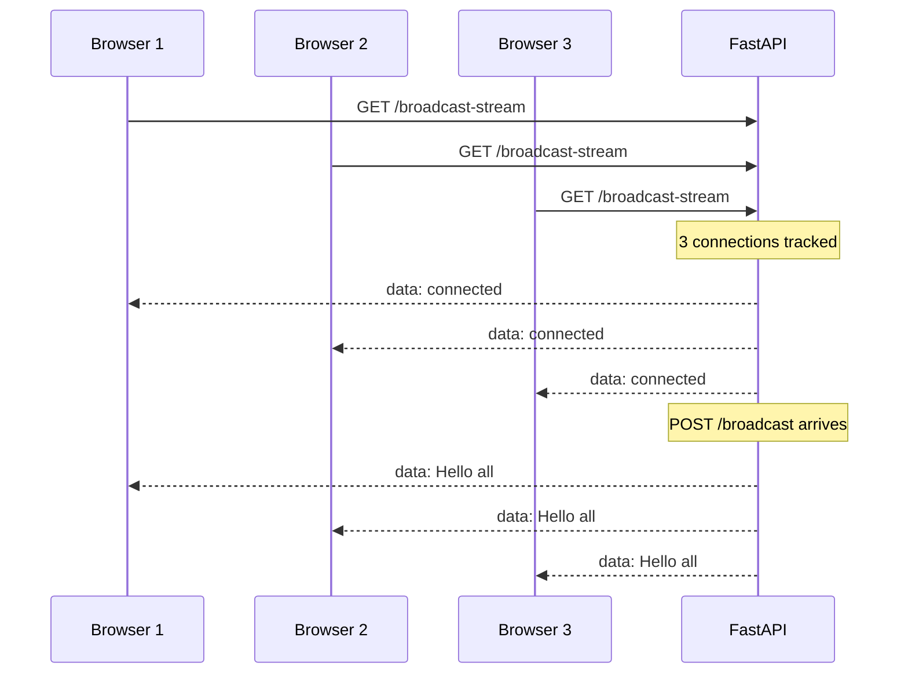
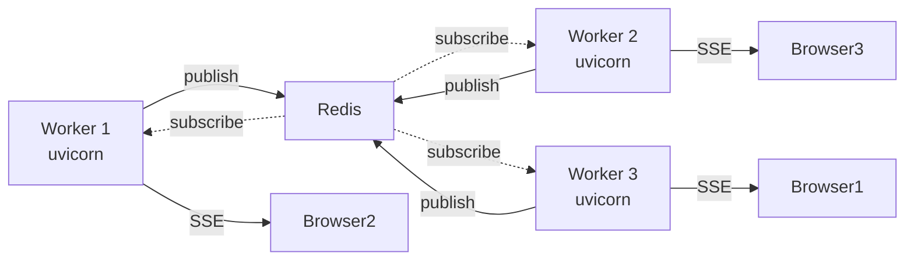
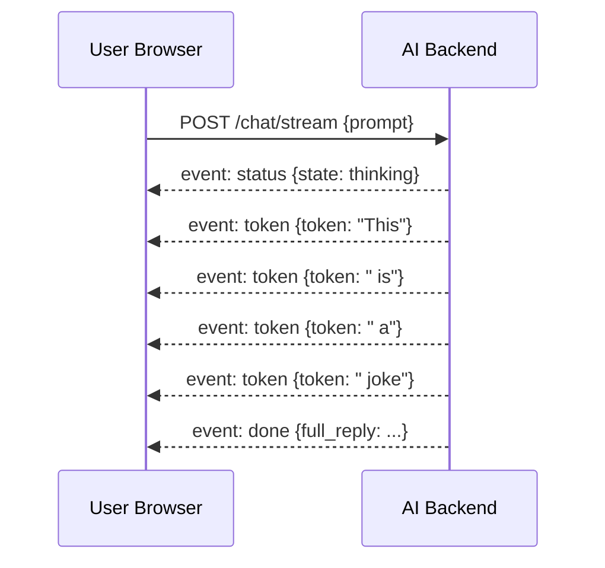

# **Server-Sent Events with FastAPI — Complete Guide from Scratch to Advanced**

> Brother, this is the FastAPI sibling of the Flask SSE notes.
> Same structure, same depth — but built async-first with `StreamingResponse`, `sse-starlette`, and modern FastAPI patterns.
> Every example is runnable. Copy, paste, run.

---

## **Table of Contents**

1. [Setup — Install everything you need](#1-setup--install-everything-you-need)
2. [Project structure we'll build](#2-project-structure-well-build)
3. [Example 1 — Tiny SSE endpoint (smallest possible)](#3-example-1--tiny-sse-endpoint-smallest-possible)
4. [Example 2 — HTML/JS test client](#4-example-2--htmljs-test-client)
5. [Example 3 — Connection manager (track all clients)](#5-example-3--connection-manager-track-all-clients)
6. [Example 4 — Broadcast to everyone](#6-example-4--broadcast-to-everyone)
7. [Example 5 — Channels / topics (group messaging)](#7-example-5--channels--topics-group-messaging)
8. [Example 6 — User-targeted messages (one-to-one)](#8-example-6--user-targeted-messages-one-to-one)
9. [Example 7 — Authentication with JWT (token in query)](#9-example-7--authentication-with-jwt-token-in-query)
10. [Example 8 — Heartbeat to keep connections alive](#10-example-8--heartbeat-to-keep-connections-alive)
11. [Example 9 — Structured JSON messages with Pydantic](#11-example-9--structured-json-messages-with-pydantic)
12. [Example 10 — Scaling with Redis Pub/Sub (multiple workers)](#12-example-10--scaling-with-redis-pubsub-multiple-workers)
13. [Example 11 — Reconnection with Last-Event-ID](#13-example-11--reconnection-with-last-event-id)
14. [Example 12 — Streaming LLM tokens (the AI use case)](#14-example-12--streaming-llm-tokens-the-ai-use-case)
15. [Testing your FastAPI SSE server](#15-testing-your-fastapi-sse-server)
16. [Common pitfalls in FastAPI SSE](#16-common-pitfalls-in-fastapi-sse)
17. [Case Study — AI streaming response app step by step](#17-case-study--ai-streaming-response-app-step-by-step)
18. [Quick reference card](#18-quick-reference-card)

---

## **1. Setup — Install everything you need**

### **Option A: Pure FastAPI (no extra SSE deps)**

```bash
pip install fastapi uvicorn
```

We can implement SSE entirely with FastAPI's `StreamingResponse`.

### **Option B: With sse-starlette (cleaner API)**

```bash
pip install fastapi uvicorn sse-starlette
```

`sse-starlette` provides `EventSourceResponse` which handles the protocol details for you.

### **Option C: With Redis for scaling**

```bash
pip install fastapi uvicorn sse-starlette redis
```

### **Option D: For testing**

```bash
pip install httpx pytest pytest-asyncio sseclient-py
```

### **Recommended versions**

```
fastapi>=0.110
uvicorn[standard]>=0.27
sse-starlette>=2.0
redis>=5.0
python>=3.10
```

---

## **2. Project structure we'll build**

```
sse_fastapi_project/
│
├── main.py                # main FastAPI app — all examples
├── sse_utils.py           # SSE formatting helpers
├── connection_manager.py  # async connection manager
├── auth.py                # JWT decode/encode
├── schemas.py             # Pydantic models
├── static/
│   └── client.html        # test client
└── requirements.txt
```

For learning, **all routes live in `main.py`**. Copy-paste and run.

---

## **3. Example 1 — Tiny SSE endpoint (smallest possible)**

The **smallest working FastAPI SSE server** — pure `StreamingResponse`.

### **`main.py`**

```python
from fastapi import FastAPI
from fastapi.responses import StreamingResponse

app = FastAPI()


@app.get("/stream")
async def stream():
    async def generate():
        yield "data: hello world\n\n"

    return StreamingResponse(
        generate(),
        media_type="text/event-stream",
    )


# Run: uvicorn main:app --reload
```

### **Test with curl**

```bash
curl -N http://localhost:8000/stream
```

You'll see:
```
data: hello world

```

Done. **A working FastAPI SSE server.**

### **Why it works**

- `StreamingResponse` accepts an async generator
- `media_type="text/event-stream"` tells browser this is SSE
- Each `yield` produces a chunk that goes out immediately
- The response stays open until the generator ends

---

## **4. Example 2 — HTML/JS test client**

Same client as the Flask file — works against any SSE endpoint.

### **`static/client.html`**

```html
<!DOCTYPE html>
<html>
<head>
    <title>FastAPI SSE Test Client</title>
    <style>
        body { font-family: monospace; padding: 20px; background: #1e1e1e; color: #fff; }
        #log { background: #000; padding: 15px; height: 400px; overflow-y: scroll; }
        .event { padding: 2px 0; border-bottom: 1px solid #333; }
        input, button { padding: 8px; margin: 5px 0; background: #333; color: #fff; border: 1px solid #555; }
    </style>
</head>
<body>
    <h1>FastAPI SSE Test Client</h1>

    <div>
        <input id="url" value="/stream" style="width: 400px;">
        <button onclick="connect()">Connect</button>
        <button onclick="disconnect()">Disconnect</button>
    </div>

    <div>Status: <span id="status">disconnected</span></div>

    <div id="log"></div>

    <script>
        let source = null;

        function log(msg, color = '#0f0') {
            const logEl = document.getElementById('log');
            const div = document.createElement('div');
            div.className = 'event';
            div.style.color = color;
            div.textContent = `[${new Date().toISOString()}] ${msg}`;
            logEl.appendChild(div);
            logEl.scrollTop = logEl.scrollHeight;
        }

        function connect() {
            if (source) source.close();
            const url = document.getElementById('url').value;
            source = new EventSource(url);

            source.onopen = () => {
                document.getElementById('status').textContent = 'connected';
                log('Connected!');
            };

            source.onmessage = (e) => log('MSG: ' + e.data, '#0af');
            source.addEventListener('greeting', (e) => log('GREETING: ' + e.data, '#fa0'));
            source.addEventListener('tick', (e) => log('TICK: ' + e.data, '#0f0'));

            source.onerror = () => {
                document.getElementById('status').textContent =
                    source.readyState === EventSource.CONNECTING ? 'reconnecting...' : 'closed';
                log('Error/reconnect', '#f55');
            };
        }

        function disconnect() {
            if (source) { source.close(); source = null; }
        }
    </script>
</body>
</html>
```

Serve it:

```python
from fastapi.staticfiles import StaticFiles
app.mount("/static", StaticFiles(directory="static"), name="static")

# Then open http://localhost:8000/static/client.html
```

Or via root:

```python
from fastapi.responses import FileResponse

@app.get("/")
async def root():
    return FileResponse("static/client.html")
```

---

## **5. Example 3 — Connection manager (track all clients)**

For broadcasting, we need to know who's connected. An **async connection manager**.

### **`connection_manager.py`**

```python
import asyncio
from typing import Dict, Set
from contextlib import asynccontextmanager


class ConnectionManager:
    """Tracks all active SSE subscribers via per-client asyncio queues."""

    def __init__(self):
        self._clients: Dict[int, asyncio.Queue] = {}
        self._channels: Dict[str, Set[int]] = {}
        self._users: Dict[str, Set[int]] = {}
        self._lock = asyncio.Lock()
        self._next_id = 1

    async def add(self) -> tuple[int, asyncio.Queue]:
        async with self._lock:
            client_id = self._next_id
            self._next_id += 1
            q: asyncio.Queue = asyncio.Queue(maxsize=100)
            self._clients[client_id] = q
            return client_id, q

    async def remove(self, client_id: int):
        async with self._lock:
            self._clients.pop(client_id, None)
            for s in self._channels.values():
                s.discard(client_id)
            for s in self._users.values():
                s.discard(client_id)

    async def count(self) -> int:
        async with self._lock:
            return len(self._clients)

    async def all_queues(self) -> list[asyncio.Queue]:
        async with self._lock:
            return list(self._clients.values())

    async def subscribe(self, client_id: int, channel: str):
        async with self._lock:
            self._channels.setdefault(channel, set()).add(client_id)

    async def channel_queues(self, channel: str) -> list[asyncio.Queue]:
        async with self._lock:
            ids = list(self._channels.get(channel, set()))
            return [self._clients[i] for i in ids if i in self._clients]

    async def tag_user(self, client_id: int, user_id: str):
        async with self._lock:
            self._users.setdefault(user_id, set()).add(client_id)

    async def user_queues(self, user_id: str) -> list[asyncio.Queue]:
        async with self._lock:
            ids = list(self._users.get(user_id, set()))
            return [self._clients[i] for i in ids if i in self._clients]


manager = ConnectionManager()
```

### **SSE endpoint that uses the manager**

```python
import asyncio

@app.get("/managed-stream")
async def managed_stream():
    async def generate():
        client_id, q = await manager.add()
        try:
            yield "data: connected\n\n"
            while True:
                try:
                    msg = await asyncio.wait_for(q.get(), timeout=30)
                    yield msg
                except asyncio.TimeoutError:
                    yield ": ping\n\n"
        finally:
            await manager.remove(client_id)

    return StreamingResponse(generate(), media_type="text/event-stream")
```

Each client has its own `asyncio.Queue`. The generator pulls from the queue and yields to the client. Disconnects are cleaned up via `try/finally`.

---

## **6. Example 4 — Broadcast to everyone**

Push a message to **all** connected clients.

### **`main.py`**

```python
@app.get("/broadcast-stream")
async def broadcast_stream():
    async def generate():
        client_id, q = await manager.add()
        try:
            yield "data: connected to broadcast\n\n"
            while True:
                try:
                    msg = await asyncio.wait_for(q.get(), timeout=30)
                    yield msg
                except asyncio.TimeoutError:
                    yield ": ping\n\n"
        finally:
            await manager.remove(client_id)

    return StreamingResponse(generate(), media_type="text/event-stream")


@app.post("/broadcast")
async def broadcast(message: str = "Hello everyone!"):
    """Send a message to every connected client."""
    payload = f"data: {message}\n\n"
    count = 0
    for q in await manager.all_queues():
        try:
            q.put_nowait(payload)
            count += 1
        except asyncio.QueueFull:
            pass
    return {"sent": True, "recipients": count}
```

### **Try it**

```bash
# Open 3 browser tabs to /broadcast-stream
curl -X POST "http://localhost:8000/broadcast?message=Hello+all"
# All 3 tabs receive the message
```



---

## **7. Example 5 — Channels / topics (group messaging)**

Send to a **subset** of subscribers — e.g., per-stock-symbol or per-room.

### **`main.py`**

```python
@app.get("/stream/channel/{channel}")
async def channel_stream(channel: str):
    async def generate():
        client_id, q = await manager.add()
        await manager.subscribe(client_id, channel)
        try:
            yield f"data: subscribed to {channel}\n\n"
            while True:
                try:
                    msg = await asyncio.wait_for(q.get(), timeout=30)
                    yield msg
                except asyncio.TimeoutError:
                    yield ": ping\n\n"
        finally:
            await manager.remove(client_id)

    return StreamingResponse(generate(), media_type="text/event-stream")


@app.post("/publish/{channel}")
async def publish_to_channel(channel: str, message: str):
    payload = f"data: [{channel}] {message}\n\n"
    count = 0
    for q in await manager.channel_queues(channel):
        try:
            q.put_nowait(payload)
            count += 1
        except asyncio.QueueFull:
            pass
    return {"channel": channel, "recipients": count}
```

### **Try it**

```bash
# Tab 1: /stream/channel/AAPL
# Tab 2: /stream/channel/GOOG
curl -X POST "http://localhost:8000/publish/AAPL?message=price+up"
# Only Tab 1 receives it
```

---

## **8. Example 6 — User-targeted messages (one-to-one)**

Push a message to **one specific user** (e.g., a personal notification).

### **`main.py`**

```python
@app.get("/stream/user/{user_id}")
async def user_stream(user_id: str):
    async def generate():
        client_id, q = await manager.add()
        await manager.tag_user(client_id, user_id)
        try:
            yield f"data: streaming for user {user_id}\n\n"
            while True:
                try:
                    msg = await asyncio.wait_for(q.get(), timeout=30)
                    yield msg
                except asyncio.TimeoutError:
                    yield ": ping\n\n"
        finally:
            await manager.remove(client_id)

    return StreamingResponse(generate(), media_type="text/event-stream")


@app.post("/notify/{user_id}")
async def notify_user(user_id: str, message: str):
    payload = f"data: {message}\n\n"
    count = 0
    for q in await manager.user_queues(user_id):
        try:
            q.put_nowait(payload)
            count += 1
        except asyncio.QueueFull:
            pass
    return {"user": user_id, "recipients": count}
```

> **Important:** SSE is server → client only. If the **client** needs to send data back, use a regular HTTP POST endpoint alongside the SSE stream. Common pattern: SSE for receiving, POST for sending.

---

## **9. Example 7 — Authentication with JWT (token in query)**

Browser's `EventSource` can't send custom headers. We authenticate via **query string** (or cookies).

### **`auth.py`**

```python
import time
import jwt
from fastapi import HTTPException, Query


SECRET = "change-me-in-prod-please"


def make_token(user_id: str, ttl_seconds: int = 3600) -> str:
    payload = {
        "sub": user_id,
        "iat": int(time.time()),
        "exp": int(time.time()) + ttl_seconds,
    }
    return jwt.encode(payload, SECRET, algorithm="HS256")


def decode_token(token: str) -> dict:
    try:
        return jwt.decode(token, SECRET, algorithms=["HS256"])
    except jwt.ExpiredSignatureError:
        raise HTTPException(401, "Token expired")
    except jwt.InvalidTokenError:
        raise HTTPException(401, "Invalid token")
```

### **Protected endpoint**

```python
from auth import make_token, decode_token
from fastapi import Query


@app.get("/login/{user_id}")
async def login(user_id: str):
    """Fake login — returns a JWT."""
    return {"token": make_token(user_id)}


@app.get("/stream/secure")
async def secure_stream(token: str = Query(...)):
    payload = decode_token(token)
    user_id = payload["sub"]

    async def generate():
        client_id, q = await manager.add()
        await manager.tag_user(client_id, user_id)
        try:
            yield f"event: welcome\ndata: hi {user_id}\n\n"
            while True:
                try:
                    msg = await asyncio.wait_for(q.get(), timeout=30)
                    yield msg
                except asyncio.TimeoutError:
                    yield ": ping\n\n"
        finally:
            await manager.remove(client_id)

    return StreamingResponse(generate(), media_type="text/event-stream")
```

### **Client side**

```javascript
// 1. Get token
const res = await fetch(`/login/alice`);
const { token } = await res.json();

// 2. Connect with token in query string
const source = new EventSource(`/stream/secure?token=${token}`);

source.addEventListener('welcome', (e) => {
    console.log('Server says:', e.data);
});
```

### **Security notes**

- Tokens in URLs get logged → use short TTL + filter server logs
- Always HTTPS in production
- For better security, prefer **cookies** (they don't appear in URLs)

---

## **10. Example 8 — Heartbeat to keep connections alive**

Middleboxes kill idle HTTP connections after 30s–5min. Send periodic `: ping` comments.

### **`main.py`**

```python
HEARTBEAT_INTERVAL = 15  # seconds


@app.get("/stream/heartbeat")
async def heartbeat_stream():
    async def generate():
        client_id, q = await manager.add()
        try:
            yield "data: connected\n\n"
            while True:
                try:
                    msg = await asyncio.wait_for(q.get(), timeout=HEARTBEAT_INTERVAL)
                    yield msg
                except asyncio.TimeoutError:
                    yield ": ping\n\n"
        finally:
            await manager.remove(client_id)

    return StreamingResponse(generate(), media_type="text/event-stream")
```

### **How it works**

- `asyncio.wait_for(q.get(), timeout=15)` waits up to 15s for a real message
- If timeout fires, we yield `: ping\n\n` (a comment the browser ignores)
- The bytes flow keep the TCP connection alive → no idle timeouts

### **Recommended intervals**

| Environment | Heartbeat |
|---|---|
| Local dev | Every 30s |
| Cloud (AWS ALB, GCP LB) | Every 30s |
| Corporate networks | Every 15s |
| Aggressive proxies | Every 10s |

---

## **11. Example 9 — Structured JSON messages with Pydantic**

Use Pydantic for clean, validated message schemas.

### **`schemas.py`**

```python
from pydantic import BaseModel
from typing import Literal
import time


class SSEMessage(BaseModel):
    event: str = "message"
    data: dict | str
    id: str | None = None
    retry: int | None = None

    def format(self) -> str:
        import json
        lines = []
        if self.retry is not None:
            lines.append(f"retry: {self.retry}")
        if self.id is not None:
            lines.append(f"id: {self.id}")
        if self.event != "message":
            lines.append(f"event: {self.event}")
        payload = json.dumps(self.data) if isinstance(self.data, dict) else str(self.data)
        for line in payload.split("\n"):
            lines.append(f"data: {line}")
        return "\n".join(lines) + "\n\n"


class TickMessage(BaseModel):
    counter: int
    time: float

    def to_sse(self, event: str = "tick") -> str:
        return SSEMessage(event=event, data=self.model_dump(), id=str(self.counter)).format()
```

### **Using the schemas**

```python
import asyncio
from schemas import SSEMessage, TickMessage


@app.get("/stream/json")
async def json_stream():
    async def generate():
        client_id, q = await manager.add()
        try:
            yield SSEMessage(event="status", data={"msg": "connected"}).format()
            counter = 0
            while True:
                try:
                    msg = await asyncio.wait_for(q.get(), timeout=15)
                    yield msg
                except asyncio.TimeoutError:
                    counter += 1
                    yield TickMessage(counter=counter, time=time.time()).to_sse()
        finally:
            await manager.remove(client_id)

    return StreamingResponse(generate(), media_type="text/event-stream")
```

### **Client side**

```javascript
const source = new EventSource('/stream/json');

source.addEventListener('status', (e) => {
    const data = JSON.parse(e.data);
    console.log('Status:', data.msg);
});

source.addEventListener('tick', (e) => {
    const data = JSON.parse(e.data);
    console.log(`Tick #${data.counter} at ${data.time}`);
});
```

---

## **12. Example 10 — Scaling with Redis Pub/Sub (multiple workers)**

A single FastAPI process can't handle thousands of SSE clients. To scale to **multiple workers**, use Redis.

### **Install**

```bash
pip install redis sse-starlette
```

### **`main.py` with Redis pub/sub**

```python
import asyncio
import json
import redis.asyncio as redis
from fastapi import FastAPI
from sse_starlette.sse import EventSourceResponse


REDIS_URL = "redis://localhost:6379"


@app.on_event("startup")
async def startup():
    app.state.redis = redis.from_url(REDIS_URL, decode_responses=True)


@app.on_event("shutdown")
async def shutdown():
    await app.state.redis.close()


@app.get("/stream/redis")
async def redis_stream():
    r: redis.Redis = app.state.redis
    pubsub = r.pubsub()
    await pubsub.subscribe("events")

    async def generate():
        try:
            # Send connected event immediately
            yield {"event": "connected", "data": json.dumps({"status": "ok"})}

            async for message in pubsub.listen():
                if message["type"] != "message":
                    continue
                # message["data"] is the raw string from publisher
                yield {"event": "update", "data": message["data"]}
        finally:
            await pubsub.unsubscribe("events")
            await pubsub.close()

    return EventSourceResponse(generate())


@app.post("/publish-redis")
async def publish_redis(message: str):
    """Publish to Redis — all workers see it."""
    await app.state.redis.publish("events", json.dumps({"msg": message}))
    return {"published": message}
```

### **Run with multiple workers**

```bash
uvicorn main:app --host 0.0.0.0 --port 8000 --workers 4
```

> With `sse-starlette`, you don't need to set `media_type` — `EventSourceResponse` handles it. You also get retry/id/event fields as a clean dict.



---

## **13. Example 11 — Reconnection with Last-Event-ID**

Browser sends `Last-Event-ID` on reconnect. Server replays missed events.

### **`main.py`**

```python
from collections import deque
import asyncio


class EventStore:
    def __init__(self, maxlen: int = 1000):
        self._events = deque(maxlen=maxlen)
        self._lock = asyncio.Lock()
        self._counter = 0

    async def add(self, data: dict, event: str = "message") -> int:
        async with self._lock:
            self._counter += 1
            eid = self._counter
            self._events.append((eid, event, data))
            return eid

    async def since(self, last_id: int) -> list[tuple[int, str, dict]]:
        async with self._lock:
            return [e for e in self._events if e[0] > last_id]


store = EventStore()


@app.get("/stream/resumable")
async def resumable_stream(request: Request):
    # Get Last-Event-ID from request headers
    last_id_header = request.headers.get("Last-Event-ID", "0")
    last_id = int(last_id_header) if last_id_header.isdigit() else 0

    async def generate():
        client_id, q = await manager.add()
        try:
            # Replay missed events
            for eid, event, data in await store.since(last_id):
                yield {
                    "id": str(eid),
                    "event": event,
                    "data": json.dumps(data),
                }

            # Continue live stream
            while True:
                try:
                    msg = await asyncio.wait_for(q.get(), timeout=15)
                    yield msg
                except asyncio.TimeoutError:
                    yield ": ping\n\n"
        finally:
            await manager.remove(client_id)

    return StreamingResponse(generate(), media_type="text/event-stream")


@app.post("/fire")
async def fire():
    eid = await store.add({"ts": time.time(), "msg": "tick"}, event="tick")
    payload = {
        "id": str(eid),
        "event": "tick",
        "data": json.dumps({"ts": time.time(), "msg": "tick"}),
    }
    for q in await manager.all_queues():
        try:
            q.put_nowait(payload)
        except asyncio.QueueFull:
            pass
    return {"fired": eid}
```

> For real durability across restarts, swap the in-memory deque for Redis Streams or Postgres.

---

## **14. Example 12 — Streaming LLM tokens (the AI use case)**

The most common modern use of SSE — streaming LLM tokens like ChatGPT.

### **Mock LLM (replace with real OpenAI/Anthropic in prod)**

```python
async def mock_llm_stream(prompt: str):
    """Pretend to be an LLM — emit tokens one by one."""
    response = f"This is a mock response to: '{prompt}'. Tokens arrive one by one!"
    tokens = response.split()
    for token in tokens:
        await asyncio.sleep(0.1)  # simulate latency
        yield token
```

### **SSE endpoint**

```python
from fastapi import Request
import json


@app.post("/chat/stream")
async def chat_stream(request: Request):
    """Accept a prompt, stream tokens back via SSE."""
    body = await request.json()
    prompt = body.get("prompt", "")

    async def generate():
        try:
            # Send a 'thinking' status first
            yield {
                "event": "status",
                "data": json.dumps({"state": "thinking"}),
            }

            full_reply = []
            async for token in mock_llm_stream(prompt):
                if await request.is_disconnected():
                    # Client gave up — stop generating
                    break

                full_reply.append(token)
                yield {
                    "event": "token",
                    "data": json.dumps({"token": token, "full": " ".join(full_reply)}),
                }

            # Done marker
            yield {
                "event": "done",
                "data": json.dumps({"full_reply": " ".join(full_reply)}),
            }
        except asyncio.CancelledError:
            # Client disconnected mid-stream
            pass

    return EventSourceResponse(generate())
```

### **Client**

```html
<textarea id="prompt">Tell me a joke</textarea>
<button onclick="ask()">Ask</button>
<div id="reply"></div>

<script>
async function ask() {
    const prompt = document.getElementById('prompt').value;
    const replyEl = document.getElementById('reply');
    replyEl.textContent = '';

    // Use fetch + reader to do POST + stream (EventSource can't do POST)
    const response = await fetch('/chat/stream', {
        method: 'POST',
        headers: { 'Content-Type': 'application/json' },
        body: JSON.stringify({ prompt }),
    });

    const reader = response.body.getReader();
    const decoder = new TextDecoder();

    while (true) {
        const { done, value } = await reader.read();
        if (done) break;

        const chunk = decoder.decode(value);
        // Parse SSE format
        const lines = chunk.split('\n');
        for (const line of lines) {
            if (line.startsWith('data: ')) {
                const data = JSON.parse(line.slice(6));
                if (data.token) replyEl.textContent += data.token + ' ';
            }
        }
    }
}
</script>
```

### **Why this works for AI**

- Token arrives → immediately rendered (no waiting for full response)
- User sees a "typing" effect like ChatGPT
- Server can interrupt generation when client disconnects
- Works behind normal HTTP proxies (with buffering disabled)



---

## **15. Testing your FastAPI SSE server**

### **15.1 Test with curl**

```bash
curl -N http://localhost:8000/stream
```

### **15.2 Test with httpx (async)**

```python
import httpx
import asyncio


async def test_stream():
    async with httpx.AsyncClient() as client:
        async with client.stream("GET", "http://localhost:8000/stream") as resp:
            async for chunk in resp.aiter_text():
                print("Got chunk:", chunk)


asyncio.run(test_stream())
```

### **15.3 Test with sseclient-py**

```python
import sseclient
import httpx

with httpx.stream("GET", "http://localhost:8000/stream") as resp:
    client = sseclient.SSEClient(resp.iter_bytes())
    for event in client.events():
        print(f"[{event.event}] {event.data}")
```

### **15.4 Pytest async test**

```python
import pytest
from httpx import AsyncClient, ASGITransport
from main import app


@pytest.mark.asyncio
async def test_sse_basic():
    transport = ASGITransport(app=app)
    async with AsyncClient(transport=transport, base_url="http://test") as client:
        async with client.stream("GET", "/stream") as resp:
            assert resp.status_code == 200
            assert resp.headers["content-type"].startswith("text/event-stream")
            chunks = []
            async for chunk in resp.aiter_text():
                chunks.append(chunk)
                if len(chunks) >= 1:
                    break
            assert any("data:" in c for c in chunks)
```

---

## **16. Common pitfalls in FastAPI SSE**

### **16.1 ❌ Using sync generator inside async**

```python
# WRONG
@app.get("/stream")
def stream():   # ← sync def
    def generate():
        yield "data: hi\n\n"
    return StreamingResponse(generate(), media_type="text/event-stream")
```

**✅ Fix:** make everything async:

```python
# RIGHT
@app.get("/stream")
async def stream():
    async def generate():
        yield "data: hi\n\n"
    return StreamingResponse(generate(), media_type="text/event-stream")
```

### **16.2 ❌ Blocking the event loop with `time.sleep`**

```python
# WRONG - blocks entire server
async def generate():
    while True:
        yield "data: hi\n\n"
        time.sleep(1)   # ← blocks all other requests
```

**✅ Fix:** use `asyncio.sleep`:

```python
# RIGHT
async def generate():
    while True:
        yield "data: hi\n\n"
        await asyncio.sleep(1)
```

### **16.3 ❌ Forgetting the `\n\n` terminator**

```python
# WRONG
yield "data: hi\n"
```

**✅ Fix:** always `\n\n`:

```python
yield "data: hi\n\n"
```

### **16.4 ❌ Wrong Content-Type**

```python
# WRONG
return StreamingResponse(generate(), media_type="text/plain")
```

**✅ Fix:** must be `text/event-stream`:

```python
return StreamingResponse(generate(), media_type="text/event-stream")
```

> With `sse-starlette`'s `EventSourceResponse`, this is handled for you.

### **16.5 ❌ Not cleaning up on disconnect**

```python
# WRONG - leaks queue forever
async def generate():
    q = asyncio.Queue()
    await manager.add(q)
    while True:
        msg = await q.get()
        yield msg
    # ← no cleanup if client disconnects!
```

**✅ Fix:** use `try/finally` and check `request.is_disconnected()`:

```python
# RIGHT
async def generate():
    client_id, q = await manager.add()
    try:
        while True:
            msg = await q.get()
            yield msg
    finally:
        await manager.remove(client_id)
```

### **16.6 ❌ Trying to send custom headers from EventSource**

```javascript
// IMPOSSIBLE - EventSource can't do this
const source = new EventSource('/stream', {
    headers: { 'Authorization': 'Bearer ...' }   // ← silently ignored!
});
```

**✅ Fix:** use query string or cookies. Or use `fetch()` + `getReader()` for full control:

```javascript
const response = await fetch('/stream', {
    headers: { 'Authorization': `Bearer ${token}` }
});
const reader = response.body.getReader();
// ... parse SSE manually
```

### **16.7 ❌ Multiple workers without shared state**

Running `--workers 4` with in-memory connection manager means worker A can't reach clients connected to worker B.

**✅ Fix:** use Redis pub/sub (Example 10) or sticky sessions.

### **16.8 ❌ Nginx buffering**

Same as Flask — default Nginx buffers responses. Add to your nginx config:

```nginx
location /stream {
    proxy_pass http://localhost:8000;
    proxy_http_version 1.1;
    proxy_set_header Connection "";
    proxy_buffering off;
    proxy_cache off;
    proxy_read_timeout 86400s;
}
```

Or send header from your app:

```python
return StreamingResponse(
    generate(),
    media_type="text/event-stream",
    headers={"X-Accel-Buffering": "no"}
)
```

### **16.9 ❌ Using regular `Queue` instead of `asyncio.Queue`**

```python
# WRONG - blocks event loop
import queue
q = queue.Queue()
```

**✅ Fix:** always `asyncio.Queue` in async code:

```python
# RIGHT
q = asyncio.Queue()
```

---

## **17. Case Study — AI streaming response app step by step**

Let's build a complete LLM-style streaming chat backend.

### **Goal**

- User POSTs a prompt
- Server streams back tokens via SSE
- User can interrupt by disconnecting
- Server can handle multiple concurrent chats
- Reconnection works mid-stream

### **`main.py`**

```python
import asyncio
import json
import time
import uuid
from typing import AsyncGenerator
from fastapi import FastAPI, Request
from fastapi.responses import StreamingResponse
from pydantic import BaseModel


app = FastAPI(title="AI Streaming Demo")


class ChatRequest(BaseModel):
    prompt: str
    session_id: str | None = None


class ChatSession:
    def __init__(self, prompt: str):
        self.id = str(uuid.uuid4())[:8]
        self.prompt = prompt
        self.tokens: list[str] = []
        self.started_at = time.time()
        self.queue: asyncio.Queue = asyncio.Queue(maxsize=50)
        self.done = False

    async def stream_reply(self):
        """Mock LLM — splits a fake reply into tokens with realistic timing."""
        reply = (
            f"Thanks for your prompt: '{self.prompt}'. "
            f"This is a streaming demo. Each token arrives ~150ms apart, "
            f"so you see text appear word by word, like ChatGPT. "
            f"Try refreshing — the connection auto-reconnects with Last-Event-ID."
        )
        for token in reply.split():
            await asyncio.sleep(0.15)  # simulate LLM latency
            self.tokens.append(token)
            payload = json.dumps({
                "token": token,
                "session": self.id,
                "ts": time.time(),
            })
            await self.queue.put({"event": "token", "data": payload, "id": str(len(self.tokens))})

        self.done = True
        await self.queue.put({"event": "done", "data": json.dumps({
            "session": self.id,
            "total_tokens": len(self.tokens),
            "full_reply": " ".join(self.tokens),
        })})


sessions: dict[str, ChatSession] = {}


@app.post("/chat")
async def chat(req: ChatRequest, request: Request):
    """Start a streaming chat. Returns SSE."""
    session = ChatSession(req.prompt)
    sessions[session.id] = session

    # Kick off LLM in background
    task = asyncio.create_task(session.stream_reply())

    async def generate():
        try:
            yield {
                "event": "start",
                "data": json.dumps({"session": session.id}),
                "id": "0",
            }

            while True:
                if await request.is_disconnected():
                    task.cancel()
                    break

                try:
                    msg = await asyncio.wait_for(session.queue.get(), timeout=30)
                    yield msg
                    if msg.get("event") == "done":
                        break
                except asyncio.TimeoutError:
                    yield ": ping\n\n"
        finally:
            # cleanup
            if session.done:
                sessions.pop(session.id, None)

    return StreamingResponse(generate(), media_type="text/event-stream")


@app.get("/sessions")
async def list_sessions():
    return {
        "active": [
            {"id": s.id, "tokens_so_far": len(s.tokens), "done": s.done}
            for s in sessions.values()
        ]
    }


@app.get("/")
async def root():
    return {
        "usage": "POST /chat with {prompt} to start streaming chat",
        "test": "curl -N -X POST http://localhost:8000/chat -H 'Content-Type: application/json' -d '{\"prompt\": \"hello\"}'"
    }
```

### **Run it**

```bash
uvicorn main:app --reload
```

### **Test with curl**

```bash
curl -N -X POST http://localhost:8000/chat \
    -H "Content-Type: application/json" \
    -d '{"prompt": "hello"}'
```

You'll see tokens stream in:

```
event:start
data: {"session": "a1b2c3d4"}
id: 0

event:token
data: {"token": "Thanks", ...}
id: 1

event:token
data: {"token": "for", ...}
id: 2

...

event:done
data: {"session": "a1b2c3d4", "total_tokens": 42, ...}
```

### **HTML client**

```html
<input id="prompt" value="Tell me about Python" style="width: 300px;">
<button onclick="ask()">Ask</button>
<pre id="reply"></pre>

<script>
async function ask() {
    const prompt = document.getElementById('prompt').value;
    document.getElementById('reply').textContent = '';

    const response = await fetch('/chat', {
        method: 'POST',
        headers: { 'Content-Type': 'application/json' },
        body: JSON.stringify({ prompt }),
    });

    const reader = response.body.getReader();
    const decoder = new TextDecoder();
    let buffer = '';

    while (true) {
        const { done, value } = await reader.read();
        if (done) break;
        buffer += decoder.decode(value, { stream: true });

        // Parse SSE messages (separated by \n\n)
        const messages = buffer.split('\n\n');
        buffer = messages.pop(); // keep incomplete

        for (const msg of messages) {
            const lines = msg.split('\n');
            let event = 'message', data = '';
            for (const line of lines) {
                if (line.startsWith('event: ')) event = line.slice(7).trim();
                if (line.startsWith('data: ')) data += line.slice(6);
            }
            if (event === 'token' && data) {
                const parsed = JSON.parse(data);
                document.getElementById('reply').textContent += parsed.token + ' ';
            }
        }
    }
}
</script>
```

---

## **18. Quick reference card**

### **Smallest possible SSE endpoint**

```python
from fastapi import FastAPI
from fastapi.responses import StreamingResponse

app = FastAPI()

@app.get("/stream")
async def stream():
    async def gen():
        yield "data: hi\n\n"
    return StreamingResponse(gen(), media_type="text/event-stream")
```

### **With sse-starlette (cleaner)**

```python
from sse_starlette.sse import EventSourceResponse

@app.get("/stream")
async def stream():
    async def gen():
        yield {"event": "greeting", "data": "hello", "id": "1"}
    return EventSourceResponse(gen())
```

### **Required headers**

```python
{
    "Content-Type": "text/event-stream",   # mandatory
    "Cache-Control": "no-cache",
    "Connection": "keep-alive",
    "X-Accel-Buffering": "no",             # for Nginx
}
```

### **The 4 SSE fields**

```
data: payload         ← the message body
event: typeName       ← custom event type (default: "message")
id: 123               ← resume ID for Last-Event-ID
retry: 5000           ← reconnect delay in ms
: comment             ← ignored, used for heartbeat
```

### **Nginx config**

```nginx
location /stream {
    proxy_pass http://localhost:8000;
    proxy_http_version 1.1;
    proxy_set_header Connection "";
    proxy_buffering off;
    proxy_cache off;
    proxy_read_timeout 86400s;
}
```

### **Run in production**

```bash
# Single worker (with in-memory manager)
uvicorn main:app --host 0.0.0.0 --port 8000

# Multiple workers (needs Redis for cross-worker messaging)
uvicorn main:app --host 0.0.0.0 --port 8000 --workers 4
```

### **Browser client**

```javascript
const es = new EventSource('/stream');
es.onmessage = (e) => console.log(e.data);
es.addEventListener('tick', (e) => console.log(e.data));
es.onerror = () => console.log('reconnecting...');
// es.close();
```

### **POST + SSE (for sending prompts to AI)**

```javascript
const r = await fetch('/chat', {
    method: 'POST',
    headers: { 'Content-Type': 'application/json' },
    body: JSON.stringify({ prompt: 'hi' })
});
const reader = r.body.getReader();
// ... parse SSE from chunks
```

### **Disconnect detection in generator**

```python
async def generate(request: Request):
    while True:
        if await request.is_disconnected():
            break
        yield "data: hi\n\n"
        await asyncio.sleep(1)
```

### **Cleanup checklist**

- [ ] Async generator with `try/finally`
- [ ] `request.is_disconnected()` for early termination
- [ ] `asyncio.wait_for()` for timeouts (not `time.sleep`)
- [ ] Always end events with `\n\n`
- [ ] `media_type="text/event-stream"` (or use `EventSourceResponse`)
- [ ] Disable Nginx buffering in prod
- [ ] Use Redis for multi-worker scaling

---

## **Where to next?**

You now have a complete FastAPI SSE toolkit — from one-line streams to a full multi-worker AI streaming backend with Redis pub/sub.

If you want to go further:
- ✅ **Flask version** of the same guide — see the sister file `sse-flask-notes.md`
- ✅ **OpenAI / Anthropic streaming** integration (replace `mock_llm_stream` with real API)
- ✅ **Postgres LISTEN/NOTIFY** as alternative to Redis
- ✅ **Per-user rate limiting** with slow client detection
- ✅ **Testing strategies** — load testing SSE with `locust`

Say the word and we'll dive in! 🚀