# **WebSocket Complete Notes — From Scratch**

# **Table of Contents**

1. [What Problem Does WebSocket Solve?](#1-what-problem-does-websocket-solve)
2. [What Is a WebSocket?](#2-what-is-a-websocket)
3. [Analogy — The Phone Call vs Letters](#3-analogy--the-phone-call-vs-letters)
4. [HTTP vs WebSocket — Side by Side](#4-http-vs-websocket--side-by-side)
5. [Short Polling, Long Polling, SSE, and WebSocket — All 4 Compared](#5-short-polling-long-polling-sse-and-websocket--all-4-compared)
6. [The WebSocket Handshake — How Connection Opens](#6-the-websocket-handshake--how-connection-opens)
7. [WebSocket Frame Structure — The Nuts and Bolts](#7-websocket-frame-structure--the-nuts-and-bolts)
8. [WebSocket Opcodes — Frame Types Explained](#8-websocket-opcodes--frame-types-explained)
9. [WebSocket Lifecycle — Full Connection Flow](#9-websocket-lifecycle--full-connection-flow)
10. [Ping and Pong — Heartbeat / Keepalive](#10-ping-and-pong--heartbeat--keepalive)
11. [Closing a WebSocket Connection](#11-closing-a-websocket-connection)
12. [WebSocket Close Codes](#12-websocket-close-codes)
13. [Message Fragmentation — Splitting Big Messages](#13-message-fragmentation--splitting-big-messages)
14. [WebSocket Events — What You Listen For](#14-websocket-events--what-you-listen-for)
15. [WebSocket URL Schemes — ws:// and wss://](#15-websocket-url-schemes--ws-and-wss)
16. [Subprotocols — Custom Protocols on Top of WebSocket](#16-subprotocols--custom-protocols-on-top-of-websocket)
17. [Masking — Why Client Frames Are Masked](#17-masking--why-client-frames-are-masked)
18. [Real-World Use Cases](#18-real-world-use-cases)
19. [When NOT to Use WebSocket](#19-when-not-to-use-websocket)
20. [Common Errors and What They Mean](#20-common-errors-and-what-they-mean)
21. [Quick Reference Cheat Sheet](#21-quick-reference-cheat-sheet)

---

# **1. What Problem Does WebSocket Solve?**

## **The Old Problem**

Before WebSocket, if you wanted a webpage to show live data (like a chat message or a live score), you had a problem.

The web was built on HTTP. HTTP works like this:

- **Client asks → Server answers → Connection closes**

That's it. The server cannot talk to you unless you first ask it something.

So if a new chat message arrives on the server — the server **cannot push it to you**. It has to wait for you to ask again.

This is like sending a letter to your friend asking "do you have news?" and waiting for a reply. If your friend has news 10 seconds later, they cannot tell you — they have to wait until you send another letter.

## **The Workarounds People Used (and their problems)**

| Technique | How it works | Problem |
|---|---|---|
| **Short Polling** | Client asks every few seconds | Wastes resources, slow |
| **Long Polling** | Client asks and server holds the connection until it has data | Complex, still many connections |
| **SSE** | Server pushes one-way data to client | Only one direction |
| **WebSocket** | Persistent two-way connection | ✅ The real solution |

---

# **2. What Is a WebSocket?**

**WebSocket is a protocol that keeps a connection open between client and server so both sides can send messages to each other at any time, without asking permission.**

Key facts about WebSocket:

- It was officially defined in **RFC 6455** in 2011
- It starts as an HTTP request, then **upgrades** to WebSocket
- After upgrade, it is NOT HTTP anymore — it's a different protocol
- Both sides (client and server) can send messages **whenever they want**
- It runs over a single **TCP connection**
- It works on ports **80** (ws://) and **443** (wss://)
- It is supported by all major browsers since 2012

---

# **3. Analogy — The Phone Call vs Letters**

## **HTTP = Sending Letters**

- You write a letter (request)
- You send it
- The post office delivers it
- The other person reads it, writes a reply
- Sends the reply back
- **Each exchange = new letter = new trip**
- Nobody can contact you out of the blue — you must write first

## **WebSocket = A Phone Call**

- You dial a number (the handshake)
- The call connects (connection established)
- **Now both of you can talk freely, back and forth, any time**
- You don't need to wait for the other person to finish
- Either person can end the call when done

This is exactly what WebSocket does. One connection, always open, both sides can speak freely.

---

# **4. HTTP vs WebSocket — Side by Side**

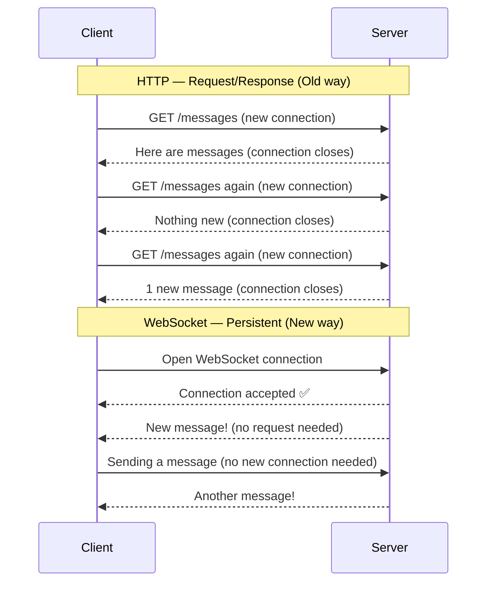
```mermaid
sequenceDiagram
    participant Client
    participant Server

    Note over Client,Server: HTTP — Request/Response (Old way)
    Client->>Server: GET /messages (new connection)
    Server-->>Client: Here are messages (connection closes)
    Client->>Server: GET /messages again (new connection)
    Server-->>Client: Nothing new (connection closes)
    Client->>Server: GET /messages again (new connection)
    Server-->>Client: 1 new message (connection closes)

    Note over Client,Server: WebSocket — Persistent (New way)
    Client->>Server: Open WebSocket connection
    Server-->>Client: Connection accepted ✅
    Server-->>Client: New message! (no request needed)
    Client->>Server: Sending a message (no new connection needed)
    Server-->>Client: Another message!
```

## **Key Differences**

| Feature | HTTP | WebSocket |
|---|---|---|
| Connection | New every request | One persistent connection |
| Who can initiate | Only client | Both client and server |
| Overhead | Large (headers every time) | Tiny (small frame headers) |
| Real-time | No (polling hacks needed) | Yes, native |
| Direction | Half-duplex (one at a time) | Full-duplex (both at same time) |
| Protocol after connect | Always HTTP | Switches to WS protocol |

---

# **5. Short Polling, Long Polling, SSE, and WebSocket — All 4 Compared**

## **Short Polling**

Client asks the server every few seconds: "Anything new?"

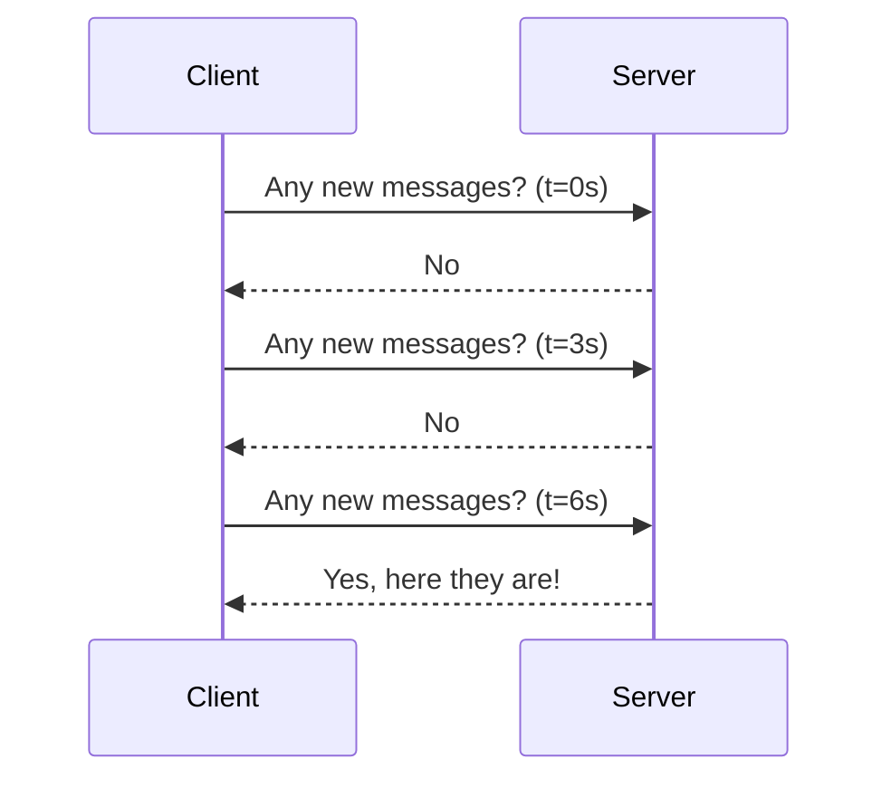
```mermaid
sequenceDiagram
    participant Client
    participant Server

    Client->>Server: Any new messages? (t=0s)
    Server-->>Client: No
    Client->>Server: Any new messages? (t=3s)
    Server-->>Client: No
    Client->>Server: Any new messages? (t=6s)
    Server-->>Client: Yes, here they are!
```

**Problem:** Most requests waste time and bandwidth. Server gets hammered even when nothing is new.

---

## **Long Polling**

Client asks, server HOLDS the connection until it has something to say. Then client immediately asks again.

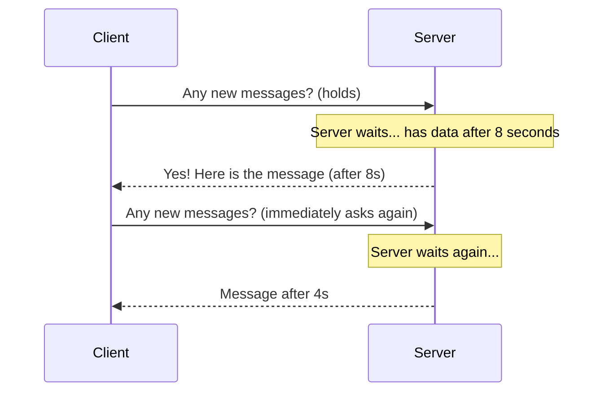
```mermaid
sequenceDiagram
    participant Client
    participant Server

    Client->>Server: Any new messages? (holds)
    Note over Server: Server waits... has data after 8 seconds
    Server-->>Client: Yes! Here is the message (after 8s)
    Client->>Server: Any new messages? (immediately asks again)
    Note over Server: Server waits again...
    Server-->>Client: Message after 4s
```

**Better** than short polling, but still creates many connections and has lots of HTTP overhead.

---

## **Server-Sent Events (SSE)**

Server pushes data to client over a persistent HTTP connection. Client CANNOT send data back through the same channel.

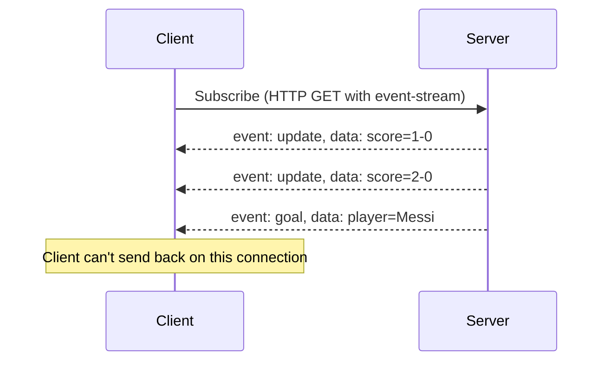
```mermaid
sequenceDiagram
    participant Client
    participant Server

    Client->>Server: Subscribe (HTTP GET with event-stream)
    Server-->>Client: event: update, data: score=1-0
    Server-->>Client: event: update, data: score=2-0
    Server-->>Client: event: goal, data: player=Messi
    Note over Client: Client can't send back on this connection
```

**Good for:** Live feeds, notifications, stock prices, sports scores — when you only need server → client.

---

## **WebSocket — Full Duplex**

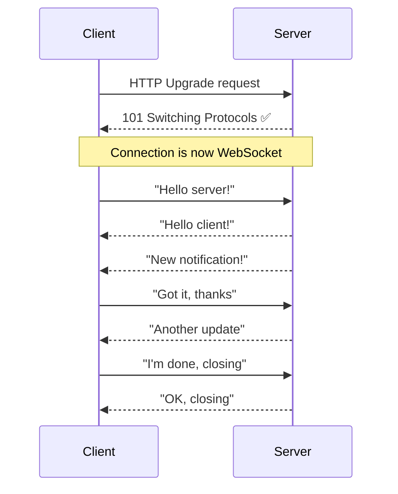
```mermaid
sequenceDiagram
    participant Client
    participant Server

    Client->>Server: HTTP Upgrade request
    Server-->>Client: 101 Switching Protocols ✅
    Note over Client,Server: Connection is now WebSocket

    Client->>Server: "Hello server!"
    Server-->>Client: "Hello client!"
    Server-->>Client: "New notification!"
    Client->>Server: "Got it, thanks"
    Server-->>Client: "Another update"
    Client->>Server: "I'm done, closing"
    Server-->>Client: "OK, closing"
```

**Best for:** Chat apps, games, live collaboration, trading dashboards, anything needing two-way real-time communication.

---

## **Comparison Table**

| Feature | Short Poll | Long Poll | SSE | WebSocket |
|---|---|---|---|---|
| Direction | Client → Server | Client → Server | Server → Client only | Both ways ✅ |
| Protocol | HTTP | HTTP | HTTP | WS (after upgrade) |
| Connection | New each time | New each time | Persistent | Persistent |
| Overhead | Very high | Medium | Low | Very low |
| Complexity | Simple | Medium | Simple | Medium |
| Browser reconnect | Manual | Manual | Automatic | Manual |
| Good for | Simple checks | Notifications | Live feeds | Chat, games, collab |

---

# **6. The WebSocket Handshake — How Connection Opens**

## **What is the Handshake?**

Before WebSocket can work, the client and server must agree to switch from HTTP to WebSocket. This agreement is called the **opening handshake**.

Think of it like a secret knock on a door. The client knocks in a special way, and if the server knows the knock, it opens the door and switches to WebSocket mode.

## **Step 1 — Client Sends Upgrade Request**

The client sends a regular-looking HTTP GET request but with special headers:

```
GET /chat HTTP/1.1
Host: example.com
Upgrade: websocket
Connection: Upgrade
Sec-WebSocket-Key: dGhlIHNhbXBsZSBub25jZQ==
Sec-WebSocket-Version: 13
```

**What these headers mean:**

| Header | What it says |
|---|---|
| `Upgrade: websocket` | "I want to switch to WebSocket" |
| `Connection: Upgrade` | "This is an upgrade request" |
| `Sec-WebSocket-Key` | A random base64 key the client generated |
| `Sec-WebSocket-Version: 13` | WebSocket version (always 13) |

## **Step 2 — Server Responds with 101**

If the server supports WebSocket, it responds:

```
HTTP/1.1 101 Switching Protocols
Upgrade: websocket
Connection: Upgrade
Sec-WebSocket-Accept: s3pPLMBiTxaQ9kYGzzhZRbK+xOo=
```

**What 101 means:** "Switching Protocols" — I am changing from HTTP to WebSocket.

The `Sec-WebSocket-Accept` is the server's answer to the key the client sent. The server takes the client's key, adds a special fixed string to it, runs SHA-1 hash, and encodes it in base64. This proves the server understood the WebSocket protocol.

## **Handshake Diagram**

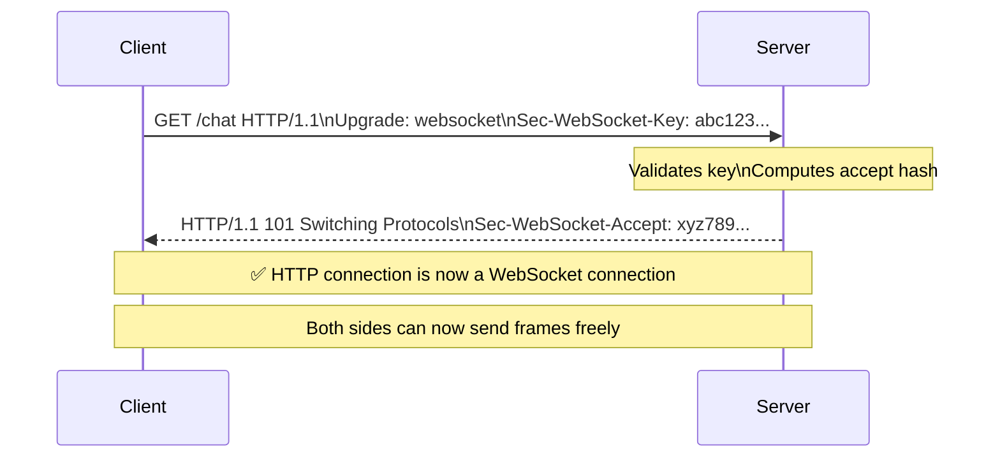
```mermaid
sequenceDiagram
    participant Client
    participant Server

    Client->>Server: GET /chat HTTP/1.1\nUpgrade: websocket\nSec-WebSocket-Key: abc123...
    Note over Server: Validates key\nComputes accept hash
    Server-->>Client: HTTP/1.1 101 Switching Protocols\nSec-WebSocket-Accept: xyz789...
    Note over Client,Server: ✅ HTTP connection is now a WebSocket connection
    Note over Client,Server: Both sides can now send frames freely
```

## **After the Handshake**

After 101, the same TCP connection is kept open but both sides stop speaking HTTP. From now on, they exchange **WebSocket frames**, not HTTP messages.

---

# **7. WebSocket Frame Structure — The Nuts and Bolts**

## **What is a Frame?**

A frame is the basic unit of data in WebSocket. Every message you send or receive is made up of one or more frames.

**Analogy:** Think of a frame like an envelope. The envelope has some info on the outside (who it's for, what type of letter) and the actual letter inside (your data).

## **Frame Layout (Every Frame Has These Parts)**

```
 0                   1                   2                   3
 0 1 2 3 4 5 6 7 8 9 0 1 2 3 4 5 6 7 8 9 0 1 2 3 4 5 6 7 8 9 0 1
+-+-+-+-+-------+-+-------------+-------------------------------+
|F|R|R|R| opcode|M| Payload len |    Extended payload length    |
|I|S|S|S|  (4)  |A|     (7)     |             (16/64)           |
|N|V|V|V|       |S|             |   (if payload len==126/127)   |
| |1|2|3|       |K|             |                               |
+-+-+-+-+-------+-+-------------+-------------------------------+
|     Extended payload length continued, if payload len == 127  |
+---------------------------------------------------------------+
|                 Masking-key, if MASK set to 1                 |
+---------------------------------------------------------------+
|                   Payload Data                                 |
+---------------------------------------------------------------+
```

This looks scary. Let's break it down simply.

## **Frame Fields in Plain English**

| Field | Size | What it means |
|---|---|---|
| **FIN** | 1 bit | Is this the final frame of the message? 1=yes, 0=more coming |
| **RSV1, RSV2, RSV3** | 1 bit each | Reserved for extensions (ignore for now, usually 0) |
| **Opcode** | 4 bits | What type of frame is this? (text, binary, ping, pong, close) |
| **MASK** | 1 bit | Is the payload masked? Client→Server must always be 1 |
| **Payload Length** | 7 bits | How big is the data? |
| **Masking Key** | 4 bytes | The key used to mask data (only if MASK=1) |
| **Payload Data** | Variable | Your actual data |

## **How Payload Length Works (a bit tricky)**

The payload length field is 7 bits. But 7 bits only goes up to 127. For bigger messages:

- If value is **0–125**: that IS the actual length
- If value is **126**: the next 2 bytes hold the real length (up to 65535 bytes)
- If value is **127**: the next 8 bytes hold the real length (up to very large)

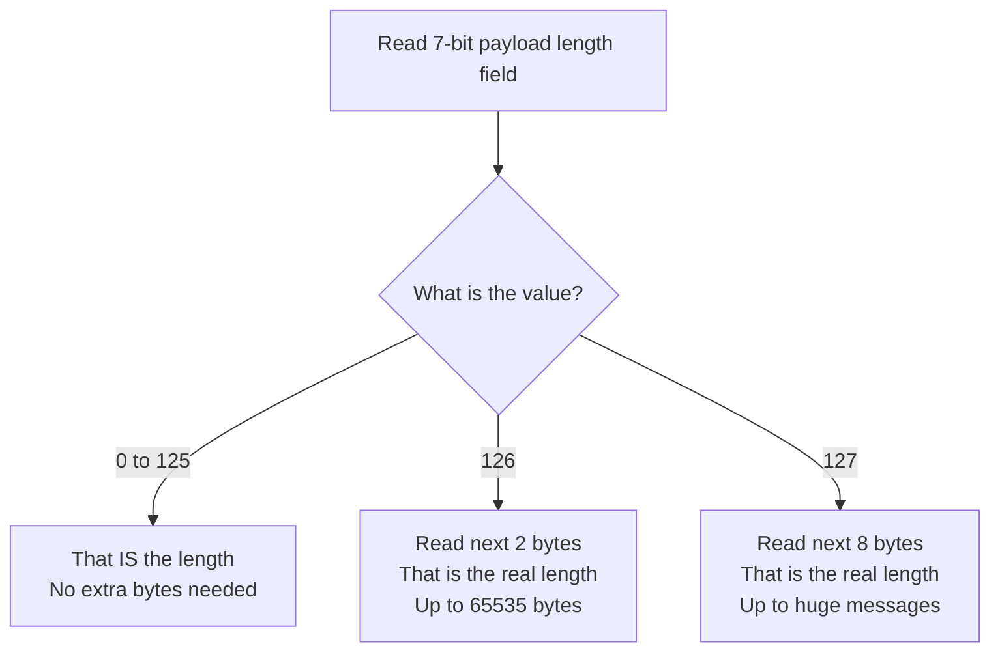
```mermaid
flowchart TD
    A[Read 7-bit payload length field] --> B{What is the value?}
    B -->|0 to 125| C[That IS the length\nNo extra bytes needed]
    B -->|126| D[Read next 2 bytes\nThat is the real length\nUp to 65535 bytes]
    B -->|127| E[Read next 8 bytes\nThat is the real length\nUp to huge messages]
```

---

# **8. WebSocket Opcodes — Frame Types Explained**

Opcodes tell you what kind of frame you received. Think of them as the "type" label on an envelope.

## **All Opcodes**

| Opcode | Hex | Name | What it means |
|---|---|---|---|
| 0 | 0x0 | Continuation | This frame continues a previous fragmented message |
| 1 | 0x1 | Text | Contains UTF-8 text data |
| 2 | 0x2 | Binary | Contains binary data (files, images, etc.) |
| 8 | 0x8 | Close | One side wants to close the connection |
| 9 | 0x9 | Ping | "Are you still there?" check |
| 10 | 0xA | Pong | "Yes I'm here!" response to ping |
| 3-7 | — | Reserved | For future non-control frames (not used) |
| 11-15 | — | Reserved | For future control frames (not used) |

## **Two Categories of Frames**

### **Data Frames (your actual messages)**
- Text (0x1) — for sending strings
- Binary (0x2) — for sending raw bytes
- Continuation (0x0) — for multi-frame messages

### **Control Frames (system messages)**
- Close (0x8) — to close connection
- Ping (0x9) — to check if connection is alive
- Pong (0xA) — reply to ping

**Important rule:** Control frames cannot be fragmented. They must always have FIN=1 and their payload can be max 125 bytes.

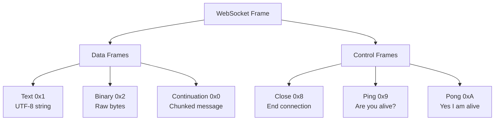
```mermaid
graph TD
    A[WebSocket Frame] --> B[Data Frames]
    A --> C[Control Frames]
    B --> D[Text 0x1\nUTF-8 string]
    B --> E[Binary 0x2\nRaw bytes]
    B --> F[Continuation 0x0\nChunked message]
    C --> G[Close 0x8\nEnd connection]
    C --> H[Ping 0x9\nAre you alive?]
    C --> I[Pong 0xA\nYes I am alive]
```

---

# **9. WebSocket Lifecycle — Full Connection Flow**

A WebSocket connection goes through these states:

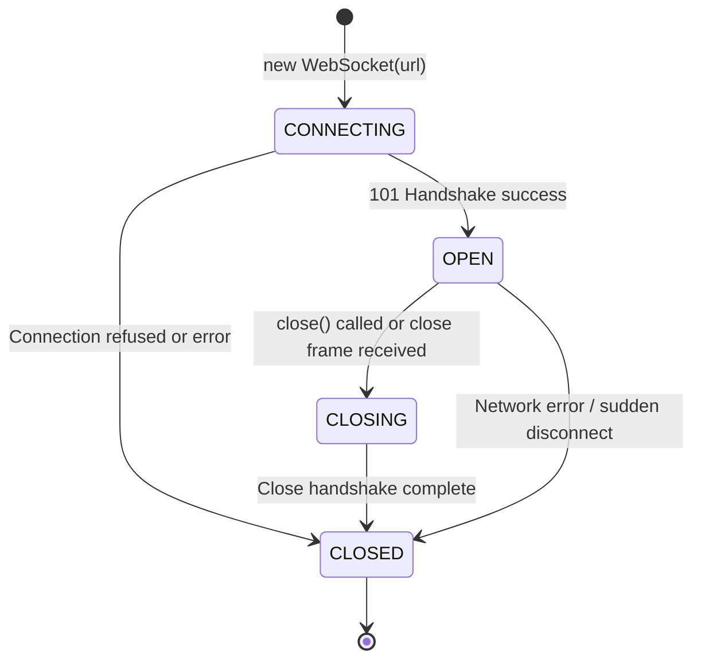
```mermaid
stateDiagram-v2
    [*] --> CONNECTING : new WebSocket(url)
    CONNECTING --> OPEN : 101 Handshake success
    CONNECTING --> CLOSED : Connection refused or error
    OPEN --> CLOSING : close() called or close frame received
    CLOSING --> CLOSED : Close handshake complete
    OPEN --> CLOSED : Network error / sudden disconnect
    CLOSED --> [*]
```

## **State Descriptions**

| State | Number | What's happening |
|---|---|---|
| **CONNECTING** | 0 | Handshake in progress |
| **OPEN** | 1 | Connected, can send/receive |
| **CLOSING** | 2 | Close process started, waiting to finish |
| **CLOSED** | 3 | Connection fully closed |

## **Full Lifecycle Flow Diagram**

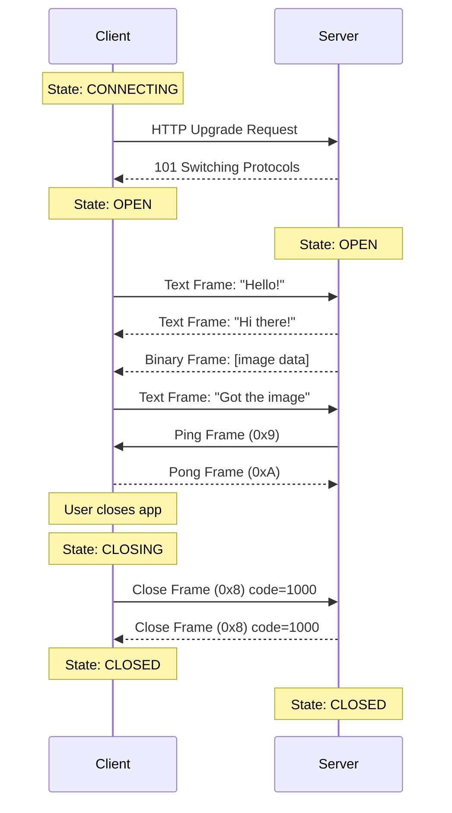
```mermaid
sequenceDiagram
    participant Client
    participant Server

    Note over Client: State: CONNECTING
    Client->>Server: HTTP Upgrade Request
    Server-->>Client: 101 Switching Protocols
    Note over Client: State: OPEN
    Note over Server: State: OPEN

    Client->>Server: Text Frame: "Hello!"
    Server-->>Client: Text Frame: "Hi there!"
    Server-->>Client: Binary Frame: [image data]
    Client->>Server: Text Frame: "Got the image"

    Server->>Client: Ping Frame (0x9)
    Client-->>Server: Pong Frame (0xA)

    Note over Client: User closes app
    Note over Client: State: CLOSING
    Client->>Server: Close Frame (0x8) code=1000
    Server-->>Client: Close Frame (0x8) code=1000
    Note over Client: State: CLOSED
    Note over Server: State: CLOSED
```

---

# **10. Ping and Pong — Heartbeat / Keepalive**

## **The Problem They Solve**

Imagine a user is connected to your chat app. They walk into an elevator. Their internet drops. But no one sent a "disconnect" message — the network just went silent.

The server now thinks the user is still connected. It keeps memory, state, everything for a dead connection. This is called a **zombie connection**.

**Ping/Pong solves this** by regularly checking if the other side is still alive.

## **How It Works**

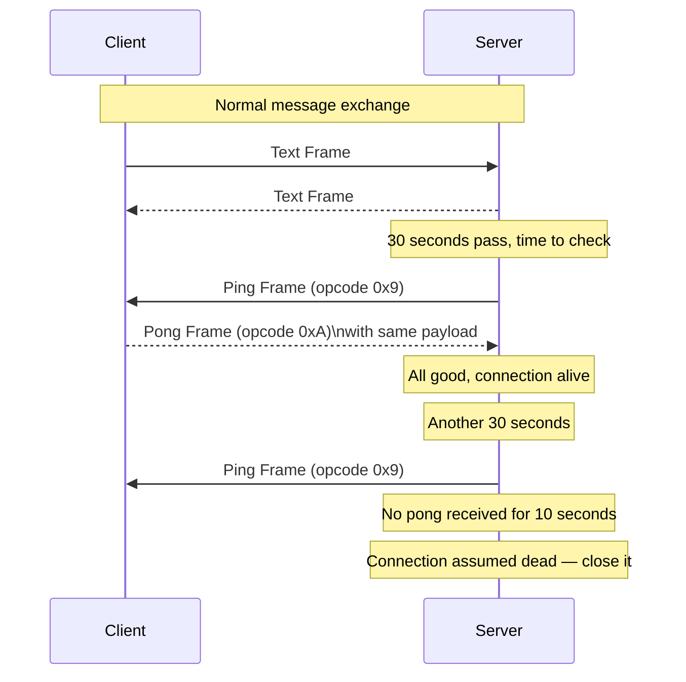
```mermaid
sequenceDiagram
    participant Client
    participant Server

    Note over Client,Server: Normal message exchange
    Client->>Server: Text Frame
    Server-->>Client: Text Frame

    Note over Server: 30 seconds pass, time to check
    Server->>Client: Ping Frame (opcode 0x9)
    Client-->>Server: Pong Frame (opcode 0xA)\nwith same payload

    Note over Server: All good, connection alive

    Note over Server: Another 30 seconds
    Server->>Client: Ping Frame (opcode 0x9)
    Note over Server: No pong received for 10 seconds
    Note over Server: Connection assumed dead — close it
```

## **Rules for Ping/Pong**

- Either side can send a Ping at any time
- When you get a Ping, you MUST send a Pong back as fast as possible
- The Pong must contain the exact same payload the Ping had
- If you receive multiple Pings before you can reply, you only need to Pong the latest one
- You can also send an unsolicited Pong (a one-way heartbeat), no reply expected
- Ping/Pong payload is max **125 bytes**
- Most servers send pings every **30–45 seconds**

## **Browser Note**

Browsers handle protocol-level ping/pong automatically. Your JavaScript code never sees these frames. If you need app-level heartbeat in a browser, you send a regular text message like `{"type": "ping"}` and handle it yourself in your code.

---

# **11. Closing a WebSocket Connection**

## **The Closing Handshake**

Closing is not just cutting the wire. There is a proper handshake to close cleanly:

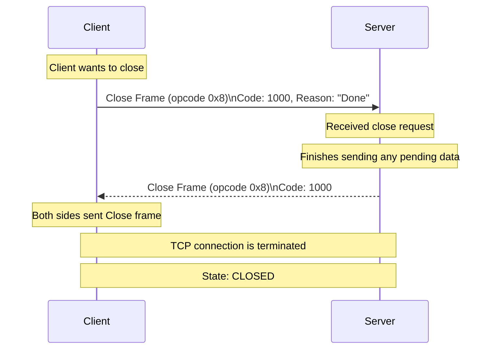
```mermaid
sequenceDiagram
    participant Client
    participant Server

    Note over Client: Client wants to close
    Client->>Server: Close Frame (opcode 0x8)\nCode: 1000, Reason: "Done"
    Note over Server: Received close request
    Note over Server: Finishes sending any pending data
    Server-->>Client: Close Frame (opcode 0x8)\nCode: 1000
    Note over Client: Both sides sent Close frame
    Note over Client,Server: TCP connection is terminated
    Note over Client,Server: State: CLOSED
```

## **Important Closing Rules**

- The side that sends the first Close frame **starts** the closing handshake
- The other side should reply with a Close frame as soon as possible
- After sending a Close frame, you should **not send any more data frames**
- After the handshake, the TCP connection is terminated
- Either side can start the close

---

# **12. WebSocket Close Codes**

When closing, you can send a numeric code and a reason string. This is like a status code for closing.

## **Common Close Codes**

| Code | Name | When to use |
|---|---|---|
| **1000** | Normal Closure | Everything is fine, done normally |
| **1001** | Going Away | Server shutting down, or user navigated away |
| **1002** | Protocol Error | WebSocket protocol violation detected |
| **1003** | Unsupported Data | Received data type not supported |
| **1005** | No Status | (No code was provided in the close frame) |
| **1006** | Abnormal Closure | Connection dropped without close handshake |
| **1007** | Invalid Frame Payload | Data is not valid UTF-8 (for text frames) |
| **1008** | Policy Violation | Message violated app policy |
| **1009** | Message Too Big | Message is too large to process |
| **1010** | Mandatory Extension | Client needed an extension the server didn't offer |
| **1011** | Internal Error | Server had unexpected error |
| **1012** | Service Restart | Server is restarting |
| **1013** | Try Again Later | Server is temporarily overloaded |
| **4000–4999** | Custom | Your own app-defined close codes |

**Tip:** Always use **1000** for normal closes. If your app needs custom codes, use anything in the 4000–4999 range.

---

# **13. Message Fragmentation — Splitting Big Messages**

## **What Is Fragmentation?**

Sometimes a message is too big to send in one frame, or you don't know the full size yet (like streaming data). WebSocket allows you to split one message across multiple frames.

## **How It Works**

- The **first frame** has the opcode set to the message type (text or binary) and FIN = 0
- **Middle frames** have opcode = 0 (Continuation) and FIN = 0
- The **last frame** has opcode = 0 (Continuation) and FIN = 1

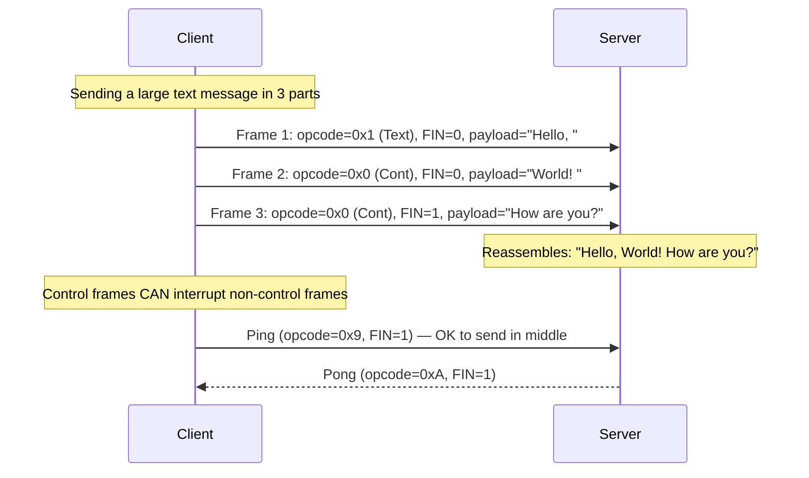
```mermaid
sequenceDiagram
    participant Client
    participant Server

    Note over Client: Sending a large text message in 3 parts

    Client->>Server: Frame 1: opcode=0x1 (Text), FIN=0, payload="Hello, "
    Client->>Server: Frame 2: opcode=0x0 (Cont), FIN=0, payload="World! "
    Client->>Server: Frame 3: opcode=0x0 (Cont), FIN=1, payload="How are you?"

    Note over Server: Reassembles: "Hello, World! How are you?"

    Note over Client: Control frames CAN interrupt non-control frames
    Client->>Server: Ping (opcode=0x9, FIN=1) — OK to send in middle
    Server-->>Client: Pong (opcode=0xA, FIN=1)
```

## **Rules for Fragmentation**

- Control frames (Close, Ping, Pong) are NEVER fragmented — always FIN=1
- You cannot interleave two different non-control messages (you can't send half of message A, then half of message B)
- Control frames CAN appear in the middle of a fragmented message

---

# **14. WebSocket Events — What You Listen For**

No matter which language or library you use, WebSocket gives you 4 main events to handle:

## **The 4 Events**

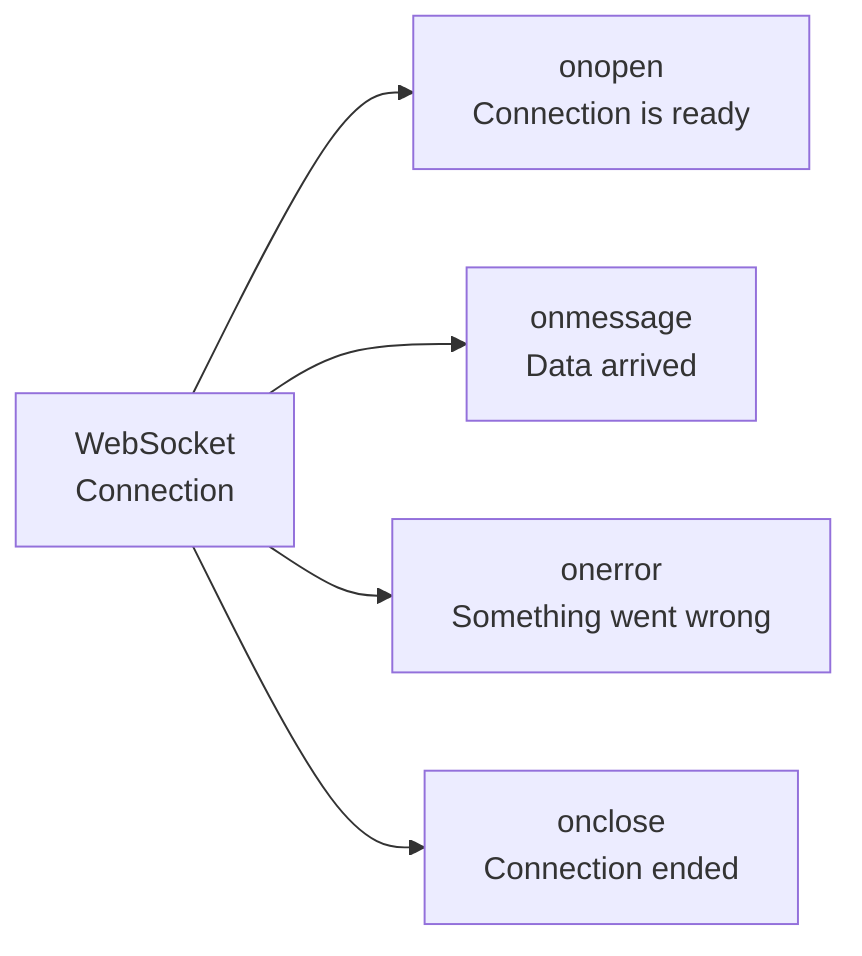
```mermaid
graph LR
    WS[WebSocket\nConnection]
    WS --> A[onopen\nConnection is ready]
    WS --> B[onmessage\nData arrived]
    WS --> C[onerror\nSomething went wrong]
    WS --> D[onclose\nConnection ended]
```

## **What Each Event Means**

### **onopen / on_connect**
The connection is established. The handshake succeeded. You can now start sending messages.

**When it fires:** Right after the 101 response from server

**What to do:** Send initial data, subscribe to channels, set up your app state

---

### **onmessage / on_message**
Data arrived from the other side. This is your main event — the data is in the event object.

**When it fires:** Every time the server sends you a message

**What to do:** Parse the data and update your UI or process it

---

### **onerror / on_error**
Something went wrong. A network error, connection refused, etc.

**When it fires:** On any error

**What to do:** Log the error, show user a message, try to reconnect

**Note:** An error is always followed by a close event. You don't need to clean up in onerror — do it in onclose.

---

### **onclose / on_close**
The connection is closed. This always fires, whether closed normally or due to an error.

**When it fires:** Connection closed for any reason

**What to do:** Clean up resources, maybe reconnect, update UI to "disconnected"

**The event tells you:**
- `code` — the close code (1000 = normal, 1006 = abnormal/network drop)
- `reason` — a string reason for closing
- `wasClean` — true if it was a proper close handshake, false if connection just dropped

---

# **15. WebSocket URL Schemes — ws:// and wss://**

WebSocket has its own URL format, similar to HTTP:

| Scheme | Port | Security | Same as |
|---|---|---|---|
| `ws://` | 80 | Not encrypted | Like http:// |
| `wss://` | 443 | Encrypted (TLS) | Like https:// |

## **Examples**

```
ws://localhost:8000/chat          — local development
ws://example.com/socket           — plain, no encryption (bad for production)
wss://example.com/socket          — encrypted (use this in production)
wss://api.myapp.com/ws/v1/live    — with path
wss://example.com/ws?token=abc123 — with query params for auth
```

**Always use wss:// in production.** Plain ws:// sends data in the clear — anyone on the same network can read your messages.

---

# **16. Subprotocols — Custom Protocols on Top of WebSocket**

## **What is a Subprotocol?**

WebSocket just moves data. It doesn't tell you how to format that data, what a "message" means, how to authenticate, etc. That's your job.

A **subprotocol** is an agreement between client and server on what format to use for messages on top of WebSocket.

Think of it like this: WebSocket is the road. A subprotocol is the language you and the driver agreed to speak.

## **How to Negotiate a Subprotocol**

During the handshake:

Client says what protocols it supports:
```
Sec-WebSocket-Protocol: chat, superchat
```

Server picks one and confirms:
```
Sec-WebSocket-Protocol: chat
```

If the server doesn't support any of them, it leaves this header out.

## **Common Subprotocols**

| Subprotocol | What it is |
|---|---|
| **STOMP** | Simple Text Oriented Messaging Protocol — popular for chat |
| **MQTT** | IoT messaging protocol |
| **AMQP** | Advanced Message Queuing Protocol |
| **JSON-RPC** | Remote Procedure Calls in JSON format |
| **graphql-ws** | GraphQL subscriptions over WebSocket |
| **Your own** | You can invent your own and name it anything |

---

# **17. Masking — Why Client Frames Are Masked**

## **What is Masking?**

Every frame sent from **client to server** must be masked (scrambled). Frames from **server to client** are NOT masked.

## **Why Masking?**

This is a security measure against cache poisoning attacks on proxy servers. Without masking, a bad actor could craft WebSocket messages that look like valid HTTP responses and trick proxy caches.

## **How Masking Works**

1. Client generates a random 4-byte masking key
2. Each byte of payload is XOR'd with the corresponding masking key byte
3. The masking key is included in the frame header
4. Server receives the frame, uses the key to XOR the payload back to get original data

```
Original byte: 0x48 ('H')
Masking key byte: 0x37
Masked byte: 0x48 XOR 0x37 = 0x7F

Server side:
Masked byte: 0x7F
Masking key byte: 0x37
Original byte: 0x7F XOR 0x37 = 0x48 ('H') ✅
```

**You almost never need to implement this yourself.** Any WebSocket library does masking automatically. But it's good to know why it exists when you see it in packet captures.

---

# **18. Real-World Use Cases**

## **Where WebSocket Shines**

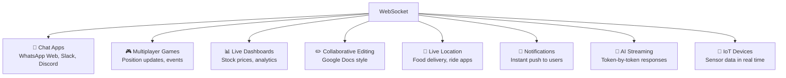
```mermaid
graph TD
    WS[WebSocket]
    WS --> A[💬 Chat Apps\nWhatsApp Web, Slack, Discord]
    WS --> B[🎮 Multiplayer Games\nPosition updates, events]
    WS --> C[📊 Live Dashboards\nStock prices, analytics]
    WS --> D[✏️ Collaborative Editing\nGoogle Docs style]
    WS --> E[📍 Live Location\nFood delivery, ride apps]
    WS --> F[🔔 Notifications\nInstant push to users]
    WS --> G[🤖 AI Streaming\nToken-by-token responses]
    WS --> H[📡 IoT Devices\nSensor data in real time]
```

## **Real Examples**

### **Chat Application**
- User types a message
- Client sends it over WebSocket
- Server receives it
- Server broadcasts to all connected clients in that room
- Everyone's screen updates instantly

### **Live Trading Dashboard**
- Server receives price feeds from exchange
- Every tick is pushed to all connected clients
- Client displays price without polling

### **Multiplayer Game**
- Every player move is sent to server via WebSocket
- Server sends all other players' positions back
- Latency is critical — WebSocket's low overhead helps

### **AI Chat (like ChatGPT)**
- AI model generates tokens one by one
- Server streams each token over WebSocket (or SSE)
- User sees response appearing word by word in real time

---

# **19. When NOT to Use WebSocket**

WebSocket is powerful but not always the right choice. Use something simpler when:

| Situation | Better Choice |
|---|---|
| Simple request-response (fetch data once) | Regular HTTP/REST |
| Server pushes data only, client never sends back | Server-Sent Events (SSE) |
| You need to send occasional notifications | SSE or Push Notifications |
| Public API for other developers | REST API |
| File upload/download | HTTP (multipart, chunked) |
| SEO-heavy pages | HTTP |
| Environment blocks WebSockets (some firewalls) | Long polling fallback |

**Simple rule:** If you only need the server to push to the client (one direction), use SSE. It's simpler. If you need two-way communication, use WebSocket.

---

# **20. Common Errors and What They Mean**

## **Connection Errors**

| Error / Code | What It Means | What to Do |
|---|---|---|
| **1006 Abnormal Closure** | Connection dropped without clean close — network issue | Implement reconnect logic |
| **Connection refused** | Server not running or wrong port | Check server is running, check URL |
| **403 Forbidden** | Server rejected the upgrade | Check authentication/token |
| **404 Not Found** | Wrong WebSocket endpoint path | Check the URL/path |
| **Mixed Content** | Using ws:// on an https:// page | Use wss:// instead |

## **Protocol Errors**

| Error | What It Means |
|---|---|
| **1002 Protocol Error** | Frame format violated the spec | Usually a library bug |
| **1007 Invalid Payload** | Sent non-UTF8 data in a text frame | Use binary frames for non-text |
| **1009 Message Too Big** | Message exceeded server's max size | Compress data or increase limit |

## **Common Mistakes**

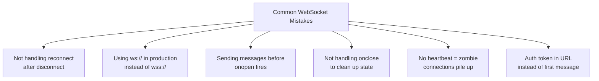
```mermaid
flowchart TD
    A[Common WebSocket Mistakes] --> B[Not handling reconnect\nafter disconnect]
    A --> C[Using ws:// in production\ninstead of wss://]
    A --> D[Sending messages before\nonopen fires]
    A --> E[Not handling onclose\nto clean up state]
    A --> F[No heartbeat = zombie\nconnections pile up]
    A --> G[Auth token in URL\ninstead of first message]
```

## **Reconnect Strategy**

WebSocket does NOT automatically reconnect when dropped. You need to build this yourself.

A good strategy is **exponential backoff** — wait a bit, try again. If it fails, wait longer. Keep increasing the wait time up to a max:

```
Attempt 1: wait 1 second
Attempt 2: wait 2 seconds
Attempt 3: wait 4 seconds
Attempt 4: wait 8 seconds
...max out at 30 seconds
```

This prevents hammering a server that is down.

---

# **21. Quick Reference Cheat Sheet**

## **WebSocket in a Nutshell**

```
ws://   or   wss://
     |
     v
HTTP Upgrade Request (GET + special headers)
     |
     v
Server replies 101 Switching Protocols
     |
     v
Connection is now WebSocket (not HTTP anymore)
     |
     v
Both sides send Frames whenever they want
     |
     v
Either side sends Close Frame to end connection
     |
     v
Other side echoes Close Frame
     |
     v
TCP connection ends
```

## **Frame Anatomy**

```
[FIN 1bit][RSV 3bits][OPCODE 4bits][MASK 1bit][PAYLOAD_LEN 7bits]
[EXTENDED_PAYLOAD_LEN 0/2/8 bytes]
[MASKING_KEY 4 bytes — only if MASK=1]
[PAYLOAD DATA]
```

## **Opcode Quick Reference**

```
0x0 = Continuation (more frames coming for this message)
0x1 = Text         (UTF-8 string)
0x2 = Binary       (raw bytes)
0x8 = Close        (close the connection)
0x9 = Ping         (are you alive?)
0xA = Pong         (yes, I'm alive)
```

## **Close Codes Quick Reference**

```
1000 = Normal close (you're done)
1001 = Going away (server shutting down)
1006 = Abnormal close (network dropped — no handshake)
1011 = Server internal error
4xxx = Your own custom codes
```

## **The 4 Events You Handle**

```
onopen    → connected, ready to send
onmessage → data arrived from server
onerror   → something went wrong
onclose   → connection ended (check .code and .wasClean)
```

## **Decision Flowchart — WebSocket or Not?**

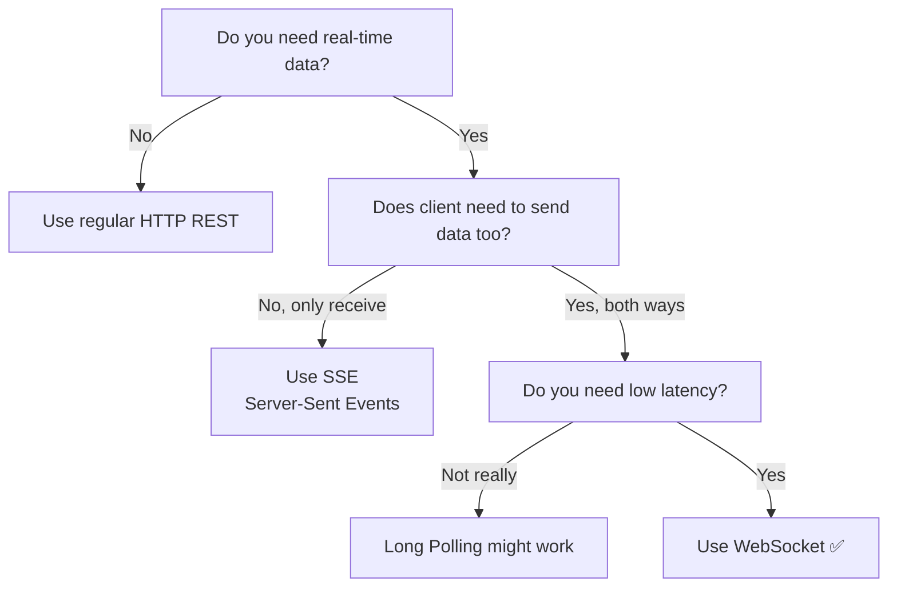
```mermaid
flowchart TD
    A[Do you need real-time data?] -->|No| B[Use regular HTTP REST]
    A -->|Yes| C[Does client need to send data too?]
    C -->|No, only receive| D[Use SSE\nServer-Sent Events]
    C -->|Yes, both ways| E[Do you need low latency?]
    E -->|Not really| F[Long Polling might work]
    E -->|Yes| G[Use WebSocket ✅]
```

---

## **Summary — What You Learned**

| Topic | Key Point |
|---|---|
| Why WebSocket | HTTP can't push data; WebSocket keeps connection open |
| Handshake | Starts as HTTP, upgrades via `101 Switching Protocols` |
| Frames | Basic data unit: FIN + opcode + mask + payload |
| Opcodes | Text, Binary, Continuation, Close, Ping, Pong |
| Lifecycle | CONNECTING → OPEN → CLOSING → CLOSED |
| Ping/Pong | Heartbeat to detect dead connections |
| Fragmentation | Split big messages across frames, FIN=0 until last |
| Masking | Client→Server always masked (XOR), Server→Client never |
| Close Codes | 1000=normal, 1006=network drop, 4xxx=your own |
| wss:// | Always use secure WebSocket in production |

---

> **Next Step:** WebSocket in Python using FastAPI — basics to advanced.
> These notes give you the full foundation. Now let's code it.