# **WebSocket — From Scratch (Language Agnostic Notes)**

> Complete notes on WebSocket. Written in plain words. No language specific code (that comes in the next file). Lots of diagrams, examples, and analogies. By the end of this file you should know WebSocket inside-out — handshake, frames, lifecycle, scaling, security, common pitfalls — all of it.

---

## **Table of Contents**

1. [What is WebSocket? (and the simple analogy)](#1-what-is-websocket-and-the-simple-analogy)
2. [Why do we even need WebSocket? The HTTP problem](#2-why-do-we-even-need-websocket-the-http-problem)
3. [HTTP vs WebSocket — Side by Side](#3-http-vs-websocket--side-by-side)
4. [Pros and Cons of WebSockets](#4-pros-and-cons-of-websockets)
5. [WebSocket URI scheme — `ws://` and `wss://`](#5-websocket-uri-scheme--ws-and-wss)
6. [The Handshake — How a connection becomes a WebSocket](#6-the-handshake--how-a-connection-becomes-a-websocket)
7. [Data Frames — The real format of every message](#7-data-frames--the-real-format-of-every-message)
8. [Opcodes — What kind of frame is this?](#8-opcodes--what-kind-of-frame-is-this)
9. [Masking — Why the client must mask data](#9-masking--why-the-client-must-mask-data)
10. [Connection Lifecycle — The 4 states](#10-connection-lifecycle--the-4-states)
11. [Events on the client side](#11-events-on-the-client-side)
12. [Ping / Pong — Heartbeat to keep the line alive](#12-ping--pong--heartbeat-to-keep-the-line-alive)
13. [Fragmentation — Splitting big messages into chunks](#13-fragmentation--splitting-big-messages-into-chunks)
14. [Close Codes — Why the connection ended](#14-close-codes--why-the-connection-ended)
15. [Subprotocols and Extensions](#15-subprotocols-and-extensions)
16. [Backpressure — When slow receivers choke the sender](#16-backpressure--when-slow-receivers-choke-the-sender)
17. [Common Message Patterns](#17-common-message-patterns)
18. [Scaling WebSockets — When one server is not enough](#18-scaling-websockets--when-one-server-is-not-enough)
19. [Security — WSS, Origin, Auth](#19-security--wss-origin-auth)
20. [Common Mistakes and Best Practices](#20-common-mistakes-and-best-practices)
21. [Why You Are Getting Errors — Frustration Busting Checklist](#21-why-you-are-getting-errors--frustration-busting-checklist)
22. [Summary Checklist Before Coding](#22-summary-checklist-before-coding)
23. [Quick Cheat Sheet](#23-quick-cheat-sheet)

---

## **1. What is WebSocket? (and the simple analogy)**

**WebSocket is a communication protocol that gives you a full-duplex (two-way), persistent connection between a client and a server over a single TCP connection.**

It is defined in **RFC 6455** and standardized by the IETF. It runs on top of TCP (just like HTTP) but it is a separate protocol once the handshake is done.

### **The simple analogy**

Think of WebSocket like a **phone call**:

- **HTTP** is like sending letters. You write, you post, you wait for a reply letter. Each letter is a separate trip.
- **WebSocket** is like a phone call. Once both sides pick up, anyone can talk any time, no need to "send" and "wait for response" each time.

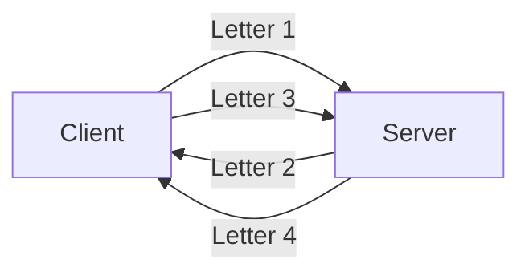
**HTTP: every message is a fresh letter**

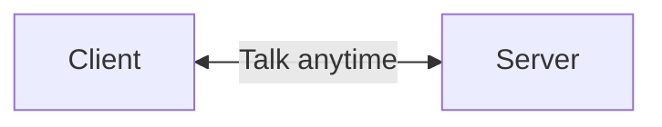
**WebSocket: open line, both sides can talk anytime**

---

## **2. Why do we even need WebSocket? The HTTP problem**

HTTP is built on a **request → response** model. The **client always starts**, the server always replies. The server cannot just push data to the client on its own.

For things like loading a page or submitting a form, this is fine. But for **real-time apps** (chat, live scores, notifications, multiplayer games), this becomes painful.

### **The hacks people tried before WebSocket**

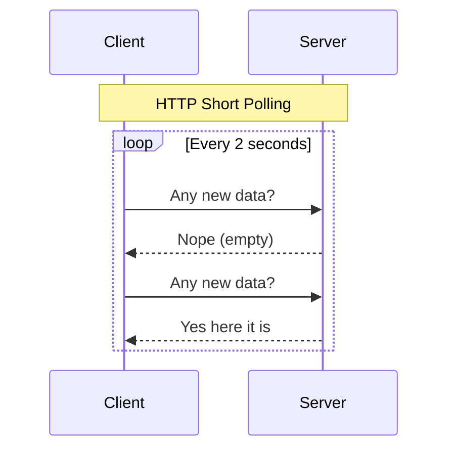

- **Short polling**: Client keeps asking "anything new?" every few seconds. Wasteful. Lots of empty replies.
- **Long polling**: Client asks, server holds the request open until there is something to say. Better, but still hacky.
- **Server-Sent Events (SSE)**: One-way, server to client only.

WebSocket fixes all of these by giving you **a real two-way pipe**.

---

## **3. HTTP vs WebSocket — Side by Side**

| Feature              | HTTP                              | WebSocket                          |
| -------------------- | --------------------------------- | ---------------------------------- |
| Direction            | Client → Server (request), then response | Both ways, anytime                 |
| Connection           | New per request (or short keep-alive) | One persistent TCP connection      |
| Headers              | Big headers (cookies, UA, etc.) every request | Tiny frame header (~2-14 bytes)    |
| Server can push?     | No (needs polling/SSE)            | Yes, anytime                       |
| Data types           | Text (and binary via multipart)   | Text and binary native             |
| URL scheme           | `http://` / `https://`            | `ws://` / `wss://`                 |
| Lifecycle            | One-shot request                  | Long-lived, controlled by app      |
| Use case             | Page loads, APIs, forms           | Chat, live data, games, collab     |

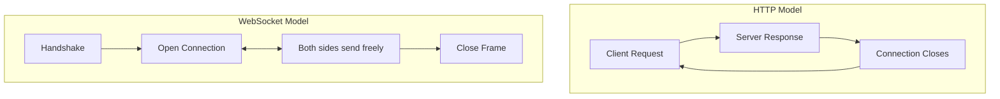

### **When to use what**

- Use **HTTP** when you fetch a page, submit a form, call a REST API, download a file.
- Use **WebSocket** when you need **low latency**, **two-way**, **frequent** messages — chat, live dashboards, multiplayer games, collaborative editors, live tracking.

---

## **4. Pros and Cons of WebSockets**

Before we go deeper, here is the honest trade-off picture so you know when to reach for WebSocket and when not to.

### **Pros**

- **Real-time two-way communication**: Either side can send data any time, no waiting for the other to ask.
- **Efficient for frequent updates**: Tiny frame headers (~2-14 bytes) vs HTTP's 500-1000 bytes per request. Big win for high-frequency messages.
- **Lower latency**: One persistent TCP connection. No TCP handshake, no HTTP overhead per message.
- **Lower battery and network usage on mobile**: Phones love it because they aren't waking up the radio to do a full HTTP handshake every few seconds.
- **Full-duplex**: Server can push to client (e.g., notifications) without the client polling.

### **Cons**

- **More complex to handle**: You must manage open connections — who is connected, what room they are in, what to do when they disconnect.
- **Harder to scale**: Each connection holds memory and a socket. Ten thousand connections is real money in RAM. Multi-server needs sticky sessions and a Pub/Sub layer.
- **Not cached like HTTP**: WebSocket frames can't go through regular CDNs or HTTP caches. You lose that nice "free" caching layer.
- **Stateful**: The server has to remember who's connected. With HTTP, every request is independent — much simpler.
- **Proxy / firewall issues**: Old proxies (and some corporate firewalls) don't understand WebSocket and kill the connection. `wss://` helps but doesn't fully solve it.
- **No built-in request-response**: If you want "send → get reply" semantics, you build it yourself with message IDs and timeouts.

### **When WebSocket is the wrong tool**

- One-shot requests (use HTTP)
- Public cacheable content (use HTTP + CDN)
- Tiny apps with very few users (overkill — HTTP polling is simpler)
- Anywhere the network between you and the client is super restrictive (some corporate networks strip WebSocket frames)

### **When WebSocket is the right tool**

- Chat / messaging
- Live dashboards (stock prices, sports scores, monitoring)
- Multiplayer games
- Collaborative editing (Google Docs style)
- Live location tracking
- Notifications / alerts

---

## **5. WebSocket URI scheme — `ws://` and `wss://`**

WebSocket has its own URL scheme:

- `ws://example.com/socket` → like `http://`
- `wss://example.com/socket` → like `https://` (encrypted via TLS)

**`wss://` is recommended** for production. Just like HTTPS, it encrypts traffic so nobody in the middle can read or tamper with it.

| HTTP      | WebSocket |
| --------- | --------- |
| `http://` | `ws://`   |
| `https://`| `wss://`  |

---

## **6. The Handshake — How a connection becomes a WebSocket**

The clever part: WebSocket **borrows HTTP** to set up the connection. This is on purpose — it lets the request pass through firewalls, proxies, and CDNs that already allow HTTP.

### **Step-by-step**

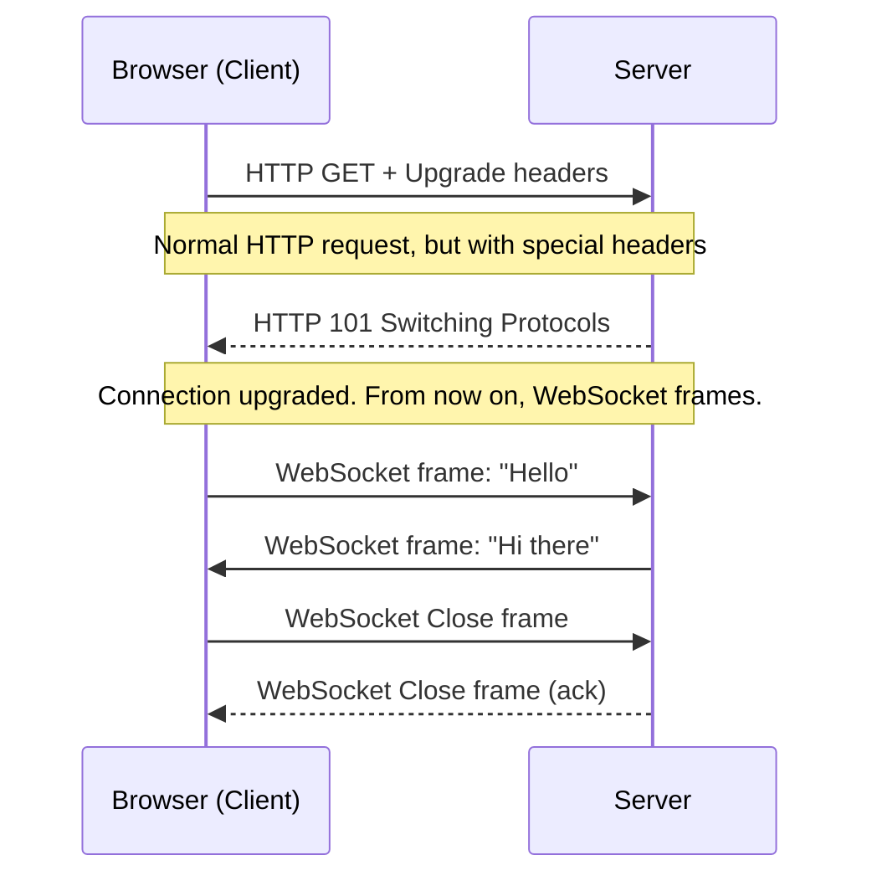

### **Client request (looks like HTTP)**

```
GET /chat HTTP/1.1
Host: example.com
Upgrade: websocket
Connection: Upgrade
Sec-WebSocket-Key: dGhlIHNhbXBsZSBub25jZQ==
Sec-WebSocket-Version: 13
Origin: https://myapp.com
```

Key headers:
- **`Upgrade: websocket`** → "I want to switch protocol"
- **`Connection: Upgrade`** → "this connection should be upgraded"
- **`Sec-WebSocket-Key`** → random Base64 string (16 bytes). Used by the server to prove it understood the protocol.
- **`Sec-WebSocket-Version: 13`** → current version (RFC 6455).

### **Server response**

```
HTTP/1.1 101 Switching Protocols
Upgrade: websocket
Connection: Upgrade
Sec-WebSocket-Accept: s3pPLMBiTxaQ9kYGzzhZRbK+xOo=
```

- **`101 Switching Protocols`** → "OK, we are switching now."
- **`Sec-WebSocket-Accept`** → the server's reply proof. It is computed as:
  ```
  Base64( SHA1( client_key + "258EAFA5-E914-47DA-95CA-C5AB0DC85B11" ) )
  ```
  That magic string is a fixed GUID. It is **not** encryption, just a proof that the server speaks WebSocket.

### **What happens after the handshake?**

The **same TCP socket** is reused. But the bytes that fly on it are no longer HTTP. They are now WebSocket **frames** (next section).

---

## **7. Data Frames — The real format of every message**

After the handshake, every piece of data is sent as a **frame**. A frame is the unit of transport.

### **Frame layout (RFC 6455)**

```mermaid
block-beta
    columns 16
    block:byte0:1
        columns 8
        FIN["FIN\n1b"]
        RSV["RSV1-3\n3b"]
        OP["Opcode\n4b"]
    end
    block:byte1:1
        columns 8
        MASK["MASK\n1b"]
        LEN["Payload len\n7b"]
    end
    block:ext:2
        columns 16
        EL16["Extended len\n(16b)"]
    end
    block:ext8:8
        columns 16
        EL64["Extended len\n(64b)"]
    end
    KEY["Masking key\n(0 or 4 bytes)"]
    PAY["Payload data\n(variable)"]
```

In text:

| Field          | Size      | What it means                                                      |
| -------------- | --------- | ------------------------------------------------------------------ |
| FIN            | 1 bit     | 1 = this is the last frame of the message, 0 = more frames coming |
| RSV1, RSV2, RSV3 | 1 bit each | Reserved for extensions, normally 0                              |
| Opcode         | 4 bits    | Type of frame (text, binary, ping, pong, close)                   |
| MASK           | 1 bit     | 1 if payload is masked (must be 1 from client to server)          |
| Payload len    | 7 bits    | If ≤125, that's the length. If 126, next 2 bytes. If 127, next 8 bytes |
| Masking key    | 0 or 4 bytes | Used to unmask the payload (only if MASK=1)                    |
| Payload        | variable  | The actual data                                                    |

### **How small is the overhead?**

- **Minimum frame header**: 2 bytes.
- **For masked frames**: 2 + 4 = 6 bytes overhead.
- **For empty ping/pong**: 2 bytes.

Compare to HTTP, where every request/response can have 500-1000 bytes of headers. That is why WebSocket is so much lighter for high-frequency messaging.

---

## **8. Opcodes — What kind of frame is this?**

The 4-bit opcode tells the receiver what the frame is for.

| Opcode (hex) | Name                | Type        | Meaning                                  |
| ------------ | ------------------- | ----------- | ---------------------------------------- |
| `0x0`        | Continuation frame  | Data        | Part of a fragmented message             |
| `0x1`        | Text frame          | Data        | UTF-8 text                               |
| `0x2`        | Binary frame        | Data        | Raw bytes                                |
| `0x3` - `0x7`| (reserved)          | Data        | Reserved for future data frames          |
| `0x8`        | Connection close    | Control     | Time to close                            |
| `0x9`        | Ping                | Control     | "Are you there?"                         |
| `0xA`        | Pong                | Control     | "Yes, I am here"                         |
| `0xB` - `0xF`| (reserved)          | Control     | Reserved for future control frames       |

### **Two big families**

- **Data frames** carry your actual messages (text or binary). They can be fragmented.
- **Control frames** (ping, pong, close) are small housekeeping. They are **never fragmented**, can be sent in the middle of a fragmented message, and have a max payload of **125 bytes**.

---

## **9. Masking — Why the client must mask data**

**Every frame from client to server MUST be masked** (a random 4-byte XOR key). Server-to-client frames are NOT masked.

### **Why?**

It is a security thing. Without masking, a malicious proxy could poison caches or confuse servers that don't fully understand WebSocket. Masking breaks any cache-poisoning attempt.

### **How it works (simple)**

For each byte of payload:
```
masked_byte = payload_byte XOR mask_key[i % 4]
```
The receiver has the same key (sent in the frame header), so it just XORs again to get back the original byte.

**Important:** Browsers enforce this automatically. You never have to do it by hand. But if you build a raw client (e.g., from a microcontroller), you must mask.

---

## **10. Connection Lifecycle — The 4 states**

Every WebSocket connection goes through these states:

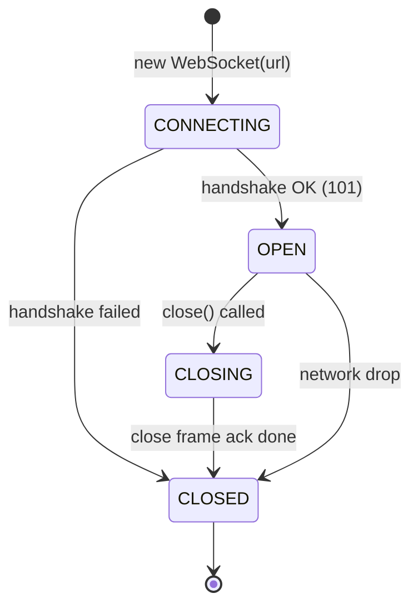

| State        | Value | Meaning                                            |
| ------------ | ----- | -------------------------------------------------- |
| `CONNECTING` | 0     | Handshake in progress                              |
| `OPEN`       | 1     | Connected, ready to send/receive                   |
| `CLOSING`    | 2     | Close handshake started, waiting for ack           |
| `CLOSED`     | 3     | Done. Cannot reuse. Must create a new instance.    |

### **Common mistakes**

- Sending data when state is not `OPEN`. Always check `readyState` before sending.
- Trying to reconnect on the same instance. Once `CLOSED`, it is dead. Make a new `WebSocket(url)`.

---

## **11. Events on the client side**

A typical WebSocket client emits these events:

| Event       | When it fires                                            |
| ----------- | -------------------------------------------------------- |
| `onopen`    | Connection is open, you can send messages now            |
| `onmessage` | A message arrived                                        |
| `onerror`   | Something went wrong                                     |
| `onclose`   | Connection closed (with code and reason)                 |

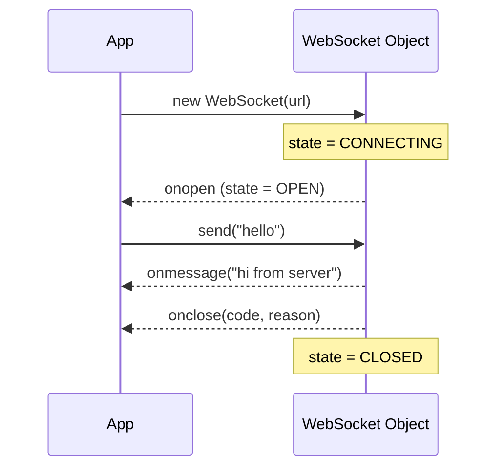

---

## **12. Ping / Pong — Heartbeat to keep the line alive**

Middleboxes (NAT routers, firewalls, load balancers) often kill "idle" connections after 30-60 seconds. WebSocket has a built-in heartbeat: **ping and pong**.

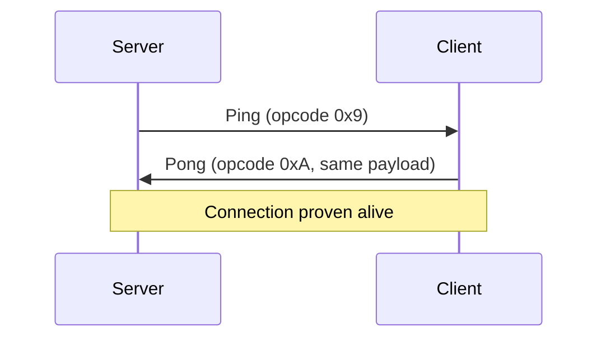

### **Rules**

- The pong payload **must echo** whatever was in the ping payload.
- Browsers handle pong automatically — you do not see them in `onmessage`.
- Servers usually send a ping every 25-30 seconds. If no pong comes back within a few seconds, the server assumes the client is dead and closes.
- You can also send pings from the client side if the protocol allows (some frameworks expose this).

### **Why care?**

Without ping/pong, your connection might silently die and the client would not know until it tried to send something.

---

## **13. Fragmentation — Splitting big messages into chunks**

A single WebSocket message can be split into many frames. This is useful when:
- You do not know the message size ahead of time.
- You want to start sending before the whole message is ready (streaming).

### **How it looks**

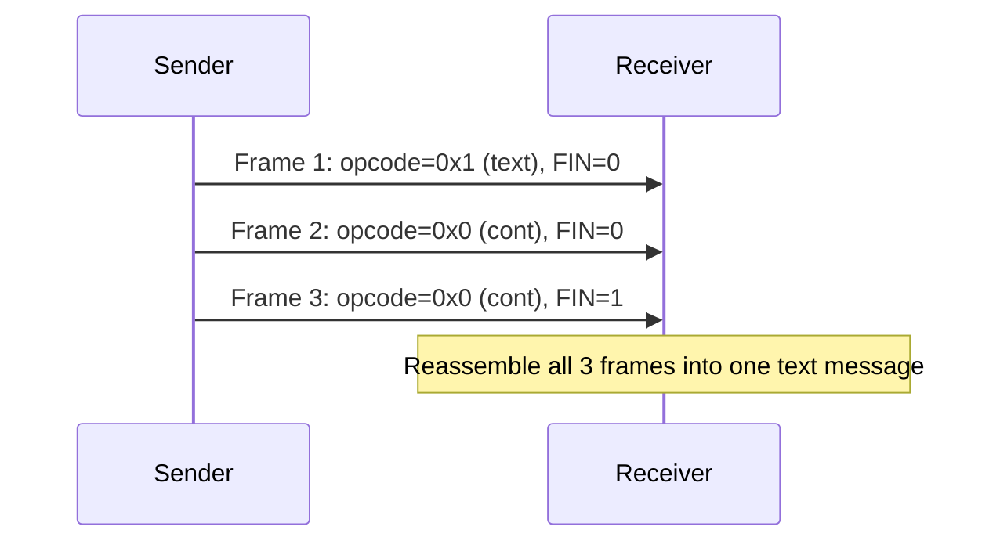

Rules:
- **First frame**: has the real opcode (`0x1` text or `0x2` binary) and FIN=0.
- **Continuation frames**: opcode=`0x0`, FIN=0 until the last one.
- **Last frame**: opcode=`0x0`, FIN=1.
- Control frames (ping/pong/close) can be interleaved but cannot be fragmented themselves.

### **Max payload size**

A single frame's payload is capped at **2^63 bytes** in theory, but in practice **browsers and servers set lower limits** (often 16 MB to 100 MB). For large data (files, video), you usually chunk it yourself at the application level and use your own message IDs.

---

## **14. Close Codes — Why the connection ended**

When the connection closes, a **close frame** carries a 16-bit code and a UTF-8 reason string (max 123 bytes).

### **Common codes**

| Code  | Name                  | When to use                                          |
| ----- | --------------------- | ---------------------------------------------------- |
| 1000  | Normal Closure        | Clean shutdown. Use this by default.                 |
| 1001  | Going Away            | Server shutting down, or browser leaving the page.   |
| 1002  | Protocol Error        | WebSocket protocol violation detected.               |
| 1003  | Unsupported Data      | Got binary when only text is accepted, etc.          |
| 1004  | Reserved              | **Don't send this**                                  |
| 1005  | No Status Received    | **Don't send this** (used internally)                |
| 1006  | Abnormal Closure      | **Don't send this** (used when no close frame sent)  |
| 1007  | Invalid Frame Payload | Text data was not valid UTF-8.                       |
| 1008  | Policy Violation      | Generic "you broke a rule"                           |
| 1009  | Message Too Big       | Payload too large for us                             |
| 1010  | Mandatory Extension   | Client wants an extension server doesn't support     |
| 1011  | Internal Server Error | Server crashed, try again later                      |
| 1012  | Service Restart       | Server restarting                                    |
| 1013  | Try Again Later       | Server overloaded                                    |
| 1014  | Bad Gateway           | Proxy got bad response from upstream                 |
| 1015  | TLS Handshake         | **Don't send this** (TLS issue)                      |
| 4000-4999 | Application-defined | Your own codes (e.g., 4001 = token expired)          |

### **Common mistake: 1006**

You will see `code 1006` in your logs a lot. **You cannot send it**. It is what the browser assigns when the connection just died without a proper close frame (e.g., the network dropped, or a proxy killed it).

### **How to close properly**

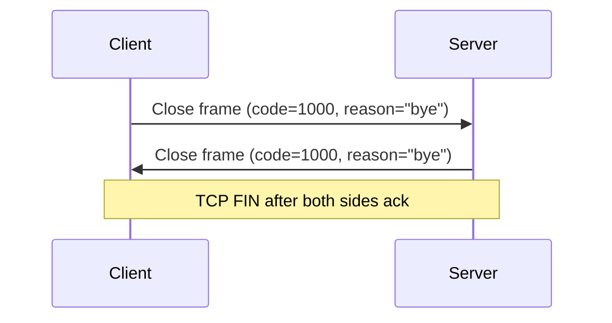

Both sides send a close frame and ack. Only then does the underlying TCP socket close.

---

## **15. Subprotocols and Extensions**

### **Subprotocols**

The `Sec-WebSocket-Protocol` header lets client and server agree on an **application-level protocol** that runs on top of WebSocket.

Examples:
- `graphql-ws` — for GraphQL subscriptions
- `wamp` — Web Application Messaging Protocol
- `chat.v2`, `mcp.v1` — your own

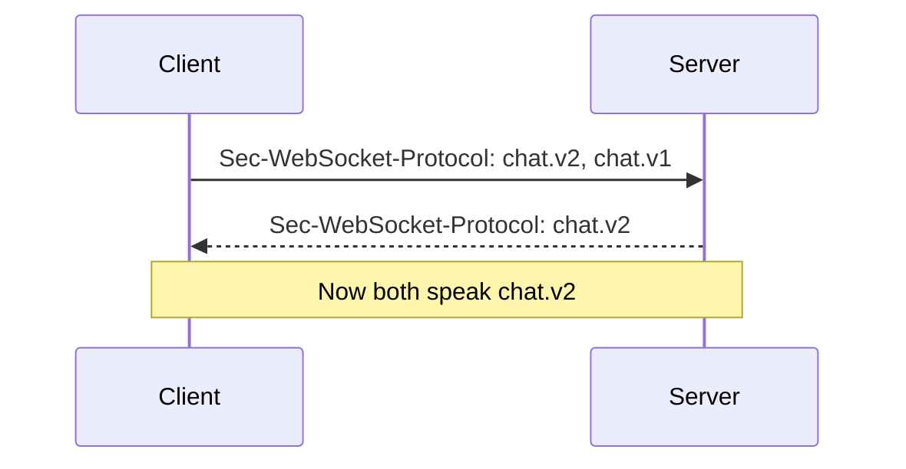

### **Extensions**

The `Sec-WebSocket-Extensions` header negotiates **protocol-level extensions**. The most famous is `permessage-deflate` — compression for each message.

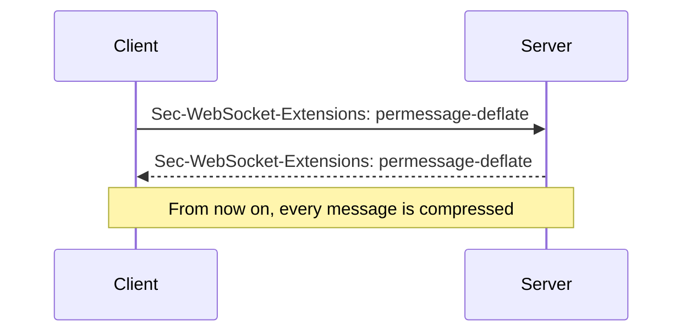

You almost never touch these by hand — browsers and libraries handle them.

---

## **16. Backpressure — When slow receivers choke the sender**

Imagine you push 100 messages per second to a client whose network can only handle 10 per second. What happens?

The data piles up in the **send buffer**. If you keep going, memory blows up.

### **What every WebSocket library gives you**

- **`bufferedAmount`** — how many bytes are waiting to be sent.
- Most libraries let you set a **max buffer**. Once exceeded, the connection is dropped (with a close frame) to protect the server.

### **Pattern to handle this**

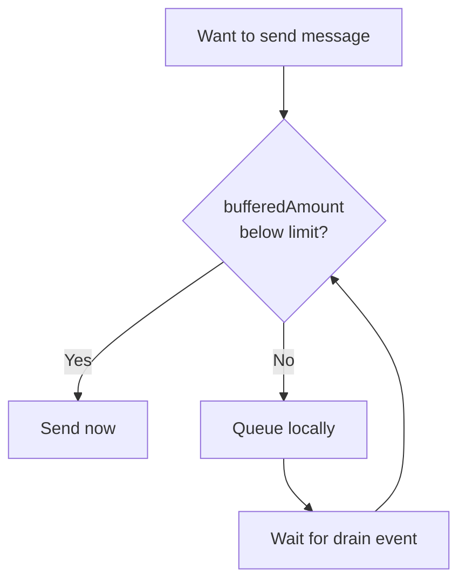

In practice:
- Check `bufferedAmount` before sending.
- Or implement a queue that only flushes when buffer drains.
- Or just **drop** the old message and send the latest one (great for live dashboards).

---

## **17. Common Message Patterns**

### **A. Echo**

Server just sends back whatever the client sent. Good for learning, bad for real apps.

### **B. Broadcast (one-to-many)**

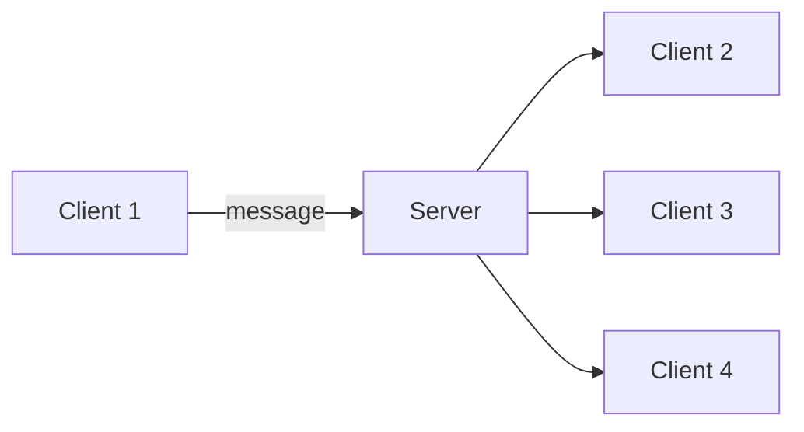

Server keeps a list of all connected sockets. When a message comes from one, it pushes it to all the others.

### **C. Pub/Sub (topic-based)**

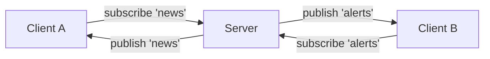

Clients subscribe to "topics" (channels). Server only sends a message to clients subscribed to the matching topic.

### **D. Rooms / Channels (group chat)**

Same idea as pub/sub, but the topic is usually a room ID. Used in chat apps, multiplayer game lobbies, collaborative docs.

### **E. Direct message (one-to-one)**

Server looks up which socket belongs to user X, and sends only to them. You usually keep a map: `userId → socket`.

### **F. Request-response over WebSocket**

Even though WebSocket is not request-response, you can fake it:
- Client sends `{"id": 1, "type": "getUser", "userId": 42}`
- Server replies `{"id": 1, "type": "user", "data": {...}}`
The client matches by `id`. Libraries like `trpc`, `JSON-RPC`, and `Socket.IO` do this for you.

---

## **18. Scaling WebSockets — When one server is not enough**

A single server can hold tens of thousands of WebSocket connections. But at some point you need more. The challenge: **a WebSocket connection is tied to one specific server process**. You cannot "move" it to another process easily.

### **The two big problems**

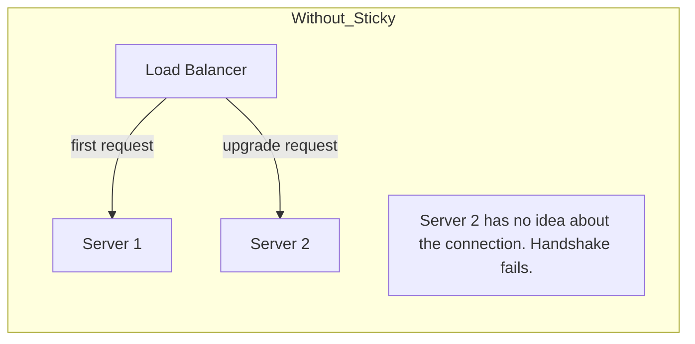

1. **Sticky sessions**: The first HTTP upgrade request and all subsequent traffic for that connection **must** go to the same server. Otherwise the handshake fails.
2. **Cross-server messaging**: User A is on Server 1, User B is on Server 2. How do you send a message from A to B?

### **Solution 1: Sticky Sessions (Session Affinity)**

The load balancer routes the same client to the same server every time.

```mermaid
flowchart LR
    C[Client] --> LB[Load Balancer\n(sticky cookie)]
    LB --> S1[Server 1]
    LB --> S2[Server 2]
```

Most load balancers (NGINX, HAProxy, AWS ALB) support this. You usually do it by IP hash or a cookie.

### **Solution 2: Redis Pub/Sub for cross-server messaging**

Each server keeps its own connections in memory. To send a message to a user on another server, you publish to a Redis channel. Every server subscribes and forwards the message to its local connections if it has the user.

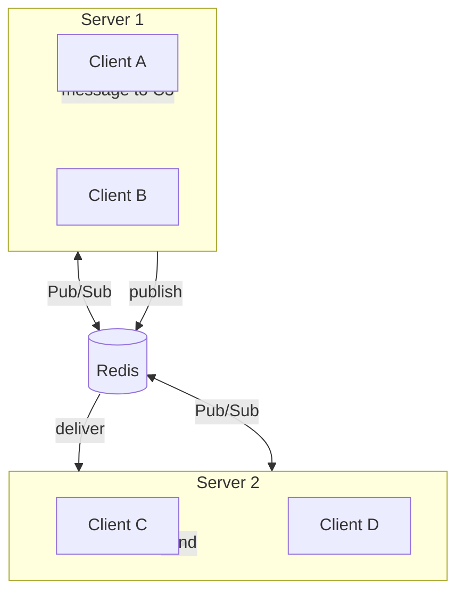

### **Why not store the WebSocket Session in Redis?**

Tempting, but it does not work. The WebSocket `Session` object holds a real TCP socket. It is **not serializable**. You cannot ship it across servers.

What you **can** store in Redis:
- User-to-server mapping ("user 42 is on server 2")
- Message queues for offline users
- Pub/Sub channels for cross-node messaging

What you **cannot** store:
- The socket object itself

---

## **19. Security — WSS, Origin, Auth**

### **1. Always use `wss://` in production**

Plain `ws://` is unencrypted. Anyone on the network (coffee shop, ISP) can see your messages. Use TLS, same as HTTPS.

### **2. Authenticate on the handshake**

The HTTP upgrade request can carry cookies, headers, or tokens — use them. Check the token before accepting the upgrade.

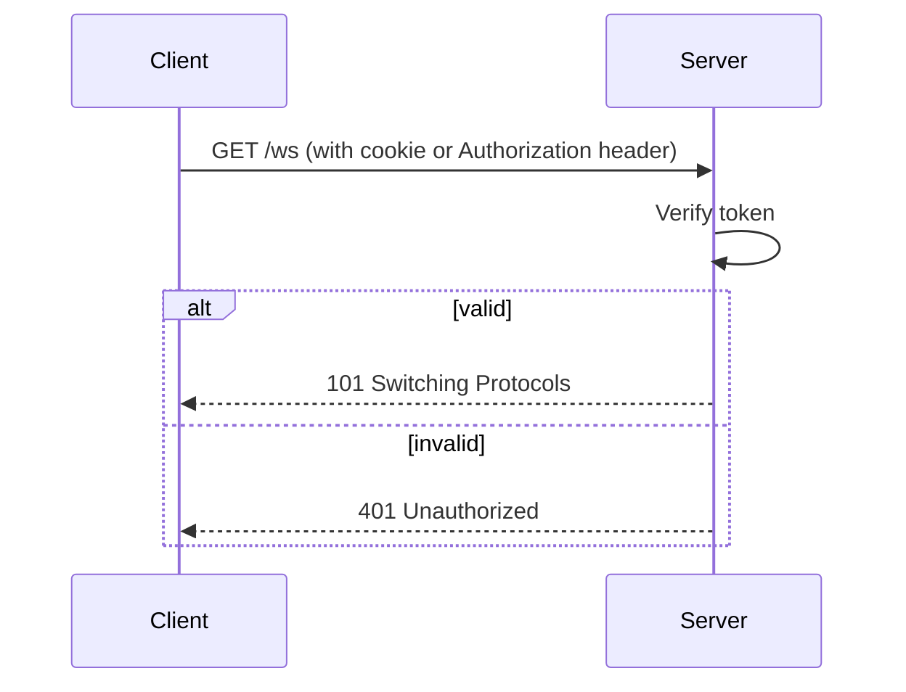

Once the connection is open, you can also send an auth message immediately. But server-side check at handshake is stronger.

### **3. Validate Origin**

The `Origin` header tells you which page the client came from. Reject unknown origins to prevent cross-site WebSocket hijacking (CSWSH).

```
Sec-WebSocket-Origin check:
  if origin in allowed_list: accept
  else: reject with 403
```

### **4. Per-message size limit**

Set a max message size on your server. Without it, a malicious client can send a 10 GB frame and crash your server.

### **5. Rate limiting**

Limit messages per second per connection. Otherwise one misbehaving client can spam everyone via broadcast.

---

## **20. Common Mistakes and Best Practices**

### **Mistakes**

| Mistake                                              | Why it bites you                                         |
| ---------------------------------------------------- | -------------------------------------------------------- |
| Sending before `onopen`                              | State is not OPEN, throws error                         |
| Not handling `onclose`                               | Connection drops silently, UI looks dead                 |
| No reconnection logic                                | One network blip and your chat is broken forever        |
| Polling instead of WebSocket                         | Wasteful, slow                                           |
| Sending huge messages without splitting              | Hits buffer / proxy limits, connection drops with 1009   |
| No heartbeat                                         | Idle connections die silently behind NAT                 |
| Auth only in `onmessage`                             | Connection is open even to bad guys                      |
| Storing WebSocket Session in Redis                  | Not serializable, will throw                             |
| Assuming `onmessage` only fires once per server send | You can get partial frames, ping/pong etc.               |
| Closing without a code                               | Use `close(1000, "logout")`, helps debugging            |

### **Best Practices**

1. **Always use `wss://`** in production.
2. **Authenticate on handshake** with cookies/JWT/tokens.
3. **Validate Origin** for browser clients.
4. **Send a heartbeat** every 25-30 seconds.
5. **Implement reconnect** with exponential backoff: 1s, 2s, 4s, 8s... up to 30s.
6. **Use subprotocols** if you have multiple message types or versions.
7. **Set max message size** on the server (e.g., 1 MB).
8. **Handle backpressure** — do not blast messages at a slow client.
9. **Log close codes** — they tell you why things died.
10. **Plan for horizontal scaling** before launch, not after.
11. **Test with `wscat`** — a CLI tool to quickly test your WS server.
12. **Use JSON or MessagePack** for payload format unless you have a good reason not to.

### **Reconnect pattern**

```mermaid
flowchart TD
    A[Connection open] --> B[Listen for messages]
    B --> C{onclose?}
    C -- no --> B
    C -- yes --> D[Wait backoff]
    D --> E[Reconnect]
    E --> F{Success?}
    F -- yes --> A
    F -- no --> G[Double backoff]
    G --> D
```

Backoff example: 1s, 2s, 4s, 8s, 16s, 30s (max). Reset on successful connection.

---

## **21. Why You Are Getting Errors — Frustration Busting Checklist**

This section is here because of the most common pain point when starting with WebSockets: things break in ways that don't always have a clear error message. If your WebSocket is misbehaving, run through this list. **95% of WebSocket bugs come from these issues.**

### **1. Sending Data Too Early**

You call `send()` before the connection state is `OPEN`. Most APIs will throw `InvalidStateError` or silently fail.

```mermaid
sequenceDiagram
    participant App
    participant WS
    App->>WS: new WebSocket(url)
    Note over WS: state = CONNECTING
    App->>WS: send("hello") 
    Note over WS: ERROR! state is still CONNECTING
    WS-->>App: onopen  (too late)
```

**Fix:** Only send data inside the `onopen` handler. Or check `readyState === 1` (OPEN) before sending.

### **2. Wrong URL Protocol**

You're trying to connect to `http://` or `https://` instead of `ws://` or `wss://`.

| Wrong          | Right              |
| -------------- | ------------------ |
| `http://...`   | `ws://...`         |
| `https://...`  | `wss://...`        |

Mixing these up usually throws a clear connection error in the console, but beginners often misread it.

**Fix:** Use `ws://` for local dev, `wss://` for production. Never `http://` or `https://`.

### **3. CORS / Cross-Origin Blocking**

Your frontend (say `localhost:3000`) and your backend (say `localhost:8000`) are on different ports. The browser treats them as different origins and may block the upgrade request.

**Fix:** Configure CORS on your backend to allow the frontend's origin. The exact way to do this depends on your framework (we'll cover it in the FastAPI notes).

### **4. Silent Disconnections (WiFi blip, idle timeout)**

The WiFi drops or NAT router kills the connection after 30-60 seconds of silence, but your app thinks everything is fine because `readyState` says `OPEN`.

```mermaid
sequenceDiagram
    participant App
    participant WS
    App->>WS: Connected (state=OPEN)
    Note over App,WS: ... 60 seconds of silence ...
    Note over WS: NAT router kills the idle socket
    App->>WS: send("hi")
    Note over App,WS: Send fails silently or after timeout
```

**Fix:** Implement a heartbeat (ping/pong) on the server side. Or on the client side, listen for `onclose` and reconnect.

### **5. Server Restart = All Connections Die**

If you restart your server during dev, every WebSocket connection is killed. Your client usually won't notice until it tries to send something.

**Fix:** Write an automatic reconnection loop in your client code with exponential backoff (1s, 2s, 4s, 8s, max 30s).

### **6. Authentication Done Wrong**

Common mistake: authenticate inside `onmessage` (after the connection is open). That means **anyone** can open the connection — they just can't do anything once they're in. That's bad because you've already given them server resources.

**Fix:** Authenticate during the handshake. The HTTP upgrade request can carry cookies, headers, or a token in the query string. Reject the upgrade (`401`) if auth fails.

### **7. Forgetting `wss://` Behind HTTPS**

Your site is on `https://myapp.com`. You can't open a `ws://` socket from an HTTPS page — the browser blocks it as mixed content.

**Fix:** Use `wss://` whenever your page is served over HTTPS. Locally you can use `ws://` because the page is also on `http://localhost`.

### **8. Frame Size Limit**

You send a huge message (e.g., a 50 MB file in one frame) and the connection dies with `code 1009` (Message Too Big).

**Fix:** Split large data into smaller chunks yourself, or set a higher max size on your server.

### **9. No `try/catch` Around `send()`**

WebSocket `send()` can throw if the state is wrong, or if the message is too big.

**Fix:** Wrap `send()` in try/catch and have a reconnection strategy.

### **10. Assuming One Message = One Frame**

A single message can span many frames. If you're writing a low-level server, you must reassemble them.

**Fix:** Use a library. Don't roll your own WebSocket parser unless you really have to.

---

## **22. Summary Checklist Before Coding**

Before you write a single line of code, make sure these are crystal clear in your head. They cover ~90% of beginner mistakes:

- [ ] WebSockets start with an HTTP handshake and switch to `101 Switching Protocols`.
- [ ] You must wait for the `OPEN` state before sending any data.
- [ ] You must handle the `CLOSED` state to reconnect if the network drops.
- [ ] You must use `ws://` or `wss://` in your URL, not `http://` or `https://`.
- [ ] The connection is **persistent** — it does NOT close after each message.
- [ ] Both client and server can send messages at any time.
- [ ] Frames are the unit of transport, not messages.
- [ ] Use `wss://` in production (encrypts traffic, same as HTTPS).
- [ ] Implement a reconnect strategy on the client side.
- [ ] Authenticate during the handshake, not after.

If you tick every box above, you will save yourself hours of debugging.

---

## **23. Quick Cheat Sheet**

### **URL**
- `ws://host/path` — plain
- `wss://host/path` — encrypted (use this)

### **Connection lifecycle**
```
CONNECTING (0) → OPEN (1) → CLOSING (2) → CLOSED (3)
```

### **Frame anatomy (simplified)**
```
[FIN|Rsv|Opcode (1B)] [MASK|Len (1B)] [Extended len?] [Mask key (4B)?] [Payload]
```

### **Opcodes**
- `0x1` text, `0x2` binary, `0x0` continuation
- `0x8` close, `0x9` ping, `0xA` pong

### **Close codes you actually use**
- `1000` normal, `1001` going away, `1011` server error
- `4000-4999` your own codes
- `1006` = "I died, no close frame" (browser tells you)

### **Headers in the handshake**
- Client: `Upgrade: websocket`, `Connection: Upgrade`, `Sec-WebSocket-Key`, `Sec-WebSocket-Version: 13`
- Server: `101 Switching Protocols`, `Sec-WebSocket-Accept`

### **Events**
`onopen`, `onmessage`, `onerror`, `onclose`

### **Server checks**
- Verify `Sec-WebSocket-Key` → compute `Sec-WebSocket-Accept`
- Check `Origin`
- Authenticate
- Limit message size
- Send ping every 25-30s

### **At scale**
- Sticky sessions at the LB
- Redis Pub/Sub between nodes
- NEVER try to store the socket object in shared memory

---

## **What's next?**

Now that you know WebSocket inside-out (theory, frames, lifecycle, scaling, security), the next file covers **how to actually use WebSocket in Python with FastAPI** — from a tiny echo server up to production patterns (rooms, auth, broadcasting, scaling with Redis).

Ping me when you're ready and I'll generate that file.
