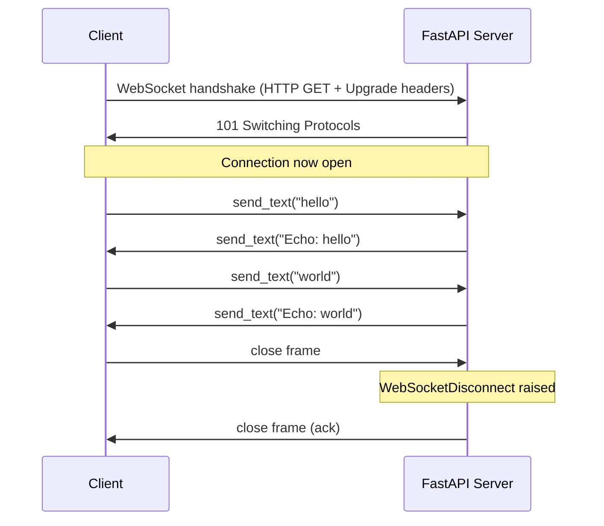
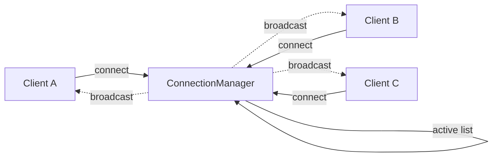
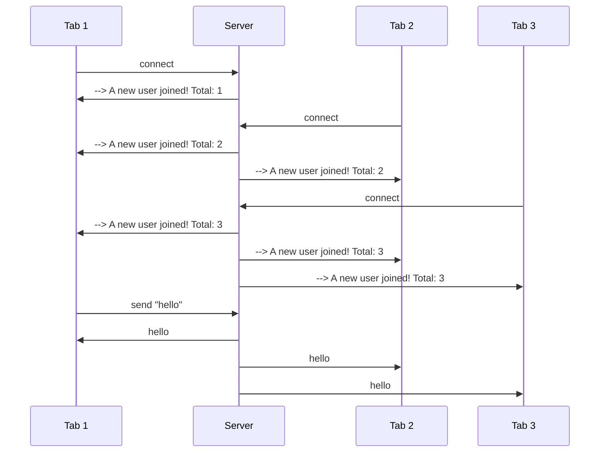
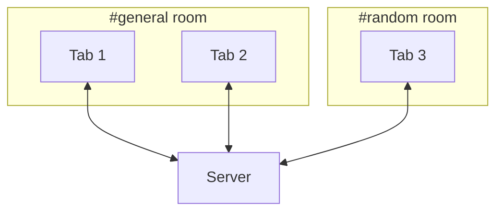
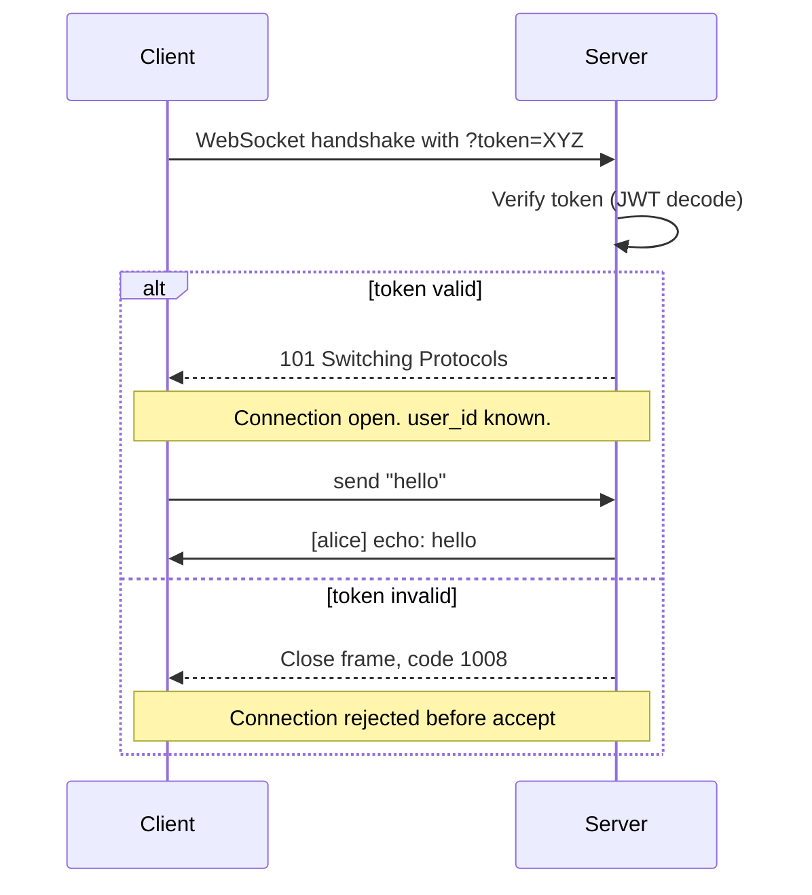
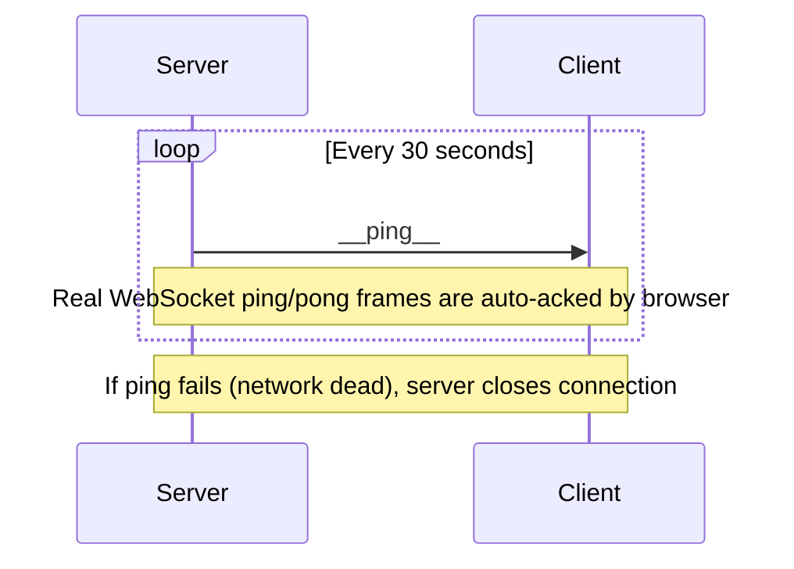
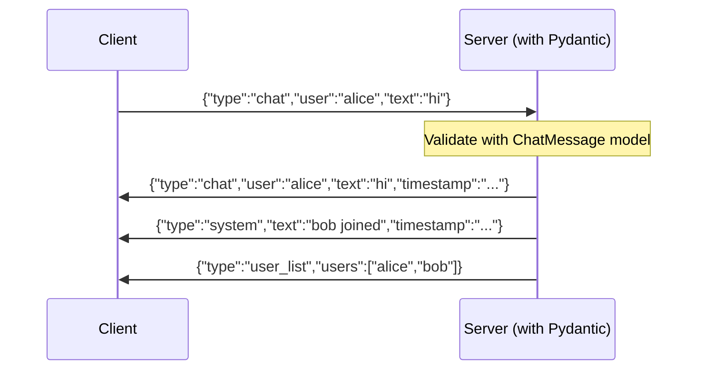
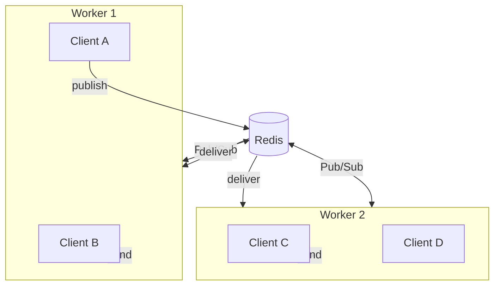
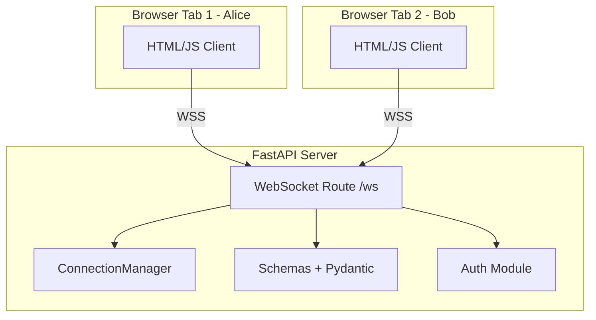

# **FastAPI WebSocket — From Basics to Production (Python)**

> Companion to `websocket_notes_from_scratch.md`. This file is **all Python + FastAPI**. Starts with the smallest possible example, then increases complexity step by step. Every code block is a file you can actually run. By the end you'll have a full real-time chat app with auth, rooms, broadcasting, heartbeat, and Redis scaling.

---

## **Table of Contents**

1. [Setup — Install everything you need](#1-setup--install-everything-you-need)
2. [Project structure we'll build](#2-project-structure-well-build)
3. [Example 1 — Tiny echo server (the smallest possible)](#3-example-1--tiny-echo-server-the-smallest-possible)
4. [Example 2 — HTML/JS test client](#4-example-2--htmljs-test-client)
5. [Example 3 — Connection manager (track all clients)](#5-example-3--connection-manager-track-all-clients)
6. [Example 4 — Broadcast to everyone](#6-example-4--broadcast-to-everyone)
7. [Example 5 — Rooms / channels (group messaging)](#7-example-5--rooms--channels-group-messaging)
8. [Example 6 — Direct messages (one-to-one)](#8-example-6--direct-messages-one-to-one)
9. [Example 7 — Authentication with JWT (token in query)](#9-example-7--authentication-with-jwt-token-in-query)
10. [Example 8 — Heartbeat / ping-pong to keep connections alive](#10-example-8--heartbeat--ping-pong-to-keep-connections-alive)
11. [Example 9 — Structured JSON messages with Pydantic](#11-example-9--structured-json-messages-with-pydantic)
12. [Example 10 — Scaling with Redis Pub/Sub (multiple workers)](#12-example-10--scaling-with-redis-pubsub-multiple-workers)
13. [Testing your WebSocket server](#13-testing-your-websocket-server)
14. [Common pitfalls in FastAPI WebSocket](#14-common-pitfalls-in-fastapi-websocket)
15. [Case Study — Building a real chat app step by step](#15-case-study--building-a-real-chat-app-step-by-step)
16. [Quick reference card](#16-quick-reference-card)

---

## **1. Setup — Install everything you need**

You need:
- **Python 3.10+**
- **FastAPI** — the web framework
- **uvicorn** — the ASGI server that runs FastAPI
- **websockets** — used by uvicorn for the actual WebSocket protocol
- **pyjwt** — for JWT auth (later examples)
- **redis** — for scaling with Pub/Sub (later examples)

```bash
# Create a project folder
mkdir fastapi-ws-demo && cd fastapi-ws-demo

# Create a virtual environment
python -m venv venv
source venv/bin/activate        # On Windows: venv\Scripts\activate

# Install everything
pip install fastapi uvicorn[standard] websockets pyjwt redis
```

That's it. You're ready.

---

## **2. Project structure we'll build**

By the end of this file we'll have something like this:

```
fastapi-ws-demo/
├── venv/
├── examples/
│   ├── 01_echo.py              # Smallest possible
│   ├── 02_connection_manager.py
│   ├── 03_broadcast.py
│   ├── 04_rooms.py
│   ├── 05_direct_messages.py
│   ├── 06_auth_jwt.py
│   ├── 07_heartbeat.py
│   ├── 08_typed_messages.py
│   └── 09_redis_scaling.py
├── case_study/
│   ├── main.py                  # Final chat app
│   ├── connection_manager.py
│   ├── auth.py
│   ├── schemas.py
│   └── static/
│       └── index.html           # Test client
├── requirements.txt
└── README.md
```

For the early examples I'll keep everything in **one file** so you can copy-paste and run them in seconds.

---

## **3. Example 1 — Tiny echo server (the smallest possible)**

**File: `examples/01_echo.py`**

This is the smallest FastAPI WebSocket you can write. It just sends back whatever the client sends.

```python
# examples/01_echo.py
from fastapi import FastAPI, WebSocket
from fastapi.websockets import WebSocketDisconnect

app = FastAPI()

@app.websocket("/ws")
async def echo_endpoint(websocket: WebSocket):
    # 1. MUST accept the connection. Without this, nothing works.
    await websocket.accept()

    try:
        # 2. Loop forever, waiting for messages from the client.
        while True:
            # 3. Wait for a text message. This blocks until something arrives.
            data = await websocket.receive_text()

            # 4. Send it back, with "Echo: " in front.
            await websocket.send_text(f"Echo: {data}")

    except WebSocketDisconnect:
        # 5. Client closed the connection. Clean up.
        print("Client disconnected")
```

**Run it:**
```bash
uvicorn examples.01_echo:app --reload
```

Now open a test client (next section) and connect to `ws://localhost:8000/ws`.

### **What's happening here — diagram**



### **The three rules you must follow**

1. **`await websocket.accept()`** must be called first. Skipping it = connection never opens.
2. **`receive_*` methods must be called in a loop** because data arrives over time, not in one shot.
3. **Catch `WebSocketDisconnect`** to clean up when the client goes away. Otherwise exceptions bubble up and the worker is unhappy.

---

## **4. Example 2 — HTML/JS test client**

You need a way to test your server. Here's a tiny HTML page you can use for all examples.

**File: `static/client.html`** (or just save and double-click to open in a browser)

```html
<!-- static/client.html -->
<!DOCTYPE html>
<html>
<head>
    <meta charset="utf-8">
    <title>WebSocket Test Client</title>
    <style>
        body { font-family: monospace; padding: 20px; max-width: 800px; margin: 0 auto; }
        #log { border: 1px solid #ccc; height: 400px; overflow-y: scroll; padding: 10px; background: #f9f9f9; }
        .msg { margin: 4px 0; }
        .sent { color: blue; }
        .recv { color: green; }
        .sys  { color: gray; font-style: italic; }
        input { padding: 8px; width: 70%; }
        button { padding: 8px 16px; }
    </style>
</head>
<body>
    <h2>WebSocket Test Client</h2>

    <div>
        URL: <input id="url" value="ws://localhost:8000/ws" style="width: 50%;">
        <button onclick="connect()">Connect</button>
        <button onclick="disconnect()">Disconnect</button>
    </div>

    <h3>Status: <span id="status">disconnected</span></h3>

    <div id="log"></div>

    <div style="margin-top: 10px;">
        <input id="msg" placeholder="Type a message..." onkeydown="if(event.key==='Enter') send()">
        <button onclick="send()">Send</button>
    </div>

    <script>
        let ws = null;
        const log = document.getElementById('log');
        const status = document.getElementById('status');

        function logMsg(text, cls) {
            const div = document.createElement('div');
            div.className = 'msg ' + cls;
            div.textContent = text;
            log.appendChild(div);
            log.scrollTop = log.scrollHeight;
        }

        function connect() {
            const url = document.getElementById('url').value;
            ws = new WebSocket(url);

            ws.onopen = () => {
                status.textContent = 'connected';
                logMsg('>>> Connected to ' + url, 'sys');
            };

            ws.onmessage = (event) => {
                logMsg('<<< ' + event.data, 'recv');
            };

            ws.onclose = () => {
                status.textContent = 'disconnected';
                logMsg('<<< Disconnected', 'sys');
            };

            ws.onerror = (err) => {
                logMsg('<<< Error: ' + err, 'sys');
            };
        }

        function disconnect() {
            if (ws) ws.close();
        }

        function send() {
            const input = document.getElementById('msg');
            if (ws && ws.readyState === WebSocket.OPEN) {
                ws.send(input.value);
                logMsg('>>> ' + input.value, 'sent');
                input.value = '';
            } else {
                logMsg('Cannot send: not connected', 'sys');
            }
        }
    </script>
</body>
</html>
```

Open it in two browser tabs → connect both → chat between them once you build a real broadcast example.

---

## **5. Example 3 — Connection manager (track all clients)**

For any real app you need to know **who is connected right now**. The standard pattern is a `ConnectionManager` class.

**File: `examples/02_connection_manager.py`**

```python
# examples/02_connection_manager.py
from fastapi import FastAPI, WebSocket
from fastapi.websockets import WebSocketDisconnect

app = FastAPI()


class ConnectionManager:
    """Keeps track of all connected WebSocket clients."""

    def __init__(self):
        # Store active connections. Set is fine because WebSocket objects are hashable by id().
        # Using a list also works, but a set is slightly safer against duplicates.
        self.active_connections: list[WebSocket] = []

    async def connect(self, websocket: WebSocket):
        """Accept the new connection and remember it."""
        await websocket.accept()
        self.active_connections.append(websocket)
        print(f"Connected. Total: {len(self.active_connections)}")

    def disconnect(self, websocket: WebSocket):
        """Remove a connection from our list."""
        self.active_connections.remove(websocket)
        print(f"Disconnected. Total: {len(self.active_connections)}")

    async def send_personal(self, message: str, websocket: WebSocket):
        """Send a message to one specific client."""
        await websocket.send_text(message)

    async def broadcast(self, message: str):
        """Send a message to ALL connected clients."""
        for connection in self.active_connections:
            await connection.send_text(message)


manager = ConnectionManager()


@app.websocket("/ws")
async def websocket_endpoint(websocket: WebSocket):
    await manager.connect(websocket)
    try:
        while True:
            data = await websocket.receive_text()
            # Echo to the sender only
            await manager.send_personal(f"You said: {data}", websocket)
            # And tell everyone else
            await manager.broadcast(f"Someone said: {data}")
    except WebSocketDisconnect:
        manager.disconnect(websocket)
```

**Run it:**
```bash
uvicorn examples.02_connection_manager:app --reload
```

Open the HTML client in **two tabs**. Type in tab 1 → tab 2 sees "Someone said: ...".

### **Diagram — how the manager works**



---

## **6. Example 4 — Broadcast to everyone**

Same as Example 3, but cleaned up. Just a chat where everyone sees everything.

**File: `examples/03_broadcast.py`**

```python
# examples/03_broadcast.py
from fastapi import FastAPI, WebSocket
from fastapi.websockets import WebSocketDisconnect

app = FastAPI()


class ConnectionManager:
    def __init__(self):
        self.active_connections: list[WebSocket] = []

    async def connect(self, websocket: WebSocket):
        await websocket.accept()
        self.active_connections.append(websocket)

    def disconnect(self, websocket: WebSocket):
        self.active_connections.remove(websocket)

    async def broadcast(self, message: str):
        # Use asyncio.gather for true parallelism (faster for many clients)
        for connection in self.active_connections:
            try:
                await connection.send_text(message)
            except Exception:
                # If a client died, ignore for now; cleanup happens in disconnect()
                pass


manager = ConnectionManager()


@app.websocket("/ws")
async def websocket_endpoint(websocket: WebSocket):
    await manager.connect(websocket)
    await manager.broadcast(f"--> A new user joined! Total: {len(manager.active_connections)}")
    try:
        while True:
            data = await websocket.receive_text()
            await manager.broadcast(data)
    except WebSocketDisconnect:
        manager.disconnect(websocket)
        await manager.broadcast(f"<-- A user left. Total: {len(manager.active_connections)}")
```

**Test:** Open the HTML client in 3 tabs. Type "hi" in tab 1. All three tabs see it.



---

## **7. Example 5 — Rooms / channels (group messaging)**

Now we want **multiple rooms** so users only see messages from their own room. Think: `#general`, `#random`, `#dev-help`.

**File: `examples/04_rooms.py`**

```python
# examples/04_rooms.py
from fastapi import FastAPI, WebSocket
from fastapi.websockets import WebSocketDisconnect

app = FastAPI()


class RoomManager:
    def __init__(self):
        # room_name -> list of WebSocket connections
        self.rooms: dict[str, list[WebSocket]] = {}

    async def connect(self, room: str, websocket: WebSocket):
        await websocket.accept()
        if room not in self.rooms:
            self.rooms[room] = []
        self.rooms[room].append(websocket)

    def disconnect(self, room: str, websocket: WebSocket):
        if room in self.rooms:
            self.rooms[room].remove(websocket)
            if not self.rooms[room]:
                # Clean up empty rooms
                del self.rooms[room]

    async def broadcast_to_room(self, room: str, message: str):
        if room in self.rooms:
            for connection in self.rooms[room]:
                await connection.send_text(message)


manager = RoomManager()


@app.websocket("/ws/{room}")
async def websocket_endpoint(websocket: WebSocket, room: str):
    await manager.connect(room, websocket)
    await manager.broadcast_to_room(room, f"--> Someone joined #{room}")

    try:
        while True:
            data = await websocket.receive_text()
            await manager.broadcast_to_room(room, data)
    except WebSocketDisconnect:
        manager.disconnect(room, websocket)
        await manager.broadcast_to_room(room, f"<-- Someone left #{room}")
```

**Test:**
- Tab 1: connect to `ws://localhost:8000/ws/general`
- Tab 2: connect to `ws://localhost:8000/ws/general`
- Tab 3: connect to `ws://localhost:8000/ws/random`

Tabs 1 & 2 see each other's messages. Tab 3 doesn't.

### **Diagram — rooms architecture**



---

## **8. Example 6 — Direct messages (one-to-one)**

Send a message to a specific user. We need to know **who is who**, so we pass a user_id in the URL.

**File: `examples/05_direct_messages.py`**

```python
# examples/05_direct_messages.py
from fastapi import FastAPI, WebSocket
from fastapi.websockets import WebSocketDisconnect

app = FastAPI()


class DirectMessageManager:
    def __init__(self):
        # user_id -> WebSocket connection (one connection per user)
        self.users: dict[str, WebSocket] = {}

    async def connect(self, user_id: str, websocket: WebSocket):
        await websocket.accept()
        # If user already has a connection, close the old one (only one device at a time here)
        if user_id in self.users:
            try:
                await self.users[user_id].close()
            except Exception:
                pass
        self.users[user_id] = websocket

    def disconnect(self, user_id: str):
        self.users.pop(user_id, None)

    async def send_to_user(self, target_id: str, message: str) -> bool:
        """Returns True if delivered, False if user offline."""
        if target_id in self.users:
            await self.users[target_id].send_text(message)
            return True
        return False


manager = DirectMessageManager()


@app.websocket("/ws/{user_id}")
async def websocket_endpoint(websocket: WebSocket, user_id: str):
    await manager.connect(user_id, websocket)
    print(f"User {user_id} connected. Online users: {list(manager.users.keys())}")

    try:
        while True:
            # Expected message format: "target_id:message"
            # e.g., "alice:hi there"
            raw = await websocket.receive_text()

            if ":" not in raw:
                await websocket.send_text("Format: target_id:message")
                continue

            target_id, message = raw.split(":", 1)
            target_id = target_id.strip()
            delivered = await manager.send_to_user(target_id, f"[from {user_id}] {message}")

            if delivered:
                await websocket.send_text(f"[sent to {target_id}] {message}")
            else:
                await websocket.send_text(f"[user {target_id} is offline]")
    except WebSocketDisconnect:
        manager.disconnect(user_id)
        print(f"User {user_id} disconnected")
```

**Test:**
- Tab 1: connect to `ws://localhost:8000/ws/alice`
- Tab 2: connect to `ws://localhost:8000/ws/bob`
- In Tab 1, type `bob:hello bob!`
- Tab 2 receives `[from alice] hello bob!`

---

## **9. Example 7 — Authentication with JWT (token in query)**

This is where most beginners get stuck. The trick: **authenticate BEFORE calling `accept()`**. If auth fails, close with a 4xx code. Once `accept()` is called, you can't return an HTTP error anymore.

**File: `examples/06_auth_jwt.py`**

```python
# examples/06_auth_jwt.py
import jwt  # from PyJWT
from datetime import datetime, timedelta, timezone
from fastapi import FastAPI, WebSocket, Query
from fastapi.websockets import WebSocketDisconnect, WebSocketException

app = FastAPI()

# In production, load this from environment!
SECRET_KEY = "super-secret-change-me"
ALGORITHM = "HS256"


def create_token(user_id: str, expires_in_minutes: int = 60) -> str:
    """Helper to create a JWT for testing. In real life, you'd do this in a /login HTTP endpoint."""
    payload = {
        "sub": user_id,
        "exp": datetime.now(timezone.utc) + timedelta(minutes=expires_in_minutes),
    }
    return jwt.encode(payload, SECRET_KEY, algorithm=ALGORITHM)


def verify_token(token: str) -> str | None:
    """Returns user_id if valid, None if invalid/expired."""
    try:
        payload = jwt.decode(token, SECRET_KEY, algorithms=[ALGORITHM])
        return payload.get("sub")
    except jwt.PyJWTError:
        return None


@app.websocket("/ws")
async def websocket_endpoint(
    websocket: WebSocket,
    token: str = Query(...),  # Comes from ?token=... in the URL
):
    # STEP 1: Authenticate FIRST, before accept()
    user_id = verify_token(token)
    if not user_id:
        # Close with HTTP 1008 (policy violation). Cannot return 401 — too late after accept.
        await websocket.close(code=1008, reason="Invalid or expired token")
        return  # Important: stop here

    # STEP 2: Now we know who you are. Accept the connection.
    await websocket.accept()
    print(f"User '{user_id}' authenticated and connected")

    try:
        while True:
            data = await websocket.receive_text()
            await websocket.send_text(f"[{user_id}] echo: {data}")
    except WebSocketDisconnect:
        print(f"User '{user_id}' disconnected")


# Convenience HTTP endpoint to mint a token for testing
@app.get("/token/{user_id}")
def get_token(user_id: str):
    return {"token": create_token(user_id)}
```

**Test:**
1. Run the server.
2. Visit `http://localhost:8000/token/alice` in your browser → you get a token.
3. In the HTML client, connect to `ws://localhost:8000/ws?token=PASTE_TOKEN_HERE`.

If you forget the token or pass a bad one, the server closes with code `1008`.

### **Diagram — auth flow**



### **Why authenticate BEFORE `accept()`?**

Because once you call `accept()`, you've already upgraded the protocol. You can no longer send back an HTTP `401 Unauthorized`. The only way to reject someone post-accept is by sending a WebSocket close frame, which the client just sees as "disconnected" — confusing.

**Always authenticate, then accept.**

---

## **10. Example 8 — Heartbeat / ping-pong to keep connections alive**

NAT routers and firewalls kill idle connections after ~60 seconds. We send a **ping** every 30s; if no **pong** comes back, we close the connection.

**File: `examples/07_heartbeat.py`**

```python
# examples/07_heartbeat.py
import asyncio
from fastapi import FastAPI, WebSocket
from fastapi.websockets import WebSocketDisconnect

app = FastAPI()

HEARTBEAT_INTERVAL = 30   # Send ping every 30 seconds
HEARTBEAT_TIMEOUT  = 10   # Close if no pong within 10 seconds


@app.websocket("/ws")
async def websocket_endpoint(websocket: WebSocket):
    await websocket.accept()

    # Two concurrent tasks:
    # 1. Receive messages from client
    # 2. Send heartbeats and check for stale connections
    receiver_task = asyncio.create_task(receive_messages(websocket))
    heartbeat_task = asyncio.create_task(send_heartbeat(websocket))

    # When either task finishes (because the other raised or returned), clean up.
    done, pending = await asyncio.wait(
        [receiver_task, heartbeat_task],
        return_when=asyncio.FIRST_COMPLETED,
    )

    for task in pending:
        task.cancel()


async def receive_messages(websocket: WebSocket):
    """Wait for messages from the client. Raises WebSocketDisconnect when they leave."""
    try:
        while True:
            data = await websocket.receive_text()
            await websocket.send_text(f"Got: {data}")
    except WebSocketDisconnect:
        print("Client disconnected")
        raise  # Bubble up to signal the other task


async def send_heartbeat(websocket: WebSocket):
    """Periodically ping. If a ping fails, the connection is dead."""
    while True:
        await asyncio.sleep(HEARTBEAT_INTERVAL)
        try:
            # FastAPI's send_bytes with empty bytes is the easiest manual "ping"
            # Browsers auto-respond to pings, but you usually don't see the pong.
            await websocket.send_text("__ping__")
            print("Sent ping")
        except Exception:
            print("Heartbeat failed, closing")
            await websocket.close()
            return
```

**Note:** This is a manual heartbeat. Most production code uses WebSocket's built-in **ping/pong frames** (opcode 0x9 / 0xA) handled by uvicorn at the protocol level. The pattern above is simpler and works fine.



---

## **11. Example 9 — Structured JSON messages with Pydantic**

Real apps don't send random strings. They send **typed messages**. Pydantic makes this clean.

**File: `examples/08_typed_messages.py`**

```python
# examples/08_typed_messages.py
from datetime import datetime
from typing import Literal
from fastapi import FastAPI, WebSocket
from fastapi.websockets import WebSocketDisconnect
from pydantic import BaseModel, ValidationError

app = FastAPI()


# ---- Define the shape of every message we send/receive ----

class ChatMessage(BaseModel):
    type: Literal["chat"] = "chat"
    user: str
    text: str


class JoinMessage(BaseModel):
    type: Literal["join"] = "join"
    user: str


class LeaveMessage(BaseModel):
    type: Literal["leave"] = "leave"
    user: str


class ServerMessage(BaseModel):
    """What the server sends back to clients."""
    type: Literal["chat", "system", "user_list"]
    user: str | None = None
    text: str | None = None
    users: list[str] | None = None
    timestamp: str


class ConnectionManager:
    def __init__(self):
        self.connections: dict[str, WebSocket] = {}  # username -> WebSocket

    async def connect(self, username: str, websocket: WebSocket):
        await websocket.accept()
        self.connections[username] = websocket

    def disconnect(self, username: str):
        self.connections.pop(username, None)

    async def broadcast(self, message: ServerMessage):
        # Convert to JSON string once, send to all
        text = message.model_dump_json()
        for conn in self.connections.values():
            await conn.send_text(text)


manager = ConnectionManager()


def make_system_message(text: str) -> ServerMessage:
    return ServerMessage(
        type="system",
        text=text,
        timestamp=datetime.now().isoformat(),
    )


@app.websocket("/ws/{username}")
async def websocket_endpoint(websocket: WebSocket, username: str):
    await manager.connect(username, websocket)

    # Tell everyone a new user joined
    await manager.broadcast(make_system_message(f"{username} joined"))
    await manager.broadcast(ServerMessage(
        type="user_list",
        users=list(manager.connections.keys()),
        timestamp=datetime.now().isoformat(),
    ))

    try:
        while True:
            raw = await websocket.receive_text()

            # Try to parse as ChatMessage. If shape is wrong, ignore.
            try:
                msg = ChatMessage.model_validate_json(raw)
            except ValidationError as e:
                await websocket.send_text(f'{{"type":"error","text":"{e}"}}')
                continue

            # Broadcast the chat message
            await manager.broadcast(ServerMessage(
                type="chat",
                user=msg.user,
                text=msg.text,
                timestamp=datetime.now().isoformat(),
            ))

    except WebSocketDisconnect:
        manager.disconnect(username)
        await manager.broadcast(make_system_message(f"{username} left"))
        await manager.broadcast(ServerMessage(
            type="user_list",
            users=list(manager.connections.keys()),
            timestamp=datetime.now().isoformat(),
        ))
```

**Why this matters:** When your frontend and backend agree on a `type` field, you can handle many message kinds (`chat`, `typing`, `image`, `reaction`) with one WebSocket connection.

### **Diagram — typed message flow**



---

## **12. Example 10 — Scaling with Redis Pub/Sub (multiple workers)**

When you run FastAPI with multiple workers (e.g., `uvicorn --workers 4`), each worker has its own in-memory connection list. User A on worker 1 can't see User B on worker 2 unless they share a message bus. **Redis Pub/Sub** is the standard fix.

**Install Redis first:**
```bash
# macOS: brew install redis && redis-server
# Ubuntu: sudo apt install redis-server && redis-server
# Docker: docker run -p 6379:6379 redis
```

**File: `examples/09_redis_scaling.py`**

```python
# examples/09_redis_scaling.py
import asyncio
import json
import redis.asyncio as aioredis
from fastapi import FastAPI, WebSocket
from fastapi.websockets import WebSocketDisconnect

app = FastAPI()

REDIS_URL = "redis://localhost:6379"
CHANNEL   = "chat:general"

# One Redis client per worker (created once at startup)
redis_client: aioredis.Redis | None = None


@app.on_event("startup")
async def startup():
    global redis_client
    redis_client = aioredis.from_url(REDIS_URL, decode_responses=True)


@app.on_event("shutdown")
async def shutdown():
    if redis_client:
        await redis_client.close()


class PubSubManager:
    """Manages WebSocket connections + Redis Pub/Sub for cross-worker messaging."""

    def __init__(self):
        # username -> WebSocket (on THIS worker only)
        self.local_connections: dict[str, WebSocket] = {}

    async def connect(self, username: str, websocket: WebSocket):
        await websocket.accept()
        self.local_connections[username] = websocket

    def disconnect(self, username: str):
        self.local_connections.pop(username, None)

    async def publish(self, message: dict):
        """Publish to Redis. All workers (including this one) will receive it."""
        await redis_client.publish(CHANNEL, json.dumps(message))

    async def listener(self):
        """Background task: subscribe to Redis and fan out to local sockets."""
        pubsub = redis_client.pubsub()
        await pubsub.subscribe(CHANNEL)

        async for message in pubsub.listen():
            if message["type"] != "message":
                continue
            data = json.loads(message["data"])
            text = json.dumps(data)

            # Send to local sockets only. Other workers do the same for their sockets.
            for conn in list(self.local_connections.values()):
                try:
                    await conn.send_text(text)
                except Exception:
                    pass

    async def start(self):
        """Start the listener in the background."""
        asyncio.create_task(self.listener())


manager = PubSubManager()


@app.on_event("startup")
async def start_listener():
    await manager.start()


@app.websocket("/ws/{username}")
async def websocket_endpoint(websocket: WebSocket, username: str):
    await manager.connect(username, websocket)
    await manager.publish({"type": "system", "text": f"{username} joined"})

    try:
        while True:
            data = await websocket.receive_text()
            await manager.publish({
                "type": "chat",
                "user": username,
                "text": data,
            })
    except WebSocketDisconnect:
        manager.disconnect(username)
        await manager.publish({"type": "system", "text": f"{username} left"})
```

**Run with multiple workers:**
```bash
uvicorn examples.09_redis_scaling:app --workers 4 --host 0.0.0.0 --port 8000
```

Open the HTML client in 4 tabs (you'll see different workers serving them — but they all see each other's messages because of Redis).

### **Diagram — Redis Pub/Sub architecture**



The key insight: **don't try to share the WebSocket objects across workers**. Just publish the **message intent** and let each worker deliver to its own sockets.

---

## **13. Testing your WebSocket server**

### **Option 1: The HTML client (Example 2)**

Already covered. Easiest for visual testing.

### **Option 2: `websocat` CLI tool**

Install:
```bash
# macOS
brew install websocat

# Linux
curl -L https://github.com/vi/websocat/releases/latest/download/websocat.x86_64-unknown-linux-musl -o /usr/local/bin/websocat
chmod +x /usr/local/bin/websocat
```

Use:
```bash
# Connect to your echo server
websocat ws://localhost:8000/ws

# Send a test message
echo "hello" | websocat ws://localhost:8000/ws

# Connect with auth
websocat "ws://localhost:8000/ws?token=YOUR_JWT"
```

### **Option 3: Python client (great for automated tests)**

```python
# test_client.py
import asyncio
import websockets

async def test():
    uri = "ws://localhost:8000/ws"
    async with websockets.connect(uri) as ws:
        await ws.send("hello")
        response = await ws.recv()
        print(f"Server said: {response}")

asyncio.run(test())
```

```python
# Test with auth
async def test_auth():
    uri = "ws://localhost:8000/ws?token=YOUR_JWT_HERE"
    async with websockets.connect(uri) as ws:
        await ws.send("authenticated hello")
        print(await ws.recv())

asyncio.run(test_auth())
```

---

## **14. Common pitfalls in FastAPI WebSocket**

| Pitfall                                          | Symptom                                          | Fix                                                                 |
| ------------------------------------------------ | ------------------------------------------------ | ------------------------------------------------------------------- |
| Forgot `await websocket.accept()`                | Browser stays in CONNECTING, never opens         | Call `accept()` as the FIRST line in your endpoint                  |
| Calling `accept()` after auth fails              | Can't return 401 anymore                        | Authenticate FIRST, then accept, or close with `websocket.close()` |
| Used `while True` without catching disconnect   | Server logs scary tracebacks when client leaves  | Wrap loop in `try/except WebSocketDisconnect`                      |
| Blocking call inside async func                  | Server freezes when connections grow             | Never use `time.sleep`, `requests`, `open()`, sync DB drivers       |
| Used a list without exception handling in broadcast | One dead client kills the broadcast for all    | Wrap each `send_text` in try/except or use `asyncio.gather`        |
| Tried to store WebSocket in Redis                | `NotSerializableError`                           | Never serialize WebSocket objects. Use Redis Pub/Sub for messages  |
| Sent huge payload without size check             | Connection dies with `code 1009`                 | Limit message size with `receive_text(max_size=...)`                |
| No heartbeat                                      | Connection silently dies after 60s of idle       | Implement ping/pong or send a heartbeat message                    |
| No CORS for browser clients                      | Browser blocks WebSocket handshake               | Configure CORS middleware OR proxy WebSocket through same origin    |
| Sending before `onopen` on the client            | `InvalidStateError`                              | Wait for `onopen` event before sending                             |

### **The single most common bug**

```python
# WRONG: forgot accept()
@app.websocket("/ws")
async def endpoint(websocket: WebSocket):
    while True:                                  # ← state is still CONNECTING
        data = await websocket.receive_text()    # ← hangs forever
        await websocket.send_text(data)

# RIGHT:
@app.websocket("/ws")
async def endpoint(websocket: WebSocket):
    await websocket.accept()                     # ← FIRST, always
    while True:
        data = await websocket.receive_text()
        await websocket.send_text(data)
```

---

## **15. Case Study — Building a real chat app step by step**

Let's build a **complete chat application** with:
- Username-based identity
- Multiple rooms
- JWT authentication
- User list per room
- System messages (join/leave)
- HTML client with nice UI
- Production-ready structure

### **File structure**

```
case_study/
├── main.py                  # FastAPI app + routes
├── connection_manager.py    # Manages all connections
├── auth.py                  # JWT helpers
├── schemas.py               # Pydantic message models
├── requirements.txt
└── static/
    └── index.html           # Browser test client
```

### **`requirements.txt`**

```
fastapi
uvicorn[standard]
websockets
pyjwt
```

### **`auth.py`**

```python
# case_study/auth.py
from datetime import datetime, timedelta, timezone
import jwt
from fastapi import WebSocket, Query, status

SECRET_KEY = "change-me-in-production"
ALGORITHM = "HS256"
TOKEN_EXPIRE_MINUTES = 60


def create_token(user_id: str) -> str:
    payload = {
        "sub": user_id,
        "exp": datetime.now(timezone.utc) + timedelta(minutes=TOKEN_EXPIRE_MINUTES),
    }
    return jwt.encode(payload, SECRET_KEY, algorithm=ALGORITHM)


def verify_token(token: str) -> str | None:
    try:
        payload = jwt.decode(token, SECRET_KEY, algorithms=[ALGORITHM])
        return payload.get("sub")
    except jwt.PyJWTError:
        return None


async def authenticate_websocket(websocket: WebSocket, token: str | None = Query(None)) -> str | None:
    """
    Verify the token from query string. Returns user_id if valid, None if not.
    Caller should call websocket.close(code=1008) and return if None.
    """
    if not token:
        return None
    return verify_token(token)
```

### **`schemas.py`**

```python
# case_study/schemas.py
from datetime import datetime
from typing import Literal
from pydantic import BaseModel


# ---- Messages FROM client TO server ----

class ClientChat(BaseModel):
    type: Literal["chat"]
    text: str


class ClientJoinRoom(BaseModel):
    type: Literal["join_room"]
    room: str


class ClientLeaveRoom(BaseModel):
    type: Literal["leave_room"]
    room: str


# ---- Messages FROM server TO client ----

class ServerChat(BaseModel):
    type: Literal["chat"]
    room: str
    user: str
    text: str
    timestamp: str


class ServerSystem(BaseModel):
    type: Literal["system"]
    room: str | None = None
    text: str
    timestamp: str


class ServerUserList(BaseModel):
    type: Literal["user_list"]
    room: str
    users: list[str]
    timestamp: str


class ServerError(BaseModel):
    type: Literal["error"]
    text: str


def now_iso() -> str:
    return datetime.now().isoformat()
```

### **`connection_manager.py`**

```python
# case_study/connection_manager.py
from fastapi import WebSocket
from schemas import ServerChat, ServerSystem, ServerUserList, now_iso


class ConnectionManager:
    """
    Tracks users and rooms.
    - One WebSocket per user (assumes single device per user).
    - A user can be in multiple rooms.
    """

    def __init__(self):
        self.connections: dict[str, WebSocket] = {}      # user_id -> socket
        self.rooms: dict[str, set[str]] = {}             # room -> set of user_ids

    async def connect(self, user_id: str, websocket: WebSocket):
        await websocket.accept()
        self.connections[user_id] = websocket
        print(f"[+] {user_id} connected ({len(self.connections)} online)")

    def disconnect(self, user_id: str):
        if user_id in self.connections:
            del self.connections[user_id]
        # Remove from any rooms
        for room, members in list(self.rooms.items()):
            if user_id in members:
                members.remove(user_id)
                if not members:
                    del self.rooms[room]
        print(f"[-] {user_id} disconnected ({len(self.connections)} online)")

    async def join_room(self, user_id: str, room: str) -> ServerUserList:
        self.rooms.setdefault(room, set()).add(user_id)

        # Notify the room
        await self.broadcast_to_room(
            room,
            ServerSystem(room=room, text=f"{user_id} joined", timestamp=now_iso()),
            exclude=user_id,  # Don't echo to the joiner
        )
        # Send updated user list to everyone
        return await self.broadcast_user_list(room)

    async def leave_room(self, user_id: str, room: str):
        if room in self.rooms:
            self.rooms[room].discard(user_id)
            if not self.rooms[room]:
                del self.rooms[room]

        await self.broadcast_to_room(
            room,
            ServerSystem(room=room, text=f"{user_id} left", timestamp=now_iso()),
        )
        await self.broadcast_user_list(room)

    async def broadcast_to_room(self, room: str, message, exclude: str | None = None):
        if room not in self.rooms:
            return
        text = message.model_dump_json() if hasattr(message, "model_dump_json") else str(message)
        for uid in list(self.rooms[room]):
            if exclude and uid == exclude:
                continue
            if uid in self.connections:
                try:
                    await self.connections[uid].send_text(text)
                except Exception:
                    pass

    async def broadcast_user_list(self, room: str) -> ServerUserList:
        users = sorted(self.rooms.get(room, set()))
        msg = ServerUserList(
            type="user_list",
            room=room,
            users=users,
            timestamp=now_iso(),
        )
        await self.broadcast_to_room(room, msg)
        return msg

    async def send_personal(self, user_id: str, message):
        if user_id in self.connections:
            text = message.model_dump_json() if hasattr(message, "model_dump_json") else str(message)
            await self.connections[user_id].send_text(text)


manager = ConnectionManager()
```

### **`main.py`**

```python
# case_study/main.py
from fastapi import FastAPI, WebSocket, Query
from fastapi.websockets import WebSocketDisconnect
from fastapi.staticfiles import StaticFiles
from fastapi.responses import HTMLResponse
from pydantic import ValidationError

from auth import create_token, authenticate_websocket
from connection_manager import manager
from schemas import (
    ClientChat, ClientJoinRoom, ClientLeaveRoom,
    ServerChat, ServerSystem, ServerError, now_iso,
)

app = FastAPI()
app.mount("/static", StaticFiles(directory="static"), name="static")


# ---- HTTP routes ----

@app.get("/")
async def root():
    with open("static/index.html") as f:
        return HTMLResponse(f.read())


@app.get("/token/{user_id}")
async def get_token(user_id: str):
    """Mint a token for testing. In real life, this comes from /login."""
    return {"token": create_token(user_id)}


# ---- WebSocket route ----

@app.websocket("/ws")
async def websocket_endpoint(
    websocket: WebSocket,
    token: str | None = Query(None),
):
    # 1. Authenticate FIRST
    user_id = await authenticate_websocket(websocket, token)
    if not user_id:
        await websocket.close(code=1008, reason="Invalid or missing token")
        return

    # 2. Accept
    await manager.connect(user_id, websocket)
    await manager.send_personal(
        user_id,
        ServerSystem(text=f"Welcome, {user_id}!", timestamp=now_iso()),
    )

    try:
        while True:
            raw = await websocket.receive_text()

            # Try to parse as one of our known message types
            try:
                # Cheap "routing" by checking the type field manually first
                import json
                parsed = json.loads(raw)
                msg_type = parsed.get("type")
            except Exception:
                await manager.send_personal(
                    user_id,
                    ServerError(text="Invalid JSON"),
                )
                continue

            if msg_type == "chat":
                try:
                    msg = ClientChat.model_validate(parsed)
                except ValidationError as e:
                    await manager.send_personal(user_id, ServerError(text=str(e)))
                    continue

                # Find which room this user is in (for simplicity, send to all rooms they're in)
                for room in list(manager.rooms.keys()):
                    if user_id in manager.rooms[room]:
                        await manager.broadcast_to_room(
                            room,
                            ServerChat(
                                type="chat",
                                room=room,
                                user=user_id,
                                text=msg.text,
                                timestamp=now_iso(),
                            ),
                        )

            elif msg_type == "join_room":
                try:
                    msg = ClientJoinRoom.model_validate(parsed)
                except ValidationError as e:
                    await manager.send_personal(user_id, ServerError(text=str(e)))
                    continue
                await manager.join_room(user_id, msg.room)

            elif msg_type == "leave_room":
                try:
                    msg = ClientLeaveRoom.model_validate(parsed)
                except ValidationError as e:
                    await manager.send_personal(user_id, ServerError(text=str(e)))
                    continue
                await manager.leave_room(user_id, msg.room)

            else:
                await manager.send_personal(
                    user_id,
                    ServerError(text=f"Unknown message type: {msg_type}"),
                )

    except WebSocketDisconnect:
        # Clean up: leave all rooms first (with notifications)
        for room in list(manager.rooms.keys()):
            if user_id in manager.rooms.get(room, set()):
                await manager.leave_room(user_id, room)
        manager.disconnect(user_id)
```

### **`static/index.html`**

```html
<!-- case_study/static/index.html -->
<!DOCTYPE html>
<html>
<head>
    <meta charset="utf-8">
    <title>FastAPI Chat</title>
    <style>
        * { box-sizing: border-box; }
        body { font-family: -apple-system, BlinkMacSystemFont, "Segoe UI", sans-serif; margin: 0; padding: 0; background: #1a1a2e; color: #fff; }
        .container { max-width: 900px; margin: 0 auto; padding: 20px; }
        h1 { text-align: center; }
        .login { text-align: center; padding: 40px; }
        .login input { padding: 10px; font-size: 16px; }
        .login button { padding: 10px 20px; font-size: 16px; cursor: pointer; }
        .chat { display: none; }
        .chat.active { display: grid; grid-template-columns: 1fr 200px; gap: 16px; height: 80vh; }
        .messages { background: #16213e; border-radius: 8px; padding: 16px; overflow-y: auto; }
        .msg { margin: 4px 0; padding: 6px 10px; border-radius: 6px; word-wrap: break-word; }
        .msg.chat { background: #0f3460; }
        .msg.system { background: #533483; font-style: italic; opacity: 0.7; }
        .sidebar { background: #16213e; border-radius: 8px; padding: 16px; }
        .sidebar h3 { margin-top: 0; }
        .input-bar { grid-column: 1 / -1; display: flex; gap: 8px; margin-top: 12px; }
        .input-bar input { flex: 1; padding: 10px; font-size: 14px; border: none; border-radius: 4px; }
        .input-bar button { padding: 10px 20px; cursor: pointer; }
        ul { list-style: none; padding: 0; }
        li { padding: 4px 0; }
        .room-bar { grid-column: 1 / -1; display: flex; gap: 8px; margin-top: 8px; }
        .room-bar input { flex: 1; padding: 8px; }
        .room-bar button { padding: 8px 16px; cursor: pointer; }
    </style>
</head>
<body>
<div class="container">
    <h1>FastAPI Chat</h1>

    <div id="login" class="login">
        <input id="username" placeholder="Your username" autofocus>
        <button onclick="login()">Get Token & Connect</button>
    </div>

    <div id="chat" class="chat">
        <div id="messages" class="messages"></div>
        <div class="sidebar">
            <h3>Online Users</h3>
            <ul id="users"></ul>
        </div>
        <div class="room-bar">
            <input id="newroom" placeholder="Room name (e.g., general)">
            <button onclick="joinRoom()">Join</button>
        </div>
        <div class="input-bar">
            <input id="msg" placeholder="Type a message..." onkeydown="if(event.key==='Enter') send()">
            <button onclick="send()">Send</button>
        </div>
    </div>
</div>

<script>
    let ws = null;
    let username = null;
    let currentRoom = null;

    const messagesEl = document.getElementById('messages');
    const usersEl = document.getElementById('users');
    const statusEl = document.getElementById('chat');

    function log(text, type = 'system') {
        const div = document.createElement('div');
        div.className = 'msg ' + type;
        div.textContent = text;
        messagesEl.appendChild(div);
        messagesEl.scrollTop = messagesEl.scrollHeight;
    }

    async function login() {
        username = document.getElementById('username').value.trim();
        if (!username) return;

        // Get token from server
        const res = await fetch(`/token/${username}`);
        const { token } = await res.json();

        // Connect
        ws = new WebSocket(`ws://${location.host}/ws?token=${token}`);

        ws.onopen = () => {
            document.getElementById('login').style.display = 'none';
            statusEl.classList.add('active');
            log('Connected!', 'system');
        };

        ws.onmessage = (e) => {
            const msg = JSON.parse(e.data);
            if (msg.type === 'chat') {
                log(`${msg.user}: ${msg.text}`, 'chat');
            } else if (msg.type === 'system') {
                const who = msg.room ? `[${msg.room}] ` : '';
                log(who + msg.text, 'system');
            } else if (msg.type === 'user_list') {
                usersEl.innerHTML = msg.users.map(u => `<li>${u}</li>`).join('');
            } else if (msg.type === 'error') {
                log('ERROR: ' + msg.text, 'system');
            }
        };

        ws.onclose = () => log('Disconnected', 'system');
    }

    function send() {
        const input = document.getElementById('msg');
        if (ws && ws.readyState === WebSocket.OPEN) {
            ws.send(JSON.stringify({ type: 'chat', text: input.value }));
            input.value = '';
        }
    }

    function joinRoom() {
        const input = document.getElementById('newroom');
        const room = input.value.trim();
        if (room && ws && ws.readyState === WebSocket.OPEN) {
            ws.send(JSON.stringify({ type: 'join_room', room }));
            currentRoom = room;
            input.value = '';
        }
    }
</script>
</body>
</html>
```

### **Run it**

```bash
cd case_study
uvicorn main:app --reload
```

Open `http://localhost:8000` in two browser windows, log in as different users, and chat.

### **Case study diagram**



### **What we built — feature checklist**

- ✅ Username-based identity
- ✅ JWT auth on handshake (no auth = close immediately)
- ✅ Multiple rooms
- ✅ User list per room (live updates)
- ✅ System messages (join/leave)
- ✅ Typed messages with Pydantic
- ✅ Graceful disconnect cleanup
- ✅ Nice-looking HTML client
- ✅ Single-file FastAPI app, easy to extend

---

## **16. Quick reference card**

### **Imports you always need**

```python
from fastapi import FastAPI, WebSocket, Query
from fastapi.websockets import WebSocketDisconnect
from pydantic import BaseModel
```

### **Minimum viable endpoint**

```python
@app.websocket("/ws")
async def endpoint(websocket: WebSocket):
    await websocket.accept()
    try:
        while True:
            data = await websocket.receive_text()
            await websocket.send_text(f"got: {data}")
    except WebSocketDisconnect:
        pass
```

### **Send/receive methods**

| Method                          | What it does                          |
| ------------------------------- | ------------------------------------- |
| `await ws.accept()`             | Accept the handshake                  |
| `await ws.close(code, reason)`  | Close the connection                  |
| `await ws.receive_text()`       | Wait for a text message               |
| `await ws.receive_bytes()`      | Wait for a binary message             |
| `await ws.receive_json()`       | Wait for and parse JSON               |
| `await ws.send_text(text)`      | Send a text message                   |
| `await ws.send_bytes(data)`     | Send a binary message                 |
| `await ws.send_json(obj)`       | Send a JSON object                    |

### **Run command**

```bash
uvicorn main:app --reload --host 0.0.0.0 --port 8000
```

### **Production command (multiple workers)**

```bash
uvicorn main:app --workers 4 --host 0.0.0.0 --port 8000
# Or with gunicorn for more control
gunicorn main:app -w 4 -k uvicorn.workers.UvicornWorker -b 0.0.0.0:8000
```

---

## **What's next?**

You now have a complete language-agnostic understanding of WebSocket **and** a working FastAPI chat app with auth, rooms, broadcasting, and scaling patterns.

Possible next steps:
1. **Add the Redis Pub/Sub layer** to the case study so it scales horizontally
2. **Add TLS** (run behind nginx with `wss://`)
3. **Add presence indicators** (typing, online/offline)
4. **Add file/image uploads** over WebSocket
5. **Write tests** with `pytest` and `websockets` client
6. **Add a frontend framework** (React / Vue) instead of vanilla HTML

Tell me which one you want and I'll build it out the same way.
