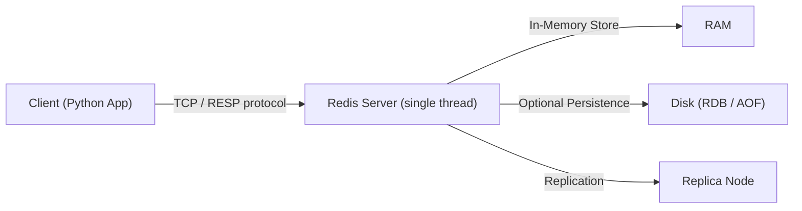
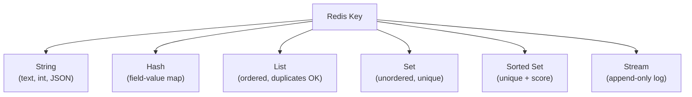
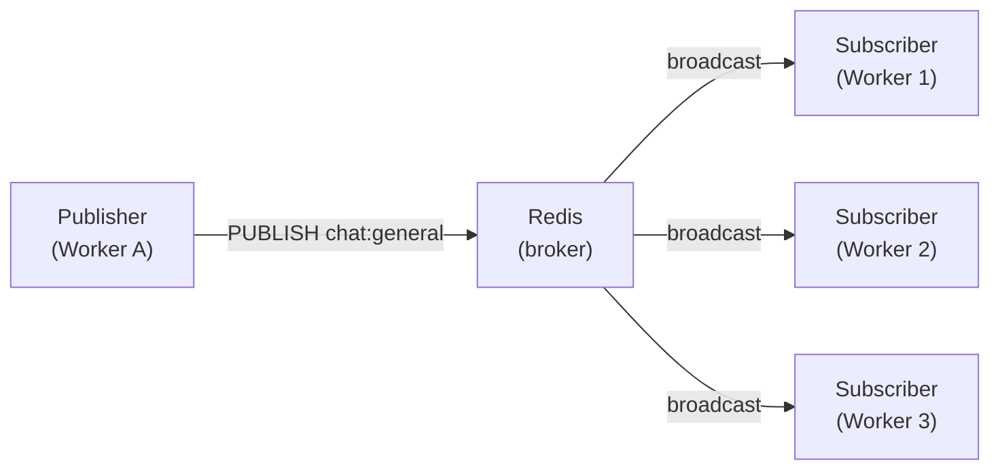
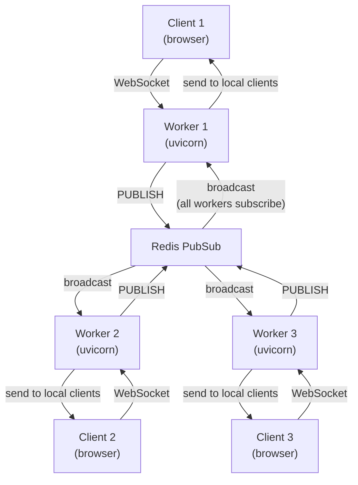

# **Redis — Complete Notes**

**Version:** Redis 7.x / 8.x | redis-py 5.x  
**Reference:** https://redis.io/docs | https://redis.readthedocs.io  

---

## **Table of Contents**

1. [What is Redis](#1-what-is-redis)
2. [How Redis Works Internally](#2-how-redis-works-internally)
3. [Where Redis is Used](#3-where-redis-is-used)
4. [Data Structures](#4-data-structures)
5. [Installation and Setup](#5-installation-and-setup)
6. [redis-py — Synchronous Client](#6-redis-py--synchronous-client)
7. [redis.asyncio — Async Client](#7-redisasyncio--async-client)
8. [FastAPI + Async Redis](#8-fastapi--async-redis)
9. [Pub/Sub — Publish Subscribe](#9-pubsub--publish-subscribe)
10. [Pub/Sub with Async Redis + FastAPI WebSockets](#10-pubsub-with-async-redis--fastapi-websockets)
11. [Pipelines and Transactions](#11-pipelines-and-transactions)
12. [Key Expiry and TTL](#12-key-expiry-and-ttl)
13. [Connection Pooling](#13-connection-pooling)
14. [Common Gotchas](#14-common-gotchas)
15. [Quick Reference](#15-quick-reference)

---

## **1. What is Redis**

Redis stands for **Remote Dictionary Server**. It is an open-source, in-memory key-value store that functions simultaneously as a database, cache, and message broker.

The critical distinction from traditional databases: **data lives in RAM**, not on disk. This gives Redis sub-millisecond read/write latency. Persistence to disk is optional and configurable.

```
Traditional DB (PostgreSQL, MySQL)
  Request --> Disk read (ms to seconds)

Redis
  Request --> RAM read (microseconds)
```

Redis is not a replacement for a relational database. It is a complement — used for the hot path (cache, sessions, queues, real-time state) while the primary database stores the source of truth.

---

## **2. How Redis Works Internally**



**Key facts:**

- Single-threaded command execution — no locking needed, all commands are atomic
- Network I/O is multi-threaded (since Redis 6.0)
- Uses RESP (Redis Serialization Protocol) over TCP
- Default port: `6379`
- Default max memory: unlimited (configure with `maxmemory`)

**Persistence modes:**

| Mode | Description | Risk |
|---|---|---|
| None | Data lives only in RAM | All data lost on restart |
| RDB | Point-in-time snapshots to disk | Some data loss on crash |
| AOF | Append-only log of every write | Near-zero data loss |
| RDB + AOF | Both combined | Safest option |

---

## **3. Where Redis is Used**

| Use Case | How Redis Helps |
|---|---|
| Caching | Store DB query results with TTL; serve from RAM on repeat requests |
| Session storage | Store JWT tokens, login sessions — fast lookup by session ID |
| Rate limiting | Increment a counter per IP/user per minute; expire automatically |
| Pub/Sub messaging | Broadcast events across multiple app servers in real time |
| Job queues | Push jobs to a List; workers pop and process |
| Leaderboards | Sorted Sets with scores; rank retrieval in O(log N) |
| Real-time analytics | Atomic INCR counters; HyperLogLog for unique counts |
| Distributed locks | SETNX + TTL pattern to lock a shared resource across workers |
| WebSocket fanout | Publish from one worker, all other workers receive and push to their local clients |

---

## **4. Data Structures**

Redis is not just key-value strings. Each key maps to one of these types:

### **4.1 String**

Binary-safe value. Can store text, numbers, serialized JSON, or raw bytes. Max size 512 MB.

```
Key: "user:1001:name"   Value: "Akshay"
Key: "page:views"       Value: "48293"   (used as counter)
```

**Commands:**

```bash
SET user:1001:name "Akshay"
GET user:1001:name          # "Akshay"
INCR page:views             # atomically increments integer value
INCRBY page:views 10
SETEX session:abc123 3600 "user_data_json"   # set with TTL in seconds
```

### **4.2 Hash**

A map of field-value pairs under one key. Think of it as a row in a table, or a Python dict.

```
Key: "user:1001"
  Fields:
    name  -> "Akshay"
    email -> "akshay@example.com"
    role  -> "engineer"
```

**Commands:**

```bash
HSET user:1001 name "Akshay" email "akshay@example.com" role "engineer"
HGET user:1001 name           # "Akshay"
HGETALL user:1001             # all fields and values
HMGET user:1001 name email    # multiple fields at once
HDEL user:1001 role           # delete one field
```

### **4.3 List**

Ordered sequence of strings. Implemented as a doubly-linked list. Supports push/pop from both ends. Used for queues (FIFO) and stacks (LIFO).

```
Key: "chat:messages"
  [0] "Hello"
  [1] "How are you"
  [2] "Good morning"
```

**Commands:**

```bash
RPUSH chat:messages "Hello"           # push to right (tail)
LPUSH chat:messages "First"           # push to left (head)
LRANGE chat:messages 0 -1            # get all elements
LPOP chat:messages                    # pop from left
RPOP chat:messages                    # pop from right
LLEN chat:messages                    # length
```

**Common pattern — task queue:**

```bash
# Producer
RPUSH jobs:queue '{"task": "send_email", "to": "user@example.com"}'

# Worker
BLPOP jobs:queue 0    # blocking pop — waits until item available
```

### **4.4 Set**

Unordered collection of unique strings. No duplicates. Fast membership checks, unions, intersections.

```bash
SADD tags:post:1 "python" "redis" "fastapi"
SMEMBERS tags:post:1        # {"python", "redis", "fastapi"}
SISMEMBER tags:post:1 "redis"   # 1 (true)
SCARD tags:post:1           # 3 (count)
SINTER tags:post:1 tags:post:2   # intersection of two sets
SUNION tags:post:1 tags:post:2   # union
```

### **4.5 Sorted Set (ZSet)**

Like a Set but each member has a floating-point **score**. Members are always ordered by score. Used for leaderboards, priority queues, range queries by score.

```bash
ZADD leaderboard 1500 "akshay"
ZADD leaderboard 2300 "karan"
ZADD leaderboard 1800 "tanvi"

ZRANGE leaderboard 0 -1 WITHSCORES     # lowest to highest
ZREVRANGE leaderboard 0 2 WITHSCORES   # top 3 (highest to lowest)
ZRANK leaderboard "akshay"             # rank position (0-indexed)
ZSCORE leaderboard "karan"             # 2300.0
```

### **4.6 Data Structure Summary**



| Type | Python Equivalent | Best For |
|---|---|---|
| String | `str` / `int` | Cache, counters, sessions |
| Hash | `dict` | Object storage (user profiles) |
| List | `list` | Queues, stacks, timelines |
| Set | `set` | Tags, unique tracking |
| Sorted Set | `dict` with sorting | Leaderboards, rankings |
| Stream | event log | Durable event queues |

---

## **5. Installation and Setup**

### **Install Redis on WSL / Ubuntu**

```bash
sudo apt update
sudo apt install redis-server -y
sudo service redis-server start

# Verify
redis-cli ping    # PONG
```

### **Install redis-py**

```bash
pip install redis
```

`redis` package ships both sync and async clients. No separate package needed for async.

### **Verify connection**

```bash
redis-cli ping              # PONG
redis-cli info server       # server details
redis-cli config get timeout
redis-cli config get maxmemory
```

---

## **6. redis-py — Synchronous Client**

Use this in regular Python scripts, Django, Flask (non-async). Not suitable inside FastAPI route handlers — use async version there.

### **6.1 Connect**

```python
import redis

r = redis.Redis(
    host="localhost",
    port=6379,
    db=0,                    # database index (0-15)
    decode_responses=True,   # return str instead of bytes
)

r.ping()   # True
```

### **6.2 Strings**

```python
# ── Basic set/get ────────────────────────────────────────────────────────────
r.set("name", "Akshay")
print(r.get("name"))          # "Akshay"

# ── Set with expiry ──────────────────────────────────────────────────────────
r.setex("session:abc", 3600, "user_data")   # expires in 3600s
r.set("key", "value", ex=60)               # same, shorter form

# ── Counters ─────────────────────────────────────────────────────────────────
r.set("visits", 0)
r.incr("visits")         # 1
r.incrby("visits", 5)    # 6
r.decr("visits")         # 5
```

### **6.3 Hashes**

```python
# ── Store object ─────────────────────────────────────────────────────────────
r.hset("user:1001", mapping={
    "name": "Akshay",
    "email": "akshay@example.com",
    "role": "ai-engineer"
})

r.hget("user:1001", "name")        # "Akshay"
r.hgetall("user:1001")             # {"name": "Akshay", "email": ..., "role": ...}
r.hmget("user:1001", "name", "role")   # ["Akshay", "ai-engineer"]
r.hincrby("user:1001", "login_count", 1)
r.hdel("user:1001", "role")
r.hexists("user:1001", "email")    # True
```

### **6.4 Lists**

```python
# ── Queue (FIFO) ──────────────────────────────────────────────────────────────
r.rpush("queue", "job1", "job2", "job3")   # push to tail
r.lpop("queue")                             # pop from head -> "job1"

# ── Stack (LIFO) ─────────────────────────────────────────────────────────────
r.rpush("stack", "a", "b", "c")
r.rpop("stack")    # "c"

# ── Inspect ───────────────────────────────────────────────────────────────────
r.lrange("queue", 0, -1)    # all items
r.llen("queue")              # count

# ── Blocking pop (worker pattern) ────────────────────────────────────────────
result = r.blpop("queue", timeout=5)   # blocks up to 5s waiting for an item
# result -> ("queue", "job2") or None on timeout
```

### **6.5 Sets**

```python
r.sadd("online_users", "karan", "tanvi", "akshay")
r.sismember("online_users", "karan")     # True
r.smembers("online_users")               # {"karan", "tanvi", "akshay"}
r.scard("online_users")                  # 3
r.srem("online_users", "karan")          # remove member

# ── Set operations ────────────────────────────────────────────────────────────
r.sadd("group:a", "x", "y", "z")
r.sadd("group:b", "y", "z", "w")
r.sinter("group:a", "group:b")     # {"y", "z"}
r.sunion("group:a", "group:b")     # {"x", "y", "z", "w"}
r.sdiff("group:a", "group:b")      # {"x"}
```

### **6.6 Sorted Sets**

```python
r.zadd("leaderboard", {"akshay": 1500, "karan": 2300, "tanvi": 1800})

r.zrevrange("leaderboard", 0, 2, withscores=True)
# [("karan", 2300.0), ("tanvi", 1800.0), ("akshay", 1500.0)]

r.zrank("leaderboard", "akshay")     # 0 (lowest score = rank 0 in ascending)
r.zrevrank("leaderboard", "akshay")  # 2 (rank from top)
r.zincrby("leaderboard", 200, "akshay")   # add 200 to akshay's score
```

### **6.7 Key Operations**

```python
r.exists("name")            # 1 if exists, 0 if not
r.delete("name")            # delete key
r.expire("session:abc", 60) # set/reset TTL in seconds
r.ttl("session:abc")        # remaining TTL (-1 = no expiry, -2 = key gone)
r.persist("session:abc")    # remove expiry, make permanent
r.keys("user:*")            # match pattern — avoid in production on large DBs
r.scan_iter("user:*")       # safe alternative to KEYS — iterates with cursor
r.type("leaderboard")       # "zset"
r.rename("old_key", "new_key")
r.flushdb()                 # delete all keys in current DB — dangerous
```

---

## **7. redis.asyncio — Async Client**

Same API as sync client but all commands are coroutines. Required inside FastAPI, aiohttp, or any asyncio application.

```python
import redis.asyncio as aioredis

async def main():
    r = aioredis.Redis(
        host="localhost",
        port=6379,
        decode_responses=True,
    )

    await r.set("name", "Akshay")
    value = await r.get("name")
    print(value)   # "Akshay"

    await r.aclose()   # always close explicitly in async context
```

### **7.1 from_url shorthand**

```python
r = aioredis.from_url(
    "redis://localhost:6379/0",
    decode_responses=True,
    socket_timeout=None,         # None = no timeout on blocking reads
    socket_connect_timeout=5,    # fail fast on initial connect
    socket_keepalive=True,       # keep TCP alive
    health_check_interval=30,    # auto-PING every 30s of idle time
)
```

### **7.2 All string/hash/list/set operations**

Exact same methods as sync, just add `await`:

```python
await r.set("key", "value")
await r.get("key")
await r.hset("user:1", mapping={"name": "Akshay"})
await r.hgetall("user:1")
await r.rpush("queue", "job1")
await r.lpop("queue")
await r.zadd("scores", {"akshay": 100})
```

---

## **8. FastAPI + Async Redis**

### **8.1 Basic pattern using lifespan**

```python
import redis.asyncio as aioredis
from contextlib import asynccontextmanager
from fastapi import FastAPI, Depends
from typing import AsyncGenerator

redis_client: aioredis.Redis | None = None


@asynccontextmanager
async def lifespan(app: FastAPI):
    global redis_client
    redis_client = aioredis.from_url(
        "redis://localhost:6379/0",
        decode_responses=True,
        socket_timeout=None,
        socket_connect_timeout=5,
        socket_keepalive=True,
        health_check_interval=30,
    )
    await redis_client.ping()
    print("[OK] Redis connected")
    yield
    await redis_client.aclose()


app = FastAPI(lifespan=lifespan)
```

### **8.2 Dependency injection pattern**

```python
from fastapi import Depends
from typing import AsyncGenerator

async def get_redis() -> AsyncGenerator[aioredis.Redis, None]:
    """Yields a Redis client from the global connection pool."""
    yield redis_client


@app.get("/cache/{key}")
async def read_cache(key: str, r: aioredis.Redis = Depends(get_redis)):
    value = await r.get(key)
    return {"key": key, "value": value}


@app.post("/cache/{key}")
async def write_cache(key: str, value: str, r: aioredis.Redis = Depends(get_redis)):
    await r.setex(key, 300, value)   # expires in 5 minutes
    return {"status": "ok"}
```

### **8.3 Caching a DB call**

```python
import json

@app.get("/user/{user_id}")
async def get_user(user_id: int, r: aioredis.Redis = Depends(get_redis)):
    cache_key = f"user:{user_id}"

    # ── Try cache first ───────────────────────────────────────────────────────
    cached = await r.get(cache_key)
    if cached:
        return json.loads(cached)

    # ── Cache miss: fetch from DB ─────────────────────────────────────────────
    user = await db.fetch_user(user_id)   # your actual DB call

    # ── Store in cache with 10 minute TTL ────────────────────────────────────
    await r.setex(cache_key, 600, json.dumps(user))
    return user
```

### **8.4 Rate limiting**

```python
from fastapi import HTTPException, Request

@app.get("/api/data")
async def rate_limited_endpoint(
    request: Request,
    r: aioredis.Redis = Depends(get_redis)
):
    client_ip = request.client.host
    rate_key = f"rate:{client_ip}"

    count = await r.incr(rate_key)
    if count == 1:
        await r.expire(rate_key, 60)   # first request: set 60s window

    if count > 100:
        raise HTTPException(status_code=429, detail="Rate limit exceeded")

    return {"data": "response"}
```

---

## **9. Pub/Sub — Publish Subscribe**

### **9.1 What it is**

Pub/Sub is a messaging pattern where:

- **Publishers** send messages to a named **channel**
- **Subscribers** listen on channels and receive messages in real time
- Publishers and subscribers have no direct knowledge of each other
- Messages are **fire-and-forget** — not persisted, not replayed



Every subscriber gets a copy of every message. There is no round-robin. This is **fan-out**, not load balancing.

### **9.2 Core commands**

```bash
# Publisher
PUBLISH channel:name "message payload"

# Subscriber
SUBSCRIBE channel:name
UNSUBSCRIBE channel:name

# Pattern subscription (glob wildcards)
PSUBSCRIBE chat:*       # matches chat:general, chat:room1, etc.
PUNSUBSCRIBE chat:*

# Inspect
PUBSUB CHANNELS         # list all active channels
PUBSUB NUMSUB channel:name   # subscriber count for a channel
```

### **9.3 Synchronous pub/sub (redis-py)**

**Publisher:**

```python
import redis
import json

r = redis.Redis(host="localhost", port=6379, decode_responses=True)

def publish_message(channel: str, data: dict):
    payload = json.dumps(data)
    subscribers_reached = r.publish(channel, payload)
    print(f"Message sent to {subscribers_reached} subscribers")

publish_message("chat:general", {"user": "akshay", "text": "Hello"})
```

**Subscriber (blocking loop):**

```python
import redis
import json

r = redis.Redis(host="localhost", port=6379, decode_responses=True)
pubsub = r.pubsub()
pubsub.subscribe("chat:general")

for message in pubsub.listen():
    if message["type"] != "message":
        continue   # skip subscribe/unsubscribe confirmation frames
    data = json.loads(message["data"])
    print(f"[{data['user']}]: {data['text']}")
```

**Message object structure:**

```python
{
    "type": "message",       # "message", "subscribe", "unsubscribe", "pmessage"
    "pattern": None,         # set only for psubscribe
    "channel": "chat:general",
    "data": "{'user': 'akshay', 'text': 'Hello'}"  # always a string
}
```

### **9.4 Pattern subscription**

```python
pubsub = r.pubsub()
pubsub.psubscribe("chat:*")       # subscribe to all channels starting with chat:

for message in pubsub.listen():
    if message["type"] != "pmessage":
        continue
    print(f"Channel: {message['channel']}, Data: {message['data']}")
```

### **9.5 Pub/Sub limitations**

| Limitation | Workaround |
|---|---|
| No message persistence | Use Redis Streams (XADD/XREAD) for durable delivery |
| No delivery guarantee | If subscriber is offline, message is lost |
| No acknowledgement | Use Streams with consumer groups for at-least-once delivery |
| Fire-and-forget | Acceptable for real-time UI updates; not for billing/orders |

---

## **10. Pub/Sub with Async Redis + FastAPI WebSockets**

This is the production pattern for multi-worker FastAPI WebSocket chat or notification systems.

### **10.1 Architecture**



**Why this is needed:** With multiple uvicorn workers, each worker has its own memory. A WebSocket connection on Worker 1 cannot directly push to a client connected to Worker 3. Redis pub/sub acts as the shared message bus — any worker that publishes is received by all workers, each of which then pushes to its locally connected clients.

### **10.2 Full working implementation**

```python
import asyncio
import json
from contextlib import asynccontextmanager

import redis.asyncio as aioredis
from fastapi import FastAPI, WebSocket
from fastapi.websockets import WebSocketDisconnect

REDIS_URL = "redis://localhost:6379"
CHANNEL = "chat:general"

redis_client: aioredis.Redis | None = None


@asynccontextmanager
async def lifespan(app: FastAPI):
    global redis_client
    try:
        redis_client = aioredis.from_url(
            REDIS_URL,
            decode_responses=True,
            socket_timeout=None,        # no timeout on blocking pubsub reads
            socket_connect_timeout=5,
            socket_keepalive=True,
            health_check_interval=30,
        )
        await redis_client.ping()
        print("[OK] Redis connected")
        asyncio.create_task(manager.listener())
        print("[OK] Listener task started")
    except Exception as e:
        print(f"[ERR] Redis failed: {e}")
    yield
    if redis_client:
        await redis_client.aclose()


app = FastAPI(lifespan=lifespan)


class PubSubManager:
    def __init__(self):
        # Tracks WebSocket connections local to THIS worker
        self.local_connections: dict[str, WebSocket] = {}

    async def connect(self, username: str, websocket: WebSocket):
        await websocket.accept()
        self.local_connections[username] = websocket

    def disconnect(self, username: str):
        self.local_connections.pop(username, None)

    async def publish(self, message: dict):
        """Publish to Redis — all workers receive this via their listener."""
        if not redis_client:
            return
        await redis_client.publish(CHANNEL, json.dumps(message))

    async def listener(self):
        """
        Background task: subscribes to Redis channel and fans out
        messages to locally connected WebSocket clients.

        Uses get_message(timeout=1.0) not listen() to avoid blocking
        the asyncio event loop on idle connections.
        """
        retry_delay = 2
        while True:
            pubsub = None
            try:
                pubsub = redis_client.pubsub()
                await pubsub.subscribe(CHANNEL)
                print("[OK] Subscribed to Redis channel")

                while True:
                    # ── Poll every 1s — yields to event loop if no message ───
                    message = await pubsub.get_message(
                        ignore_subscribe_messages=True,
                        timeout=1.0,
                    )
                    if message is None:
                        await asyncio.sleep(0)   # yield to other coroutines
                        continue

                    data = json.loads(message["data"])

                    # ── Send to all clients connected to THIS worker ─────────
                    disconnected = []
                    for username, ws in list(self.local_connections.items()):
                        try:
                            await ws.send_text(json.dumps(data))
                        except Exception:
                            disconnected.append(username)
                    for u in disconnected:
                        self.disconnect(u)

            except asyncio.CancelledError:
                break
            except Exception as e:
                print(f"[ERR] Listener error (reconnecting in {retry_delay}s): {e}")
            finally:
                if pubsub:
                    try:
                        await pubsub.unsubscribe(CHANNEL)
                        await pubsub.aclose()
                    except Exception:
                        pass
            await asyncio.sleep(retry_delay)


manager = PubSubManager()


@app.websocket("/ws/{username}")
async def websocket_endpoint(websocket: WebSocket, username: str):
    await manager.connect(username, websocket)
    await manager.publish({"type": "system", "text": f"{username} joined"})
    try:
        while True:
            data = await websocket.receive_text()
            await manager.publish({"type": "chat", "user": username, "text": data})
    except WebSocketDisconnect:
        manager.disconnect(username)
        await manager.publish({"type": "system", "text": f"{username} left"})
```

### **10.3 Key design decisions explained**

| Decision | Reason |
|---|---|
| `socket_timeout=None` | Default is 5s. PubSub read blocks on idle channel, causing TimeoutError every 5s and a reconnect loop |
| `get_message(timeout=1.0)` not `listen()` | `listen()` is a blocking generator; `get_message` polls and yields to event loop every 1s |
| `health_check_interval=30` | Auto-sends PING every 30s so idle connections are not dropped by Redis or NAT |
| `socket_keepalive=True` | OS-level TCP keepalive — prevents WSL NAT from silently dropping idle TCP connections |
| One `asyncio.create_task` per worker | Each uvicorn worker is a separate process with its own event loop; each needs its own listener |
| `pubsub.aclose()` in finally | Releases the connection back to the pool cleanly on error or shutdown |

### **10.4 Run with multiple workers**

```bash
uvicorn myapp:app --workers 4 --host 0.0.0.0 --port 8000
```

Each of the 4 workers will:
1. Connect to Redis
2. Start its own listener task subscribed to `chat:general`
3. Maintain its own dict of local WebSocket connections

When any user sends a message:
- Their worker publishes to Redis
- All 4 workers receive it via their subscriptions
- Each worker sends to its locally connected clients

---

## **11. Pipelines and Transactions**

### **11.1 Pipelines (batch commands)**

A pipeline batches multiple commands into a single network round trip instead of sending each command individually.

```python
# Without pipeline: 3 round trips
await r.set("a", 1)
await r.set("b", 2)
await r.set("c", 3)

# With pipeline: 1 round trip
async with r.pipeline(transaction=False) as pipe:
    pipe.set("a", 1)
    pipe.set("b", 2)
    pipe.set("c", 3)
    results = await pipe.execute()
    # results -> [True, True, True]
```

Use `transaction=False` for pure batching (no atomicity). Use `transaction=True` (default) to wrap in MULTI/EXEC.

### **11.2 Transactions (MULTI/EXEC)**

All commands inside execute atomically — no other client can interleave commands between them.

```python
async with r.pipeline(transaction=True) as pipe:
    pipe.incr("account:1001:balance", -500)   # debit
    pipe.incr("account:1002:balance", 500)    # credit
    await pipe.execute()    # both happen atomically or neither does
```

### **11.3 Optimistic locking with WATCH**

```python
async with r.pipeline() as pipe:
    while True:
        try:
            await pipe.watch("inventory:item:42")
            current = int(await pipe.get("inventory:item:42") or 0)

            if current <= 0:
                raise ValueError("Out of stock")

            pipe.multi()
            pipe.decrby("inventory:item:42", 1)
            await pipe.execute()   # fails with WatchError if key changed
            break

        except aioredis.WatchError:
            continue   # retry if someone else modified the key
```

---

## **12. Key Expiry and TTL**

Every Redis key can have an optional TTL (time to live). When TTL reaches zero, Redis deletes the key automatically.

```python
# ── Set with TTL at creation ──────────────────────────────────────────────────
await r.set("token:xyz", "user_data", ex=3600)     # 3600 seconds
await r.set("token:xyz", "user_data", px=3600000)  # milliseconds
await r.setex("token:xyz", 3600, "user_data")      # explicit setex

# ── Set TTL on existing key ───────────────────────────────────────────────────
await r.expire("token:xyz", 3600)        # seconds
await r.pexpire("token:xyz", 3600000)    # milliseconds
await r.expireat("token:xyz", unix_ts)   # expire at absolute Unix timestamp

# ── Inspect TTL ───────────────────────────────────────────────────────────────
await r.ttl("token:xyz")     # seconds remaining; -1 = no expiry; -2 = key gone
await r.pttl("token:xyz")    # milliseconds remaining

# ── Remove expiry ─────────────────────────────────────────────────────────────
await r.persist("token:xyz")   # make key permanent
```

**Common TTL values:**

| Use Case | TTL |
|---|---|
| Session token | 3600 (1 hour) or 86400 (1 day) |
| Cache (API response) | 60 to 600 seconds |
| Rate limit window | 60 seconds |
| OTP / verification code | 300 seconds (5 minutes) |
| Feature flags | 86400 (1 day) |

---

## **13. Connection Pooling**

By default, `redis.Redis()` and `aioredis.from_url()` create an internal connection pool automatically. For multi-worker or high-concurrency apps, configure the pool explicitly.

```python
import redis.asyncio as aioredis

pool = aioredis.ConnectionPool.from_url(
    "redis://localhost:6379/0",
    max_connections=50,       # max concurrent connections
    decode_responses=True,
    socket_timeout=None,
    socket_connect_timeout=5,
    socket_keepalive=True,
    health_check_interval=30,
)

# Create clients from the pool
r = aioredis.Redis(connection_pool=pool)

# In FastAPI lifespan:
@asynccontextmanager
async def lifespan(app: FastAPI):
    app.state.redis_pool = aioredis.ConnectionPool.from_url(
        "redis://localhost:6379/0",
        max_connections=50,
        decode_responses=True,
    )
    yield
    await app.state.redis_pool.aclose()
```

**Pool sizing rule of thumb:**

- Each uvicorn worker is a separate process
- Each worker uses up to `max_connections` connections
- Total Redis connections = workers x max_connections
- Keep total below Redis `maxclients` (default 10000)

---

## **14. Common Gotchas**

### **decode_responses=False (default)**

By default redis-py returns `bytes`. Always pass `decode_responses=True` unless you need binary data.

```python
r = redis.Redis(host="localhost")
r.set("name", "Akshay")
r.get("name")   # b"Akshay"  <-- bytes!

r = redis.Redis(host="localhost", decode_responses=True)
r.get("name")   # "Akshay"  <-- str
```

### **socket_timeout causes pubsub reconnect loops**

Default `socket_timeout=5`. PubSub `listen()` blocks waiting for messages. On idle channel, times out every 5s and throws `TimeoutError`. Fix: `socket_timeout=None` + use `get_message(timeout=1.0)`.

### **listen() vs get_message() in asyncio**

`listen()` is a blocking async generator. Under asyncio it can starve the event loop on idle channels. Prefer `get_message(timeout=1.0)` which yields control every second.

### **Pub/Sub messages are not persisted**

If a subscriber is offline when a message is published, the message is lost. Use Redis Streams (`XADD`/`XREADGROUP`) if you need durability.

### **KEYS command blocks Redis**

`r.keys("user:*")` runs a full scan of all keys — dangerous on large databases; blocks Redis for all other clients. Use `r.scan_iter("user:*")` which paginates with a cursor.

```python
# Dangerous
for key in r.keys("user:*"):
    ...

# Safe
async for key in r.scan_iter("user:*"):
    ...
```

### **Windows PowerShell: UnicodeEncodeError on emoji**

Windows cp1252 encoding cannot render Unicode emoji in `print()`. Either replace emoji with ASCII tags (`[OK]`, `[ERR]`) or add at the top of the file:

```python
import sys
sys.stdout.reconfigure(encoding="utf-8")
```

### **WSL: Redis not running after reboot**

WSL does not persist services. Run on every session:

```bash
sudo service redis-server start
redis-cli ping   # verify PONG
```

---

## **15. Quick Reference**

### **redis-py method map**

| Operation | Sync | Async |
|---|---|---|
| Connect | `redis.Redis(...)` | `aioredis.from_url(...)` |
| Ping | `r.ping()` | `await r.ping()` |
| String set | `r.set(k, v)` | `await r.set(k, v)` |
| String get | `r.get(k)` | `await r.get(k)` |
| Set with TTL | `r.setex(k, ttl, v)` | `await r.setex(k, ttl, v)` |
| Hash set | `r.hset(k, mapping={...})` | `await r.hset(k, mapping={...})` |
| Hash get all | `r.hgetall(k)` | `await r.hgetall(k)` |
| List push | `r.rpush(k, v)` | `await r.rpush(k, v)` |
| List pop | `r.lpop(k)` | `await r.lpop(k)` |
| Set add | `r.sadd(k, v)` | `await r.sadd(k, v)` |
| ZSet add | `r.zadd(k, {m: score})` | `await r.zadd(k, {m: score})` |
| Publish | `r.publish(ch, msg)` | `await r.publish(ch, msg)` |
| Subscribe | `pubsub.subscribe(ch)` | `await pubsub.subscribe(ch)` |
| Poll message | `pubsub.get_message()` | `await pubsub.get_message(timeout=1.0)` |
| Delete key | `r.delete(k)` | `await r.delete(k)` |
| TTL check | `r.ttl(k)` | `await r.ttl(k)` |
| Close | `r.close()` | `await r.aclose()` |

### **Key naming conventions**

```
object:id:field       user:1001:name
object:id             user:1001  (for hashes)
namespace:entity      session:abc123
prefix:action:target  rate:login:192.168.1.1
```

### **Connection params cheatsheet**

```python
aioredis.from_url(
    "redis://localhost:6379/0",
    decode_responses=True,      # return str not bytes
    socket_timeout=None,        # None for pubsub; 5.0 for regular commands
    socket_connect_timeout=5,   # fail fast on initial connect
    socket_keepalive=True,      # TCP keepalive probes
    health_check_interval=30,   # PING on idle connections every 30s
    max_connections=50,         # pool size (for ConnectionPool)
)
```

### **Official references**

| Resource | URL |
|---|---|
| Redis commands reference | https://redis.io/commands |
| Redis pub/sub docs | https://redis.io/docs/latest/develop/pubsub/ |
| redis-py documentation | https://redis.readthedocs.io |
| redis-py asyncio examples | https://redis.readthedocs.io/en/stable/examples/asyncio_examples.html |
| redis-py production guide | https://redis.io/docs/latest/develop/clients/redis-py/produsage/ |