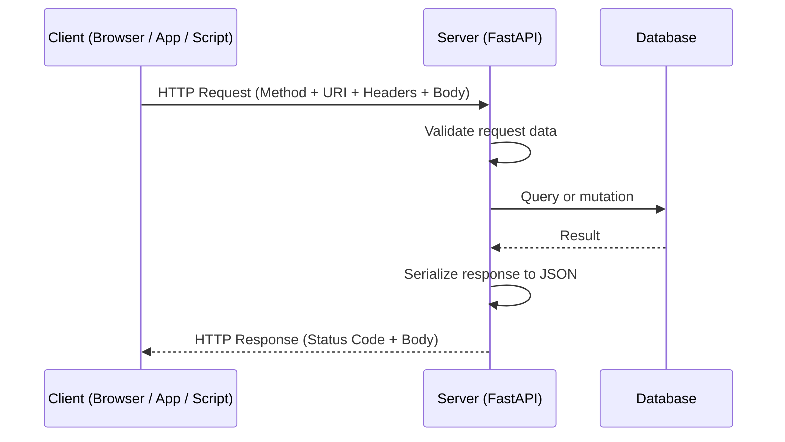
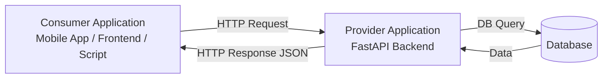

# 01 - REST Fundamentals

---

## What is an API?

API stands for Application Programming Interface. The core purpose of an API is to allow two separate applications to communicate with each other, exchange data, and integrate functionality without needing to know each other's internal implementation.

A user here is not necessarily a human. It can be:

- A mobile application
- A desktop client
- Another backend service
- A browser running JavaScript

When the communication happens over the web using HTTP, the API is called a **Web API** or **Web Service**.

---

## REST: Representational State Transfer

REST is an **architectural style**, not a protocol. It was defined by Roy Fielding in his 2000 doctoral dissertation. REST defines a set of constraints and principles for building web services that are scalable, stateless, and interoperable.

A Web API that follows REST principles is called a **RESTful API**.

The key distinction:

| Term | What it is |
|------|-----------|
| REST | An architecture / set of constraints |
| RESTful API | An API that implements those constraints |
| Web API / Web Service | Any API accessible over HTTP |

---

## REST Constraints (The 6 Rules)

These are the formal architectural constraints that make an API truly RESTful:

```
1. Client-Server separation
   - Client handles the UI/UX
   - Server handles data storage and logic
   - They evolve independently

2. Statelessness
   - Every request from client must contain all the information needed
   - Server does not store client session state between requests
   - Authentication tokens must be sent with every request

3. Cacheability
   - Responses must define themselves as cacheable or non-cacheable
   - Caching reduces server load and improves performance

4. Uniform Interface
   - Resources are identified by URIs
   - Resources are manipulated through representations (JSON/XML)
   - Self-descriptive messages
   - HATEOAS (Hypermedia as the Engine of Application State)

5. Layered System
   - Client cannot tell if it is connected to the end server or a middleware
   - Allows load balancers, caches, gateways to sit between client and server

6. Code on Demand (optional)
   - Servers can send executable code to clients (e.g., JavaScript)
```

In practice, most APIs focus on constraints 1-4. Constraint 6 is rarely used in pure API contexts.

---

## Resources and URIs

In REST, everything is a **resource**. A resource is any data entity you want to expose:

- A single employee record
- A list of all products
- An order

Each resource is identified by a **URI** (Uniform Resource Identifier):

```
/employees          - collection of all employees
/employees/42       - a specific employee with id 42
/employees/42/orders - all orders belonging to employee 42
```

The resource URI identifies **what** you are acting on. The HTTP method tells the server **what to do** with it.

---

## HTTP Verbs and CRUD Mapping

HTTP verbs define the operation type. This maps directly to database CRUD operations:

| HTTP Verb | CRUD | Description | Idempotent |
|-----------|------|-------------|------------|
| GET | READ | Retrieve one or many resources | Yes |
| POST | CREATE | Create a new resource | No |
| PUT | UPDATE | Replace an entire resource | Yes |
| PATCH | UPDATE | Partially update a resource | Yes |
| DELETE | DELETE | Remove a resource | Yes |

**Idempotent** means: making the same request multiple times produces the same result as making it once. GET, PUT, DELETE are idempotent. POST is not.

**PUT vs PATCH:**

```
PUT   /employees/42  { "name": "Raj", "salary": 50000, "city": "Pune" }
      --> replaces the entire employee record. If you omit a field, it gets wiped.

PATCH /employees/42  { "salary": 60000 }
      --> only updates the salary. All other fields remain unchanged.
```

---

## HTTP Status Codes

Status codes are standardized numbers in the HTTP response that tell the client what happened.

```
1xx - Informational    (processing, not yet done)
2xx - Success          (request was received and handled correctly)
3xx - Redirection      (client should go elsewhere)
4xx - Client Error     (client sent something wrong)
5xx - Server Error     (server failed to handle a valid request)
```

The ones you will actually use in API development:

| Code | Name | When to use |
|------|------|-------------|
| 200 | OK | Standard success response for GET, PUT, PATCH |
| 201 | Created | Resource was created successfully (POST) |
| 204 | No Content | Success but no body to return (DELETE) |
| 400 | Bad Request | Client sent malformed or invalid data |
| 401 | Unauthorized | Authentication credentials missing or invalid |
| 403 | Forbidden | Authenticated but not permitted |
| 404 | Not Found | Resource does not exist |
| 422 | Unprocessable Entity | Validation error (FastAPI uses this by default) |
| 500 | Internal Server Error | Server-side failure |

---

## Message Format: JSON

The standard message format for modern REST APIs is **JSON** (JavaScript Object Notation). JSON replaced XML as the dominant format because:

- Human-readable
- Machine-friendly
- Lightweight (less bandwidth than XML)
- Native support in JavaScript (browser-friendly)
- First-class support in Python via the `json` module and Pydantic

A JSON object looks like a Python dictionary:

```json
{
  "eno": 100,
  "ename": "Akshay",
  "esal": 75000,
  "eaddr": "Pune"
}
```

JSON supports these data types:

```
string     "hello"
number     42, 3.14
boolean    true, false
null       null
array      [1, 2, 3]
object     { "key": "value" }
```

---

## Request-Response Cycle

The complete flow of a REST API call:



Every HTTP request has:

- **Method**: GET, POST, PUT, PATCH, DELETE
- **URI**: `/employees/42`
- **Headers**: `Content-Type: application/json`, `Authorization: Bearer <token>`
- **Body**: JSON payload (not used in GET by convention)

Every HTTP response has:

- **Status Code**: 200, 201, 404, etc.
- **Headers**: `Content-Type: application/json`
- **Body**: JSON data

---

## Common Communication Pattern: Provider and Consumer



- **Web Service Provider**: The application exposing the API (your FastAPI server)
- **Web Service Consumer**: The application consuming the API (frontend, mobile app, another microservice, a Python script using `httpx` or `requests`)

The common language between them: **HTTP**
The common message format: **JSON**

This means the consumer and provider can be written in completely different languages and run on different platforms. A Java client can talk to a Python FastAPI server through a JSON REST API with no compatibility issues.

---

## Why REST Dominates Modern API Development

The original notes compared SOAP and REST. SOAP was dominant in enterprise software in the 2000s. Today:

- SOAP is found almost exclusively in legacy enterprise systems (banking, insurance, government integrations)
- New greenfield projects use REST or GraphQL
- If you encounter SOAP, it will be an integration target, not something you build from scratch

REST won because:

1. JSON is faster to parse than XML
2. REST endpoints are just URLs, no special tooling needed to call them
3. Auto-documentation tools (Swagger/OpenAPI) make REST self-describing
4. REST works natively with browsers and HTTP tooling
5. Statelessness makes REST services easy to scale horizontally

---

## Key Vocabulary Recap

| Term | Definition |
|------|-----------|
| API | Interface allowing applications to communicate |
| Web API | API accessible over HTTP |
| REST | Architectural style defining constraints for web services |
| RESTful API | API that conforms to REST constraints |
| Resource | Any named data entity exposed by the API |
| URI | Unique identifier for a resource |
| HTTP Verb | Method indicating the operation (GET, POST, etc.) |
| Status Code | Number in the response indicating success or failure |
| JSON | Primary data format for REST API messages |
| Serialization | Converting an in-memory object to a transmittable format (e.g., Python dict to JSON) |
| Deserialization | Converting received data back into an in-memory object |

---

Next: [02 - SOAP vs REST Deep Comparison](02_soap_vs_rest.md)