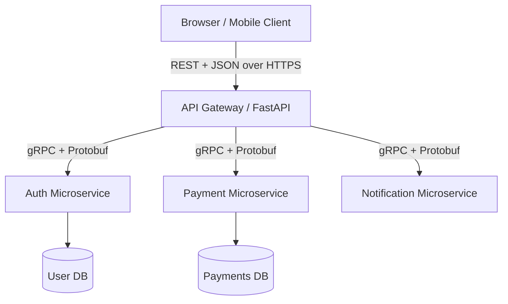
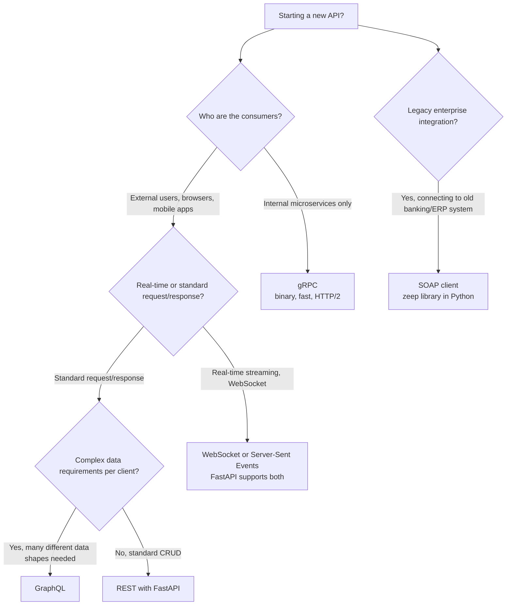
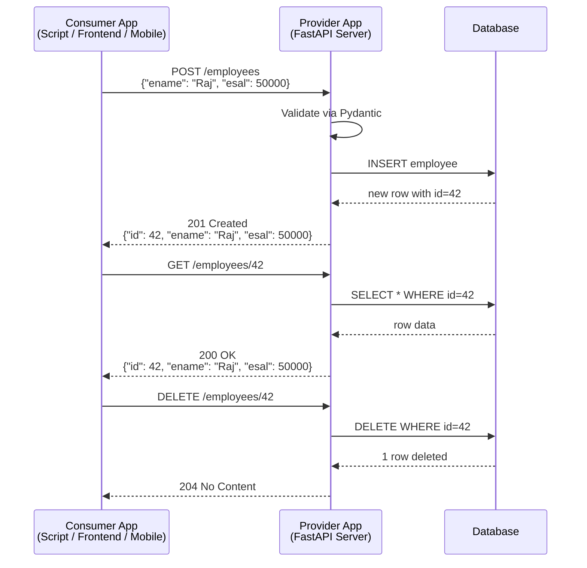

# 02 - SOAP vs REST and Web Service Types

---

## Two Types of Web Services

All web services fall into two broad categories:

1. **SOAP-based Web Services** (older, enterprise-heavy)
2. **RESTful Web Services** (modern standard)

Understanding SOAP matters even if you will never build SOAP services, because you will encounter SOAP endpoints in legacy enterprise integrations (banking, ERP systems, government APIs).

---

## SOAP: Simple Object Access Protocol

SOAP is an **XML-based messaging protocol** for accessing web services. It defines a strict message format and communication rules.

Key properties:

- Every SOAP message is an XML document with a specific envelope structure
- Services are described using **WSDL** (Web Service Description Language)
- Communication happens via **RPC-style method calls**
- Can operate over multiple transport protocols: HTTP, SMTP, FTP, JMS
- Built-in security via WS-Security standard
- Built-in transaction and reliability support via WS-Reliability

A SOAP message looks like this:

```xml
<?xml version="1.0"?>
<soap:Envelope xmlns:soap="http://schemas.xmlsoap.org/soap/envelope/">
  <soap:Header>
    <auth:Token>abc123token</auth:Token>
  </soap:Header>
  <soap:Body>
    <emp:GetEmployee>
      <emp:EmployeeId>42</emp:EmployeeId>
    </emp:GetEmployee>
  </soap:Body>
</soap:Envelope>
```

Compare this with a REST call:

```
GET /employees/42
Authorization: Bearer abc123token
```

The REST call is one line. The SOAP envelope wrapping the same request is 10+ lines of XML.

---

## REST: Representational State Transfer

REST is an **architectural style** that uses HTTP verbs and URIs to operate on resources. There is no special protocol or message wrapper. A resource is just a URL and the operation is the HTTP method.

REST message format is JSON (or XML, though JSON dominates):

```json
{
  "eno": 42,
  "ename": "Akshay",
  "esal": 75000,
  "eaddr": "Pune"
}
```

---

## SOAP vs REST: Detailed Comparison

| Dimension | SOAP | REST |
|-----------|------|------|
| Type | Protocol | Architectural Style |
| Message Format | XML only | JSON (primarily), XML, YAML, others |
| Interface Description | WSDL (verbose, auto-generated) | OpenAPI / Swagger (modern, human-readable) |
| Transport | HTTP, SMTP, FTP, JMS, others | Primarily HTTP |
| Invocation Style | RPC method calls | URI + HTTP verb |
| Response Readability | Not human-readable (XML envelope) | Human-readable (JSON) |
| Weight | Heavy (XML parsing, envelope overhead) | Lightweight |
| Bandwidth | High (XML is verbose) | Low (JSON is compact) |
| Performance | Lower (parsing overhead) | Higher |
| Security | WS-Security built in | Relies on HTTPS + JWT/OAuth2 |
| Caching | Not natively cacheable | GET responses are cacheable |
| State | Can be stateful | Stateless by design |
| Learning Curve | Steep | Moderate |
| Tooling | Heavyweight (WSDL generators, SOAP clients) | Minimal (curl, httpx, browsers work natively) |

---

## Why SOAP Lost Market Share

The original notes noted that Google used SOAP-based web services. That was accurate for 2018-2019. The current picture is different:

- Google's newer APIs (Maps, Gmail, Calendar) are all REST or gRPC
- SOAP services still exist in enterprise backends but are not exposed to external developers
- No major new API platform launches with SOAP in 2024-2025
- Developer tools (Postman, Insomnia, HTTPie, curl) treat REST as the default
- Auto-documentation (Swagger UI, ReDoc) is only available for REST/OpenAPI

SOAP survives in:
- Banking transaction processing systems (SWIFT integrations)
- Insurance policy management platforms
- Government/public sector legacy systems
- SAP integrations
- Older telecom OSS/BSS platforms

---

## GraphQL: The Third Option (2025 Context)

The original notes only covered SOAP and REST. A third paradigm is now relevant enough to mention:

**GraphQL** (released by Facebook/Meta in 2015, open-sourced in 2018):

- Client specifies exactly what data it needs in the query
- Single endpoint (`/graphql`) handles all operations
- No over-fetching (getting more data than needed) or under-fetching (needing multiple calls)
- Strong typing via schema definition language
- Used by GitHub, Shopify, Twitter, Meta

When to use GraphQL:
- Complex frontends with many different data requirements per view
- Mobile apps where bandwidth is constrained
- When multiple consumer types (mobile, web, third-party) need different data shapes from the same backend

FastAPI has GraphQL support via `strawberry-graphql`.

For standard backend APIs, REST remains the dominant choice in 2025.

---

## gRPC: The High-Performance Option

Also worth knowing for completeness:

**gRPC** (Google Remote Procedure Call):

- Uses Protocol Buffers (binary format) instead of JSON
- HTTP/2 based (multiplexing, bidirectional streaming)
- Extremely fast for internal microservice-to-microservice communication
- Not browser-friendly without a proxy layer (grpc-web)
- Requires `.proto` schema files

Typical architecture in 2025:



REST handles external-facing APIs. gRPC handles internal service-to-service calls. You do not need to choose one for your whole system.

---

## API Communication Protocols: Summary Decision Tree



---

## The Web Service Provider and Consumer Model



---

## Sending HTTP Requests from Python (Consumer Side)

The original notes used the `requests` library and `HTTPie`. Current recommendations:

**`httpx`** is the modern replacement for `requests`:
- Supports both sync and async (critical for FastAPI testing and async clients)
- HTTP/2 support
- Connection pooling, timeouts, retries built in

```python
import httpx

BASE_URL = "http://127.0.0.1:8000"

# Sync usage
with httpx.Client() as client:
    response = client.get(f"{BASE_URL}/employees/42")
    print(response.status_code)
    print(response.json())

# Async usage
import asyncio

async def fetch_employee():
    async with httpx.AsyncClient() as client:
        response = await client.get(f"{BASE_URL}/employees/42")
        return response.json()

asyncio.run(fetch_employee())
```

**`requests`** still works and is not deprecated, but `httpx` is preferred for new code especially when working with async FastAPI backends.

**HTTPie** (CLI tool, still excellent for manual testing):

```bash
pip install httpie

# GET request
http GET http://127.0.0.1:8000/employees/42

# POST with JSON body
http POST http://127.0.0.1:8000/employees eno=100 ename="Akshay" esal:=75000 eaddr="Pune"

# PATCH
http PATCH http://127.0.0.1:8000/employees/42 esal:=80000

# DELETE
http DELETE http://127.0.0.1:8000/employees/42
```

**curl** (always available, no install needed):

```bash
# GET
curl http://127.0.0.1:8000/employees/42

# POST
curl -X POST http://127.0.0.1:8000/employees \
     -H "Content-Type: application/json" \
     -d '{"eno": 100, "ename": "Akshay", "esal": 75000, "eaddr": "Pune"}'
```

FastAPI also provides an interactive **Swagger UI** at `/docs` and **ReDoc** at `/redoc` — so for development and testing, you often don't need any external tool at all.

---

Next: [03 - FastAPI Introduction and Setup](03_fastapi_introduction.md)