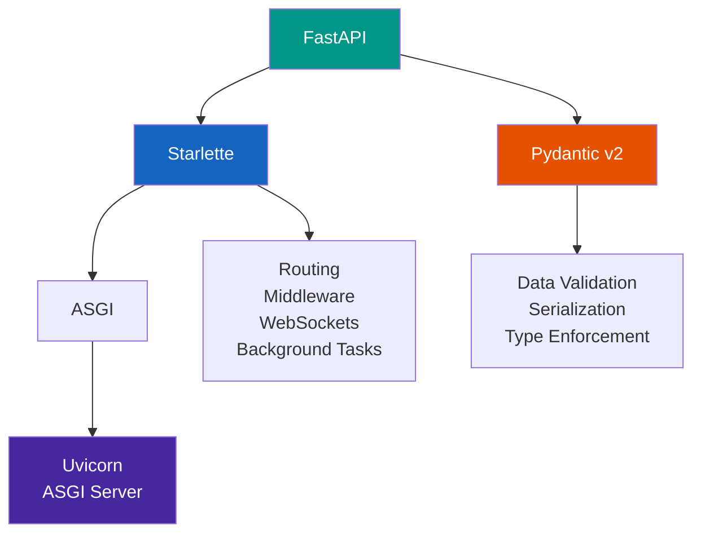
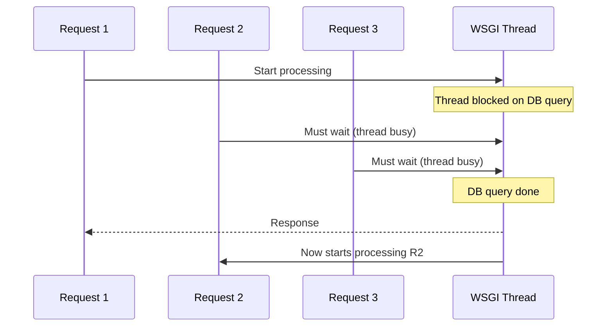
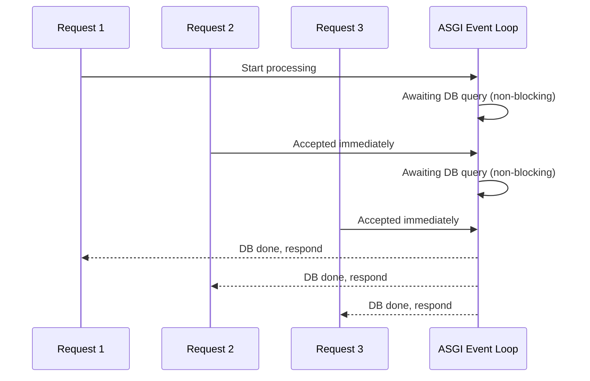
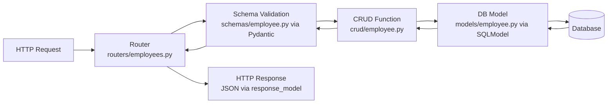

# 03 - FastAPI: Introduction and Setup

---

## Why FastAPI Instead of Django REST Framework

The original notes were written around Django REST Framework (DRF). DRF is built on top of Django, which is a full-stack web framework designed for building complete web applications with templates, admin panels, and ORM included. When you only need an API backend, Django brings a large amount of unused machinery.

FastAPI was released in 2018 and is purpose-built for API development. By 2025, it has become the default choice for new Python API projects.

Concrete comparison:

| Dimension | Django REST Framework | FastAPI |
|-----------|----------------------|---------|
| Architecture | WSGI (synchronous) by default | ASGI (async-native) |
| Validation | Django Forms / DRF Serializers (custom classes) | Pydantic v2 (Python type hints, near-zero boilerplate) |
| Auto Documentation | Not built-in (third-party: drf-spectacular) | Built-in Swagger UI + ReDoc at `/docs` and `/redoc` |
| Performance | Lower (serializer overhead, sync model) | 3-5x higher throughput under concurrency |
| Type Safety | Weak (strings, no type hints enforced) | Strong (full Python type hint integration) |
| Learning Curve | Steep (Django ORM + serializers + viewsets + routers) | Moderate (type hints + Pydantic + route decorators) |
| Boilerplate | High (serializers, viewsets, routers all separate) | Low (route function + Pydantic model) |
| Database | Django ORM (tightly coupled) | Any: SQLAlchemy, SQLModel, Tortoise ORM, MongoDB |
| Testing | Django test client | `httpx.AsyncClient`, pytest-asyncio |
| CSRF | Must handle explicitly | Not applicable for stateless APIs |
| Job Market 2025 | ~145,000 postings | Growing rapidly, 150% increase 2024-2025 |
| PyPI Downloads | ~23M/month | ~9M/month (closing gap) |
| Adoption 2025 | Established | 38% of Python devs (JetBrains survey) |

The original notes spent pages working around Django's CSRF verification, manual JSON validation, and custom mixin classes just to return JSON. In FastAPI, all of that disappears.

---

## What FastAPI Is Built On

FastAPI does not reinvent everything from scratch. It combines three existing, well-maintained libraries:



- **Starlette**: Lightweight ASGI framework handling routing, middleware, WebSockets, background tasks. FastAPI's routing and request/response handling is Starlette.
- **Pydantic v2**: Data validation and serialization using Python type hints. Every incoming request body and every response model is validated by Pydantic.
- **Uvicorn**: The ASGI server that runs your FastAPI application (replaces Django's WSGI/Gunicorn setup).

---

## WSGI vs ASGI: Why It Matters

The original Django REST Framework notes never mentioned this because it was not relevant. FastAPI runs on ASGI and the difference is significant.

**WSGI (Web Server Gateway Interface):**

- Handles one request per thread
- Blocking: while waiting for a database query, the thread is held and cannot serve another request
- Django uses WSGI by default (Django 4.1+ supports ASGI but it is not the primary model)

**ASGI (Asynchronous Server Gateway Interface):**

- Single thread can handle thousands of concurrent requests
- Non-blocking: while waiting for a database query, the thread processes other requests
- FastAPI is ASGI-native





For AI/ML serving, microservices, and high-concurrency APIs, ASGI is not optional. FastAPI is async-first.

---

## Installation and Environment Setup

```bash
# Create virtual environment
python -m venv venv

# Activate
source venv/bin/activate       # Linux/macOS
venv\Scripts\activate          # Windows

# Install FastAPI and the ASGI server
pip install fastapi uvicorn[standard]

# Install for database work
pip install sqlmodel            # ORM (SQLAlchemy + Pydantic combined)
pip install alembic             # Database migrations

# Install for testing
pip install httpx pytest pytest-asyncio

# Optional but useful
pip install python-dotenv       # Environment variable management
```

FastAPI has no project scaffolding command like `django-admin startproject`. You create your own structure.

---

## Minimal FastAPI Application

This is the equivalent of Django's "Hello World" with views.py, urls.py, settings.py. In FastAPI:

```python
# main.py
from fastapi import FastAPI

app = FastAPI()

@app.get("/")
def root():
    return {"message": "API is running"}
```

Run it:

```bash
uvicorn main:app --reload
```

- `main` = the Python file `main.py`
- `app` = the FastAPI instance inside that file
- `--reload` = auto-reload on file changes (development only)

Visit:
- `http://127.0.0.1:8000/` - your API response
- `http://127.0.0.1:8000/docs` - Swagger UI (interactive documentation, auto-generated)
- `http://127.0.0.1:8000/redoc` - ReDoc (alternative documentation view)
- `http://127.0.0.1:8000/openapi.json` - raw OpenAPI schema

The Swagger UI is the replacement for needing HTTPie or curl during development. You can call every endpoint directly from the browser.

---

## FastAPI vs DRF: Same Endpoint Side by Side

The original notes showed how to return JSON data from a Django view. Here is the direct translation:

**DRF approach (from original notes):**

```python
# models.py
class Employee(models.Model):
    eno = models.IntegerField()
    ename = models.CharField(max_length=64)
    esal = models.FloatField()
    eaddr = models.CharField(max_length=64)

# serializers.py (extra file needed)
class EmployeeSerializer(serializers.ModelSerializer):
    class Meta:
        model = Employee
        fields = '__all__'

# views.py
class EmployeeView(APIView):
    def get(self, request, pk):
        emp = Employee.objects.get(pk=pk)
        serializer = EmployeeSerializer(emp)
        return Response(serializer.data)

# urls.py
urlpatterns = [
    path('api/employees/<int:pk>/', EmployeeView.as_view()),
]
```

Five separate pieces across four files to return one resource.

**FastAPI approach:**

```python
# main.py
from fastapi import FastAPI
from pydantic import BaseModel

app = FastAPI()

class Employee(BaseModel):
    id: int
    eno: int
    ename: str
    esal: float
    eaddr: str

@app.get("/employees/{employee_id}", response_model=Employee)
def get_employee(employee_id: int):
    # fetch from DB (shown in detail in file 06)
    return {"id": employee_id, "eno": 100, "ename": "Akshay", "esal": 75000.0, "eaddr": "Pune"}
```

One file, one function, validation and documentation included automatically.

---

## Project Structure for Real Applications

For anything beyond a tutorial, a flat `main.py` is insufficient. Standard FastAPI project structure:

```
project/
    app/
        __init__.py
        main.py           # FastAPI app instance, includes all routers
        models/
            __init__.py
            employee.py   # SQLModel / SQLAlchemy table models
        schemas/
            __init__.py
            employee.py   # Pydantic schemas for request/response
        routers/
            __init__.py
            employees.py  # Route handlers for /employees endpoints
        crud/
            __init__.py
            employee.py   # Database operations (create, read, update, delete)
        database.py       # Engine, session factory, get_db dependency
        config.py         # Settings via pydantic-settings
    tests/
        test_employees.py
    alembic/              # Database migration files
    requirements.txt
    .env
```

Each layer has a single responsibility:



This is the production-standard separation of concerns. It maps to how the original notes tried to separate things using Django's Mixin pattern, but cleaner.

---

## How FastAPI Handles What Django Did Manually

The original notes manually handled several things that FastAPI does automatically:

| Original notes manual work | FastAPI equivalent |
|---------------------------|-------------------|
| `is_json(data)` function to check JSON validity | Pydantic validates automatically, returns 422 if invalid |
| `json.dumps()` / `json.loads()` manually | Pydantic handles serialization/deserialization |
| Custom `HttpResponseMixin` class | `JSONResponse` built in, or just return a dict |
| Custom `SerializeMixin` class | `response_model=` parameter on route decorator |
| `@csrf_exempt` decorator | Not needed (JWT/OAuth2 tokens are stateless) |
| Separate `forms.py` with `ModelForm` for validation | Pydantic model with `Field()` validators |
| Manual status code in `HttpResponse(data, status=404)` | `raise HTTPException(status_code=404, detail="...")` |
| Manual `json.dumps({'msg': 'error'})` for error responses | `HTTPException` with `detail` field |

---

## Running in Production

Development:

```bash
uvicorn app.main:app --reload --host 0.0.0.0 --port 8000
```

Production (multiple workers):

```bash
uvicorn app.main:app --host 0.0.0.0 --port 8000 --workers 4
```

Or via Gunicorn with Uvicorn workers (recommended for production):

```bash
pip install gunicorn
gunicorn app.main:app -w 4 -k uvicorn.workers.UvicornWorker --bind 0.0.0.0:8000
```

The `--reload` flag must never be used in production. It disables optimizations and watches the filesystem.

---

Next: [04 - Pydantic v2 for Validation and Serialization](04_pydantic_v2.md)