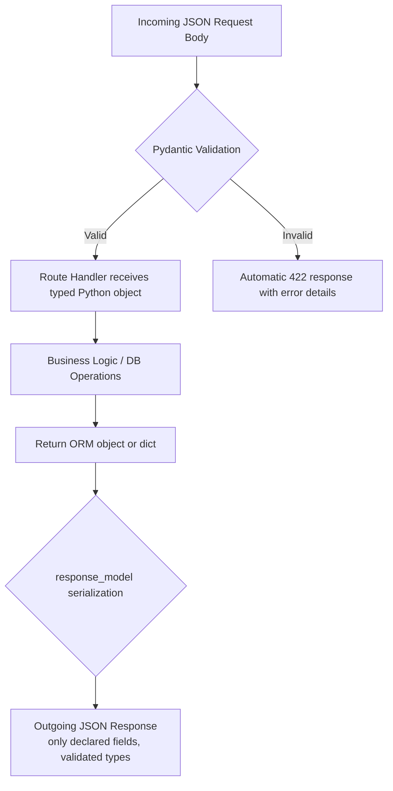
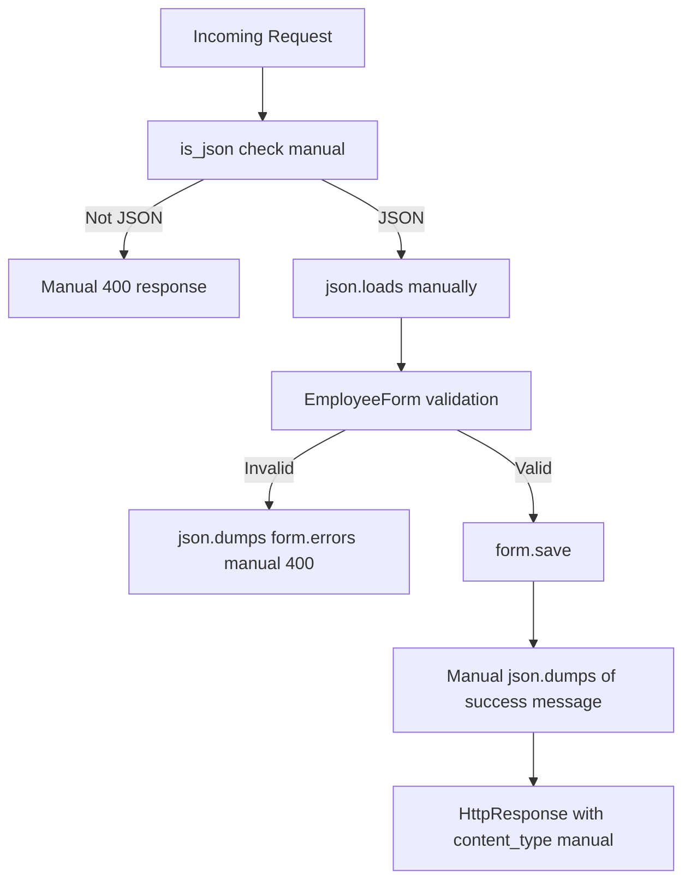

# 04 - Pydantic v2: Validation and Serialization

---

## What Pydantic Replaces

In the original DRF notes, data validation was handled by Django's `ModelForm` and DRF's `Serializer`. Those required:

1. A `models.py` with the database model
2. A `forms.py` or `serializers.py` with validation logic
3. Manual calls to `form.is_valid()` and `form.errors`
4. Manual conversion between form data and JSON

Pydantic collapses all of that. Define a class with type hints. Pydantic validates automatically on instantiation. Invalid data raises a clear error with a structured response.

---

## What is Pydantic

Pydantic is a Python library for data validation using Python's type annotation system. FastAPI is built directly on top of Pydantic. Every request body, query parameter, and response model in FastAPI goes through Pydantic.

Pydantic v2 (released June 2023) is a complete rewrite of v1 in Rust. It is significantly faster and has a cleaner API. All modern FastAPI projects use Pydantic v2.

Install:

```bash
pip install pydantic      # v2 is the default as of 2023
pip install fastapi       # includes pydantic v2 as dependency
```

---

## Basic Model Definition

```python
from pydantic import BaseModel
from typing import Optional

class Employee(BaseModel):
    eno: int
    ename: str
    esal: float
    eaddr: str
```

Instantiate it:

```python
emp = Employee(eno=100, ename="Akshay", esal=75000.0, eaddr="Pune")
print(emp.eno)      # 100
print(emp.ename)    # Akshay
```

Pass wrong types:

```python
emp = Employee(eno="not_a_number", ename="Akshay", esal=75000.0, eaddr="Pune")
# ValidationError: eno: Input should be a valid integer
```

Pydantic also coerces compatible types:

```python
emp = Employee(eno="100", ename="Akshay", esal="75000", eaddr="Pune")
# eno becomes int 100, esal becomes float 75000.0
# This is Pydantic's "lax" mode for scalar types
```

---

## Optional Fields and Default Values

```python
from pydantic import BaseModel
from typing import Optional

class Employee(BaseModel):
    eno: int
    ename: str
    esal: float
    eaddr: str
    department: Optional[str] = None       # optional, defaults to None
    is_active: bool = True                 # optional, defaults to True
    years_of_experience: int = 0           # optional, defaults to 0
```

Fields without defaults are required. Fields with defaults are optional.

`Optional[str]` is equivalent to `str | None` in Python 3.10+. Both work with Pydantic v2:

```python
# Modern Python 3.10+ syntax (preferred)
class Employee(BaseModel):
    department: str | None = None
```

---

## Field Validators and Constraints

Pydantic's `Field()` function adds validation constraints directly in the model definition. This replaces the `clean_<fieldname>()` methods in Django forms.

**Original DRF approach:**

```python
class EmployeeForm(forms.ModelForm):
    def clean_esal(self):
        inputsal = self.cleaned_data['esal']
        if inputsal < 5000:
            raise forms.ValidationError('The minimum salary should be 5000')
        return inputsal
```

**Pydantic v2 approach:**

```python
from pydantic import BaseModel, Field

class EmployeeCreate(BaseModel):
    eno: int = Field(gt=0, description="Employee number, must be positive")
    ename: str = Field(min_length=2, max_length=64, description="Full name")
    esal: float = Field(ge=5000.0, description="Salary must be at least 5000")
    eaddr: str = Field(min_length=2, max_length=64)
```

Common `Field()` constraints:

| Constraint | Applies to | Meaning |
|-----------|-----------|---------|
| `gt=n` | int, float | greater than n |
| `ge=n` | int, float | greater than or equal to n |
| `lt=n` | int, float | less than n |
| `le=n` | int, float | less than or equal to n |
| `min_length=n` | str | minimum string length |
| `max_length=n` | str | maximum string length |
| `pattern="regex"` | str | must match regex |
| `default=val` | any | default value |
| `description="..."` | any | shows in Swagger docs |
| `example=val` | any | shows example in Swagger docs |

---

## Custom Validators with `@field_validator`

For logic that cannot be expressed as a simple constraint:

```python
from pydantic import BaseModel, Field, field_validator

class Employee(BaseModel):
    eno: int
    ename: str
    esal: float = Field(ge=5000.0)
    eaddr: str

    @field_validator("ename")
    @classmethod
    def name_must_not_be_numeric(cls, v: str) -> str:
        if v.isdigit():
            raise ValueError("Employee name cannot be all digits")
        return v.strip().title()   # also transforms: "akshay" -> "Akshay"
```

For cross-field validation (validating one field based on another), use `@model_validator`:

```python
from pydantic import BaseModel, model_validator

class SalaryRange(BaseModel):
    min_salary: float
    max_salary: float

    @model_validator(mode="after")
    def max_must_exceed_min(self) -> "SalaryRange":
        if self.max_salary <= self.min_salary:
            raise ValueError("max_salary must be greater than min_salary")
        return self
```

---

## Serialization: Converting Models to and from JSON

**Converting a Pydantic model to a Python dict:**

```python
emp = Employee(eno=100, ename="Akshay", esal=75000.0, eaddr="Pune")

# Pydantic v2 method
emp.model_dump()
# {'eno': 100, 'ename': 'Akshay', 'esal': 75000.0, 'eaddr': 'Pune'}

# Pydantic v1 (deprecated, do not use in new code)
# emp.dict()
```

**Converting to JSON string:**

```python
emp.model_dump_json()
# '{"eno":100,"ename":"Akshay","esal":75000.0,"eaddr":"Pune"}'
```

**Excluding fields:**

```python
emp.model_dump(exclude={"esal"})
# {'eno': 100, 'ename': 'Akshay', 'eaddr': 'Pune'}
```

**Only include set fields (useful for PATCH/partial updates):**

```python
emp.model_dump(exclude_unset=True)
# Only returns fields that were explicitly set, not defaults
```

**Parsing from a dict:**

```python
data = {"eno": 100, "ename": "Akshay", "esal": 75000.0, "eaddr": "Pune"}
emp = Employee.model_validate(data)

# Pydantic v1 (deprecated)
# emp = Employee.parse_obj(data)
```

**Parsing from a JSON string:**

```python
json_str = '{"eno":100,"ename":"Akshay","esal":75000.0,"eaddr":"Pune"}'
emp = Employee.model_validate_json(json_str)
```

---

## Schema Design Pattern: Separate Models per Operation

This is the most important Pydantic concept for API design. The original DRF notes used a single `EmployeeSerializer` for both input and output. This creates problems:

- The `id` field should appear in responses but not be sent by the client in create requests
- A password field should be accepted in create requests but never returned in responses
- A PATCH endpoint accepts partial data (all fields optional) but a POST endpoint requires fields

The pattern is to define multiple Pydantic models, each with a specific purpose:

```python
from pydantic import BaseModel, Field
from typing import Optional

# Base: shared fields common to create, update, and response
class EmployeeBase(BaseModel):
    eno: int
    ename: str = Field(min_length=2, max_length=64)
    esal: float = Field(ge=5000.0)
    eaddr: str

# Create: what the client sends in a POST request
# Inherits from base, no id (DB generates it)
class EmployeeCreate(EmployeeBase):
    pass

# Update: what the client sends in a PATCH request
# All fields optional since PATCH is partial
class EmployeeUpdate(BaseModel):
    eno: Optional[int] = None
    ename: Optional[str] = Field(default=None, min_length=2, max_length=64)
    esal: Optional[float] = Field(default=None, ge=5000.0)
    eaddr: Optional[str] = None

# Response: what the API returns to the client
# Includes id which is generated by the database
class EmployeeResponse(EmployeeBase):
    id: int

    # Pydantic v2 config for reading from ORM objects
    model_config = {"from_attributes": True}
```

Usage in FastAPI routes:

```python
@app.post("/employees", response_model=EmployeeResponse, status_code=201)
def create_employee(employee: EmployeeCreate):
    # employee is validated, type-safe
    # response is serialized according to EmployeeResponse schema
    ...

@app.patch("/employees/{emp_id}", response_model=EmployeeResponse)
def update_employee(emp_id: int, employee: EmployeeUpdate):
    # Only fields sent by client are non-None
    ...
```

The `response_model=EmployeeResponse` parameter tells FastAPI:
1. Validate the return value against `EmployeeResponse`
2. Strip any extra fields not in `EmployeeResponse` (security: database internals do not leak)
3. Generate the response schema in Swagger docs

---

## `from_attributes = True`: Reading from ORM Objects

When you fetch a database row via SQLAlchemy or SQLModel, you get an ORM object, not a dict. Pydantic by default only reads from dicts.

```python
# Without from_attributes=True, this fails:
db_employee = session.get(Employee, 42)   # ORM object
EmployeeResponse.model_validate(db_employee)   # ValidationError

# With from_attributes=True in the model config, this works:
class EmployeeResponse(EmployeeBase):
    id: int
    model_config = {"from_attributes": True}

EmployeeResponse.model_validate(db_employee)   # works
```

FastAPI handles this automatically when you set `response_model=EmployeeResponse` and return an ORM object from your route.

---

## Nested Models

Pydantic models can contain other Pydantic models for complex data structures:

```python
from pydantic import BaseModel
from typing import List

class Address(BaseModel):
    street: str
    city: str
    state: str
    pincode: str

class Department(BaseModel):
    name: str
    location: str

class EmployeeDetailed(BaseModel):
    id: int
    ename: str
    esal: float
    address: Address          # nested model
    department: Department    # nested model
    reports_to: List[int]     # list of employee IDs
```

Accepts JSON like:

```json
{
  "id": 1,
  "ename": "Akshay",
  "esal": 75000,
  "address": {
    "street": "FC Road",
    "city": "Pune",
    "state": "Maharashtra",
    "pincode": "411004"
  },
  "department": {
    "name": "AI Engineering",
    "location": "Pune"
  },
  "reports_to": [2, 3, 5]
}
```

---

## Validation Error Response Format

When Pydantic validation fails, FastAPI automatically returns a `422 Unprocessable Entity` response with a structured error body. You do not need to write `is_json()` or check `form.errors`. This is automatic.

Example: POST to `/employees` with `esal = 3000` (below the minimum of 5000):

```json
{
  "detail": [
    {
      "type": "greater_than_equal",
      "loc": ["body", "esal"],
      "msg": "Input should be greater than or equal to 5000",
      "input": 3000,
      "ctx": {"ge": 5000.0}
    }
  ]
}
```

Compare this to the original DRF approach where you had to:
1. Call `is_json(data)` manually
2. Call `form.is_valid()`
3. Check `form.errors`
4. `json.dumps(form.errors)` and return with `status=400`

---

## Pydantic v1 vs v2: Method Name Changes

If you encounter older code or tutorials, these renames are the most common source of confusion:

| Pydantic v1 (old) | Pydantic v2 (current) |
|-------------------|----------------------|
| `emp.dict()` | `emp.model_dump()` |
| `emp.json()` | `emp.model_dump_json()` |
| `Employee.parse_obj(data)` | `Employee.model_validate(data)` |
| `Employee.parse_raw(json_str)` | `Employee.model_validate_json(json_str)` |
| `Employee.schema()` | `Employee.model_json_schema()` |
| `@validator` | `@field_validator` |
| `@root_validator` | `@model_validator` |
| `orm_mode = True` | `from_attributes = True` |
| `class Config:` | `model_config = {}` |

---

## Summary: Pydantic vs Original DRF Approach



Contrast with original DRF flow:



Every box in the DRF flow is code you wrote. Every box in the Pydantic flow is handled by the framework.

---

Next: [05 - FastAPI Routing and Path Operations](05_fastapi_routing.md)