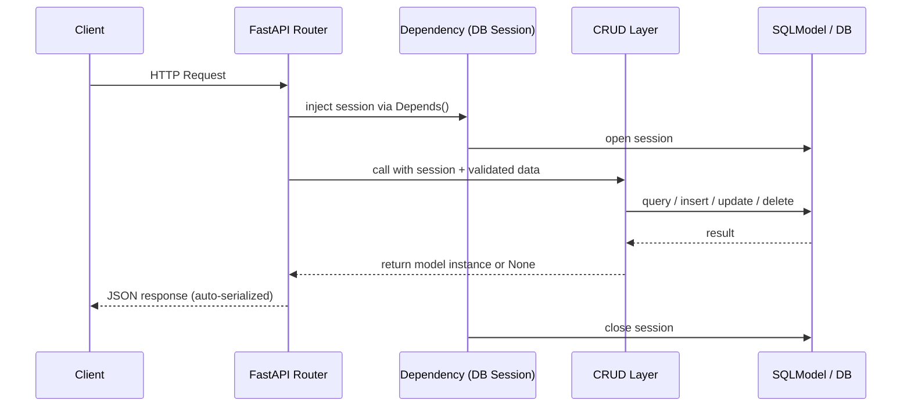

# 05 - CRUD APIs with SQLModel and FastAPI

**Series context:** `01_REST_fundamentals` → `02_soap_vs_rest` → `03_fastapi_introduction` → `04_pydantic_v2` → **you are here**

---

## What this file covers

Building a full CRUD API using FastAPI + SQLModel with proper HTTP semantics, dependency injection, schema separation, and production-ready patterns.

---

## Stack Setup

```bash
pip install fastapi sqlmodel uvicorn httpx
```

> SQLModel works with SQLAlchemy 2.x as of 2024. No version pinning needed unless you hit a specific compatibility issue.

---

## Project Structure

```
app/
├── main.py
├── database.py
├── models.py       # SQLModel table models
├── schemas.py      # SQLModel data models (request/response shapes)
├── crud.py         # DB operations
└── routers/
    └── employees.py
```

For larger projects, group by domain instead of by file type (see `06_routers_and_project_structure.md`).

---

## Request/Response Flow



---

## database.py

```python
from sqlmodel import create_engine, Session, SQLModel

DATABASE_URL = "sqlite:///./employees.db"

# check_same_thread=False is SQLite-specific; remove for PostgreSQL
engine = create_engine(DATABASE_URL, connect_args={"check_same_thread": False}, echo=True)


def create_db_and_tables():
    SQLModel.metadata.create_all(engine)


def get_session():
    with Session(engine) as session:
        yield session
```

**Why `yield` in `get_session`:** FastAPI's dependency system runs code after `yield` once the response is sent. This guarantees the session closes even if the handler raises an exception — no manual cleanup needed.

---

## models.py — SQLModel Table Models

```python
from typing import Optional
from sqlmodel import Field, SQLModel


class Employee(SQLModel, table=True):
    id   : Optional[int] = Field(default=None, primary_key=True)
    eno  : int
    ename: str   = Field(max_length=64)
    esal : float
    eaddr: str   = Field(max_length=128)
```

`table=True` makes this a real database table. Without it, the class is a pure Pydantic model (data-only, no table created).

---

## schemas.py — Request and Response Models

Separate your DB model from your API shapes. Use inheritance to avoid repeating field definitions:

```python
from typing import Optional
from sqlmodel import SQLModel


# Base holds shared fields with validation rules
class EmployeeBase(SQLModel):
    eno  : int
    ename: str
    esal : float
    eaddr: str


# Create: client does NOT send id
class EmployeeCreate(EmployeeBase):
    pass


# Update: all fields optional (PATCH semantics), id excluded from body
class EmployeeUpdate(SQLModel):
    eno  : Optional[int]   = None
    ename: Optional[str]   = None
    esal : Optional[float] = None
    eaddr: Optional[str]   = None


# Response: includes id
class EmployeeRead(EmployeeBase):
    id: int
```

The ID always goes in the URL path — never in the request body. Path parameters are unambiguous, cacheable, and correct REST design.

---

## crud.py — Database Operations

```python
from typing import Optional
from sqlmodel import Session, select
from app.models import Employee
from app.schemas import EmployeeCreate, EmployeeUpdate


def get_employee(session: Session, employee_id: int) -> Optional[Employee]:
    return session.get(Employee, employee_id)


def get_employees(session: Session, offset: int = 0, limit: int = 100) -> list[Employee]:
    statement = select(Employee).offset(offset).limit(limit)
    return session.exec(statement).all()


def create_employee(session: Session, data: EmployeeCreate) -> Employee:
    emp = Employee.model_validate(data)
    session.add(emp)
    session.commit()
    session.refresh(emp)
    return emp


def update_employee(session: Session, employee_id: int, data: EmployeeUpdate) -> Optional[Employee]:
    emp = session.get(Employee, employee_id)
    if emp is None:
        return None
    # Only apply fields that were actually sent (exclude_unset)
    update_data = data.model_dump(exclude_unset=True)
    emp.sqlmodel_update(update_data)
    session.add(emp)
    session.commit()
    session.refresh(emp)
    return emp


def delete_employee(session: Session, employee_id: int) -> bool:
    emp = session.get(Employee, employee_id)
    if emp is None:
        return False
    session.delete(emp)
    session.commit()
    return True
```

`exclude_unset=True` is critical for PATCH semantics. Fields the client did not send are left at their current DB values — no accidental null overwrites.

---

## routers/employees.py

```python
from typing import Annotated
from fastapi import APIRouter, Depends, HTTPException, Query
from sqlmodel import Session
from app.database import get_session
from app.schemas import EmployeeCreate, EmployeeRead, EmployeeUpdate
import app.crud as crud

router     = APIRouter(prefix="/employees", tags=["employees"])
SessionDep = Annotated[Session, Depends(get_session)]


@router.get("/", response_model=list[EmployeeRead])
def list_employees(
    session: SessionDep,
    offset : int = Query(default=0, ge=0),
    limit  : int = Query(default=100, le=100),
):
    return crud.get_employees(session, offset=offset, limit=limit)


@router.get("/{employee_id}", response_model=EmployeeRead)
def get_employee(employee_id: int, session: SessionDep):
    emp = crud.get_employee(session, employee_id)
    if emp is None:
        raise HTTPException(status_code=404, detail="Employee not found")
    return emp


@router.post("/", response_model=EmployeeRead, status_code=201)
def create_employee(data: EmployeeCreate, session: SessionDep):
    return crud.create_employee(session, data)


@router.patch("/{employee_id}", response_model=EmployeeRead)
def update_employee(employee_id: int, data: EmployeeUpdate, session: SessionDep):
    emp = crud.update_employee(session, employee_id, data)
    if emp is None:
        raise HTTPException(status_code=404, detail="Employee not found")
    return emp


@router.delete("/{employee_id}", status_code=204)
def delete_employee(employee_id: int, session: SessionDep):
    deleted = crud.delete_employee(session, employee_id)
    if not deleted:
        raise HTTPException(status_code=404, detail="Employee not found")
```

Use `PATCH` (partial update) rather than `PUT` unless you require the client to send the **complete** resource on every update. `PATCH` + `exclude_unset=True` is the standard pattern for partial updates.

---

## main.py

```python
from contextlib import asynccontextmanager
from fastapi import FastAPI
from app.database import create_db_and_tables
from app.routers.employees import router as employee_router


@asynccontextmanager
async def lifespan(app: FastAPI):
    create_db_and_tables()
    yield
    # shutdown logic here if needed


app = FastAPI(title="Employee API", lifespan=lifespan)
app.include_router(employee_router)
```

`@app.on_event("startup")` is **deprecated** in recent FastAPI versions. Always use the `lifespan` context manager. If `lifespan` is set, `on_event` handlers are silently ignored.

---

## Testing with httpx

```python
import httpx

BASE_URL = "http://127.0.0.1:8000"
client   = httpx.Client(base_url=BASE_URL)


def test_create():
    r = client.post("/employees/", json={
        "eno"  : 1001,
        "ename": "Katrina",
        "esal" : 20000.0,
        "eaddr": "Mumbai"
    })
    print(r.status_code, r.json())
    return r.json()["id"]


def test_list():
    r = client.get("/employees/")
    print(r.status_code, r.json())


def test_get(employee_id: int):
    r = client.get(f"/employees/{employee_id}")
    print(r.status_code, r.json())


def test_update(employee_id: int):
    # Only send fields you want to change — PATCH semantics
    r = client.patch(f"/employees/{employee_id}", json={"esal": 35000.0})
    print(r.status_code, r.json())


def test_delete(employee_id: int):
    r = client.delete(f"/employees/{employee_id}")
    print(r.status_code)


if __name__ == "__main__":
    emp_id = test_create()
    test_list()
    test_get(emp_id)
    test_update(emp_id)
    test_delete(emp_id)
```

---

## Database Migrations with Alembic

`SQLModel.metadata.create_all()` is fine for development and prototyping, but it **cannot handle schema changes** to existing tables. For production, use Alembic.

### Install

```bash
pip install alembic
alembic init alembic
```

### Configure `alembic/env.py`

Point Alembic at your SQLModel metadata so it can detect model changes:

```python
from sqlmodel import SQLModel
from app.models import Employee  # import all models so metadata is populated

target_metadata = SQLModel.metadata
```

Also update the `sqlalchemy.url` in `alembic.ini` (or override it dynamically in `env.py` from your `DATABASE_URL`).

### Common Alembic commands

```bash
# Auto-generate a migration from model changes
alembic revision --autogenerate -m "add salary column"

# Apply all pending migrations
alembic upgrade head

# Roll back one migration
alembic downgrade -1

# View migration history
alembic history
```

Think of Alembic as **Git for your database schema** — every schema change becomes a versioned, reversible migration file committed alongside your code.

---

## Common Mistakes to Avoid

**1. Sending `id` in request body for updates**

The ID belongs in the URL path (`/employees/42`), not the body. Path parameters are unambiguous, RESTful, and cacheable.

**2. Not using `exclude_unset=True` on partial updates**

Without it, `model_dump()` returns all optional fields as `None`, silently overwriting existing DB values with nulls.

**3. Using `@app.on_event` in new code**

Still works but is deprecated. Use `lifespan`. Any tutorial still using `on_event` is outdated.

**4. Committing in both `crud` functions and the router**

Pick one layer. Convention: commit in the router (or service layer). This keeps CRUD functions focused on DB logic and makes multiple operations composable inside a single transaction.

**5. Putting `table=True` on response/schema models**

Only the actual DB model gets `table=True`. `EmployeeCreate`, `EmployeeUpdate`, `EmployeeRead` are data models — no `table=True`. Mixing these causes SQLAlchemy to try to create phantom tables.

**6. Using `create_all()` in production**

`create_all()` skips tables that already exist and cannot add new columns to existing ones. Use Alembic for any real deployment.

---

## Running the App

```bash
uvicorn app.main:app --reload
```

- Swagger UI: `http://127.0.0.1:8000/docs`
- ReDoc: `http://127.0.0.1:8000/redoc`

---

Next: [06_routers_and_project_structure.md](./06_routers_and_project_structure.md)