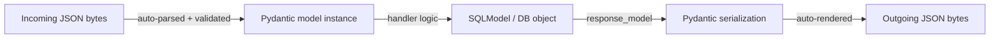
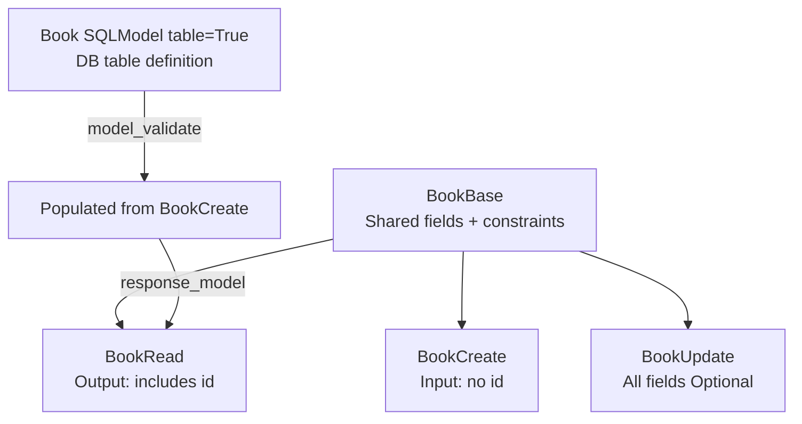

# 06 - Serialization, Deserialization, and Validation in FastAPI

**Series context:** `01_REST_fundamentals` → `02_soap_vs_rest` → `03_fastapi_introduction` → `04_pydantic_v2` → `05_crud_with_sqlmodel` → **you are here**

---

## What are Serialization, Deserialization, and Validation

**Serialization** converts complex Python objects (model instances, ORM objects) into Python-native types like `dict`, which are then rendered as JSON for the HTTP response.

**Deserialization** is the reverse: converting raw incoming JSON bytes into validated, typed Python objects your application can safely work with.

**Validation** checks that incoming data satisfies all defined constraints before the application processes it. If validation fails, the request is rejected before your handler even runs.

In FastAPI, all three are handled automatically by **Pydantic models**. There is no separate serializer class, no manual `.is_valid()` call. The framework handles this at the HTTP boundary using type annotations.



---

## Serialization in FastAPI

### What it means here

When your route handler returns a Pydantic model instance, SQLModel instance, or plain `dict`, FastAPI automatically serializes it to JSON. You do not call any renderer manually.

### Basic serialization

The examples below use a **bookstore** domain: books with title, author, price, and genre.

```python
from pydantic import BaseModel

class BookRead(BaseModel):
    title : str
    author: str
    price : float
    genre : str
```

```python
from fastapi import FastAPI

app = FastAPI()

@app.get("/book", response_model=BookRead)
def get_book():
    return {"title": "The Alchemist", "author": "Paulo Coelho", "price": 299.0, "genre": "Fiction"}
```

FastAPI validates the return value against `BookRead` and renders it as JSON. Extra keys not in `BookRead` are automatically stripped from the response.

### Serializing a single model instance

```python
from typing import Optional
from sqlmodel import Field, SQLModel, Session, select, create_engine
from fastapi import Depends, HTTPException

class Book(SQLModel, table=True):
    id    : Optional[int] = Field(default=None, primary_key=True)
    title : str           = Field(max_length=200)
    author: str           = Field(max_length=100)
    price : float
    genre : str           = Field(max_length=50)

class BookRead(SQLModel):
    id    : int
    title : str
    author: str
    price : float
    genre : str

@app.get("/books/{book_id}", response_model=BookRead)
def get_book(book_id: int, session: Session = Depends(get_session)):
    book = session.get(Book, book_id)
    if book is None:
        raise HTTPException(status_code=404, detail="Book not found")
    return book  # FastAPI serializes this automatically
```

### Serializing a list

```python
@app.get("/books/", response_model=list[BookRead])
def list_books(session: Session = Depends(get_session)):
    return session.exec(select(Book)).all()
```

Return a `list` and declare `response_model=list[BookRead]`. No special flag needed.

### Manual serialization with model_dump()

Use this outside of routes — in utilities, tests, background tasks, etc.

```python
book = BookRead(id=1, title="Ikigai", author="Héctor García", price=350.0, genre="Self-help")

# Convert to dict
data = book.model_dump()
# {'id': 1, 'title': 'Ikigai', 'author': 'Héctor García', 'price': 350.0, 'genre': 'Self-help'}

# Convert to JSON string
json_str = book.model_dump_json()
```

### Controlling which fields appear in output

```python
# Include only specific fields
book.model_dump(include={"title", "author"})

# Exclude specific fields
book.model_dump(exclude={"price"})

# Only fields explicitly set (omit defaults)
book.model_dump(exclude_unset=True)

# Omit fields whose value is None
book.model_dump(exclude_none=True)
```

---

## Deserialization in FastAPI

### What it means here

When a client sends a POST or PATCH with a JSON body, FastAPI reads the raw bytes, parses the JSON, and maps the result into the Pydantic model declared as the parameter type. If parsing or type coercion fails, FastAPI returns a `422 Unprocessable Entity` automatically — before your function runs.

### Basic deserialization

```python
class BookCreate(BaseModel):
    title : str
    author: str
    price : float
    genre : str

@app.post("/books/", response_model=BookRead, status_code=201)
def create_book(data: BookCreate, session: Session = Depends(get_session)):
    # 'data' is already a validated BookCreate instance here
    # No manual json.loads(), no parsing needed
    book = Book.model_validate(data)
    session.add(book)
    session.commit()
    session.refresh(book)
    return book
```

By the time your handler is called, `data` is a fully typed and validated Python object.

### model_validate() — deserializing from a dict or another model

Used when the data did not come directly from an HTTP request body (e.g., from a dict, a DB row, another model).

```python
raw = {"title": "Sapiens", "author": "Yuval Noah Harari", "price": 499.0, "genre": "History"}

book = BookCreate.model_validate(raw)
# book.title -> 'Sapiens', book.price -> 499.0, etc.
```

```python
# Deserializing from a raw JSON string
book = BookCreate.model_validate_json(
    '{"title": "Sapiens", "author": "Yuval Noah Harari", "price": 499.0, "genre": "History"}'
)
```

### Partial deserialization for PATCH updates

For partial updates, declare all fields as `Optional` with a `None` default. Then use `exclude_unset=True` when applying the update so only the fields the client actually sent are changed.

```python
from typing import Optional

class BookUpdate(BaseModel):
    title : Optional[str]   = None
    author: Optional[str]   = None
    price : Optional[float] = None
    genre : Optional[str]   = None

@app.patch("/books/{book_id}", response_model=BookRead)
def update_book(book_id: int, data: BookUpdate, session: Session = Depends(get_session)):
    book = session.get(Book, book_id)
    if book is None:
        raise HTTPException(status_code=404, detail="Book not found")

    update_data = data.model_dump(exclude_unset=True)  # only sent fields
    book.sqlmodel_update(update_data)

    session.add(book)
    session.commit()
    session.refresh(book)
    return book
```

`exclude_unset=True` is critical: if the client sends only `{"price": 399.0}`, only `price` is updated. All other fields retain their current DB values. Without this flag, every unset `Optional` field comes through as `None` and silently overwrites existing data.

---

## Validation in FastAPI (Pydantic v2)

Pydantic handles all validation. There are three levels:

### Validation execution order

```
1. Type coercion + Field() constraints      ← runs first
2. @field_validator                         ← field-level custom logic
3. @model_validator                         ← object-level, cross-field logic
```

If step 1 fails for a field, steps 2 and 3 do not run for that field. If step 2 raises, step 3 still runs for other valid fields. Validators can be stacked and run in sequence, making the order of precedence important.

---

### 1. Field-Level Validation with Field()

Use `Field()` for constraint-based rules: min/max values, string lengths, regex patterns.

```python
from pydantic import BaseModel, Field

class BookCreate(BaseModel):
    title : str   = Field(min_length=1, max_length=200)
    author: str   = Field(min_length=1, max_length=100)
    price : float = Field(gt=0, description="Price must be positive")
    genre : str   = Field(max_length=50)
    isbn  : str   = Field(pattern=r"^\d{13}$", description="13-digit ISBN")
```

`Field()` constraint reference:

| Argument | Meaning |
|---|---|
| `gt` | greater than |
| `ge` | greater than or equal |
| `lt` | less than |
| `le` | less than or equal |
| `min_length` | minimum string/list length |
| `max_length` | maximum string/list length |
| `pattern` | regex pattern (strings only) |

Validation failure → FastAPI returns `422` with a detailed error body. You write zero error-handling code.

---

### 2. Field-Level Custom Validation with @field_validator

Use `@field_validator` when the constraint can't be expressed with `Field()` arguments alone.

```python
from pydantic import BaseModel, Field, field_validator

class BookCreate(BaseModel):
    title : str   = Field(max_length=200)
    author: str   = Field(max_length=100)
    price : float
    genre : str

    @field_validator("price")
    @classmethod
    def price_must_be_multiple_of_half(cls, value: float) -> float:
        if value % 0.5 != 0:
            raise ValueError("Price must be a multiple of 0.5")
        return value

    @field_validator("title")
    @classmethod
    def title_must_not_be_blank(cls, value: str) -> str:
        if not value.strip():
            raise ValueError("Title cannot be blank or whitespace")
        return value.strip()  # clean the value while validating
```

Key rules for `@field_validator`:
- Always a `@classmethod` in Pydantic v2.
- Raise `ValueError` — Pydantic wraps it into a `ValidationError`.
- Return the (possibly transformed) value. You can sanitize data here, not just reject it.
- Validate multiple fields in one decorator: `@field_validator("title", "author")`.

**Running before type coercion (`mode="before"`):**

By default, validators run after Pydantic applies type coercion. Use `mode="before"` to intercept raw input first:

```python
@field_validator("genre", mode="before")
@classmethod
def normalize_genre(cls, value) -> str:
    # value is raw input — could be any type
    if isinstance(value, str):
        return value.strip().title()   # "fiction " → "Fiction"
    return value
```

---

### 3. Object-Level (Cross-Field) Validation with @model_validator

Use `@model_validator` when validation logic involves more than one field.

Common use cases:
- Discount price must be less than the original price
- `published_year` must be before `edition_year`
- Conditional rules: if `genre == "Academic"` then `price` must be above a threshold

```python
from pydantic import BaseModel, model_validator
from typing import Self

class BookCreate(BaseModel):
    title         : str
    author        : str
    price         : float
    discount_price: Optional[float] = None

    @model_validator(mode="after")
    def discount_must_be_less_than_price(self) -> Self:
        if self.discount_price is not None and self.discount_price >= self.price:
            raise ValueError("discount_price must be less than price")
        return self
```

`mode="after"` — all fields have been individually validated before this runs. `self` is the fully constructed model instance.

`mode="before"` — runs before field validation; receives the raw input dict:

```python
@model_validator(mode="before")
@classmethod
def check_before(cls, values: dict) -> dict:
    # values is the raw input dict, fields may not be coerced yet
    return values
```

**User registration example (password confirmation):**

```python
class UserCreate(BaseModel):
    username        : str
    password        : str
    confirm_password: str

    @model_validator(mode="after")
    def passwords_must_match(self) -> Self:
        if self.password != self.confirm_password:
            raise ValueError("Passwords do not match")
        return self
```

**Another cross-field example — order discount:**

```python
class OrderCreate(BaseModel):
    customer_name: str
    total_amount : float
    discount     : float = 0.0

    @model_validator(mode="after")
    def discount_cannot_exceed_total(self) -> Self:
        if self.discount > self.total_amount:
            raise ValueError(
                f"Discount ({self.discount}) cannot exceed total amount ({self.total_amount})"
            )
        return self
```

---

### 4. Reusable Validators with Annotated

When the same validation logic applies across multiple models, extract it as a standalone function and use `Annotated` with `AfterValidator` or `BeforeValidator`. One of the key benefits of the annotated pattern is to make validators reusable.

```python
from typing import Annotated
from pydantic import BaseModel
from pydantic.functional_validators import AfterValidator


def positive_price(value: float) -> float:
    if value <= 0:
        raise ValueError("Price must be greater than 0")
    return round(value, 2)  # normalize to 2 decimal places


def strip_whitespace(value: str) -> str:
    return value.strip()


# Reusable type aliases
PriceField  = Annotated[float, AfterValidator(positive_price)]
CleanString = Annotated[str,   AfterValidator(strip_whitespace)]


class BookCreate(BaseModel):
    title : CleanString  # whitespace stripped automatically
    author: CleanString
    price : PriceField   # validated and normalized


class CourseCreate(BaseModel):
    name  : CleanString
    fee   : PriceField   # same validator reused
```

This is the preferred pattern for validation logic shared across multiple schemas.

---

### 5. Accessing Already-Validated Fields Inside a Validator

Inside a `@field_validator`, you can access previously validated fields via the `info` argument:

```python
from pydantic import BaseModel, field_validator, ValidationInfo

class BookCreate(BaseModel):
    author      : str
    co_author   : str
    price       : float

    @field_validator("co_author")
    @classmethod
    def co_author_must_differ(cls, value: str, info: ValidationInfo) -> str:
        if info.data.get("author") == value:
            raise ValueError("Co-author must be different from the main author")
        return value
```

`info.data` contains fields that have already passed validation (fields defined before the current one in the class body).

---

## Validation Error Response Shape

When validation fails, FastAPI returns `HTTP 422` with this body automatically:

```json
{
  "detail": [
    {
      "type"  : "greater_than",
      "loc"   : ["body", "price"],
      "msg"   : "Input should be greater than 0",
      "input" : -50.0,
      "ctx"   : {"gt": 0}
    }
  ]
}
```

| Field | Meaning |
|---|---|
| `loc` | Where the bad data was found: `body`, `path`, `query` |
| `msg` | Human-readable description |
| `type` | Machine-readable error code |
| `input` | The actual value that failed |

You write no code to produce this. It is entirely automatic.

---

## Separating the DB Model from API Schemas

One class should not serve all three roles (DB table, input validation, output serialization) simultaneously. Use inheritance to share field definitions without duplication.



```python
from typing import Optional
from sqlmodel import SQLModel, Field


# DB table model — owns the table definition
class Book(SQLModel, table=True):
    id    : Optional[int] = Field(default=None, primary_key=True)
    title : str           = Field(max_length=200)
    author: str           = Field(max_length=100)
    price : float         = Field(gt=0)
    genre : str           = Field(max_length=50)


# Shared base — inherited by API schemas
class BookBase(SQLModel):
    title : str   = Field(min_length=1, max_length=200)
    author: str   = Field(min_length=1, max_length=100)
    price : float = Field(gt=0)
    genre : str   = Field(max_length=50)


# Create: client does not send id
class BookCreate(BookBase):
    pass


# Update: all fields optional for PATCH
class BookUpdate(SQLModel):
    title : Optional[str]   = Field(default=None, max_length=200)
    author: Optional[str]   = Field(default=None, max_length=100)
    price : Optional[float] = Field(default=None, gt=0)
    genre : Optional[str]   = Field(default=None, max_length=50)


# Response: includes id
class BookRead(BookBase):
    id: int
```

---

## Complete Working Example

A bookstore API with full CRUD, custom validators, cross-field validation, and reusable types.

```python
from contextlib import asynccontextmanager
from typing import Optional, Annotated
from fastapi import FastAPI, Depends, HTTPException, Query
from pydantic import field_validator, model_validator
from pydantic.functional_validators import AfterValidator
from sqlmodel import Field, SQLModel, Session, create_engine, select
from typing import Self


# -- Reusable validator types --

def positive_price(value: float) -> float:
    if value <= 0:
        raise ValueError("Price must be greater than 0")
    return round(value, 2)

def strip_and_title(value: str) -> str:
    return value.strip().title()

PriceField  = Annotated[float, AfterValidator(positive_price)]
CleanString = Annotated[str,   AfterValidator(strip_and_title)]


# -- DB model --

class Book(SQLModel, table=True):
    id            : Optional[int]   = Field(default=None, primary_key=True)
    title         : str             = Field(max_length=200)
    author        : str             = Field(max_length=100)
    price         : float
    discount_price: Optional[float] = None
    genre         : str             = Field(max_length=50)


# -- API schemas --

class BookBase(SQLModel):
    title         : CleanString
    author        : CleanString
    price         : PriceField
    discount_price: Optional[PriceField] = None
    genre         : str = Field(max_length=50)

    @field_validator("genre")
    @classmethod
    def genre_must_be_known(cls, value: str) -> str:
        allowed = {"fiction", "non-fiction", "academic", "biography", "history", "self-help"}
        if value.lower() not in allowed:
            raise ValueError(f"Genre must be one of: {', '.join(sorted(allowed))}")
        return value.lower()

    @model_validator(mode="after")
    def discount_must_be_less_than_price(self) -> Self:
        if self.discount_price is not None and self.discount_price >= self.price:
            raise ValueError("discount_price must be strictly less than price")
        return self


class BookCreate(BookBase):
    pass


class BookUpdate(SQLModel):
    title         : Optional[CleanString] = None
    author        : Optional[CleanString] = None
    price         : Optional[PriceField]  = None
    discount_price: Optional[PriceField]  = None
    genre         : Optional[str]         = None


class BookRead(BookBase):
    id: int


# -- DB setup --

engine = create_engine("sqlite:///./bookstore.db", connect_args={"check_same_thread": False})

def get_session():
    with Session(engine) as session:
        yield session

SessionDep = Annotated[Session, Depends(get_session)]


@asynccontextmanager
async def lifespan(app: FastAPI):
    SQLModel.metadata.create_all(engine)
    yield

app = FastAPI(title="Bookstore API", lifespan=lifespan)


# -- Routes --

@app.post("/books/", response_model=BookRead, status_code=201)
def create_book(data: BookCreate, session: SessionDep):
    book = Book.model_validate(data)
    session.add(book)
    session.commit()
    session.refresh(book)
    return book


@app.get("/books/", response_model=list[BookRead])
def list_books(
    session: SessionDep,
    offset : int = Query(default=0, ge=0),
    limit  : int = Query(default=50, le=100),
):
    return session.exec(select(Book).offset(offset).limit(limit)).all()


@app.get("/books/{book_id}", response_model=BookRead)
def get_book(book_id: int, session: SessionDep):
    book = session.get(Book, book_id)
    if book is None:
        raise HTTPException(status_code=404, detail="Book not found")
    return book


@app.patch("/books/{book_id}", response_model=BookRead)
def update_book(book_id: int, data: BookUpdate, session: SessionDep):
    book = session.get(Book, book_id)
    if book is None:
        raise HTTPException(status_code=404, detail="Book not found")
    update_data = data.model_dump(exclude_unset=True)
    book.sqlmodel_update(update_data)
    session.add(book)
    session.commit()
    session.refresh(book)
    return book


@app.delete("/books/{book_id}", status_code=204)
def delete_book(book_id: int, session: SessionDep):
    book = session.get(Book, book_id)
    if book is None:
        raise HTTPException(status_code=404, detail="Book not found")
    session.delete(book)
    session.commit()
```

**Sample valid request body for POST `/books/`:**
```json
{
  "title": "Atomic Habits",
  "author": "James Clear",
  "price": 499.0,
  "discount_price": 399.0,
  "genre": "self-help"
}
```

**Sample 422 response (discount >= price):**
```json
{
  "detail": [
    {
      "type"  : "value_error",
      "loc"   : ["body"],
      "msg"   : "Value error, discount_price must be strictly less than price",
      "input" : { "title": "Atomic Habits", "price": 299.0, "discount_price": 299.0 }
    }
  ]
}
```

---

## Key Points Summary

- **Serialization** = return a model instance or dict from a route + set `response_model` on the decorator. FastAPI handles rendering. Extra fields are stripped automatically.
- **Deserialization** = declare a Pydantic model as a parameter type. FastAPI parses and validates the request body before your function is called.
- **Validation order**: `Field()` constraints → `@field_validator` → `@model_validator`. If an earlier step fails, later steps don't run for that field.
- For **partial updates** (PATCH), all fields in the update schema must be `Optional`. Always use `exclude_unset=True` when applying updates — otherwise unset fields come through as `None` and overwrite existing data.
- The **DB model** (`table=True`) and API schemas (`BookCreate`, `BookRead`, `BookUpdate`) must be separate classes. Never expose DB internals through the API contract.
- **Reusable validators**: use `Annotated` + `AfterValidator` / `BeforeValidator` for logic shared across multiple schemas. This avoids duplicating `@field_validator` in every class.
- `model_dump()` = serialize to dict. `model_dump_json()` = serialize to JSON string. Both replace the old Pydantic v1 `.dict()` and `.json()` methods.
- Validation errors return `422` automatically with field-level detail including `loc`, `msg`, `type`, and the failing `input`. Zero manual error formatting needed.

---

Next: [07_model_serializer_equivalent.md](./07_model_serializer_equivalent.md)