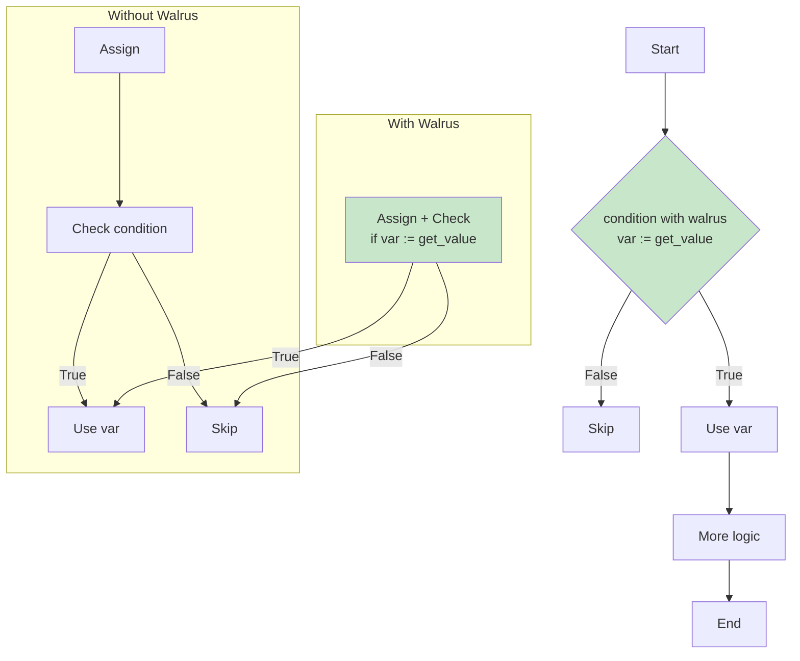

# Python Walrus Operator (:=): Assignment Expressions

## Overview

The walrus operator (`:=`) assigns values to variables as part of expressions, introduced in Python 3.8 via PEP 572. It combines assignment and value return in a single operation, reducing redundancy and improving readability in AI engineering codebases.

## Basic Syntax and Behavior

The walrus operator assigns and returns the assigned value:

```python
# Traditional approach: separate assignment and use
data = fetch_data()
if data:
    process(data)

# Walrus operator: assign and use in one expression
if data := fetch_data():
    process(data)
```

## Real-World AI Engineering Examples

### Example 1: Conditional Model Loading

```python
import torch
from typing import Optional

def load_model_checkpoint(
    checkpoint_path: Optional[str],
    model: torch.nn.Module
) -> tuple[torch.nn.Module, int]:
    """
    Load model with optional checkpoint. Returns (model, epoch).
    """
    if checkpoint_path and (state := torch.load(checkpoint_path, map_location="cpu")):
        model.load_state_dict(state["model_state_dict"])
        epoch = state.get("epoch", 0)
        return model, epoch

    return model, 0

# Usage
model = build_model()
loaded_model, start_epoch = load_model_checkpoint(
    checkpoint_path="/models/best.pt",
    model=model
)
```

### Example 2: Generator Expression with State Preservation

```python
from typing import Iterator, List

def batch_generator(
    data_iterator: Iterator[dict],
    batch_size: int = 32
) -> Iterator[List[dict]]:
    """Generate batches from data iterator."""
    batch = []

    while item := next(data_iterator, None):  # Fetch and assign in condition
        batch.append(item)
        if len(batch) >= batch_size:
            yield batch
            batch = []

    if batch:  # Yield remaining items
        yield batch

# Usage with DataLoader-style iteration
def iterate_training_data(data_path: str):
    with open(data_path, 'r') as f:
        while record := f.readline():
            yield eval(record)  # Parse JSON-like records
```

### Example 3: Pattern Matching with Walrus (Python 3.10+)

```python
from dataclasses import dataclass
from typing import Union, Optional

@dataclass
class ModelOutput:
    logits: list[float]
    embeddings: Optional[list[float]] = None

@dataclass
class ErrorOutput:
    error_message: str
    error_code: int

ModelResult = Union[ModelOutput, ErrorOutput]

def process_model_response(response: dict) -> ModelResult:
    match response:
        case {"status": "success", "logits": var_logits, "embeddings": var_emb} if var_emb:
            return ModelOutput(logits=var_logits, embeddings=var_emb)
        case {"status": "success", "logits": var_logits}:
            return ModelOutput(logits=var_logits)
        case {"status": "error", "message": var_msg, "code": var_code} if var_code > 0:
            return ErrorOutput(error_message=var_msg, error_code=var_code)
        case _:
            return ErrorOutput(error_message="Unknown response format", error_code=-1)
```

### Example 4: Comprehension with Caching Intermediate Results

```python
import numpy as np
from typing import List

def compute_attention_scores(
    queries: np.ndarray,
    keys: np.ndarray,
    mask_threshold: float = 0.5
) -> np.ndarray:
    """
    Compute attention scores with masking. Uses walrus to avoid
    recomputing softmax normalization factor.
    """
    # Compute raw attention scores
    scores = np.matmul(queries, keys.transpose(0, 1))

    # Apply mask and compute softmax
    masked_scores = np.where(
        scores > mask_threshold,
        scores,
        -1e9
    )

    # Compute softmax with numerical stability
    max_scores = masked_scores.max(axis=-1, keepdims=True)
    exp_scores = np.exp(masked_scores - (stable_max := max_scores))
    attention_weights = exp_scores / exp_scores.sum(axis=-1, keepdims=True)

    return attention_weights

# Usage
queries = np.random.randn(8, 12, 64)  # batch, seq, hidden
keys = np.random.randn(8, 12, 64)

weights = compute_attention_scores(queries, keys)
```

### Example 5: FastAPI Request Handling

```python
from fastapi import FastAPI, HTTPException
from typing import Optional
import time

app = FastAPI()

@app.get("/models/{model_name}/predict")
async def predict(
    model_name: str,
    data: list[float],
    temperature: float = 1.0
):
    # Validate input
    if not (validated_data := validate_input(data)):
        raise HTTPException(status_code=400, detail="Invalid input data")

    # Rate limiting check
    if not (allowed := check_rate_limit(model_name)):
        raise HTTPException(status_code=429, detail="Rate limit exceeded")

    # Run inference
    start_time = time.perf_counter()

    if model_name == "gpt":
        result = await run_gpt_inference(validated_data, temperature)
    elif model_name == "bert":
        result = await run_bert_inference(validated_data)
    else:
        raise HTTPException(status_code=404, detail="Model not found")

    inference_time = time.perf_counter() - start_time

    return {
        "model": model_name,
        "predictions": result,
        "inference_time_ms": inference_time * 1000,
        "input_length": len(validated_data)
    }

def validate_input(data: list[float]) -> Optional[list[float]]:
    if not data or len(data) > 10000:
        return None
    return [float(x) for x in data]

async def check_rate_limit(model_name: str) -> bool:
    return True  # Simplified rate limit check

async def run_gpt_inference(data: list[float], temp: float) -> list[float]:
    await asyncio.sleep(0.01)  # Simulate inference
    return [0.8, 0.1, 0.1]

async def run_bert_inference(data: list[float]) -> list[float]:
    await asyncio.sleep(0.01)
    return [0.9, 0.05, 0.05]

import asyncio
```

### Example 6: ML Training Loop

```python
import torch
from torch.utils.data import DataLoader
from typing import Optional
from dataclasses import dataclass

@dataclass
class TrainingMetrics:
    epoch: int
    loss: float
    accuracy: float
    learning_rate: float

def train_epoch(
    model: torch.nn.Module,
    dataloader: DataLoader,
    optimizer: torch.optim.Optimizer,
    criterion: torch.nn.Module,
    device: str = "cuda"
) -> TrainingMetrics:
    model.train()
    total_loss = 0.0
    correct = 0
    total = 0

    for batch_idx, (data := next(iter(dataloader), None)):
        if data is None:
            break

        inputs, targets = data[0].to(device), data[1].to(device)

        optimizer.zero_grad()
        outputs = model(inputs)
        loss = criterion(outputs, targets)
        loss.backward()
        optimizer.step()

        total_loss += loss.item()
        if (predictions := outputs.argmax(dim=1)).shape[0] > 0:
            correct += (predictions == targets).sum().item()
            total += targets.size(0)

    epoch = getattr(dataloader, 'epoch', 0)
    return TrainingMetrics(
        epoch=epoch,
        loss=total_loss / len(dataloader),
        accuracy=100.0 * correct / max(total, 1),
        learning_rate=optimizer.param_groups[0]['lr']
    )
```

### Example 7: Configuration Parsing with Nested Structures

```python
from typing import Any, Optional
import json

def parse_experiment_config(config_dict: dict) -> Optional[dict]:
    """Parse and validate experiment configuration."""

    # Check required top-level keys with walrus
    if not (model_config := config_dict.get("model")):
        print("Missing 'model' configuration")
        return None

    if not (training_config := config_dict.get("training")):
        print("Missing 'training' configuration")
        return None

    # Extract nested values
    model_type = model_config.get("type", "unknown")

    match model_type:
        case "transformer":
            if not (d_model := model_config.get("d_model")):
                print("Missing 'd_model' for transformer")
                return None
            if not (num_layers := model_config.get("num_layers")):
                print("Missing 'num_layers' for transformer")
                return None

            return {
                "model": {
                    "type": "transformer",
                    "d_model": d_model,
                    "num_layers": num_layers,
                    "num_heads": model_config.get("num_heads", 8)
                },
                "training": {
                    "learning_rate": training_config.get("lr", 1e-4),
                    "batch_size": training_config.get("batch_size", 32),
                    "epochs": training_config.get("epochs", 100)
                }
            }

        case "cnn":
            return {
                "model": {
                    "type": "cnn",
                    "channels": model_config.get("channels", [64, 128, 256])
                },
                "training": training_config
            }

        case _:
            print(f"Unknown model type: {model_type}")
            return None

# Usage
config = {
    "model": {
        "type": "transformer",
        "d_model": 512,
        "num_layers": 6,
        "num_heads": 8
    },
    "training": {
        "lr": 1e-4,
        "batch_size": 64,
        "epochs": 50
    }
}

parsed = parse_experiment_config(config)
print(json.dumps(parsed, indent=2))
```

## Mermaid Diagram: Walrus Operator Flow



## Common Patterns and Anti-Patterns

### Recommended Patterns

```python
# Pattern 1: Conditional assignment
if (result := expensive_computation()) > threshold:
    process(result)

# Pattern 2: While loop with accumulation
total = 0
while (item := queue.get()) is not None:
    total += item.value

# Pattern 3: List comprehension with filtering
data = [x for x in (result := fetch_all()) if x.valid]

# Pattern 4: Repeated function call elimination
if (response := requests.get(url)) and response.status_code == 200:
    process(response.json())
```

### Anti-Patterns to Avoid

```python
# Anti-pattern 1: Overusing walrus in simple cases
# BAD
x := 5  # Just use x = 5

# Anti-pattern 2: Complex expressions that hurt readability
if (a := calculate_a()) and (b := calculate_b()) and (c := calculate_c()):
    process(a, b, c)  # Too complex

# Anti-pattern 3: Shadowing outer scope variables
x = 10
if x := 20:  # Creates new x, shadows outer x
    print(x)  # Prints 20, confusing

# Anti-pattern 4: Using walrus for side effects
if (data := fetch_data()) and (data := transform(data)):
    # Same variable reassigned, confusing
    pass
```

## Performance Considerations

The walrus operator can eliminate redundant function calls:

```python
import time

def expensive_operation(x: int) -> int:
    """Simulate expensive computation."""
    time.sleep(0.1)  # 100ms
    return x * 2

# Without walrus: 2 calls
if expensive_operation(5) > 5:
    result = expensive_operation(5)  # Second call

# With walrus: 1 call
if (result := expensive_operation(5)) > 5:
    pass  # Use result, single call
```

## Key Takeaways

| Pattern | Example | Best Use Case |
|---------|---------|---------------|
| Conditional | `if (x := f()):` | Avoid repeated function calls |
| While loop | `while (x := it.next()):` | Accumulation with iterators |
| Comprehension | `[x for x in (data := f())]` | Reusing computed values |
| Match-case | `case {"val": x} if x := f():` | Complex pattern matching |

---

**Next file:** [08_03_python_match_case.md](08_03_python_match_case.md)

---

**References:**

- [PEP 572 – Assignment Expressions](https://peps.python.org/pep-0572/)
- [Real Python: Walrus Operator](https://realpython.com/python-walrus-operator/)
- [Real Python: Assignment Expressions Video](https://realpython.com/videos/assignment-expressions/)
