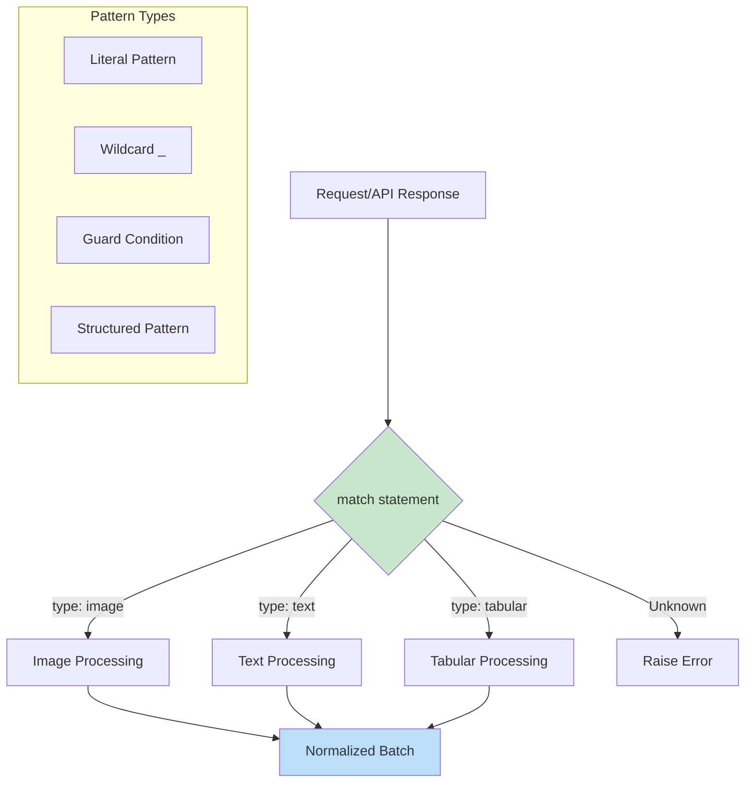

# Python Match-Case: Structural Pattern Matching

## Overview

Python 3.10 introduced structural pattern matching via the `match` statement (PEP 634-636). Unlike simple switch-case from other languages, Python's match-case supports destructuring, type checking, guards, and nested patterns. For AI engineers, this enables cleaner routing logic for model types, API responses, and data transformations.

## Basic Syntax

```python
match subject:
    case pattern1:
        # handle pattern1
    case pattern2:
        # handle pattern2
    case _:
        # default case (wildcard)
```

## Real-World AI Engineering Examples

### Example 1: Model Type Routing

```python
from dataclasses import dataclass
from typing import Union, Literal
import torch

ModelType = Literal["resnet", "vgg", "transformer", "lstm"]

@dataclass
class ModelConfig:
    name: str
    input_channels: int = 3
    num_classes: int = 1000

def build_model_from_config(config: ModelConfig) -> torch.nn.Module:
    match config.name:
        case "resnet":
            return torch.hub.load('pytorch/vision', 'resnet18', pretrained=False)
        case "vgg":
            return torch.hub.load('pytorch/vision', 'vgg16', pretrained=False)
        case "transformer":
            return build_transformer_model(config)
        case "lstm":
            return build_lstm_model(config)
        case _:
            raise ValueError(f"Unknown model type: {config.name}")

def build_transformer_model(config: ModelConfig) -> torch.nn.Module:
    return torch.nn.Transformer(
        d_model=512,
        nhead=8,
        num_encoder_layers=6
    )

def build_lstm_model(config: ModelConfig) -> torch.nn.Module:
    return torch.nn.LSTM(
        input_size=config.input_channels,
        hidden_size=256,
        num_layers=2,
        batch_first=True
    )
```

### Example 2: API Response Pattern Matching

```python
from dataclasses import dataclass
from typing import Union, Optional, Any
import json

@dataclass
class SuccessResponse:
    status: str
    data: Any
    metadata: Optional[dict] = None

@dataclass
class ErrorResponse:
    status: str
    error_code: int
    message: str
    details: Optional[dict] = None

APIResponse = Union[SuccessResponse, ErrorResponse]

def parse_api_response(response_dict: dict) -> APIResponse:
    """Parse raw API response into typed response object."""
    match response_dict:
        case {"status": "success", "data": var_data, **var_rest}:
            return SuccessResponse(
                status="success",
                data=var_data,
                metadata=var_rest.get("metadata")
            )
        case {"status": "error", "code": var_code, "msg": var_msg}:
            return ErrorResponse(
                status="error",
                error_code=var_code,
                message=var_msg,
                details=response_dict.get("details")
            )
        case _:
            return ErrorResponse(
                status="error",
                error_code=-1,
                message="Invalid response format"
            )

def handle_response(response: APIResponse) -> str:
    match response:
        case SuccessResponse(data=var_data) if var_data is not None:
            return f"Success: {len(var_data)} items"
        case SuccessResponse(data=None):
            return "Success: No data returned"
        case ErrorResponse(message=var_msg, error_code=var_code) if var_code > 500:
            return f"Server error: {var_msg}"
        case ErrorResponse(message=var_msg):
            return f"Client error: {var_msg}"
```

### Example 3: Data Transformation Patterns

```python
from typing import Any, Union, List
from dataclasses import dataclass

@dataclass
class ImageData:
    height: int
    width: int
    channels: int
    data: List[float]

@dataclass
class TextData:
    tokens: List[int]
    attention_mask: List[int]
    special_tokens_count: int

@dataclass
class TabularData:
    features: List[float]
    feature_names: List[str]
    missing_values: dict

BatchData = Union[ImageData, TextData, TabularData]

def preprocess_batch(batch: dict) -> BatchData:
    """Route preprocessing based on data type."""
    match batch:
        case {"type": "image", "height": h, "width": w, "channels": c, "pixels": p}:
            return ImageData(height=h, width=w, channels=c, data=p)
        case {"type": "text", "token_ids": t, "mask": m}:
            special = t.count(0) + t.count(1)  # PAD + CLS
            return TextData(tokens=t, attention_mask=m, special_tokens_count=special)
        case {"type": "tabular", "values": v, "columns": cols, "missing": miss}:
            return TabularData(features=v, feature_names=cols, missing_values=miss)
        case _:
            raise ValueError(f"Unknown batch type: {batch}")

def normalize_batch(batch: BatchData) -> BatchData:
    """Normalize data based on type."""
    match batch:
        case ImageData(data=var_data) as img:
            normalized = [x / 255.0 for x in var_data]
            return ImageData(height=img.height, width=img.width,
                           channels=img.channels, data=normalized)
        case TextData(tokens=var_tokens) as txt:
            return TextData(
                tokens=var_tokens,
                attention_mask=txt.attention_mask,
                special_tokens_count=txt.special_tokens_count
            )
        case TabularData(features=var_features, **rest) as tab:
            mean = sum(var_features) / len(var_features)
            normalized = [x - mean for x in var_features]
            return TabularData(features=normalized, **rest)
```

### Example 4: FastAPI Request Routing

```python
from fastapi import FastAPI, HTTPException, Request
from typing import Optional, Union
from pydantic import BaseModel
import torch

app = FastAPI()

class ClassificationRequest(BaseModel):
    model_name: str
    inputs: list[float]

class DetectionRequest(BaseModel):
    model_name: str
    image_path: str
    confidence_threshold: float = 0.5

class GenerationRequest(BaseModel):
    model_name: str
    prompt: str
    max_tokens: int = 100
    temperature: float = 1.0

RequestType = Union[ClassificationRequest, DetectionRequest, GenerationRequest]

@app.post("/inference")
async def handle_inference(request: Request):
    """Route to appropriate inference handler."""
    body = await request.json()

    match body:
        case {"task": "classify", "model": m, "data": d}:
            return await classify(model_name=m, inputs=d)
        case {"task": "detect", "model": m, "image": img, "threshold": th}:
            return await detect(model_name=m, image_path=img, threshold=th)
        case {"task": "generate", "model": m, "prompt": p, **opts}:
            return await generate(
                model_name=m,
                prompt=p,
                max_tokens=opts.get("max_tokens", 100),
                temperature=opts.get("temperature", 1.0)
            )
        case {"task": task} if task not in ["classify", "detect", "generate"]:
            raise HTTPException(status_code=400, detail=f"Unknown task: {task}")
        case _:
            raise HTTPException(status_code=400, detail="Invalid request format")

async def classify(model_name: str, inputs: list[float]) -> dict:
    return {"predictions": [0.8, 0.15, 0.05], "class": "cat"}

async def detect(model_name: str, image_path: str, threshold: float) -> dict:
    return {"boxes": [[10, 20, 100, 200]], "scores": [0.95]}

async def generate(model_name: str, prompt: str, max_tokens: int,
                   temperature: float) -> dict:
    return {"generated_text": "Sample generated text..."}
```

### Example 5: Experiment Configuration Parsing

```python
from typing import Any, Optional
from dataclasses import dataclass
from enum import Enum

class OptimizerType(Enum):
    ADAM = "adam"
    SGD = "sgd"
    RMSPROP = "rmsprop"
    ADAMW = "adamw"

@dataclass
class ExperimentConfig:
    model: dict
    training: dict
    optimizer: OptimizerType
    learning_rate: float

def parse_experiment_config(raw_config: dict) -> ExperimentConfig:
    """Parse experiment configuration with pattern matching."""
    match raw_config:
        case {
            "model": {
                "type": "transformer",
                "d_model": dm,
                "nhead": nh,
                "layers": nl,
                **model_rest
            },
            "optimizer": opt_type,
            "learning_rate": lr,
            **rest
        } if opt_type in ["adam", "adamw", "sgd", "rmsprop"]:
            return ExperimentConfig(
                model={"type": "transformer", "d_model": dm,
                      "nhead": nh, "layers": nl, **model_rest},
                training=rest.get("training", {}),
                optimizer=OptimizerType(opt_type),
                learning_rate=lr
            )
        case {
            "model": {
                "type": "cnn",
                "channels": ch,
                "kernel_sizes": ks,
                **model_rest
            },
            "optimizer": opt_type,
            "momentum": mom,
            **rest
        }:
            return ExperimentConfig(
                model={"type": "cnn", "channels": ch,
                      "kernel_sizes": ks, **model_rest},
                training=rest.get("training", {}),
                optimizer=OptimizerType(opt_type),
                learning_rate=rest.get("learning_rate", 0.001)
            )
        case {"model": {"type": unknown_type}}:
            raise ValueError(f"Unknown model type: {unknown_type}")
        case _:
            raise ValueError("Invalid experiment configuration")

# Example usage
config = {
    "model": {
        "type": "transformer",
        "d_model": 512,
        "nhead": 8,
        "layers": 6
    },
    "optimizer": "adamw",
    "learning_rate": 1e-4,
    "training": {
        "batch_size": 32,
        "epochs": 100
    }
}

parsed = parse_experiment_config(config)
print(f"Optimizer: {parsed.optimizer}, LR: {parsed.learning_rate}")
```

### Example 6: Logging and Monitoring Patterns

```python
from typing import Any, Optional
from dataclasses import dataclass
from datetime import datetime
import json

@dataclass
class LogEntry:
    timestamp: datetime
    level: str
    message: str
    metadata: Optional[dict] = None

def parse_log_entry(raw_entry: dict) -> LogEntry:
    """Parse various log formats into standardized LogEntry."""
    match raw_entry:
        case {"timestamp": ts, "level": lv, "msg": msg, **rest}:
            return LogEntry(
                timestamp=datetime.fromisoformat(ts) if isinstance(ts, str) else ts,
                level=lv,
                message=msg,
                metadata=rest
            )
        case {"time": ts, "severity": lv, "message": msg}:
            return LogEntry(timestamp=ts, level=lv, message=msg)
        case {"@timestamp": ts, "log.level": lv, "message": msg, **rest}:
            return LogEntry(
                timestamp=datetime.fromisoformat(ts),
                level=lv.upper(),
                message=msg,
                metadata=rest
            )
        case _:
            return LogEntry(
                timestamp=datetime.now(),
                level="INFO",
                message=str(raw_entry)
            )

def format_log_for_export(entry: LogEntry) -> str:
    """Format log entry based on destination."""
    match entry.level:
        case "ERROR" | "CRITICAL":
            return json.dumps({
                "timestamp": entry.timestamp.isoformat(),
                "level": entry.level,
                "message": entry.message,
                "error_details": entry.metadata
            })
        case "WARNING":
            return f"[{entry.timestamp}] WARN: {entry.message}"
        case _:
            return f"[{entry.timestamp}] {entry.level}: {entry.message}"
```

## Mermaid Diagram: Pattern Matching Flow



## Pattern Types Reference

| Pattern Type | Syntax | Example |
|-------------|--------|---------|
| Capture | `var` | `case x:` |
| Literal | `value` | `case "success":` |
| Wildcard | `_` | `case _:` |
| OR | `p1 \| p2` | `case "a" \| "b":` |
| Sequence | `[p1, p2, ...]` | `case [a, b]:` |
| Star | `*var` | `case [first, *rest]:` |
| Mapping | `{"key": var}` | `case {"data": x}:` |
| AS | `pattern as var` | `case Success() as s:` |
| Guard | `pattern if condition` | `case x if x > 0:` |

## Key Takeaways

- Use `match-case` for complex routing logic instead of nested if-elif chains
- Leverage guards (`if condition`) for additional filtering
- Match dictionaries with mapping patterns for API responses
- Combine with walrus operator for computed values in patterns
- Use capture patterns (`var`) to extract values into variables

---

**Next file:** [08_04_python_fstrings.md](08_04_python_fstrings.md)

---

**References:**

- [PEP 634 – Structural Pattern Matching: Specification](https://peps.python.org/pep-0634/)
- [PEP 636 – Structural Pattern Matching: Tutorial](https://peps.python.org/pep-0636/)
- [Ben Hoyt: Structural Pattern Matching in Python](https://benhoyt.com/writings/python-pattern-matching/)
