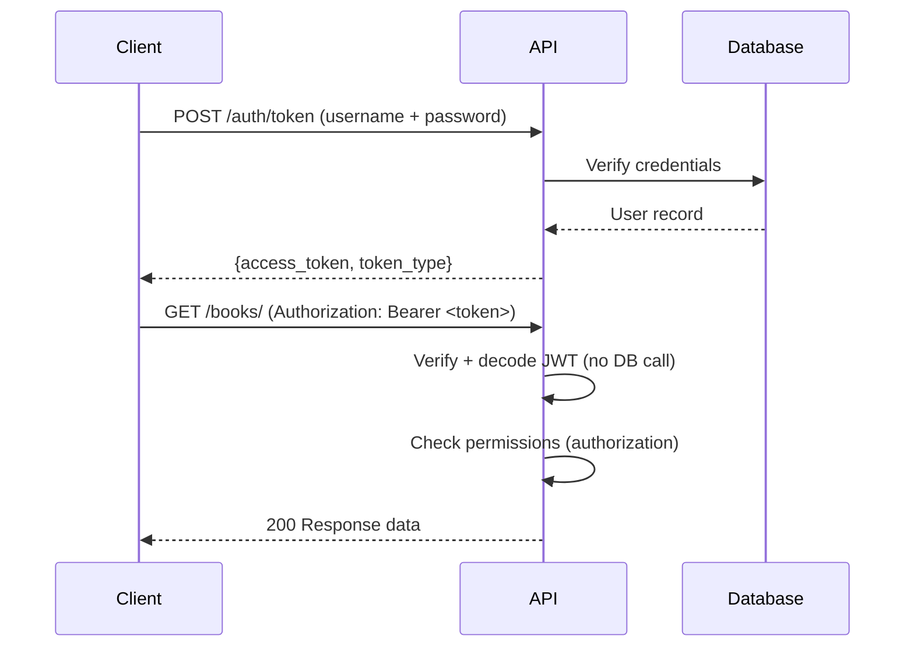
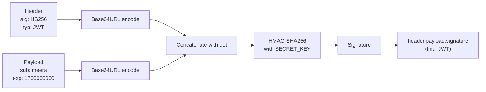
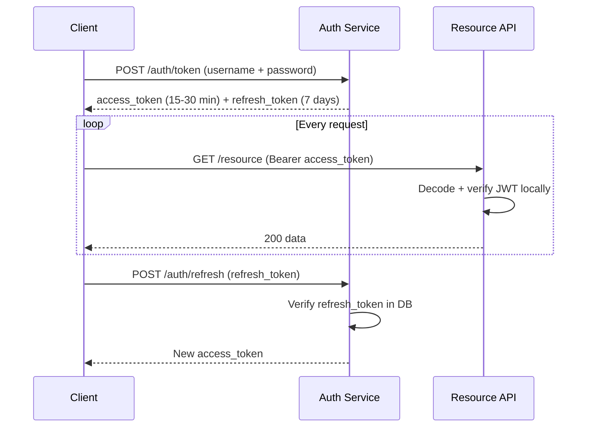
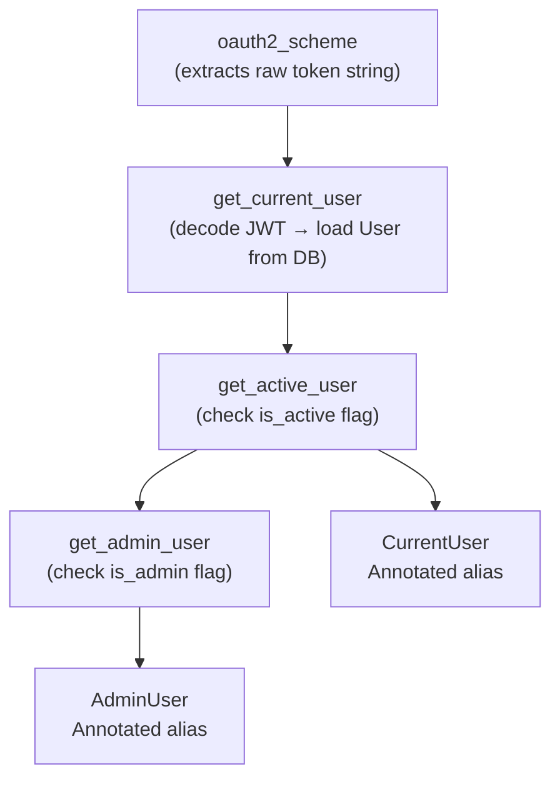
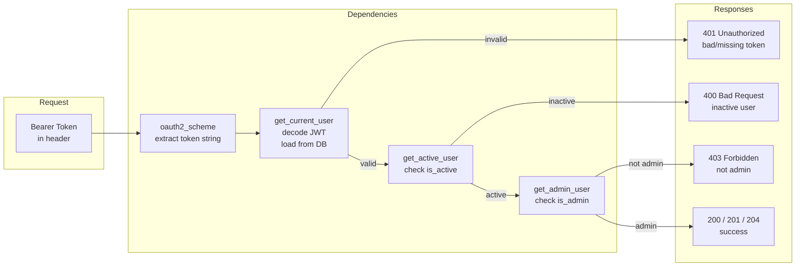
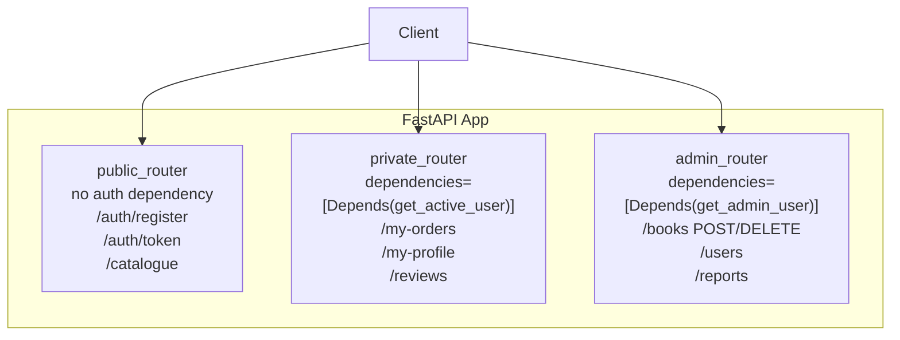

# 08 - Authentication and Authorization in FastAPI

---

## Theory

**Authentication** is the process of verifying who a caller is. FastAPI does not enforce any particular strategy — it exposes security primitives through its dependency injection system and you compose them.

**Authorization** is the process of deciding what an authenticated caller is allowed to do. In FastAPI this is implemented as additional dependencies or guards inside route handlers, not as a framework-level middleware layer.

The two steps are always sequential: authenticate first, authorize after. Skipping authentication and jumping to authorization is a logic error.



---

## Security Schemes Available in FastAPI

FastAPI exposes these from `fastapi.security`:

| Scheme | Class | Use case |
|---|---|---|
| HTTP Basic | `HTTPBasic` | Development/testing only |
| Bearer Token (JWT) | `OAuth2PasswordBearer` | Production, stateless |
| API Key (header) | `APIKeyHeader` | Machine-to-machine |
| API Key (query) | `APIKeyQuery` | Simple integrations |
| OAuth2 full flow | `OAuth2AuthorizationCodeBearer` | Third-party delegated auth |

---

## HTTP Basic Authentication

Sends `username:password` as Base64 in the `Authorization` header on every request. Trivially reversible — never use in production. Useful for understanding the security dependency pattern.

```python
from typing import Annotated
import secrets
from fastapi import Depends, FastAPI, HTTPException, status
from fastapi.security import HTTPBasic, HTTPBasicCredentials

app   = FastAPI()
security = HTTPBasic()

def verify_credentials(
    credentials: Annotated[HTTPBasicCredentials, Depends(security)]
) -> str:
    correct_username = secrets.compare_digest(
        credentials.username.encode("utf8"), b"arjun"
    )
    correct_password = secrets.compare_digest(
        credentials.password.encode("utf8"), b"secret"
    )
    if not (correct_username and correct_password):
        raise HTTPException(
            status_code=status.HTTP_401_UNAUTHORIZED,
            detail="Invalid credentials",
            headers={"WWW-Authenticate": "Basic"},
        )
    return credentials.username

@app.get("/admin/")
def admin_panel(username: Annotated[str, Depends(verify_credentials)]):
    return {"user": username}
```

**Why `secrets.compare_digest`**: plain `==` comparison short-circuits on the first differing byte, leaking timing information. `compare_digest` runs in constant time regardless of where the mismatch occurs.

---

## Token Authentication (JWT)

JWT (JSON Web Token) solves the core scalability problem of session-based or opaque token authentication: the server does not need a database lookup to validate a token. The token is self-contained — it carries the user identity and expiry in a cryptographically signed payload. Any service that knows the secret key can verify it independently.

### JWT Structure

A JWT has three Base64URL-encoded parts separated by dots:

```
header.payload.signature

eyJ0eXAiOiJKV1QiLCJhbGciOiJIUzI1NiJ9
.
eyJzdWIiOiJtZWVyYSIsImV4cCI6MTcwMDAwMDAwMH0
.
SflKxwRJSMeKKF2QT4fwpMeJf36POk6yJV_adQssw5c
```

- **Header**: algorithm and token type
- **Payload**: claims (`sub`, `exp`, `iat`, any custom fields)
- **Signature**: HMAC of header + payload using the secret key

The signature makes the token tamper-evident. If any byte in header or payload changes, signature verification fails.

### JWT Construction Flow



### Algorithm Choice

**HS256** (HMAC-SHA256): symmetric. Same secret key signs and verifies. Use when all verifying parties are trusted and can share the secret securely. Simpler to deploy.

**RS256** (RSA-SHA256): asymmetric. Private key signs, public key verifies. Use in distributed systems where multiple services need to verify tokens but must not be able to issue them.

### Token Lifecycle



- **Access token**: short-lived (15-30 minutes). Used to authenticate each request.
- **Refresh token**: long-lived (7 days). Used to issue new access tokens without re-login. Must be stored server-side (database or Redis) so it can be revoked. Implement with a separate `/auth/refresh` endpoint.

---

## Full JWT Implementation

Domain: bookstore platform (users, books, orders).

### Dependencies

```bash
pip install "python-jose[cryptography]" "passlib[bcrypt]" python-multipart
```

`python-jose` handles JWT encode/decode. `passlib` handles password hashing. `python-multipart` is required for `OAuth2PasswordRequestForm` to parse form data.

### Project Structure

```
app/
    main.py
    auth/
        config.py
        hashing.py
        tokens.py
        dependencies.py
    models/
        user.py
    routers/
        auth.py
        books.py
```

### auth/config.py

```python
import os
from datetime import timedelta

# Load from environment in production — never hardcode in source.
# Generate with: openssl rand -hex 32
SECRET_KEY              : str = os.getenv("SECRET_KEY", "change-me-in-production-256-bits")
ALGORITHM               : str = "HS256"
ACCESS_TOKEN_EXPIRE_MINUTES: int = 30
```

### auth/hashing.py

```python
from passlib.context import CryptContext

pwd_context = CryptContext(schemes=["bcrypt"], deprecated="auto")

def hash_password(plain: str) -> str:
    return pwd_context.hash(plain)

def verify_password(plain: str, hashed: str) -> bool:
    return pwd_context.verify(plain, hashed)
```

### models/user.py

```python
from sqlmodel import SQLModel, Field
from typing import Optional

class UserBase(SQLModel):
    username : str
    email    : str
    is_active: bool = True
    is_admin : bool = False

class User(UserBase, table=True):
    id             : Optional[int] = Field(default=None, primary_key=True)
    hashed_password: str

class UserCreate(UserBase):
    password: str

class UserRead(UserBase):
    id: int

class UserUpdate(SQLModel):
    email    : Optional[str]  = None
    is_active: Optional[bool] = None
    is_admin : Optional[bool] = None
```

### auth/tokens.py

```python
from datetime import datetime, timedelta, timezone
from typing import Any
from jose import JWTError, jwt
from pydantic import BaseModel
from app.auth.config import SECRET_KEY, ALGORITHM, ACCESS_TOKEN_EXPIRE_MINUTES

class TokenPayload(BaseModel):
    sub: str | None = None

class Token(BaseModel):
    access_token: str
    token_type  : str

def create_access_token(
    data: dict[str, Any],
    expires_delta: timedelta | None = None,
) -> str:
    to_encode = data.copy()
    expire    = datetime.now(timezone.utc) + (
        expires_delta or timedelta(minutes=ACCESS_TOKEN_EXPIRE_MINUTES)
    )
    to_encode.update({"exp": expire})
    return jwt.encode(to_encode, SECRET_KEY, algorithm=ALGORITHM)

def decode_access_token(token: str) -> TokenPayload:
    try:
        payload = jwt.decode(token, SECRET_KEY, algorithms=[ALGORITHM])
        return TokenPayload(**payload)
    except JWTError:
        raise ValueError("Token decode failed")
```

### auth/dependencies.py

This is the core of the authorization layer. Dependencies are chained: each builds on the previous one.



```python
from typing import Annotated
from fastapi import Depends, HTTPException, status
from fastapi.security import OAuth2PasswordBearer
from sqlmodel import Session, select
from app.auth.tokens import decode_access_token
from app.db import SessionDep
from app.models.user import User

oauth2_scheme = OAuth2PasswordBearer(tokenUrl="/auth/token")

def get_current_user(
    token  : Annotated[str, Depends(oauth2_scheme)],
    session: SessionDep,
) -> User:
    credentials_exception = HTTPException(
        status_code=status.HTTP_401_UNAUTHORIZED,
        detail="Could not validate credentials",
        headers={"WWW-Authenticate": "Bearer"},
    )
    try:
        payload  = decode_access_token(token)
        username = payload.sub
        if username is None:
            raise credentials_exception
    except ValueError:
        raise credentials_exception

    user = session.exec(select(User).where(User.username == username)).first()
    if user is None:
        raise credentials_exception
    return user

def get_active_user(
    current_user: Annotated[User, Depends(get_current_user)]
) -> User:
    if not current_user.is_active:
        raise HTTPException(status_code=400, detail="Inactive user")
    return current_user

def get_admin_user(
    current_user: Annotated[User, Depends(get_active_user)]
) -> User:
    if not current_user.is_admin:
        raise HTTPException(
            status_code=status.HTTP_403_FORBIDDEN,
            detail="Insufficient permissions",
        )
    return current_user

# Reusable type aliases — inject these into routes
CurrentUser = Annotated[User, Depends(get_active_user)]
AdminUser   = Annotated[User, Depends(get_admin_user)]
```

### routers/auth.py

```python
from typing import Annotated
from fastapi import APIRouter, Depends, HTTPException, status
from fastapi.security import OAuth2PasswordRequestForm
from sqlmodel import select
from app.auth.hashing import hash_password, verify_password
from app.auth.tokens import Token, create_access_token
from app.db import SessionDep
from app.models.user import User, UserCreate, UserRead

router = APIRouter(prefix="/auth", tags=["auth"])

@router.post("/register", response_model=UserRead, status_code=201)
def register(user_data: UserCreate, session: SessionDep):
    existing = session.exec(
        select(User).where(User.username == user_data.username)
    ).first()
    if existing:
        raise HTTPException(status_code=400, detail="Username already taken")

    user = User(
        username        =user_data.username,
        email           =user_data.email,
        hashed_password =hash_password(user_data.password),
    )
    session.add(user)
    session.commit()
    session.refresh(user)
    return user

@router.post("/token", response_model=Token)
def login(
    form_data: Annotated[OAuth2PasswordRequestForm, Depends()],
    session  : SessionDep,
):
    user = session.exec(
        select(User).where(User.username == form_data.username)
    ).first()
    if not user or not verify_password(form_data.password, user.hashed_password):
        raise HTTPException(
            status_code=status.HTTP_401_UNAUTHORIZED,
            detail="Incorrect username or password",
            headers={"WWW-Authenticate": "Bearer"},
        )
    access_token = create_access_token(data={"sub": user.username})
    return Token(access_token=access_token, token_type="bearer")
```

`OAuth2PasswordRequestForm` expects `application/x-www-form-urlencoded` body with fields `username` and `password`. This matches the OAuth2 specification. The token endpoint must use form encoding — do not accept credentials as JSON.

### Protecting Routes

```python
from fastapi import APIRouter
from app.auth.dependencies import CurrentUser, AdminUser

router = APIRouter(prefix="/books", tags=["books"])

# Any authenticated active user
@router.get("/")
def list_books(current_user: CurrentUser):
    return {"user": current_user.username, "books": [...]}

# Only admins
@router.delete("/{book_id}", status_code=204)
def delete_book(book_id: int, _: AdminUser):
    ...
```

The underscore `_` on `AdminUser` is intentional: the dependency runs for its side effect (authorization check), but the user object is not needed in the handler body.

---

## Authorization Dependency Chain (Visual)



---

## Permission Patterns (Authorization)

FastAPI has no built-in permission class hierarchy. Authorization is implemented entirely as composed dependencies.

### Always-allowed (public route)

No dependency declared. Any caller can reach the route.

```python
@router.get("/catalogue")
def public_catalogue():
    return {"books": [...]}
```

### Authenticated users only

```python
@router.get("/my-orders")
def my_orders(current_user: CurrentUser):
    ...
```

### Admin only

```python
@router.post("/books", status_code=201)
def create_book(_: AdminUser, book_data: BookCreate, session: SessionDep):
    ...
```

### Role/scope-based (factory pattern)

Use this when you have more than two permission levels (e.g., `reader`, `editor`, `admin`).

```python
from fastapi import Depends, HTTPException, status
from app.models.user import User
from app.auth.dependencies import get_active_user

def require_role(*roles: str):
    """Returns a dependency that passes only if the user holds one of the given roles."""
    def _check(current_user: User = Depends(get_active_user)) -> User:
        if current_user.role not in roles:
            raise HTTPException(
                status_code=status.HTTP_403_FORBIDDEN,
                detail=f"Required roles: {roles}. User has: {current_user.role}",
            )
        return current_user
    return _check

# Usage
@router.post("/reviews/moderate")
def moderate_review(
    review_id: int,
    user     : Annotated[User, Depends(require_role("editor", "admin"))],
):
    ...
```

This requires a `role: str` column on the `User` model. The factory pattern (`require_role(...)`) returns a new callable each time, so FastAPI treats each call as a distinct dependency.

### IsAuthenticatedOrReadOnly equivalent

```python
from fastapi import Depends, HTTPException, Request, status
from app.auth.dependencies import get_current_user
from app.models.user import User

SAFE_METHODS = {"GET", "HEAD", "OPTIONS"}

def require_auth_for_writes(
    request     : Request,
    current_user: User | None = Depends(get_current_user),
) -> User | None:
    if request.method not in SAFE_METHODS and current_user is None:
        raise HTTPException(
            status_code=status.HTTP_401_UNAUTHORIZED,
            detail="Authentication required for write operations",
            headers={"WWW-Authenticate": "Bearer"},
        )
    return current_user
```

---

## Router-level vs Route-level Authentication

### Apply to a specific router (preferred pattern)

```python
from fastapi import APIRouter, Depends
from app.auth.dependencies import get_active_user

# Every route in this router requires an active authenticated user.
# The dependency runs automatically — no need to declare it on each handler.
protected_router = APIRouter(
    prefix      ="protected",
    tags        =["protected"],
    dependencies=[Depends(get_active_user)],
)

@protected_router.get("/dashboard")
def dashboard():  # Auth enforced by router, not by handler signature
    return {"data": "..."}
```

### Splitting public and private routers

This is the cleanest pattern for mixed apps. Do not apply auth at the app level — it makes public route exemption awkward.

```python
from fastapi import FastAPI, Depends
from app.auth.dependencies import get_active_user

app = FastAPI()

public_router  = APIRouter()                                        # No auth
private_router = APIRouter(dependencies=[Depends(get_active_user)]) # Auth enforced

app.include_router(public_router)
app.include_router(private_router)
```



---

## JWT Statelessness: the Revocation Problem

JWTs cannot be invalidated before expiry by design — the server holds no state. If a token is stolen, it remains valid until `exp`. Production mitigations:

1. Short `ACCESS_TOKEN_EXPIRE_MINUTES` (15-30 min) limits the damage window.
2. A token blocklist in Redis keyed on JWT ID (`jti` claim) enables per-token revocation.
3. A `token_version` integer column on the user table enables per-user bulk revocation — increment the version on logout or credential change; all existing tokens with an older version become invalid.

None of these are the default. You must implement them explicitly if your threat model requires revocation.

---

## Testing Authentication with httpx

```python
import pytest
from fastapi.testclient import TestClient
from app.main import app

client = TestClient(app)

def test_login_returns_token():
    response = client.post(
        "/auth/token",
        data={"username": "meera", "password": "testpass"},  # form data, not JSON
    )
    assert response.status_code == 200
    body = response.json()
    assert "access_token" in body
    assert body["token_type"] == "bearer"

def test_protected_route_without_token():
    response = client.get("/books/")
    assert response.status_code == 401

def test_protected_route_with_valid_token():
    login    = client.post("/auth/token", data={"username": "meera", "password": "testpass"})
    token    = login.json()["access_token"]
    response = client.get(
        "/books/",
        headers={"Authorization": f"Bearer {token}"},
    )
    assert response.status_code == 200

def test_admin_route_rejects_non_admin():
    login    = client.post("/auth/token", data={"username": "rohit", "password": "pass"})
    token    = login.json()["access_token"]
    response = client.delete(
        "/books/1",
        headers={"Authorization": f"Bearer {token}"},
    )
    assert response.status_code == 403
```

---

## Security Checklist

- `SECRET_KEY` must come from an environment variable, never hardcoded. Generate with `openssl rand -hex 32`.
- Use `secrets.compare_digest` for any in-process credential comparison to prevent timing attacks.
- Always set the `exp` claim. A JWT without expiry is valid forever.
- Return `401` when credentials are missing or invalid. Return `403` when the caller is authenticated but lacks permission. These are different failure modes with different status codes.
- Never log tokens, passwords, or hashed passwords.
- HTTPS is mandatory in production. JWT signatures protect against tampering but not against eavesdropping on an unencrypted channel.
- Set `ACCESS_TOKEN_EXPIRE_MINUTES` as low as your UX tolerates. Longer expiry widens the theft window.

---

Next: [09 - Path Parameters, Query Parameters, Headers, and Cookies](./09_request_parameters.md)