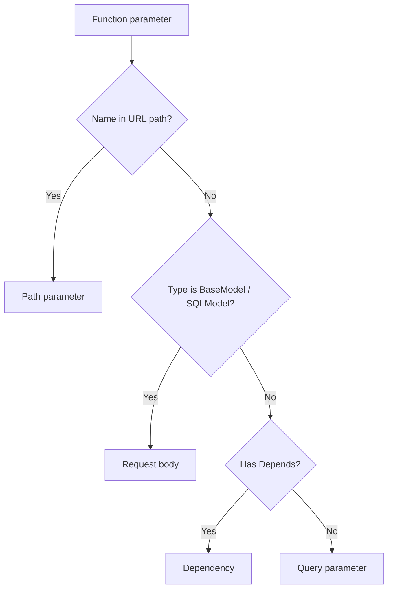
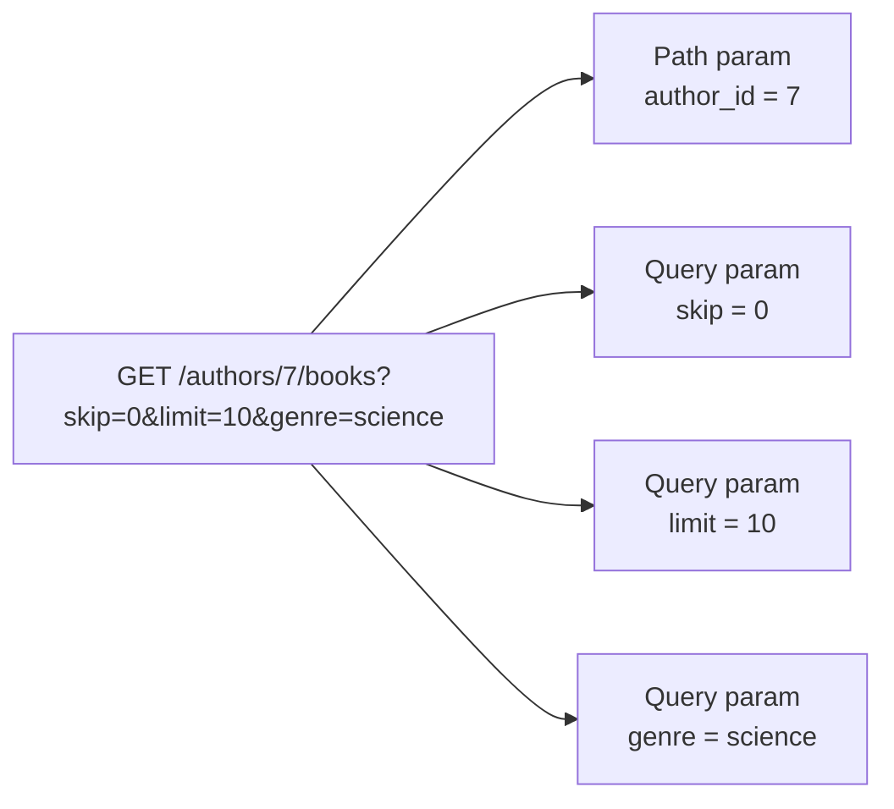
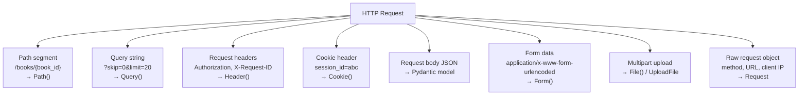

# 09 - Request Parameters: Path, Query, Headers, and Cookies

All parameter declarations in modern FastAPI use `Annotated`. The older style of assigning `Query(...)`, `Path(...)`, or `Header(...)` directly as default values still works but is not recommended — it breaks IDE type inference and mixes metadata into the default value slot.

---

## How FastAPI Resolves Parameters

FastAPI inspects function signatures using Python's `inspect` module and Pydantic. Resolution rules, in order:

1. If the parameter name matches a path segment (`{name}` in the route string) → **path parameter**
2. If the type annotation is a Pydantic `BaseModel` or `SQLModel` subclass → **request body**
3. If the parameter uses `Depends(...)` → **dependency**
4. Otherwise → **query parameter**

`Query()`, `Path()`, `Header()`, and `Cookie()` override this resolution explicitly. Use them whenever you need validation, aliases, or documentation metadata.



---

## Path Parameters

### Basic

```python
from fastapi import FastAPI

app = FastAPI()

@app.get("/books/{book_id}")
def get_book(book_id: int):
    return {"book_id": book_id}
```

FastAPI coerces the string from the URL to `int`. If the value cannot be coerced, it returns `422 Unprocessable Entity` automatically — no manual error handling needed.

### With validation using `Annotated` + `Path`

```python
from typing import Annotated
from fastapi import FastAPI, Path

app = FastAPI()

@app.get("/books/{book_id}")
def get_book(
    book_id: Annotated[int, Path(
        title      ="Book ID",
        description="Primary key of the book record",
        ge=1,
        le=999_999,
    )]
):
    return {"book_id": book_id}
```

Numeric constraints: `gt` (strictly greater), `ge` (greater or equal), `lt` (strictly less), `le` (less or equal). These are reflected directly in the generated OpenAPI schema.

### Enum path parameter

Enums provide a closed set of valid values with automatic documentation and `422` rejection for anything outside the set:

```python
from enum import Enum
from typing import Annotated
from fastapi import FastAPI, Path

class Genre(str, Enum):
    fiction    = "fiction"
    non_fiction = "non-fiction"
    science    = "science"
    biography  = "biography"

app = FastAPI()

@app.get("/genres/{genre}/books")
def list_by_genre(
    genre: Annotated[Genre, Path(title="Book genre")]
):
    return {"genre": genre.value}
```

`GET /genres/cooking/books` returns `422` — `cooking` is not a member of `Genre`.

### Path converter: capturing slashes

Standard `{param}` captures everything up to the next `/`. To capture a full file path including slashes, use Starlette's `:path` converter:

```python
@app.get("/files/{file_path:path}")
def read_file(file_path: str):
    # GET /files/reports/2024/q4.csv
    # file_path == "reports/2024/q4.csv"
    return {"path": file_path}
```

The `:path` converter is a Starlette feature, not a Pydantic one. You cannot attach `Path(ge=...)` numeric constraints to it — the value is always a raw string.

---

## Query Parameters

Any parameter not in the path and not a body model is a query parameter. FastAPI reads it from the URL query string.

### Basic required and optional

```python
from typing import Annotated
from fastapi import FastAPI, Query

app = FastAPI()

@app.get("/books/")
def list_books(
    skip  : Annotated[int,        Query(ge=0)]           = 0,
    limit : Annotated[int,        Query(ge=1, le=100)]   = 20,
    genre : Annotated[str | None, Query()]               = None,
):
    return {"skip": skip, "limit": limit, "genre": genre}
```

`skip` and `limit` have defaults → optional. `genre` is `str | None` with default `None` → optional. Remove the default to make a query parameter required.

### Required query parameter (no default)

```python
@app.get("/search/")
def search_books(
    q: Annotated[str, Query(min_length=2, max_length=100, title="Search term")]
):
    return {"query": q}
```

`GET /search/` without `?q=...` returns `422`.

### String constraints

```python
from typing import Annotated
from fastapi import Query

# length bounds
title  : Annotated[str, Query(min_length=1, max_length=256)]

# regex pattern — Pydantic v2 uses `pattern`, not `regex`
isbn   : Annotated[str, Query(pattern=r"^\d{13}$")]
```

The old `regex=` argument (Pydantic v1 / early FastAPI) is replaced by `pattern=` in Pydantic v2. Using `regex=` raises a deprecation warning.

### List query parameters

Multiple values for the same key: `?tag=python&tag=fastapi&tag=async`

```python
from typing import Annotated
from fastapi import FastAPI, Query

app = FastAPI()

@app.get("/books/")
def list_books(
    tags: Annotated[list[str], Query()] = [],
):
    return {"tags": tags}
```

Without the explicit `Query()`, FastAPI would interpret `tags` as a request body field. `Query()` explicitly routes it to the query string.

### Alias

When the query parameter name in the URL cannot be a valid Python identifier (e.g., it contains a hyphen):

```python
@app.get("/books/")
def list_books(
    # client sends ?sort-by=title
    sort_by: Annotated[str | None, Query(alias="sort-by")] = None,
):
    return {"sort_by": sort_by}
```

### Pydantic model as query parameter group (FastAPI 0.115+)

Group related query parameters into a Pydantic model to avoid long function signatures. The model fields become individual query parameters — the model itself does not appear in the URL.

```python
from typing import Annotated
from fastapi import FastAPI, Query
from pydantic import BaseModel, ConfigDict

app = FastAPI()

class PaginationParams(BaseModel):
    model_config = ConfigDict(extra="forbid")  # reject unknown query keys
    skip : int = 0
    limit: int = 20

@app.get("/books/")
def list_books(
    pagination: Annotated[PaginationParams, Query()]
):
    return {"skip": pagination.skip, "limit": pagination.limit}
```

Nested models do not work reliably as query parameters — Starlette parses query strings as flat key-value pairs. Keep query parameter models flat.

### Boolean query parameters

FastAPI accepts these string values as `True`: `"true"`, `"1"`, `"on"`, `"yes"`. And these as `False`: `"false"`, `"0"`, `"off"`, `"no"`. Case-insensitive.

```python
@app.get("/books/")
def list_books(include_out_of_stock: bool = False):
    return {"include_out_of_stock": include_out_of_stock}
# GET /books/?include_out_of_stock=yes  →  True
# GET /books/?include_out_of_stock=0    →  False
```

---

## Path + Query Together



```python
from typing import Annotated
from fastapi import FastAPI, Path, Query

app = FastAPI()

@app.get("/authors/{author_id}/books")
def list_author_books(
    author_id: Annotated[int,        Path(ge=1, title="Author ID")],
    skip     : Annotated[int,        Query(ge=0)]                   = 0,
    limit    : Annotated[int,        Query(ge=1, le=100)]           = 20,
    genre    : Annotated[str | None, Query(min_length=1)]           = None,
):
    return {
        "author_id": author_id,
        "skip"     : skip,
        "limit"    : limit,
        "genre"    : genre,
    }
```

FastAPI identifies each parameter by whether its name appears in the path string — the order in the function signature does not matter.

---

## Headers

HTTP headers are read with `Header`. FastAPI automatically converts underscores to hyphens (HTTP convention): `user_agent` in the function maps to the `User-Agent` header.

### Reading individual headers

```python
from typing import Annotated
from fastapi import FastAPI, Header

app = FastAPI()

@app.get("/books/")
def list_books(
    user_agent  : Annotated[str | None, Header()] = None,
    x_request_id: Annotated[str | None, Header()] = None,
):
    return {
        "User-Agent"   : user_agent,
        "X-Request-ID" : x_request_id,
    }
```

### Disabling underscore-to-hyphen conversion

```python
x_custom_header: Annotated[str | None, Header(convert_underscores=False)] = None
```

### List of repeated headers

Some headers (e.g., `X-Token`) can appear multiple times in a single request:

```python
@app.get("/warehouse/")
def warehouse(x_token: Annotated[list[str], Header()] = []):
    return {"tokens": x_token}
```

---

## Cookies

Cookies are read with `Cookie`. The value is extracted from the `Cookie` request header automatically.

```python
from typing import Annotated
from fastapi import FastAPI, Cookie

app = FastAPI()

@app.get("/cart/")
def read_cart(
    session_id: Annotated[str | None, Cookie()] = None,
):
    return {"session_id": session_id}
```

### Setting cookies on responses

```python
from fastapi import Response

@app.post("/auth/token")
def login(response: Response):
    response.set_cookie(
        key     ="session_id",
        value   ="abc123",
        httponly=True,   # not accessible from JavaScript
        secure  =True,   # HTTPS only
        samesite="lax",
    )
    return {"message": "logged in"}
```

---

## Parameter Source Summary



| Where is the data? | Use |
|---|---|
| URL path segment `/books/{id}` | `Path()` |
| URL query string `?skip=0&limit=10` | `Query()` |
| HTTP request header | `Header()` |
| HTTP cookie | `Cookie()` |
| Request body (JSON) | Pydantic model as parameter |
| Form data | `Form()` |
| File upload | `File()`, `UploadFile` |
| Raw request access | `Request` |

---

## Request Object

For raw access to method, URL, client IP, or any other low-level data, inject `Request` directly. It does not conflict with other declared parameters.

```python
from fastapi import FastAPI, Request

app = FastAPI()

@app.get("/debug/")
def debug_info(request: Request):
    return {
        "method"     : request.method,
        "url"        : str(request.url),
        "client_host": request.client.host if request.client else None,
        "headers"    : dict(request.headers),
    }
```

---

## Full Runnable Example — Bookstore

This example combines path, query, header, and cookie parameters in one route:

```python
from typing import Annotated
from enum import Enum
from fastapi import FastAPI, Path, Query, Header, Cookie

app = FastAPI()

class SortOrder(str, Enum):
    asc  = "asc"
    desc = "desc"

@app.get("/v1/authors/{author_id}/books")
def author_books(
    # path
    author_id        : Annotated[int,          Path(ge=1, title="Author ID")],
    # query
    year             : Annotated[int,          Query(ge=1800, le=2100, title="Publication year")],
    month            : Annotated[int | None,   Query(ge=1, le=12)]    = None,
    order            : Annotated[SortOrder,    Query()]               = SortOrder.desc,
    genre            : Annotated[str | None,   Query(min_length=1)]   = None,
    # header
    x_client_version : Annotated[str | None,   Header()]              = None,
    # cookie
    session          : Annotated[str | None,   Cookie()]              = None,
):
    return {
        "author_id"    : author_id,
        "year"         : year,
        "month"        : month,
        "order"        : order,
        "genre"        : genre,
        "client_version": x_client_version,
        "session"      : session,
    }
```

### Tests

```python
from fastapi.testclient import TestClient

client = TestClient(app)

def test_author_books_full():
    response = client.get(
        "/v1/authors/12/books",
        params ={"year": 2023, "month": 6, "order": "asc", "genre": "science"},
        headers={"X-Client-Version": "3.0.1"},
        cookies={"session": "tok_meera_42"},
    )
    assert response.status_code == 200
    data = response.json()
    assert data["author_id"]     == 12
    assert data["year"]          == 2023
    assert data["order"]         == "asc"
    assert data["client_version"] == "3.0.1"
    assert data["session"]       == "tok_meera_42"

def test_invalid_path_param():
    # ge=1 violated
    response = client.get("/v1/authors/0/books", params={"year": 2023})
    assert response.status_code == 422

def test_missing_required_query():
    # year has no default → required
    response = client.get("/v1/authors/1/books")
    assert response.status_code == 422

def test_invalid_enum():
    response = client.get(
        "/v1/authors/1/books",
        params={"year": 2023, "order": "random"},
    )
    assert response.status_code == 422
```

---

Next: [10 - Middleware, CORS, and Background Tasks](./10_middleware_cors_background_tasks.md)