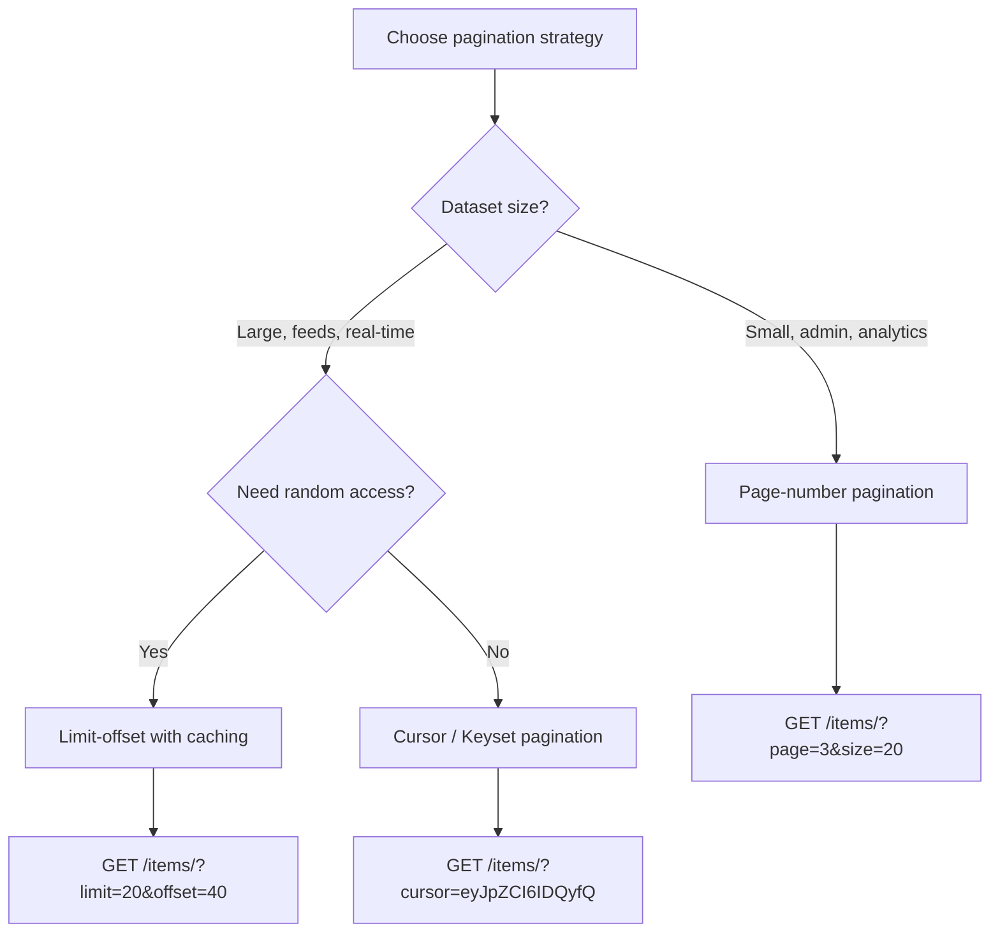

# 10 - Pagination, Filtering, Ordering, and Search

FastAPI has no built-in pagination system. Pagination is implemented through dependencies — reusable, composable, and testable. This is more flexible than a framework-level setting but requires you to wire it up explicitly.

---

## Why Pagination Matters

Returning an unbounded queryset on a list endpoint is a correctness problem, not just a performance problem. A single request that returns 500,000 rows will:

- exhaust database connection time limits
- serialize a response too large to transmit reliably
- consume unbounded memory on the server
- block the event loop if using sync code

All list endpoints that query a database must be paginated. No exceptions for "small" tables — tables grow.

---

## Pagination Strategies



| Strategy | SQL mechanism | Supports jump-to-page | Performance at depth | Stable under writes |
|---|---|---|---|---|
| Page-number | `LIMIT n OFFSET (page-1)*n` | Yes | Degrades | No |
| Limit-offset | `LIMIT n OFFSET m` | Yes (if offset given) | Degrades | No |
| Cursor / Keyset | `WHERE id > last_id` | No | Constant | Yes |

**Offset degrades** because the database must scan and discard all rows before the offset. `OFFSET 100000` with `LIMIT 20` still reads 100,020 rows. On tables above ~100k rows, cursor or keyset is required.

---

## 1. Page-Number Pagination

### Dependency

```python
# app/pagination.py
from typing import Annotated
from fastapi import Query
from pydantic import BaseModel

class PageParams(BaseModel):
    page: int = Query(default=1, ge=1, description="Page number, 1-indexed")
    size: int = Query(default=20, ge=1, le=100, description="Items per page")

    @property
    def offset(self) -> int:
        return (self.page - 1) * self.size

    @property
    def limit(self) -> int:
        return self.size

# Reusable type alias
PageDep = Annotated[PageParams, Query()]
```

### Generic paginated response envelope

```python
from typing import Generic, TypeVar
from pydantic import BaseModel

T = TypeVar("T")

class PagedResponse(BaseModel, Generic[T]):
    total: int
    page: int
    size: int
    pages: int
    results: list[T]

    @classmethod
    def create(cls, items: list[T], total: int, params: PageParams) -> "PagedResponse[T]":
        pages = (total + params.size - 1) // params.size  # ceiling division
        return cls(
            total=total,
            page=params.page,
            size=params.size,
            pages=pages,
            results=items,
        )
```

### Route using the dependency

```python
from typing import Annotated
from fastapi import APIRouter, Query
from sqlmodel import Session, select, func
from app.models.employee import Employee, EmployeeRead
from app.db import SessionDep
from app.pagination import PageDep, PagedResponse

router = APIRouter(prefix="/employees", tags=["employees"])

@router.get("/", response_model=PagedResponse[EmployeeRead])
def list_employees(session: SessionDep, pagination: PageDep):
    total = session.exec(select(func.count()).select_from(Employee)).one()
    employees = session.exec(
        select(Employee).offset(pagination.offset).limit(pagination.limit)
    ).all()
    return PagedResponse.create(list(employees), total, pagination)
```

Response shape:

```json
{
  "total": 120,
  "page": 3,
  "size": 20,
  "pages": 6,
  "results": [...]
}
```

---

## 2. Limit-Offset Pagination

More flexible than page-number — the client controls both the window size and the starting position independently.

```python
from typing import Annotated
from fastapi import Query
from pydantic import BaseModel

class LimitOffsetParams(BaseModel):
    limit: int = Query(default=20, ge=1, le=100)
    offset: int = Query(default=0, ge=0)

LimitOffsetDep = Annotated[LimitOffsetParams, Query()]
```

```python
@router.get("/", response_model=LimitOffsetResponse[EmployeeRead])
def list_employees(session: SessionDep, params: LimitOffsetDep):
    total = session.exec(select(func.count()).select_from(Employee)).one()
    items = session.exec(
        select(Employee).offset(params.offset).limit(params.limit)
    ).all()
    return {
        "total": total,
        "limit": params.limit,
        "offset": params.offset,
        "next_offset": params.offset + params.limit if params.offset + params.limit < total else None,
        "results": items,
    }
```

Client request: `GET /employees/?limit=20&offset=40`

---

## 3. Cursor Pagination (Keyset)

Uses the last-seen value of the sort column as a WHERE predicate instead of OFFSET. The database uses the index on that column — no rows are scanned and discarded.

The cursor sent to clients must be opaque (encoded) so that internal IDs are not exposed and so clients cannot forge arbitrary positions.

```python
import base64
import json
from typing import Annotated
from fastapi import Query
from pydantic import BaseModel

def encode_cursor(last_id: int) -> str:
    payload = json.dumps({"id": last_id}).encode()
    return base64.urlsafe_b64encode(payload).decode()

def decode_cursor(cursor: str) -> int:
    try:
        payload = base64.urlsafe_b64decode(cursor.encode())
        return json.loads(payload)["id"]
    except Exception:
        raise ValueError("Invalid cursor")
```

```python
from fastapi import HTTPException
from sqlmodel import select

class CursorResponse(BaseModel):
    results: list
    next_cursor: str | None
    has_more: bool

@router.get("/cursor", response_model=CursorResponse)
def list_employees_cursor(
    session: SessionDep,
    cursor: Annotated[str | None, Query(description="Opaque cursor from previous response")] = None,
    size: Annotated[int, Query(ge=1, le=100)] = 20,
):
    stmt = select(Employee).order_by(Employee.id)

    if cursor is not None:
        try:
            last_id = decode_cursor(cursor)
        except ValueError:
            raise HTTPException(status_code=422, detail="Invalid cursor value")
        stmt = stmt.where(Employee.id > last_id)

    # Fetch size+1 to detect if there is a next page
    items = session.exec(stmt.limit(size + 1)).all()
    has_more = len(items) > size
    page_items = items[:size]

    next_cursor = encode_cursor(page_items[-1].id) if has_more else None
    return CursorResponse(results=page_items, next_cursor=next_cursor, has_more=has_more)
```

**Why fetch `size + 1`**: avoids a separate COUNT query. If you get back `size + 1` items, you know there is a next page. Return only `size` items to the client.

**Ordering requirement**: cursor pagination requires a stable, unique sort key with a database index. Sorting on a non-unique column requires a composite key (e.g., `created_at` + `id`) to handle ties deterministically.

```python
# Composite cursor: stable even when sort column has duplicates
from datetime import datetime

def encode_cursor_composite(created_at: datetime, id: int) -> str:
    payload = json.dumps({"created_at": created_at.isoformat(), "id": id}).encode()
    return base64.urlsafe_b64encode(payload).decode()

# SQL predicate for composite cursor (row comparison):
# WHERE (created_at, id) < (:last_created_at, :last_id) ORDER BY created_at DESC, id DESC
```

---

## 4. Using `fastapi-pagination` (third-party library)

For teams that want pagination without manual implementation:

```bash
pip install fastapi-pagination
```

```python
from fastapi import FastAPI
from fastapi_pagination import add_pagination, Page
from fastapi_pagination.ext.sqlmodel import paginate
from sqlmodel import select

app = FastAPI()
add_pagination(app)  # required: registers pagination middleware

@app.get("/employees", response_model=Page[EmployeeRead])
def list_employees(session: SessionDep):
    return paginate(session, select(Employee).order_by(Employee.id))
```

`Page[T]` produces: `{"items": [...], "total": N, "page": P, "size": S, "pages": N}`.

The default `paginate()` on raw in-memory lists loads all records first. Use `fastapi_pagination.ext.sqlmodel.paginate` to paginate at the SQL level.

---

## Filtering and Search

FastAPI has no built-in filter backend. Filtering is implemented as query parameters in the route function, applied to the SQLModel query.

### Basic filter via query parameter

```python
@router.get("/", response_model=PagedResponse[EmployeeRead])
def list_employees(
    session: SessionDep,
    pagination: PageDep,
    department: Annotated[str | None, Query(description="Filter by department")] = None,
    min_salary: Annotated[float | None, Query(ge=0)] = None,
    max_salary: Annotated[float | None, Query(ge=0)] = None,
):
    stmt = select(Employee)

    if department is not None:
        stmt = stmt.where(Employee.department == department)
    if min_salary is not None:
        stmt = stmt.where(Employee.salary >= min_salary)
    if max_salary is not None:
        stmt = stmt.where(Employee.salary <= max_salary)

    total = session.exec(select(func.count()).select_from(stmt.subquery())).one()
    items = session.exec(stmt.offset(pagination.offset).limit(pagination.limit)).all()
    return PagedResponse.create(list(items), total, pagination)
```

### Text search (contains, starts-with, exact)

SQL `LIKE` via SQLModel/SQLAlchemy:

```python
from sqlmodel import col

# contains (case-insensitive ilike on PostgreSQL, SQLite uses LIKE which is case-insensitive for ASCII)
if search is not None:
    stmt = stmt.where(col(Employee.name).ilike(f"%{search}%"))

# starts-with
stmt = stmt.where(col(Employee.name).ilike(f"{search}%"))

# exact match
stmt = stmt.where(Employee.name == search)
```

The source material's `=` prefix for exact and `^` for starts-with are DRF-specific syntax for `search_fields`. In FastAPI, match type is chosen in code, not in a config string prefix.

### Encapsulating filters as a dependency

For routes with many filter parameters, group them into a Pydantic model used as a dependency to avoid bloated function signatures:

```python
from typing import Annotated
from fastapi import Depends, Query
from pydantic import BaseModel

class EmployeeFilters(BaseModel):
    department: str | None = None
    name_contains: str | None = None
    min_salary: float | None = None
    max_salary: float | None = None

def get_employee_filters(
    department: Annotated[str | None, Query()] = None,
    name_contains: Annotated[str | None, Query(min_length=1)] = None,
    min_salary: Annotated[float | None, Query(ge=0)] = None,
    max_salary: Annotated[float | None, Query(ge=0)] = None,
) -> EmployeeFilters:
    return EmployeeFilters(
        department=department,
        name_contains=name_contains,
        min_salary=min_salary,
        max_salary=max_salary,
    )

FiltersDep = Annotated[EmployeeFilters, Depends(get_employee_filters)]
```

```python
def apply_filters(stmt, filters: EmployeeFilters):
    if filters.department:
        stmt = stmt.where(Employee.department == filters.department)
    if filters.name_contains:
        stmt = stmt.where(col(Employee.name).ilike(f"%{filters.name_contains}%"))
    if filters.min_salary is not None:
        stmt = stmt.where(Employee.salary >= filters.min_salary)
    if filters.max_salary is not None:
        stmt = stmt.where(Employee.salary <= filters.max_salary)
    return stmt

@router.get("/", response_model=PagedResponse[EmployeeRead])
def list_employees(session: SessionDep, pagination: PageDep, filters: FiltersDep):
    stmt = apply_filters(select(Employee), filters)
    total = session.exec(select(func.count()).select_from(stmt.subquery())).one()
    items = session.exec(stmt.offset(pagination.offset).limit(pagination.limit)).all()
    return PagedResponse.create(list(items), total, pagination)
```

---

## Ordering

Ordering is a query parameter that selects a sort field and direction. Validate the field against an allowlist — never interpolate client input directly into a SQL ORDER BY.

```python
from enum import Enum
from typing import Annotated
from fastapi import Query

class EmployeeSortField(str, Enum):
    id = "id"
    name = "name"
    salary = "salary"
    department = "department"

class SortOrder(str, Enum):
    asc = "asc"
    desc = "desc"
```

```python
from sqlmodel import asc, desc, col

@router.get("/", response_model=PagedResponse[EmployeeRead])
def list_employees(
    session: SessionDep,
    pagination: PageDep,
    filters: FiltersDep,
    sort_by: Annotated[EmployeeSortField, Query()] = EmployeeSortField.id,
    order: Annotated[SortOrder, Query()] = SortOrder.asc,
):
    sort_column = getattr(Employee, sort_by.value)
    sort_expr = asc(sort_column) if order == SortOrder.asc else desc(sort_column)

    stmt = apply_filters(select(Employee), filters).order_by(sort_expr)
    total = session.exec(select(func.count()).select_from(stmt.subquery())).one()
    items = session.exec(stmt.offset(pagination.offset).limit(pagination.limit)).all()
    return PagedResponse.create(list(items), total, pagination)
```

Client requests:
```
GET /employees/?sort_by=salary&order=desc
GET /employees/?sort_by=name&order=asc&department=engineering
GET /employees/?sort_by=salary&order=desc&min_salary=50000&page=2&size=20
```

---

## Complete Runnable Example

```python
# app/routers/employees.py
from typing import Annotated, Generic, TypeVar
from enum import Enum
from fastapi import APIRouter, Depends, Query
from sqlmodel import Session, select, col, asc, desc, func
from pydantic import BaseModel
from app.models.employee import Employee, EmployeeRead
from app.db import SessionDep

router = APIRouter(prefix="/employees", tags=["employees"])

T = TypeVar("T")

class PagedResponse(BaseModel, Generic[T]):
    total: int
    page: int
    size: int
    pages: int
    results: list[T]

class EmployeeSortField(str, Enum):
    id = "id"
    name = "ename"
    salary = "esal"

class SortOrder(str, Enum):
    asc = "asc"
    desc = "desc"

@router.get("/", response_model=PagedResponse[EmployeeRead])
def list_employees(
    session: SessionDep,
    # pagination
    page: Annotated[int, Query(ge=1)] = 1,
    size: Annotated[int, Query(ge=1, le=100)] = 20,
    # filters
    name_contains: Annotated[str | None, Query(min_length=1)] = None,
    min_salary: Annotated[float | None, Query(ge=0)] = None,
    # ordering
    sort_by: Annotated[EmployeeSortField, Query()] = EmployeeSortField.id,
    order: Annotated[SortOrder, Query()] = SortOrder.asc,
):
    stmt = select(Employee)

    if name_contains:
        stmt = stmt.where(col(Employee.ename).ilike(f"%{name_contains}%"))
    if min_salary is not None:
        stmt = stmt.where(Employee.esal >= min_salary)

    sort_col = getattr(Employee, sort_by.value)
    stmt = stmt.order_by(asc(sort_col) if order == SortOrder.asc else desc(sort_col))

    total = session.exec(select(func.count()).select_from(stmt.subquery())).one()
    offset = (page - 1) * size
    items = session.exec(stmt.offset(offset).limit(size)).all()
    pages = (total + size - 1) // size

    return PagedResponse(total=total, page=page, size=size, pages=pages, results=list(items))
```

---

## OpenAPI Documentation (Built-in, Zero Config)

The source material references `django-rest-swagger` as a third-party package requiring installation and INSTALLED_APPS registration to get Swagger UI.

FastAPI generates OpenAPI documentation automatically. No package installation, no configuration. The docs are available at:

- `/docs` — Swagger UI (interactive, supports authentication headers)
- `/redoc` — ReDoc (read-only, better for documentation publishing)
- `/openapi.json` — raw OpenAPI 3.x schema

All query parameters declared with `Query()`, their types, constraints, defaults, and descriptions appear in the Swagger UI automatically. No annotation work beyond what is already written for validation.

To customize the docs:

```python
from fastapi import FastAPI

app = FastAPI(
    title="Employee API",
    description="CRUD and search operations on employee records",
    version="1.0.0",
    docs_url="/docs",       # change or set None to disable
    redoc_url="/redoc",
    openapi_url="/openapi.json",
)
```

To disable docs in production while keeping the schema endpoint:

```python
app = FastAPI(docs_url=None, redoc_url=None)
```

---

## Testing Pagination

```python
from fastapi.testclient import TestClient
from app.main import app

client = TestClient(app)

def test_pagination_defaults():
    r = client.get("/employees/")
    assert r.status_code == 200
    body = r.json()
    assert "total" in body
    assert "results" in body
    assert len(body["results"]) <= 20

def test_pagination_page_two():
    r = client.get("/employees/?page=2&size=5")
    assert r.status_code == 200
    assert r.json()["page"] == 2

def test_filter_by_name():
    r = client.get("/employees/?name_contains=John")
    assert r.status_code == 200
    for emp in r.json()["results"]:
        assert "john" in emp["ename"].lower()

def test_ordering():
    r = client.get("/employees/?sort_by=salary&order=desc")
    assert r.status_code == 200
    salaries = [e["esal"] for e in r.json()["results"]]
    assert salaries == sorted(salaries, reverse=True)

def test_invalid_page():
    r = client.get("/employees/?page=0")
    assert r.status_code == 422

def test_size_exceeds_max():
    r = client.get("/employees/?size=500")
    assert r.status_code == 422
```

---

Next: [11 - Relationships and Nested Responses with SQLModel](./11_relationships_and_nested_responses.md)