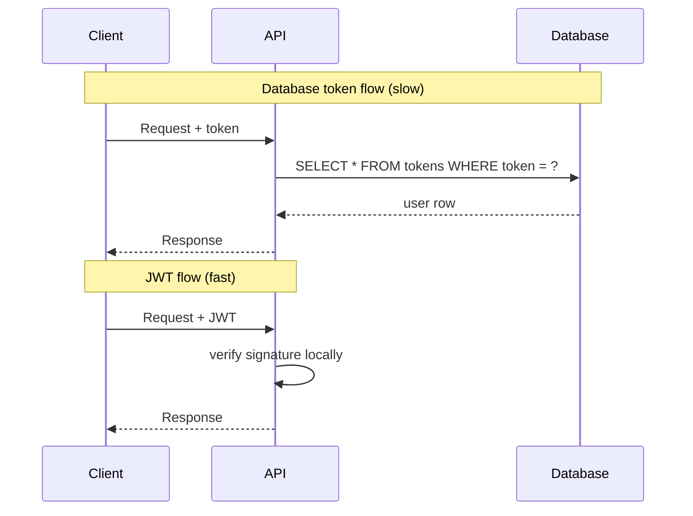
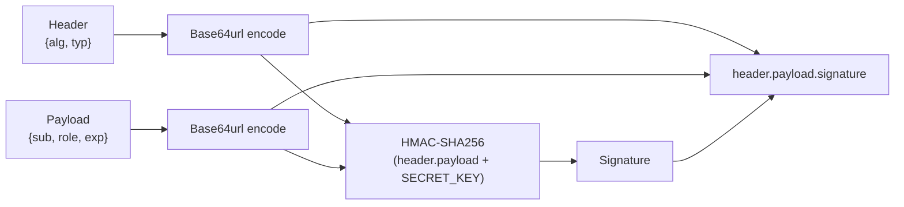
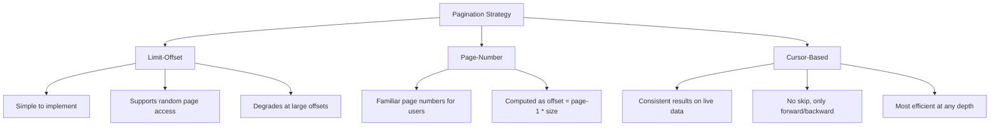
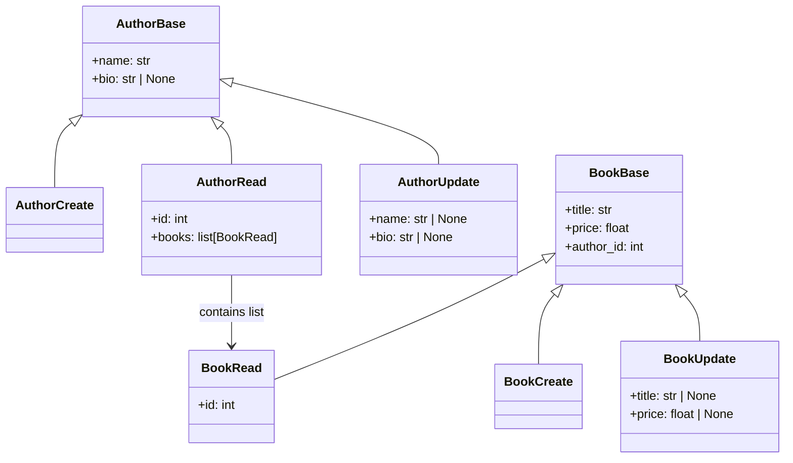

# 08 — FastAPI Q&A: Security, Permissions, Pagination, Filtering, and Nested Models

---

## Security and Authentication

---

### Q1. What is the difference between authentication and authorization in FastAPI?

Authentication answers "who are you?" — it verifies the caller's identity by checking credentials such as a password or a token.

Authorization answers "what are you allowed to do?" — it determines whether an already-identified caller has permission to perform a specific action on a specific resource.

In FastAPI both concerns are handled through dependency injection. Authentication dependencies extract and verify credentials. Authorization dependencies check the verified identity against business rules.

```
Request
  │
  ▼
authenticate (who are you?)
  │
  ▼
authorize (are you allowed?)
  │
  ▼
route handler
```

---

### Q2. What security schemes does FastAPI support out of the box?

FastAPI's `fastapi.security` module provides ready-made classes for the most common schemes.

| Class | Scheme | Use case |
|---|---|---|
| `HTTPBasic` | HTTP Basic | Simple username/password, not recommended for production |
| `APIKeyHeader` | API Key in header | Machine-to-machine calls |
| `APIKeyQuery` | API Key in query param | Webhooks, simple integrations |
| `OAuth2PasswordBearer` | Bearer token via form login | User-facing APIs with JWT |
| `HTTPBearer` | Raw Bearer header | Custom token formats |

All of them integrate with FastAPI's dependency injection system using `Depends()`. They also integrate automatically with the OpenAPI docs, so Swagger UI shows the correct "Authorize" button.

---

### Q3. Why is JWT authentication preferred over storing tokens in a database table?

When tokens are persisted in a database table every single request requires a round-trip to that table to validate the token and look up the associated user. Under high traffic this creates a bottleneck and reduces the scalability of the API.

JWT (JSON Web Token) is self-contained. The token itself encodes the user identity and expiry time and is cryptographically signed. The server verifies the signature using a secret key — no database lookup is needed. This makes JWTs stateless, which means any server instance in a cluster can verify any token independently.



The tradeoff is that JWTs cannot be invalidated before they expire unless you maintain a blocklist (which brings back a database lookup). Short expiry times mitigate this.

---

### Q4. How do you implement JWT authentication in FastAPI? Show a complete working example for a bookstore API.

Install dependencies:

```bash
pip install fastapi uvicorn sqlmodel python-jose[cryptography] passlib[bcrypt]
```

**`auth/config.py`**

```python
SECRET_KEY    = "openssl-rand-hex-32-output-goes-here"
ALGORITHM     = "HS256"
ACCESS_TOKEN_EXPIRE_MINUTES = 30
```

**`auth/utils.py`**

```python
from datetime import datetime, timedelta, timezone
from typing import Annotated

from fastapi import Depends, HTTPException, status
from fastapi.security import OAuth2PasswordBearer
from jose import JWTError, jwt
from passlib.context import CryptContext
from pydantic import BaseModel

from auth.config import ACCESS_TOKEN_EXPIRE_MINUTES, ALGORITHM, SECRET_KEY

pwd_context   = CryptContext(schemes=["bcrypt"], deprecated="auto")
oauth2_scheme = OAuth2PasswordBearer(tokenUrl="/auth/token")


class TokenData(BaseModel):
    username: str | None = None


def hash_password(plain: str) -> str:
    return pwd_context.hash(plain)


def verify_password(plain: str, hashed: str) -> bool:
    return pwd_context.verify(plain, hashed)


def create_access_token(data: dict) -> str:
    payload = data.copy()
    expire  = datetime.now(timezone.utc) + timedelta(minutes=ACCESS_TOKEN_EXPIRE_MINUTES)
    payload.update({"exp": expire})
    return jwt.encode(payload, SECRET_KEY, algorithm=ALGORITHM)


def decode_token(token: Annotated[str, Depends(oauth2_scheme)]) -> TokenData:
    credentials_exception = HTTPException(
        status_code=status.HTTP_401_UNAUTHORIZED,
        detail="Could not validate credentials",
        headers={"WWW-Authenticate": "Bearer"},
    )
    try:
        payload  = jwt.decode(token, SECRET_KEY, algorithms=[ALGORITHM])
        username = payload.get("sub")
        if username is None:
            raise credentials_exception
        return TokenData(username=username)
    except JWTError:
        raise credentials_exception
```

**`auth/router.py`**

```python
from typing import Annotated

from fastapi import APIRouter, Depends, HTTPException, status
from fastapi.security import OAuth2PasswordRequestForm
from pydantic import BaseModel

from auth.utils import create_access_token, verify_password

router = APIRouter(prefix="/auth", tags=["auth"])

# In production this comes from the database
FAKE_USERS = {
    "durga": {
        "username": "durga",
        "hashed_password": "$2b$12$...",  # hash of actual password
        "role": "admin",
    },
    "meera": {
        "username": "meera",
        "hashed_password": "$2b$12$...",
        "role": "customer",
    },
}


class Token(BaseModel):
    access_token: str
    token_type:   str


@router.post("/token", response_model=Token)
def login(form_data: Annotated[OAuth2PasswordRequestForm, Depends()]):
    user = FAKE_USERS.get(form_data.username)
    if not user or not verify_password(form_data.password, user["hashed_password"]):
        raise HTTPException(
            status_code=status.HTTP_401_UNAUTHORIZED,
            detail="Incorrect username or password",
            headers={"WWW-Authenticate": "Bearer"},
        )
    token = create_access_token(data={"sub": user["username"], "role": user["role"]})
    return Token(access_token=token, token_type="bearer")
```

**`main.py`**

```python
from contextlib import asynccontextmanager

from fastapi import FastAPI

from auth.router import router as auth_router


@asynccontextmanager
async def lifespan(app: FastAPI):
    yield


app = FastAPI(lifespan=lifespan)
app.include_router(auth_router)
```

The client sends `POST /auth/token` with `Content-Type: application/x-www-form-urlencoded` and receives a Bearer token. It then attaches `Authorization: Bearer <token>` to every protected request.

---

### Q5. What are permission levels and how do you model them in FastAPI?

FastAPI has no built-in permission class hierarchy. Permissions are modeled as reusable dependency functions. The equivalent tiers are:

| Concept | FastAPI implementation |
|---|---|
| Allow anyone | No dependency, or an empty function |
| Allow authenticated users only | `Depends(decode_token)` resolves the current user |
| Allow only admin/superuser | Dependency that checks `current_user.role == "admin"` |
| Allow read for anyone, write for authenticated | Check `request.method` inside the dependency |
| Model-level permissions | Check specific permissions stored on the user object |

The dependency is composable — you inject a stricter dependency where needed and a permissive one where not.

---

### Q6. How do you implement an "allow any" and "allow authenticated only" access pattern?

```python
from typing import Annotated

from fastapi import APIRouter, Depends

from auth.utils import TokenData, decode_token

router = APIRouter(prefix="/books", tags=["books"])

CurrentUser = Annotated[TokenData, Depends(decode_token)]


# Public — anyone can call this
@router.get("/")
def list_books():
    return [{"title": "The God of Small Things"}, {"title": "A Suitable Boy"}]


# Protected — JWT required
@router.get("/my-orders")
def my_orders(current_user: CurrentUser):
    return {"user": current_user.username, "orders": []}
```

If the token is missing or invalid, `decode_token` raises `HTTP 401` before the route handler runs.

---

### Q7. How do you implement admin-only access?

Create a dependency that first resolves the current user, then asserts the role:

```python
from typing import Annotated

from fastapi import Depends, HTTPException, status
from jose import jwt

from auth.config import ALGORITHM, SECRET_KEY
from auth.utils import TokenData, oauth2_scheme


def get_current_user(token: Annotated[str, Depends(oauth2_scheme)]) -> dict:
    try:
        payload = jwt.decode(token, SECRET_KEY, algorithms=[ALGORITHM])
    except Exception:
        raise HTTPException(status_code=status.HTTP_401_UNAUTHORIZED, detail="Invalid token")
    return payload


def require_admin(user: Annotated[dict, Depends(get_current_user)]) -> dict:
    if user.get("role") != "admin":
        raise HTTPException(
            status_code=status.HTTP_403_FORBIDDEN,
            detail="Admin access required",
        )
    return user


AdminUser = Annotated[dict, Depends(require_admin)]
```

Apply at route level or at router level:

```python
from fastapi import APIRouter, Depends

from auth.permissions import require_admin

# Option A — single route
@router.delete("/books/{book_id}", status_code=204)
def delete_book(book_id: int, _: AdminUser):
    ...


# Option B — entire router (all routes inside require admin)
admin_router = APIRouter(
    prefix="/admin",
    tags=["admin"],
    dependencies=[Depends(require_admin)],
)
```

Option B is the cleaner approach for groups of routes that share the same access level.

---

### Q8. How do you implement "read for anyone, write for authenticated users"?

```python
from typing import Annotated

from fastapi import Depends, HTTPException, Request, status
from fastapi.security import OAuth2PasswordBearer
from jose import jwt

from auth.config import ALGORITHM, SECRET_KEY

oauth2_scheme = OAuth2PasswordBearer(tokenUrl="/auth/token", auto_error=False)


def read_or_authenticated(
    request: Request,
    token: Annotated[str | None, Depends(oauth2_scheme)],
) -> dict | None:
    safe_methods = {"GET", "HEAD", "OPTIONS"}
    if request.method in safe_methods:
        return None   # unauthenticated reads are fine
    if token is None:
        raise HTTPException(
            status_code=status.HTTP_401_UNAUTHORIZED,
            detail="Authentication required for write operations",
        )
    try:
        return jwt.decode(token, SECRET_KEY, algorithms=[ALGORITHM])
    except Exception:
        raise HTTPException(status_code=status.HTTP_401_UNAUTHORIZED, detail="Invalid token")
```

`auto_error=False` on `OAuth2PasswordBearer` tells FastAPI not to automatically raise 401 when the header is absent — the dependency itself decides what to do based on the HTTP method.

---

### Q9. How do you implement custom authentication — for example, a secret key passed as a query parameter?

Extend the dependency pattern. The following example requires a `username` and a `key` as query parameters. The key must be 7 characters, the first character must match the last character of the username (lowercased), the third character must be `Z`, and the fifth character must match the first character of the username.

```python
from typing import Annotated

from fastapi import Depends, HTTPException, Query, status


def custom_key_auth(
    username: Annotated[str, Query()],
    key:      Annotated[str, Query()],
) -> str:
    if len(key) != 7:
        raise HTTPException(status_code=status.HTTP_401_UNAUTHORIZED, detail="Key must be 7 characters")

    rule_1 = key[0] == username[-1].lower()
    rule_2 = key[2] == "Z"
    rule_3 = key[4] == username[0]

    if not (rule_1 and rule_2 and rule_3):
        raise HTTPException(
            status_code=status.HTTP_401_UNAUTHORIZED,
            detail="Provided key is invalid",
        )
    return username


AuthedUsername = Annotated[str, Depends(custom_key_auth)]
```

Usage:

```python
@router.get("/catalog")
def get_catalog(username: AuthedUsername):
    return {"user": username, "books": []}
```

Request: `GET /catalog?username=durga&key=a7ZXd98`

The dependency runs before the handler. If the key fails validation it raises 401 and the handler never executes.

---

### Q10. What is the JWT token structure? How does FastAPI verify it without a database lookup?

A JWT consists of three base64url-encoded segments separated by dots:

```
header.payload.signature
```



On every request FastAPI:

1. Extracts the token from the `Authorization: Bearer` header.
2. Re-computes `HMAC-SHA256(header + "." + payload, SECRET_KEY)`.
3. Compares the result to the signature in the token.
4. If they match and `exp` has not passed, the payload is trusted and no DB call is needed.

The payload carries `sub` (subject — typically the username) and any custom claims like `role`. The dependency reads these claims directly from the decoded payload.

---

### Q11. How do you apply router-level authentication so every route inside a router is protected?

```python
from fastapi import APIRouter, Depends

from auth.utils import decode_token

protected_router = APIRouter(
    prefix="/orders",
    tags=["orders"],
    dependencies=[Depends(decode_token)],   # applied to every route in this router
)


@protected_router.get("/")
def list_orders():
    return []


@protected_router.post("/", status_code=201)
def create_order():
    return {}
```

The `dependencies` parameter on `APIRouter` runs before every route registered on that router. You do not repeat `Depends(decode_token)` on each route function.

---

## Pagination

---

### Q12. What pagination strategies are available in FastAPI?

There are three common strategies:

| Strategy | Use when |
|---|---|
| Limit-offset | Small to medium datasets, random access needed |
| Page-number | Exposing page numbers to end users (1, 2, 3...) |
| Cursor-based | Large or fast-changing datasets, consistent results required |

FastAPI has no built-in pagination helper. You implement it through query parameters and SQLModel query methods, or use the `fastapi-pagination` library for a higher-level API.



---

### Q13. How do you implement limit-offset pagination with SQLModel?

```python
from typing import Annotated

from fastapi import APIRouter, Depends, Query
from sqlmodel import Session, select

from db import SessionDep, engine
from models import Book, BookRead

router = APIRouter(prefix="/books", tags=["books"])


@router.get("/", response_model=list[BookRead])
def list_books(
    offset: Annotated[int, Query(ge=0)]          = 0,
    limit:  Annotated[int, Query(ge=1, le=100)]  = 20,
    session: SessionDep                          = None,
):
    books = session.exec(select(Book).offset(offset).limit(limit)).all()
    return books
```

Request: `GET /books/?offset=40&limit=20` returns items 41 to 60.

The `Query(ge=0)` and `Query(ge=1, le=100)` apply Pydantic v2 validation directly on the query parameter. Invalid values return a `422 Unprocessable Entity` automatically.

---

### Q14. How do you implement page-number pagination and return total count metadata?

```python
from typing import Annotated, Generic, TypeVar

from fastapi import APIRouter, Query
from pydantic import BaseModel
from sqlmodel import Session, func, select

from db import SessionDep
from models import Book, BookRead

T = TypeVar("T")

router = APIRouter(prefix="/books", tags=["books"])


class PageResponse(BaseModel, Generic[T]):
    total:    int
    page:     int
    size:     int
    pages:    int
    results:  list[T]


@router.get("/", response_model=PageResponse[BookRead])
def list_books(
    page:    Annotated[int, Query(ge=1)]          = 1,
    size:    Annotated[int, Query(ge=1, le=100)]  = 20,
    session: SessionDep                           = None,
):
    total   = session.exec(select(func.count()).select_from(Book)).one()
    offset  = (page - 1) * size
    books   = session.exec(select(Book).offset(offset).limit(size)).all()
    pages   = (total + size - 1) // size

    return PageResponse(
        total=total,
        page=page,
        size=size,
        pages=pages,
        results=books,
    )
```

Response shape:

```json
{
  "total": 240,
  "page": 3,
  "size": 20,
  "pages": 12,
  "results": [...]
}
```

---

### Q15. How does cursor-based pagination work and when should you use it?

Cursor-based pagination uses the ID (or another unique sequential field) of the last item returned as a pointer into the dataset. Instead of computing `OFFSET`, the query uses `WHERE id > cursor`. This is a constant-time operation at any depth because the database uses the index on `id` rather than skipping rows.

Use it when:
- The dataset is large (millions of rows).
- Data changes frequently (rows inserted or deleted between pages).
- You only need forward/backward navigation, not random page access.

```python
from typing import Annotated

from fastapi import APIRouter, Query
from sqlmodel import Session, select

from db import SessionDep
from models import Book, BookRead

router = APIRouter(prefix="/books", tags=["books"])


class CursorPage(BaseModel):
    results:     list[BookRead]
    next_cursor: int | None


@router.get("/cursor", response_model=CursorPage)
def list_books_cursor(
    after:   Annotated[int | None, Query(description="Last book id from previous page")] = None,
    limit:   Annotated[int, Query(ge=1, le=100)]                                         = 20,
    session: SessionDep                                                                   = None,
):
    stmt = select(Book).order_by(Book.id).limit(limit + 1)
    if after is not None:
        stmt = stmt.where(Book.id > after)

    books       = session.exec(stmt).all()
    has_more    = len(books) > limit
    results     = books[:limit]
    next_cursor = results[-1].id if has_more else None

    return CursorPage(results=results, next_cursor=next_cursor)
```

Fetching `limit + 1` rows is a common trick to check whether a next page exists without a separate `COUNT` query. If more than `limit` rows come back, there is a next page; the extra row is discarded from the results.

Request:
```
GET /books/cursor?limit=20              # first page
GET /books/cursor?after=20&limit=20    # next page
```

---

### Q16. How do you use the `fastapi-pagination` library with SQLModel?

```bash
pip install fastapi-pagination
```

```python
from contextlib import asynccontextmanager

from fastapi import FastAPI
from fastapi_pagination import add_pagination
from fastapi_pagination.ext.sqlmodel import paginate
from fastapi_pagination import Page
from sqlmodel import Session, select

from db import SessionDep
from models import Book, BookRead


@asynccontextmanager
async def lifespan(app: FastAPI):
    yield


app = FastAPI(lifespan=lifespan)
add_pagination(app)   # registers pagination parameters globally


@app.get("/books", response_model=Page[BookRead])
def list_books(session: SessionDep):
    return paginate(session, select(Book).order_by(Book.title))
```

The library injects `page` and `size` query parameters automatically. Switch to limit-offset by importing `LimitOffsetPage` and `LimitOffsetParams` instead.

---

## Filtering and Ordering

---

### Q17. How do you implement filtering and ordering on a list endpoint in FastAPI?

Filtering and ordering are implemented as optional query parameters. The route function builds the SQLModel query conditionally based on which parameters are provided.

```python
from typing import Annotated, Literal

from fastapi import APIRouter, Query
from sqlmodel import Session, col, select

from db import SessionDep
from models import Book, BookRead

router = APIRouter(prefix="/books", tags=["books"])


@router.get("/", response_model=list[BookRead])
def list_books(
    genre:     Annotated[str | None,  Query()]                              = None,
    min_price: Annotated[float | None, Query(ge=0)]                        = None,
    max_price: Annotated[float | None, Query(ge=0)]                        = None,
    order_by:  Annotated[Literal["title", "price", "created_at"], Query()] = "title",
    order_dir: Annotated[Literal["asc", "desc"], Query()]                  = "asc",
    offset:    Annotated[int, Query(ge=0)]                                 = 0,
    limit:     Annotated[int, Query(ge=1, le=100)]                         = 20,
    session:   SessionDep                                                  = None,
):
    stmt = select(Book)

    if genre is not None:
        stmt = stmt.where(Book.genre == genre)
    if min_price is not None:
        stmt = stmt.where(Book.price >= min_price)
    if max_price is not None:
        stmt = stmt.where(Book.price <= max_price)

    sort_col = col(getattr(Book, order_by))
    stmt     = stmt.order_by(sort_col.desc() if order_dir == "desc" else sort_col.asc())
    stmt     = stmt.offset(offset).limit(limit)

    return session.exec(stmt).all()
```

Sample request:

```
GET /books/?genre=fiction&min_price=200&order_by=price&order_dir=desc&limit=10
```

`Literal["title", "price", "created_at"]` restricts the allowed values for `order_by` at the Pydantic validation layer before the query runs, preventing SQL injection through column name injection.

---

### Q18. How do you extract common filtering parameters into a reusable dependency?

```python
from dataclasses import dataclass
from typing import Annotated, Literal

from fastapi import Depends, Query


@dataclass
class PaginationParams:
    offset:    int   = Query(default=0,  ge=0)
    limit:     int   = Query(default=20, ge=1, le=100)
    order_dir: Literal["asc", "desc"] = Query(default="asc")


PaginationDep = Annotated[PaginationParams, Depends()]
```

Usage:

```python
@router.get("/", response_model=list[BookRead])
def list_books(p: PaginationDep, session: SessionDep):
    stmt = select(Book).offset(p.offset).limit(p.limit)
    if p.order_dir == "desc":
        stmt = stmt.order_by(Book.title.desc())
    return session.exec(stmt).all()
```

Using a dataclass (or a Pydantic model) with `Depends()` and no explicit constructor arguments tells FastAPI to populate the fields from query parameters automatically. This pattern avoids repeating `offset`, `limit`, and `order_dir` on every route.

---

## Nested Models

---

### Q19. When should you use nested Pydantic/SQLModel schemas?

Use nested schemas when the response for one resource must include related resource data inline. This typically maps to foreign key relationships in the database.

Examples:
- A book response that includes its author's name and bio.
- An order response that includes a list of order line items.
- A course response that includes the list of enrolled students.

The read schema is the place for nesting. Create and update schemas normally accept only the foreign key ID, not the full nested object, to avoid ambiguity about whether you are creating or linking the related resource.

---

### Q20. How do you implement nested schemas for a one-to-many relationship? Show an example with a bookstore (Author → Books).

**`models.py`**

```python
from typing import Optional

from sqlmodel import Field, Relationship, SQLModel


class Author(SQLModel, table=True):
    id:   int | None = Field(default=None, primary_key=True)
    name: str
    bio:  str | None = None

    books: list["Book"] = Relationship(back_populates="author")


class Book(SQLModel, table=True):
    id:        int | None = Field(default=None, primary_key=True)
    title:     str
    price:     float
    author_id: int        = Field(foreign_key="author.id")

    author: Optional[Author] = Relationship(back_populates="books")
```

**`schemas.py`**

```python
from pydantic import BaseModel, ConfigDict


class BookRead(BaseModel):
    model_config = ConfigDict(from_attributes=True)

    id:    int
    title: str
    price: float


class AuthorBase(BaseModel):
    name: str
    bio:  str | None = None


class AuthorCreate(AuthorBase):
    pass


class AuthorRead(AuthorBase):
    model_config = ConfigDict(from_attributes=True)

    id:    int
    books: list[BookRead] = []   # nested
```

**`routers/authors.py`**

```python
from typing import Annotated

from fastapi import APIRouter, Depends, HTTPException, status
from sqlmodel import Session, select

from db import SessionDep
from models import Author
from schemas import AuthorCreate, AuthorRead

router = APIRouter(prefix="/authors", tags=["authors"])


def get_author_or_404(author_id: int, session: SessionDep) -> Author:
    author = session.get(Author, author_id)
    if not author:
        raise HTTPException(status_code=404, detail="Author not found")
    return author


AuthorDep = Annotated[Author, Depends(get_author_or_404)]


@router.get("/{author_id}", response_model=AuthorRead)
def get_author(author: AuthorDep):
    return author


@router.post("/", response_model=AuthorRead, status_code=201)
def create_author(data: AuthorCreate, session: SessionDep):
    author = Author.model_validate(data)
    session.add(author)
    session.commit()
    session.refresh(author)
    return author
```

`ConfigDict(from_attributes=True)` replaces the deprecated `class Config: orm_mode = True` from Pydantic v1. Never use `orm_mode` in new code.

The `books` field on `AuthorRead` is automatically populated from the SQLModel relationship when the author object is serialised. No extra query code is needed in the route — SQLModel loads the relationship data when the session is still open.

---

### Q21. How does the schema hierarchy (Base, Create, Read, Update) apply when a model has a nested relationship?



Rules:
- `XxxBase` holds the common fields shared by all variants.
- `XxxCreate` inherits from `XxxBase` and adds nothing extra (or adds required fields only).
- `XxxRead` inherits from `XxxBase`, adds `id`, and adds any nested read schemas for related resources.
- `XxxUpdate` inherits from `XxxBase` but marks all fields `Optional` so partial updates work correctly with `model_dump(exclude_unset=True)`.

---

### Q22. How do you handle a partial update (PATCH) when the model has nested relationships?

The update route updates only the scalar fields on the resource. Relationships (like the list of books on an author) are managed through the child resource's own endpoints, not through a nested payload on the parent.

```python
from typing import Annotated
from fastapi import APIRouter, Depends

from db import SessionDep
from models import Author
from schemas import AuthorRead, AuthorUpdate

router = APIRouter(prefix="/authors", tags=["authors"])


@router.patch("/{author_id}", response_model=AuthorRead)
def update_author(
    author: AuthorDep,
    data:   AuthorUpdate,
    session: SessionDep,
):
    update_data = data.model_dump(exclude_unset=True)
    author.sqlmodel_update(update_data)
    session.add(author)
    session.commit()
    session.refresh(author)
    return author
```

`model_dump(exclude_unset=True)` produces a dict containing only the fields the client actually sent, so fields omitted from the request body are not overwritten. `sqlmodel_update` applies that dict to the model instance in place.

---

### Q23. What is the difference between SOAP and REST web services?

| Aspect | SOAP | REST |
|---|---|---|
| Nature | Protocol | Architectural style |
| Message format | XML only | JSON (common), XML, or other |
| Description language | WSDL | OpenAPI / Swagger |
| Invocation | RPC-style method calls | URL paths with HTTP verbs |
| Human-readable output | No | Yes |
| Weight | Heavy | Light |
| Bandwidth | High (verbose XML) | Low (compact JSON) |
| Transport protocols | HTTP, SMTP, FTP, others | Primarily HTTP (requires URI) |
| Performance | Lower | Higher |
| Security built-in | WS-Security standard | Relies on HTTPS + app-level auth |

SOAP's built-in WS-Security and formal contract (WSDL) make it attractive for enterprise integrations where strict contracts and multi-transport support are needed. REST's simplicity, lower overhead, and human-readable messages make it the dominant choice for public APIs and microservices. FastAPI is a REST framework.

---

*Next file: `09_fastapi_testing_and_async.md`*